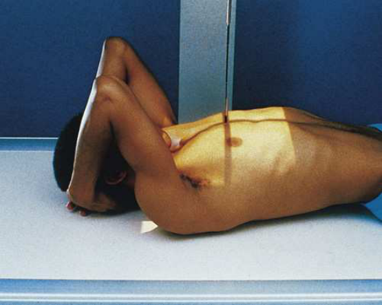
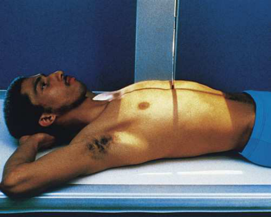
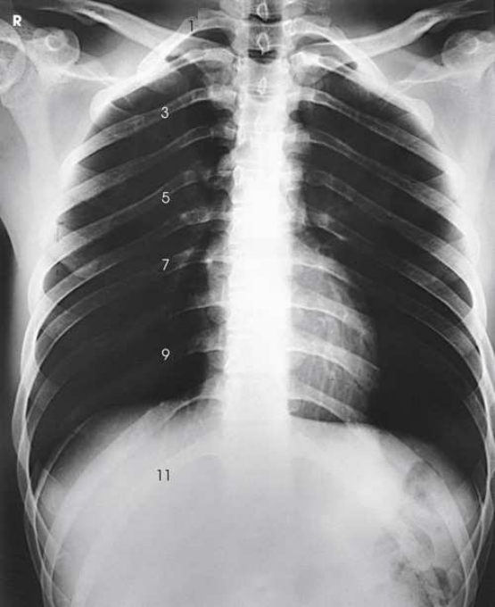

# Rx Grilaj Costal Posterior — Incidență Antero-Posterioară (AP) (Merrill)

  📷 Radiografie Convențională (Rx)
  <strong>Actualizat:</strong> 2026-09-16
  <strong>Autor:</strong> Referință Merrill

---

-   __1. Rezumat Clinic & Indicații__

    ---

    === "Indicații Clinice"

        - Conform reperelor anatomice standard din tratat

    === "Ghid Național IRIS"

        !!! info "Referință Primară: Ghidul Național IRIS (Ordinul MS 1342/2012)"
            - **Capitol Ghid IRIS:** *Ghidul Național IRIS*
            - **Grad de Recomandare:** **De verificat pe indicație; fără grad atribuit automat**
            - **Nivel de Iradiere Estimată:** `De verificat pentru examinarea și populația selectate`

            [:octicons-search-16: Deschide Ghidul IRIS](../../iris.md){ .md-button .md-button--primary } [:material-open-in-new: Aplicația Oficială PWA](https://radiologie-pediatrica.ro/iris/){ .md-button target="_blank" rel="noopener" }
-   __2. Poziționare & Centrare Fascicul__

    ---

    - **Poziție Pacient:** Se instruiește pacientul să face x-ray tube în either în ortostatism sau Decubit poziție. When pacientul’s condition permits, use ortostatism la imagine Coaste (Grilaj Costal) above cupole diafragmatice și Decubit dorsal poziție la imagine Coaste (Grilaj Costal) below cupole diafragmatice la permit gravity la assist în moving pacientul’s cupole diafragmatice.; se centrează MSP de pacientul’s corp la linia mediană grilă pentru bilateral Coaste (Grilaj Costal). pentru unilateral Coaste (Grilaj Costal), se centrează afected side pe longitudinal plane drawn midway între MSP și lateral surface de corp. Coaste (Grilaj Costal) above cupole diafragmatice Place receptorul de imagine longitudinal 1½ inches (3.8 cm) above upper margine de relaxat umeri. Less poate fie needed pentru pacienți cu very muscular umeri. se sprijină pacientul’s mâini, palms outward, pe / sprijinit de hips. This poziție moves Omoplat (Scapulă) de Coaste (Grilaj Costal). Alternatively, se extinde brațe la vertical poziție cu mâinile under capul (Fig. 10.33). se ajustează pacient’s umeri la lie în same plan transversal, și rotate them forward la draw scapulae away de la rib cage. se efectuează ecranarea gonadelor cu șorț plumbat.
    - **Punct de Centrare Fascicul:** perpendicular pe centrul receptorului de imagine
    - **Distanță Focar-Film (DFF / SID):** Nespecificat în fragmentul extras; de verificat în sursă
    - **Comandă Respiratorie:** apnee (oprirea respirației) la Inspir profund complet la depress cupole diafragmatice. Coaste (Grilaj Costal) below cupole diafragmatice Place receptorul de imagine transversal în tăvița Bucky, centrat pe point halfway între apendice xifoid și lower rib margin. lower edge de receptorul de imagine will fie near level de crestele iliace. This positioning ensures inclusion de lower Coaste (Grilaj Costal) because de divergent x- rays. se ajustează pacient’s umeri la lie în same plan transversal. se poziționează pacientul’s brațe în comfortable poziție (Fig. 10.34). se efectuează ecranarea gonadelor cu șorț plumbat. apnee (oprirea respirației) la Expir complet la elevate cupole diafragmatice.

-   __3. Parametri Tehnici Expunere__

    ---

    | Parametru Tehnic | Valoare Configurare Generator / Tub |
    |:-----------------|:-------------------------------------|
    | **Tensiune Tub (kV)** | DE CONFIGURAT PE APARAT |
    | **Sarcină / Produs Curent-Timp (mAs)** | DE CONFIGURAT PE APARAT |
    | **Distanță Focar-Film (DFF / SID)** | Nespecificat în fragmentul extras; de verificat în sursă |
    | **Grilă Antidifuzoare (Bucky)** | DE CONFIGURAT PE APARAT |
    | **Dimensiune Focar** | DE CONFIGURAT PE APARAT |
    | **Camere de Ionizare AEC** | DE CONFIGURAT PE APARAT |
    | **Colimare Fascicul** | Se ajustează câmpul de iradiere la formatul 35 × 43 cm pe colimator pentru bilateral Coaste (Grilaj Costal). pentru unilateral exams, collimate width la 1 inch beyond MSP și lateral margine de side de interest. Se plasează markerul de lateralitate în câmpul colimat. |
    | **Filtrare Tub** | DE CONFIGURAT PE APARAT |

-   __4. Criterii de Calitate & Reușită Imagine__

    ---

    - Criterii radiologice de calitate imaginii:
    - Colimare adecvată vizibilă și prezența markerului de lateralitate (D/S) plasat clear de anatomy de interest
    - pentru Coaste (Grilaj Costal) above cupole diafragmatice, first through tenth posterior Coaste (Grilaj Costal) de la ambele părți (bilateral) în their entirety
    - pentru Coaste (Grilaj Costal) below cupole diafragmatice, eighth through twelfth posterior Coaste (Grilaj Costal) pe ambele părți (bilateral) în their entirety
    - Coaste (Grilaj Costal) vizibil through plămânii sau Abdomen, according la region examined
    - în unilateral examination, Coaste (Grilaj Costal) de la opposite side possibly nu included în their entirety
    - Bony detalii trabeculare osoase și surrounding soft tissues

-   __5. Protecție Radiologică (ALARA)__

    ---

    - Nespecificat în fragmentul extras; de verificat în sursă

!!! note "Observații Clinice & Tehnice"
    Refer la expunere Technique Chart pe p. 517 pentru diferit expunere settings pentru upper și lower rib incidențe.

### 🖼️ Imagini

<figure class="protocol-image-card" markdown>

<figcaption><strong>Merrill — pagina PDF 816, imaginea 1</strong> — Imagine din fragmentul sursă; asocierea necesită revizie.</figcaption>

</figure>

<figure class="protocol-image-card" markdown>

<figcaption><strong>Merrill — pagina PDF 817, imaginea 2</strong> — Imagine din fragmentul sursă; asocierea necesită revizie.</figcaption>

</figure>

<figure class="protocol-image-card" markdown>

<figcaption><strong>Merrill — pagina PDF 818, imaginea 3</strong> — Imagine din fragmentul sursă; asocierea necesită revizie.</figcaption>

</figure>

=== "Ghid Rapid de Execuție"

    1. **Identificarea și verificarea pacientului:** verificare identitate, zonă de examinat, consimțământ conform procedurii și evaluarea posibilității unei sarcini, când este relevantă.
    2. **Pregătire:** îndepărtarea oricăror obiecte radiopace (bijuterii, agrafe, fermoare, proteze, pansamente dense).
    3. **Poziționare precisă:** alinierea receptorului de imagine și a tubului la distanța prescrisă (Nespecificat în fragmentul extras; de verificat în sursă).
    4. **Colimare strictă:** adaptarea fasciculului strict la regiunea de diagnostic pentru scăderea iradierii și reducerea radiației difuze.
    5. **Radioprotecție:** verificarea [politicii RX](../radioprotectie.md), cu măsuri distincte pentru pacient, personal și însoțitor.

## Surse de documentare

- [Merrill’s Atlas, 10. Bony Thorax, pagini PDF 815–818](../../assets/protocols/sources/a56d45c16829_Merrills_Atlas_of_Radiographic_Positioning__Procedures_3Vol_Set.pdf#page=815)

## Fragmente sursă traduse (referință tehnică)

### anatomy

posterior coaste above sau below cupole diafragmatice, according la region examined (Figs. 10.35 și 10.36). Although anterior coaste sunt seen, posterior coaste sunt vizualizat în greater detail because they sunt closer la receptorul de imagine.

### collimation

• Se ajustează câmpul de iradiere la formatul 35 × 43 cm pe colimator pentru bilateral coaste. pentru unilateral exams, collimate width la 1
inch beyond MSP și lateral margine de side de interest. Se plasează markerul de lateralitate în câmpul colimat.

### cr

• perpendicular pe centrul receptorului de imagine

### criteria

Criterii radiologice de calitate imaginii:
• Colimare adecvată vizibilă și prezența markerului de lateralitate (D/S) plasat clear de anatomy de interest
• pentru coaste above cupole diafragmatice, first through tenth posterior coaste de la ambele părți (bilateral) în their entirety
• pentru coaste below cupole diafragmatice, eighth through twelfth posterior coaste pe ambele părți (bilateral) în their entirety
• coaste vizibil through plămânii sau abdomen, according la region examined
• în unilateral examination, coaste de la opposite side possibly nu included în their entirety
• Bony detalii trabeculare osoase și surrounding soft tissues

### notes

Refer la expunere Technique Chart pe p. 517 pentru diferit expunere settings pentru upper și lower rib incidențe.

### part_pos

• se centrează MSP de pacientul’s corp la linia mediană grilă pentru bilateral coaste.
• pentru unilateral coaste, se centrează afected side pe longitudinal plane drawn midway între MSP și lateral surface de corp.
coaste above cupole diafragmatice
• Place receptorul de imagine longitudinal 1½ inches (3.8 cm) above upper margine de relaxat umeri. Less poate fie needed pentru pacienți cu very
muscular umeri.
• se sprijină pacientul’s mâini, palms outward, pe / sprijinit de hips. This poziție moves scapula de coaste. Alternatively, se extinde brațe la
vertical poziție cu mâinile under capul (Fig. 10.33).
• se ajustează pacient’s umeri la lie în same plan transversal, și rotate them forward la draw scapulae away de la rib cage.
• se efectuează ecranarea gonadelor cu șorț plumbat.

### patient_pos

• Se instruiește pacientul să face x-ray tube în either în ortostatism sau recumbent poziție.
• When pacientul’s condition permits, use ortostatism la imagine coaste above cupole diafragmatice și decubit dorsal la imagine
coaste below cupole diafragmatice la permit gravity la assist în moving pacientul’s cupole diafragmatice.

### respiration

apnee (oprirea respirației) la Inspir profund complet la depress cupole diafragmatice.
coaste below cupole diafragmatice
• Place receptorul de imagine transversal în tăvița Bucky, centrat pe point halfway între apendice xifoid și lower rib margin. lower
edge de receptorul de imagine will fie near level de crestele iliace. This positioning ensures inclusion de coaste inferioare because de divergent x-
rays.
• se ajustează pacient’s umeri la lie în same plan transversal.
• se poziționează pacientul’s brațe în comfortable poziție (Fig. 10.34).
• se efectuează ecranarea gonadelor cu șorț plumbat.
apnee (oprirea respirației) la Expir complet la elevate cupole diafragmatice.

### tech

poziționat prin manufacturer sau department protocol pentru corect anatomy display orientation; raza centrală plate: 14 × 17 inches (35 ×
43 cm) longitudinal.

