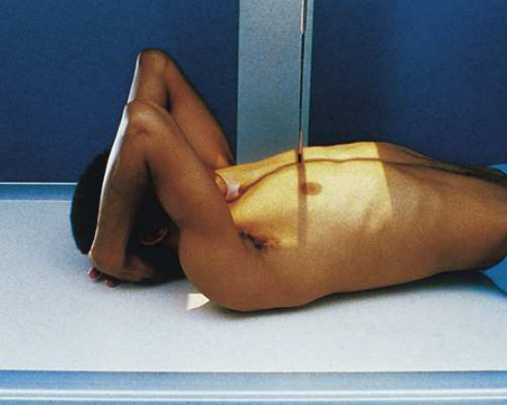
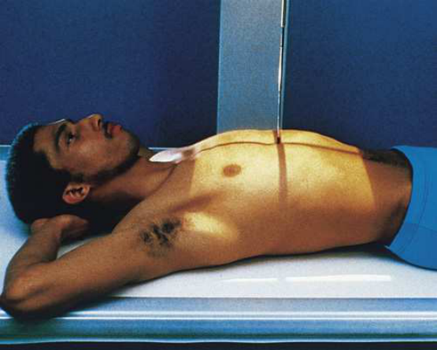
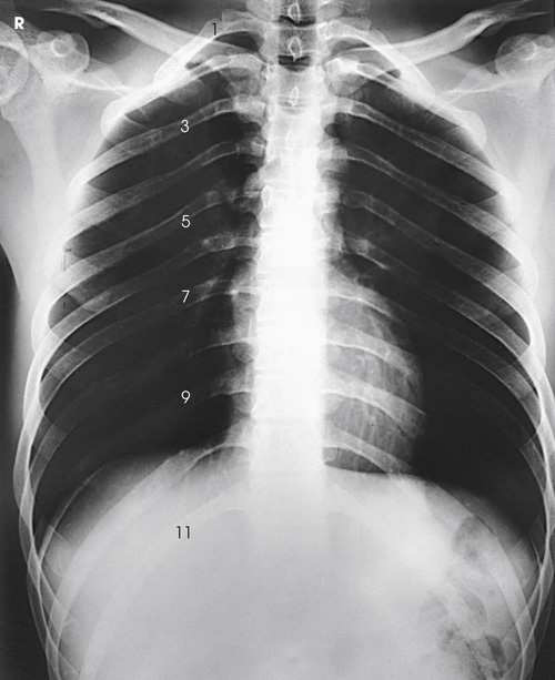

# Radiografie a grilajului costal posterior — incidență antero-posterioară (AP) (Merrill)

  📷 Radiografie Convențională (Rx)
  <strong>Actualizat:</strong> 2026-09-16
  <strong>Autor:</strong> Referință Merrill

---

-   __1. Rezumat Clinic & Indicații__

    ---

    === "Indicații Clinice"

        - Conform reperelor anatomice standard din tratat

    === "Ghid Național IRIS"

        !!! info "Referință Primară: Ghidul Național IRIS (Ordinul MS 1342/2012)"
            - **Capitol Ghid IRIS:** *Torace & Pulmon*
            - **Grad de Recomandare:** **Grad A**
            - **Nivel de Iradiere Estimată:** `Clasa 1 (Minimă < 0.1 mSv)`

            [:octicons-search-16: Deschide Ghidul IRIS](../../iris.md){ .md-button .md-button--primary } [:material-open-in-new: Aplicația Oficială PWA](https://radiologie-pediatrica.ro/iris/){ .md-button target="_blank" rel="noopener" }

-   __2. Poziționare & Centrare Fascicul__

    ---

    - **Poziție Pacient:** Instruiți pacientul să stea cu fața spre tubul de raze X, fie în ortostatism, fie în decubit. Când starea pacientului permite, utilizați ortostatismul pentru examinarea coastelor (grilajului costal) de deasupra cupolelor diafragmatice și decubitul dorsal pentru examinarea coastelor (grilajului costal) de sub cupolele diafragmatice, pentru a permite gravitației să contribuie la deplasarea cupolelor diafragmatice.; Centrați MSP al corpului pacientului pe linia mediană a grilei pentru examinarea bilaterală a coastelor (grilajului costal). Pentru examinarea unilaterală a coastelor (grilajului costal), centrați partea afectată pe planul longitudinal trasat la jumătatea distanței dintre MSP și suprafața laterală a corpului. Coastele (grilajul costal) de deasupra cupolelor diafragmatice: Plasați receptorul de imagine longitudinal, la 1½ inci (3.8 cm) deasupra marginii superioare a umerilor relaxați. Pentru pacienții cu umeri foarte musculoși poate fi necesară o distanță mai mică. Sprijiniți mâinile pacientului pe șolduri, cu palmele spre exterior. Această poziție deplasează omoplatul (scapula) din dreptul coastelor (grilajului costal). Alternativ, întindeți brațele în poziție verticală, cu mâinile sub cap (Fig. 10.33). Ajustați umerii pacientului astfel încât să se afle în același plan transversal și rotiți-i înainte pentru a îndepărta scapulele de grilajul costal. Ecranați gonadele cu un șorț plumbat.
    - **Punct de Centrare Fascicul:** perpendicular pe centrul receptorului de imagine
    - **Distanță Focar-Film (DFF / SID):** Nespecificat în fragmentul extras; de verificat în sursă
    - **Comandă Respiratorie:** Apnee (oprirea respirației) după un inspir profund complet, pentru a coborî cupolele diafragmatice. Coastele (grilajul costal) de sub cupolele diafragmatice: Plasați receptorul de imagine transversal în tăvița Bucky, centrat pe punctul de la jumătatea distanței dintre apendicele xifoid și marginea costală inferioară. Marginea inferioară a receptorului de imagine va fi aproape de nivelul crestelor iliace. Această poziționare asigură includerea coastelor inferioare (grilaj costal) datorită divergenței razelor X. Ajustați umerii pacientului astfel încât să se afle în același plan transversal. Poziționați brațele pacientului confortabil (Fig. 10.34). Ecranați gonadele cu un șorț plumbat. Apnee (oprirea respirației) după expir complet, pentru a ridica cupolele diafragmatice.

-   __3. Parametri Tehnici Expunere__

    ---

    | Parametru Tehnic | Valoare Configurare Generator / Tub |
    |:-----------------|:-------------------------------------|
    | **Tensiune Tub (kV)** | DE CONFIGURAT PE APARAT |
    | **Sarcină / Produs Curent-Timp (mAs)** | DE CONFIGURAT PE APARAT |
    | **Distanță Focar-Film (DFF / SID)** | Nespecificat în fragmentul extras; de verificat în sursă |
    | **Grilă Antidifuzoare (Bucky)** | DE CONFIGURAT PE APARAT |
    | **Dimensiune Focar** | DE CONFIGURAT PE APARAT |
    | **Camere de Ionizare AEC** | DE CONFIGURAT PE APARAT |
    | **Colimare Fascicul** | Se ajustează câmpul de iradiere la formatul 35 × 43 cm pe colimator pentru coaste bilaterale (grilaj costal). Pentru examinările unilaterale, se colimează cu 1 țol dincolo de MSP și de marginea laterală a părții de interes. Se plasează markerul de lateralitate în câmpul colimat. |
    | **Filtrare Tub** | DE CONFIGURAT PE APARAT |

-   __4. Criterii de Calitate & Reușită Imagine__

    ---

    - Criterii radiologice de calitate a imaginii:
    - Colimare adecvată vizibilă și prezența markerului de lateralitate (D/S) plasat în afara structurilor anatomice de interes
    - Pentru coastele (grilajul costal) de deasupra cupolelor diafragmatice, arcurile costale posterioare de la primul până la al zecelea, bilateral, în întregime.
    - Pentru coastele (grilajul costal) de sub cupolele diafragmatice, coastele posterioare a opta până la a douăsprezecea de pe ambele părți (bilateral), în întregime.
    - Coaste vizibile prin plămâni sau abdomen, în funcție de regiunea examinată
    - La examinarea unilaterală, coastele de pe partea opusă pot să nu fie incluse în întregime
    - Detalii trabeculare osoase și țesuturile moi înconjurătoare

-   __5. Protecție Radiologică (ALARA)__

    ---

    - Nespecificat în fragmentul extras; de verificat în sursă

!!! note "Observații Clinice & Tehnice"
    Consultați tabelul parametrilor de expunere de la p. 517 pentru diferitele setări de expunere pentru incidențele coastelor superioare și inferioare.

### 🖼️ Imagini

<figure class="protocol-image-card" markdown>

<figcaption><strong>Merrill — pagina 816, imaginea 1</strong> — Imagine din fragmentul sursă; asocierea necesită revizie.</figcaption>

</figure>

<figure class="protocol-image-card" markdown>

<figcaption><strong>Merrill — pagina 817, imaginea 2</strong> — Imagine din fragmentul sursă; asocierea necesită revizie.</figcaption>

</figure>

<figure class="protocol-image-card" markdown>

<figcaption><strong>Merrill — pagina 818, imaginea 3</strong> — Imagine din fragmentul sursă; asocierea necesită revizie.</figcaption>

</figure>

=== "Ghid Rapid de Execuție"

    1. **Identificarea și verificarea pacientului:** verificare identitate, zonă de examinat, consimțământ conform procedurii și evaluarea posibilității unei sarcini, când este relevantă.
    2. **Pregătire:** îndepărtarea oricăror obiecte radiopace (bijuterii, agrafe, fermoare, proteze, pansamente dense).
    3. **Poziționare precisă:** alinierea receptorului de imagine și a tubului la distanța prescrisă (Nespecificat în fragmentul extras; de verificat în sursă).
    4. **Colimare strictă:** adaptarea fasciculului strict la regiunea de diagnostic pentru scăderea iradierii și reducerea radiației difuze.
    5. **Radioprotecție:** verificarea [politicii RX](../radioprotectie.md), cu măsuri distincte pentru pacient, personal și însoțitor.

## Surse de documentare

- [Merrill’s Atlas, 10. Bony Thorax, pagini 815–818](https://books.google.com/books/about/Merrill_s_Atlas_of_Radiographic_Position.html?id=BM0lEQAAQBAJ)
