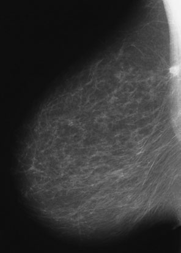
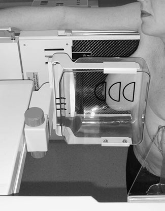
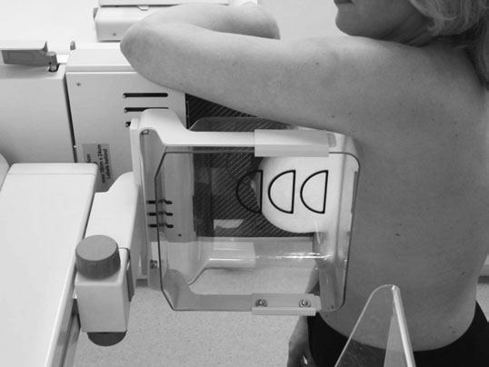
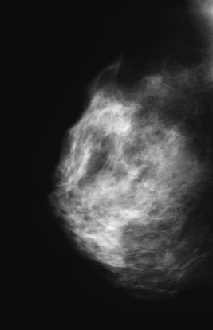

# Rx Profil (Lateral) Incidență Medio - Profil (Lateral)

  📷 Radiografie Convențională (Rx)
  <strong>Actualizat:</strong> 2026-09-16
  <strong>Autor:</strong> Departamentul de Radiologie / Referință Clark (Ed. 12)

---

-   __1. Rezumat Clinic & Indicații__

    ---

    === "Indicații Clinice"

        - 455 15 Profil (lateral) incidențe forward again la ensure that woman este în poziție pentru true Profil (lateral) incidență.
        - Sân (Mamografie) poziție este maintained manually, cu radiographer using his sau her other Mână la remove orice skin folds între Sân (Mamografie)-support table și Profil (lateral) aspect de Sân (Mamografie).
        - Mână este removed, ensuring that poziție este maintained ca final compression este applied.

    === "Ghid Național IRIS"

        !!! info "Referință Primară: Ghidul Național IRIS (Ordinul MS 1342/2012)"
            - **Capitol Ghid IRIS:** *Ghidul Național IRIS*
            - **Grad de Recomandare:** **De verificat pe indicație; fără grad atribuit automat**
            - **Nivel de Iradiere Estimată:** `De verificat pentru examinarea și populația selectate`

            [:octicons-search-16: Deschide Ghidul IRIS](../../iris.md){ .md-button .md-button--primary } [:material-open-in-new: Aplicația Oficială PWA](https://radiologie-pediatrica.ro/iris/){ .md-button target="_blank" rel="noopener" }
-   __2. Poziționare & Centrare Fascicul__

    ---

    - **Poziție Pacient:** • equipment este poziționat cu tubul și breastsupport table vertical.
• woman faces equipment, cu Sân (Mamografie)-support table la Profil (lateral) side de Sân (Mamografie). woman places her braț behind Sân (Mamografie)-support table și holds equipment pentru stability. She leans în de la waist la ensure that Sân (Mamografie) tissue cel mai apropiat de chest perete will fie visualized.
• equipment este ajustat la height la which inferior portion de Sân (Mamografie) will fie included.
• radiographer’s Mână este plasat pe / sprijinit de side de rib cage și slid forward la support Sân (Mamografie), palm de Mână pe Profil (lateral) aspect și Police pe medial aspect.
• woman este pushed în gently și Sân (Mamografie) extins outwards și upwards pe / sprijinit de Sân (Mamografie)-support table, ensuring that nipple remains în profile.
• Umăr de opposite side este pushed back astfel încât compression plate poate fie brought into contact cu Sân (Mamografie) under examination. Firm support de Sân (Mamografie) este necessary la this time astfel încât Sân (Mamografie) tissue la toracele perete margin este nu pulled away.
• Compression este applied gently. When plate contacts Sân (Mamografie) la toracele perete, other Umăr este brought radiografie de medio-Profil (lateral) incidență evidențiind small proces proliferativ tumoral close la toracele perete

• Sân (Mamografie)-support table este plasat pe / sprijinit de Stern. braț pe side being examined este lifted up la clear X-ray tube și este rested pe equipment. corp este rotit inwards slightly la contact Sân (Mamografie)-support table.
• equipment height este altered în order that lower margine de Sân (Mamografie) este included.
• Sân (Mamografie) este gently guided across și upwards, ensuring that nipple este în profile.
• Compression este applied while radiographer’s Mână supports Sân (Mamografie). Mână este removed ca final compression este achieved.
• This incidență este taken pentru demonstration de medially situated lesions.
    - **Punct de Centrare Fascicul:** Raza centrală perpendiculară pe centrul receptorului de imagine.
    - **Distanță Focar-Film (DFF / SID):** 100 cm
    - **Comandă Respiratorie:** Apnee pe durata expunerii (apnee în inspir pentru torace; expir pentru Abdomen/bazin).

-   __3. Parametri Tehnici Expunere__

    ---

    | Parametru Tehnic | Valoare Configurare Generator / Tub |
    |:-----------------|:-------------------------------------|
    | **Tensiune Tub (kV)** | DE CONFIGURAT PE APARAT |
    | **Sarcină / Produs Curent-Timp (mAs)** | Conform AEC / grosime anatomică |
    | **Distanță Focar-Film (DFF / SID)** | 100 cm |
    | **Grilă Antidifuzoare (Bucky)** | Conform grosimii anatomice (> 10-12 cm cu grilă) |
    | **Dimensiune Focar** | Focar Mic (0.6 mm) |
    | **Camere de Ionizare AEC** | DE CONFIGURAT PE APARAT |
    | **Colimare Fascicul** | Colimare strictă la aria anatomică de interes diagnostic |
    | **Filtrare Tub** | Totală ≥ 2.5 mm Al echivalent (conform Clark: 3.0 mm Al eq.) |

-   __4. Criterii de Calitate & Reușită Imagine__

    ---

    - Sân (Mamografie), including its inferior margine, trebuie să fie evidențiat adequately.
    - There trebuie să fie same depth de tissue ca în craniocaudal incidență.
    - Sân (Mamografie) este evidențiat fully, including its inferior margine.
    - same depth de Sân (Mamografie) tissue trebuie să fie visualized ca pe cranio-caudal incidență.
    - Erori de evitat / remedii: If toate Sân (Mamografie) tissue este nu seen, then radiographer’s Mână was nu taken back la rib cage și Sân (Mamografie) nu slid forward sufficiently across Sân (Mamografie)-support table.
    - Erori de evitat / remedii: If nipple was nu în profile, then woman was în ortostatism too far în front de Sân (Mamografie)-support table if nipple lies behind majority de Sân (Mamografie) tissue, și too far behind if nipple este culcat în front de majority de Sân (Mamografie) tissue.
    - Erori de evitat / remedii: If compression este inadequate, then film radiologic will fie underexposed. Sân (Mamografie) was nu checked pentru firmness.

-   __5. Protecție Radiologică (ALARA)__

    ---

    - Ecranare gonadică cu șorț plumbat dacă gonadele sunt în apropierea fasciculului util (regula ALARA).
    - Colimare precisă la dimensiunea anatomică strict necesară pentru reducerea dozei și a radiației difuze.
    - Verificarea posibilității unei sarcini la pacientele de vârstă fertilă înainte de expunere.

!!! note "Observații Clinice & Tehnice"
    Pregătirea pacientului prin îndepărtarea tuturor accesoriilor radio-opace.

### 🖼️ Imagini

<figure class="protocol-image-card" markdown>

<figcaption><strong>• If toate Sân (Mamografie) tissue este nu seen, then radiographer’s</strong> — Poziționare pacient și centrare fascicul conform Clark (Ed. 12)</figcaption>

</figure>

<figure class="protocol-image-card" markdown>

<figcaption><strong>detail, e.g. micro-calcificări patologice, great care trebuie să fie taken la</strong> — Aspect radiografic / ghid de poziționare conform tratatului Clark (Ed. 12)</figcaption>

</figure>

<figure class="protocol-image-card" markdown>

<figcaption><strong>• Compression este applied while radiographer’s Mână</strong> — Aspect radiografic / ghid de poziționare conform tratatului Clark (Ed. 12)</figcaption>

</figure>

<figure class="protocol-image-card" markdown>

<figcaption><strong>detail, e.g. micro-calcificări patologice, great care trebuie să fie taken la</strong> — Aspect radiografic / ghid de poziționare conform tratatului Clark (Ed. 12)</figcaption>

</figure>

=== "Ghid Rapid de Execuție"

    1. **Identificarea și verificarea pacientului:** verificare identitate, zonă de examinat, consimțământ conform procedurii și evaluarea posibilității unei sarcini, când este relevantă.
    2. **Pregătire:** îndepărtarea oricăror obiecte radiopace (bijuterii, agrafe, fermoare, proteze, pansamente dense).
    3. **Poziționare precisă:** alinierea receptorului de imagine și a tubului la distanța prescrisă (100 cm).
    4. **Colimare strictă:** adaptarea fasciculului strict la regiunea de diagnostic pentru scăderea iradierii și reducerea radiației difuze.
    5. **Radioprotecție:** verificarea [politicii RX](../radioprotectie.md), cu măsuri distincte pentru pacient, personal și însoțitor.

## Surse de documentare

- [Clark's Positioning in Radiography (Ed. 12), Pagina 470](../../assets/protocols/sources/Clark___Positioning_in_Radiography__12th_edition.pdf#page=470)
