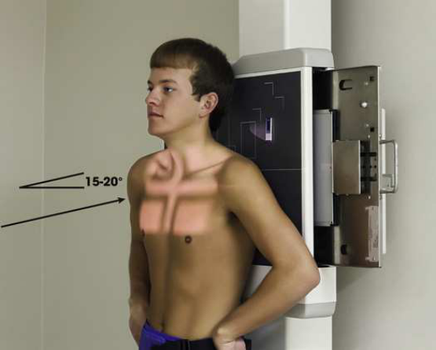
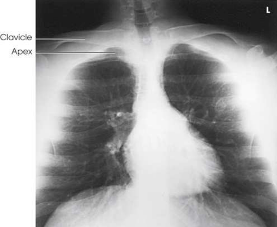

# Rx Vârfuri Pulmonare (Apexuri) — Incidență AP Axială (Merrill)

  📷 Radiografie Convențională (Rx)
  <strong>Actualizat:</strong> 2026-09-16
  <strong>Autor:</strong> Referință Merrill

---

-   __1. Rezumat Clinic & Indicații__

    ---

    === "Indicații Clinice"

        - Conform reperelor anatomice standard din tratat

    === "Ghid Național IRIS"

        !!! info "Referință Primară: Ghidul Național IRIS (Ordinul MS 1342/2012)"
            - **Capitol Ghid IRIS:** *Ghidul Național IRIS*
            - **Grad de Recomandare:** **De verificat pe indicație; fără grad atribuit automat**
            - **Nivel de Iradiere Estimată:** `De verificat pentru examinarea și populația selectate`

            [:octicons-search-16: Deschide Ghidul IRIS](../../iris.md){ .md-button .md-button--primary } [:material-open-in-new: Aplicația Oficială PWA](https://radiologie-pediatrica.ro/iris/){ .md-button target="_blank" rel="noopener" }
-   __2. Poziționare & Centrare Fascicul__

    ---

    - **Poziție Pacient:** Examine pacientul în ortostatism sau Decubit dorsal poziție.; se centrează receptorul de imagine la planul mediosagital la nivelul T2. se ajustează pacient’s corp so that it este nu rotit, ensuring MSP este perpendicular pe receptorul de imagine (RI) plane. se flectează pacient’s coate și place mâinile pe șoldurile cu palms out sau pronate mâinile beside șoldurile. Place umerii back pe / sprijinit de grilă și adjust them la lie în same plan transversal (Fig. 3.63). se efectuează ecranarea gonadelor cu șorț plumbat.
    - **Punct de Centrare Fascicul:** orientat la un unghi de 15 sau 20 grade cranial la center de receptorul de imagine și entering manubriu sternal
    - **Distanță Focar-Film (DFF / SID):** Minimum SID of 72 inches (183 cm) is recommended to decrease magnification of the heart and to increase spatial resolution of the thoracic structures.
    - **Comandă Respiratorie:** Expose la end de Inspir profund complet.

-   __3. Parametri Tehnici Expunere__

    ---

    | Parametru Tehnic | Valoare Configurare Generator / Tub |
    |:-----------------|:-------------------------------------|
    | **Tensiune Tub (kV)** | DE CONFIGURAT PE APARAT |
    | **Sarcină / Produs Curent-Timp (mAs)** | DE CONFIGURAT PE APARAT |
    | **Distanță Focar-Film (DFF / SID)** | Minimum SID of 72 inches (183 cm) is recommended to decrease magnification of the heart and to increase spatial resolution of the thoracic structures. |
    | **Grilă Antidifuzoare (Bucky)** | DE CONFIGURAT PE APARAT |
    | **Dimensiune Focar** | DE CONFIGURAT PE APARAT |
    | **Camere de Ionizare AEC** | DE CONFIGURAT PE APARAT |
    | **Colimare Fascicul** | Adjust câmp de iradiere la 10 × 12 inches (24 × 30 cm). Approximately 1 inch (2.5 cm) de field light trebuie să fie seen above shadow de umerii. Place marker de lateralitate (D/S) în collimated expunere field. |
    | **Filtrare Tub** | DE CONFIGURAT PE APARAT |

-   __4. Criterii de Calitate & Reușită Imagine__

    ---

    - Criterii radiologice de calitate imaginii:
    - Evidence de corect collimation și presence de marker de lateralitate (D/S) plasat clear de anatomy de interest
    - apexuri (vârfuri pulmonare) în their entirety
    - superior lung region adjacent la apexuri (vârfuri pulmonare)
    - Clavicles located superior la apexuri (vârfuri pulmonare) și oriented horizontally cu sternal ends overlapping first sau second rib
    - Sternal ends de clavicles echidistant față de coloană vertebrală
    - Coaste (Grilaj Costal) distorted, cu their anterior și posterior portions superimposed
    - Pulmonary vascular markings de apexuri (vârfuri pulmonare)

-   __5. Protecție Radiologică (ALARA)__

    ---

    - Nespecificat în fragmentul extras; de verificat în sursă

!!! note "Observații Clinice & Tehnice"
    This incidență este recommended when pacientul cannot fie plasat în lordotic poziție. Incidență AP Axială este used în preference la Incidență PA Axială în hypersthenic pacienți și pacienți whose clavicles occupy high poziție. Incidență AP Axială makes it possible la separate apical și clavicular shadows fără undue distortion de apexuri (vârfuri pulmonare).

### 🖼️ Imagini

<figure class="protocol-image-card" markdown>

<figcaption><strong>Merrill — pagina PDF 196, imaginea 1</strong> — Imagine din fragmentul sursă; asocierea necesită revizie.</figcaption>

</figure>

<figure class="protocol-image-card" markdown>

<figcaption><strong>Merrill — pagina PDF 196, imaginea 2</strong> — Imagine din fragmentul sursă; asocierea necesită revizie.</figcaption>

</figure>

=== "Ghid Rapid de Execuție"

    1. **Identificarea și verificarea pacientului:** verificare identitate, zonă de examinat, consimțământ conform procedurii și evaluarea posibilității unei sarcini, când este relevantă.
    2. **Pregătire:** îndepărtarea oricăror obiecte radiopace (bijuterii, agrafe, fermoare, proteze, pansamente dense).
    3. **Poziționare precisă:** alinierea receptorului de imagine și a tubului la distanța prescrisă (Minimum SID of 72 inches (183 cm) is recommended to decrease magnification of the heart and to increase spatial resolution of the thoracic structures.).
    4. **Colimare strictă:** adaptarea fasciculului strict la regiunea de diagnostic pentru scăderea iradierii și reducerea radiației difuze.
    5. **Radioprotecție:** verificarea [politicii RX](../radioprotectie.md), cu măsuri distincte pentru pacient, personal și însoțitor.

## Surse de documentare

- [Merrill’s Atlas, 3. Thoracic Viscera: Chest and Upper Airway, pagini PDF 194–196](../../assets/protocols/sources/a56d45c16829_Merrills_Atlas_of_Radiographic_Positioning__Procedures_3Vol_Set.pdf#page=194)

## Fragmente sursă traduse (referință tehnică)

### anatomy

AP axial incidență shows apexuri (vârfuri pulmonare) culcat below clavicles (Fig. 3.64).

### collimation

• Adjust câmp de iradiere la 10 × 12 inches (24 × 30 cm). Approximately 1 inch (2.5 cm) de field light trebuie să fie seen above shadow de umeri. Place marker de lateralitate (D/S) în collimated expunere field.

### cr

• orientat la un unghi de 15 sau 20 grade cranial la center de receptorul de imagine și entering manubriu sternal

### criteria

Criterii radiologice de calitate imaginii:
• Evidence de corect collimation și presence de marker de lateralitate (D/S) plasat clear de anatomy de interest
• apexuri (vârfuri pulmonare) în their entirety
• superior lung region adjacent la apexuri (vârfuri pulmonare)
• Clavicles located superior la apexuri (vârfuri pulmonare) și oriented horizontally cu sternal ends overlapping first sau second rib
• Sternal ends de clavicles echidistant față de coloană vertebrală
• coaste distorted, cu their anterior și posterior portions superimposed
• Pulmonary vascular markings de apexuri (vârfuri pulmonare)

### notes

This incidență este recommended when pacientul cannot fie plasat în lordotic poziție.
AP axial incidență este used în preference la PA axial incidență în hypersthenic pacienți și pacienți whose clavicles occupy high poziție. AP axial incidență makes it possible la separate apical și clavicular shadows fără undue distortion de apexuri (vârfuri pulmonare).

### part_pos

• se centrează receptorul de imagine la planul mediosagital la nivelul T2.
• se ajustează pacient’s corp so that it este nu rotit, ensuring MSP este perpendicular pe receptorul de imagine (RI) plane.
• se flectează pacient’s coate și place mâinile pe șoldurile cu palms out sau pronate mâinile beside șoldurile.
• Place umerii back pe / sprijinit de grilă și adjust them la lie în same plan transversal (Fig. 3.63).
• se efectuează ecranarea gonadelor cu șorț plumbat.

### patient_pos

• Examine pacientul în ortostatism sau decubit dorsal.

### respiration

Expose la end de Inspir profund complet.

### sid

Minimum SID de 72 inches (183 cm) este recommended la decrease magnification de cordul și la increase spatial resolution de thoracic
structures.

### tech

poziționat prin manufacturer sau department protocol pentru corect anatomy display orientation; raza centrală plate: 10 × 12 inches (24 ×
30 cm) transversal sau 14 × 17 inches (35 × 43 cm)

