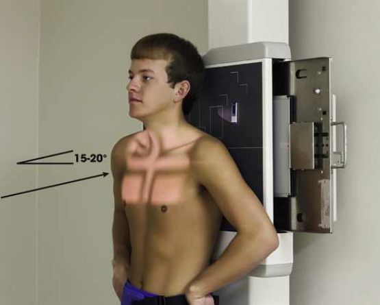
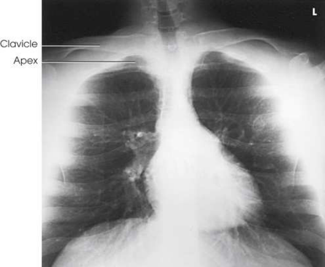

# Radiografie a apexurilor pulmonare — incidență axială AP (Merrill)

  📷 Radiografie Convențională (Rx)
  <strong>Actualizat:</strong> 2026-09-16
  <strong>Autor:</strong> Referință Merrill

---

-   __1. Rezumat Clinic & Indicații__

    ---

    === "Indicații Clinice"

        - Conform reperelor anatomice standard din tratat

    === "Ghid Național IRIS"

        !!! info "Referință Primară: Ghidul Național IRIS (Ordinul MS 1342/2012)"
            - **Capitol Ghid IRIS:** *Torace & Pulmon*
            - **Grad de Recomandare:** **Grad A**
            - **Nivel de Iradiere Estimată:** `Clasa 1 (Minimă < 0.1 mSv)`

            [:octicons-search-16: Deschide Ghidul IRIS](../../iris.md){ .md-button .md-button--primary } [:material-open-in-new: Aplicația Oficială PWA](https://radiologie-pediatrica.ro/iris/){ .md-button target="_blank" rel="noopener" }

-   __2. Poziționare & Centrare Fascicul__

    ---

    - **Poziție Pacient:** Se examinează pacientul în ortostatism sau în decubit dorsal. Se centrează receptorul de imagine la planul mediosagital, la nivelul T2. Se ajustează corpul pacientului astfel încât să nu fie rotit, asigurând perpendicularitatea MSP pe planul receptorului de imagine (RI). Se flectează coatele pacientului și se plasează mâinile pe șolduri, cu palmele orientate în afară, sau se pronază mâinile lângă șolduri. Se plasează umerii posterior, pe sau sprijiniți de grilă, și se ajustează astfel încât să se afle în același plan transversal (Fig. 3.63). Se efectuează ecranarea gonadelor cu șorț plumbat.
    - **Punct de Centrare Fascicul:** Orientat la un unghi de 15 sau 20 grade cranial, spre centrul receptorului de imagine, cu punctul de intrare la manubriul sternal.
    - **Distanță Focar-Film (DFF / SID):** Se recomandă o SID minimă de 72 inci (183 cm), pentru a reduce magnificarea inimii și a crește rezoluția spațială a structurilor toracice.
    - **Comandă Respiratorie:** Expunere la sfârșitul inspirului profund complet

-   __3. Parametri Tehnici Expunere__

    ---

    | Parametru Tehnic | Valoare Configurare Generator / Tub |
    |:-----------------|:-------------------------------------|
    | **Tensiune Tub (kV)** | DE CONFIGURAT PE APARAT |
    | **Sarcină / Produs Curent-Timp (mAs)** | DE CONFIGURAT PE APARAT |
    | **Distanță Focar-Film (DFF / SID)** | Se recomandă o SID minimă de 72 inci (183 cm), pentru a reduce magnificarea inimii și a crește rezoluția spațială a structurilor toracice. |
    | **Grilă Antidifuzoare (Bucky)** | DE CONFIGURAT PE APARAT |
    | **Dimensiune Focar** | DE CONFIGURAT PE APARAT |
    | **Camere de Ionizare AEC** | DE CONFIGURAT PE APARAT |
    | **Colimare Fascicul** | Se ajustează câmpul de iradiere la 10 × 12 țoli (24 × 30 cm). Aproximativ 1 țol (2,5 cm) din lumina câmpului trebuie să fie vizibil deasupra umbrei umerilor. Se plasează markerul de lateralitate (D/S) în câmpul de expunere colimat. |
    | **Filtrare Tub** | DE CONFIGURAT PE APARAT |

-   __4. Criterii de Calitate & Reușită Imagine__

    ---

    - Criterii radiologice de calitate a imaginii:
    - Evidențierea colimării corecte și prezența markerului de lateralitate (D/S), plasat fără a se suprapune peste anatomia de interes
    - Apexurile (vârfurile pulmonare) în întregime
    - Regiunea pulmonară superioară adiacentă apexurilor (vârfurilor pulmonare)
    - Claviculele situate superior față de apexuri (vârfurile pulmonare) și orientate orizontal, cu capetele sternale suprapuse peste prima sau a doua coastă
    - Capetele sternale ale claviculelor echidistante față de coloana vertebrală
    - Coastele (grilajul costal) deformate, cu porțiunile lor anterioare și posterioare suprapuse
    - Desenul vascular pulmonar de la apexuri (vârfurile pulmonare)

-   __5. Protecție Radiologică (ALARA)__

    ---

    - Nespecificat în fragmentul extras; de verificat în sursă

!!! note "Observații Clinice & Tehnice"
    Această incidență este recomandată când pacientul nu poate fi plasat în poziție lordotică. Incidența AP axială este utilizată cu preferință față de incidența PA axială la pacienții hiperstenici și la pacienții ale căror clavicule ocupă o poziție înaltă. Incidența AP axială permite separarea umbrelor apicale și claviculare fără distorsionarea excesivă a apexurilor (vârfurilor pulmonare).

### 🖼️ Imagini

<figure class="protocol-image-card" markdown>

<figcaption><strong>Merrill — pagina 196, imaginea 1</strong> — Imagine din fragmentul sursă; asocierea necesită revizie.</figcaption>

</figure>

<figure class="protocol-image-card" markdown>

<figcaption><strong>Merrill — pagina 196, imaginea 2</strong> — Imagine din fragmentul sursă; asocierea necesită revizie.</figcaption>

</figure>

=== "Ghid Rapid de Execuție"

    1. **Identificarea și verificarea pacientului:** verificare identitate, zonă de examinat, consimțământ conform procedurii și evaluarea posibilității unei sarcini, când este relevantă.
    2. **Pregătire:** îndepărtarea oricăror obiecte radiopace (bijuterii, agrafe, fermoare, proteze, pansamente dense).
    3. **Poziționare precisă:** alinierea receptorului de imagine și a tubului la distanța prescrisă (Se recomandă o SID minimă de 72 inci (183 cm), pentru a reduce magnificarea inimii și a crește rezoluția spațială a structurilor toracice.).
    4. **Colimare strictă:** adaptarea fasciculului strict la regiunea de diagnostic pentru scăderea iradierii și reducerea radiației difuze.
    5. **Radioprotecție:** verificarea [politicii RX](../radioprotectie.md), cu măsuri distincte pentru pacient, personal și însoțitor.

## Surse de documentare

- [Merrill’s Atlas, 3. Thoracic Viscera: Chest and Upper Airway, pagini 194–196](https://books.google.com/books/about/Merrill_s_Atlas_of_Radiographic_Position.html?id=BM0lEQAAQBAJ)
