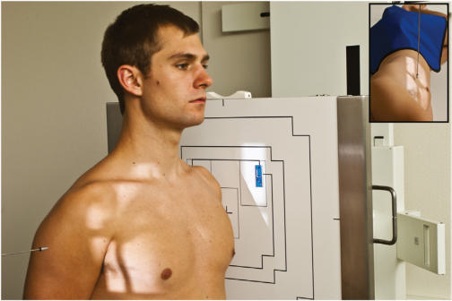
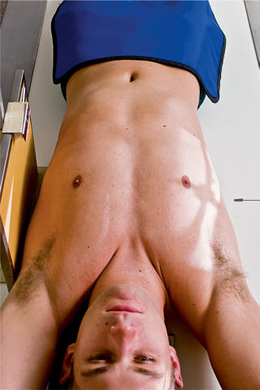
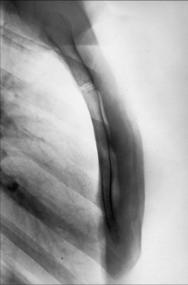
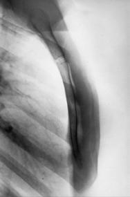

# Rx R OR L LATERAL Profil (Lateral) (Stern)

  📷 Radiografie Convențională (Rx)
  <strong>Actualizat:</strong> 2026-09-15
  <strong>Autor:</strong> Departamentul de Radiologie / Referință Bontrager

---

-   __1. Rezumat Clinic & Indicații__

    ---

    === "Indicații Clinice"

        - Pathology de Stern, including suspiciune de fractură și inflammatory processes

    === "Ghid Național IRIS"

        !!! info "Referință Primară: Ghidul Național IRIS (Ordinul MS 1342/2012)"
            - **Capitol Ghid IRIS:** *Ghidul Național IRIS*
            - **Grad de Recomandare:** **De verificat pe indicație; fără grad atribuit automat**
            - **Nivel de Iradiere Estimată:** `De verificat pentru examinarea și populația selectate`

            [:octicons-search-16: Deschide Ghidul IRIS](../../iris.md){ .md-button .md-button--primary } [:material-open-in-new: Aplicația Oficială PWA](https://radiologie-pediatrica.ro/iris/){ .md-button target="_blank" rel="noopener" }
-   __2. Poziționare & Centrare Fascicul__

    ---

    - **Poziție Pacient:** Pacient: Ortostatism (preferred) sau lateral Decubit (see; Regiune anatomică: Ortostatism poziție pacient în ortostatism sau Poziție Șezândă în true lateral cu planul mediosagital (MSP) paralel cu receptorul de imagine (RI), și umeri și brațe drawn back. (Fig. 10.23). Place top de receptorul de imagine 1½ inches (4 cm) above incizura jugulară (manubriul sternal). Align axa longitudinală de Stern la raza centrală și midline de grilă sau table/ stativ vertical Bucky. Ensure true lateral, cu Absența rotației anatomice: clavicule echidistante față de linia apofizelor spinoase.
    - **Punct de Centrare Fascicul:** este perpendicular pe receptorul de imagine și orientat la center de Stern (midway între incizura jugulară (manubriul sternal) și apendice xifoid). pentru traumatism acuttism / Regim Urgență situations, see Adaptation section.
    - **Distanță Focar-Film (DFF / SID):** 100 cm
    - **Comandă Respiratorie:** Apnee pe durata expunerii pe inspiration.

-   __3. Parametri Tehnici Expunere__

    ---

    | Parametru Tehnic | Valoare Configurare Generator / Tub |
    |:-----------------|:-------------------------------------|
    | **Tensiune Tub (kV)** | DE CONFIGURAT PE APARAT |
    | **Sarcină / Produs Curent-Timp (mAs)** | DE CONFIGURAT PE APARAT |
    | **Distanță Focar-Film (DFF / SID)** | 100 cm |
    | **Grilă Antidifuzoare (Bucky)** | Conform grosimii anatomice (> 10 cm cu grilă) |
    | **Dimensiune Focar** | Focar Mic (0.6 mm) |
    | **Camere de Ionizare AEC** | DE CONFIGURAT PE APARAT |
    | **Colimare Fascicul** | Long, narrow collimation field size, la region de Stern |
    | **Filtrare Tub** | Totală ≥ 2.5 mm Al echivalent |

-   __4. Criterii de Calitate & Reușită Imagine__

    ---

    - Entire Stern cu minimal overlap de soft tissues (Figs. 10.25 și 10.26). poziție:
    - Correct pacient poziție cu Absența rotației anatomice: clavicule echidistante față de linia apofizelor spinoase evidențiază following:
    - Entire Stern cu fără superimposition de Coaste (Grilaj Costal).
    - Lower aspect de Stern nu obscured prin breasts de female pacient.
    - Collimation la aria de interes diagnostic. expunere:
    - optim receptorul de imagine expunere și contrast la visualize entire Stern.
    - fără mișcare, indicated prin net bony margins. Fig. 10.23 lateral—Ortostatism. Inset, lateral Decubit. Fig. 10.24 orizontal fascicul lateral. L Fig. 10.25 lateral Stern. L apendice xifoid corp Sternal angle manubriu sternal Fig. 10.26 lateral Stern.

-   __5. Protecție Radiologică (ALARA)__

    ---

    - Ecranare gonadică și a organelor radiosensibile conform procedurilor locale de radioprotecție ALARA.
    - Colimare strictă la aria de interes pentru limitarea radiației difuze.
    - Verificarea posibilității unei sarcini la pacientele de vârstă fertilă înainte de expunere.

!!! note "Observații Clinice & Tehnice"
    If positioning pacient Decubit (Fig. 10.24), place him sau her pe side cu brațe up above cap și keeping umeri back. support sponge poate fie plasat under lower thorax la place Stern orizontal și paralel cu receptorul de imagine. Large, pendulous breasts de female pacienți poate fie drawn la sides și held în poziție cu wide bandage if necessary. Adaptation lateral imagine poate fie obtained cu use de orizontal xray fascicul cu pacient în Decubit dorsal poziție if pacient’s condition warrants this modification (Fig. 10.24). AEC nu recommended 24 (30) (35) Stern ROUTINE RAO lateral

### 🖼️ Imagini

<figure class="protocol-image-card" markdown>

<figcaption><strong>Fig. 10.23 lateral—Ortostatism. Inset, lateral Decubit.</strong> — Poziționare pacient conform Ghidului Bontrager (Fig. 10.23 lateral—în ortostatism. Inset, lateral recumbent.)</figcaption>

</figure>

<figure class="protocol-image-card" markdown>

<figcaption><strong>Fig. 10.24 orizontal fascicul lateral.</strong> — Aspect radiografic de referință conform Ghidului Bontrager (Fig. 10.24 orizontal fascicul lateral.)</figcaption>

</figure>

<figure class="protocol-image-card" markdown>

<figcaption><strong>Fig. 10.25 lateral Stern.</strong> — Aspect radiografic de referință conform Ghidului Bontrager (Fig. 10.25 lateral sternum.)</figcaption>

</figure>

<figure class="protocol-image-card" markdown>

<figcaption><strong>Fig. 10.26 lateral Stern.</strong> — Aspect radiografic de referință conform Ghidului Bontrager (Fig. 10.26 lateral sternum.)</figcaption>

</figure>

=== "Ghid Rapid de Execuție"

    1. **Identificarea și verificarea pacientului:** verificare identitate, zonă de examinat, consimțământ conform procedurii și evaluarea posibilității unei sarcini, când este relevantă.
    2. **Pregătire:** îndepărtarea oricăror obiecte radiopace (bijuterii, agrafe, fermoare, proteze, pansamente dense).
    3. **Poziționare precisă:** alinierea receptorului de imagine și a tubului la distanța prescrisă (100 cm).
    4. **Colimare strictă:** adaptarea fasciculului strict la regiunea de diagnostic pentru scăderea iradierii și reducerea radiației difuze.
    5. **Radioprotecție:** verificarea [politicii RX](../radioprotectie.md), cu măsuri distincte pentru pacient, personal și însoțitor.

## Surse de documentare

- [Bontrager's Textbook of Radiographic Positioning (Ed. 9/10), Pagina 389](https://www.elsevier.com/books/textbook-of-radiographic-positioning-and-related-anatomy/lampignano/978-0-323-65367-1)
