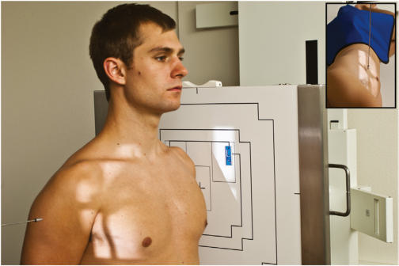
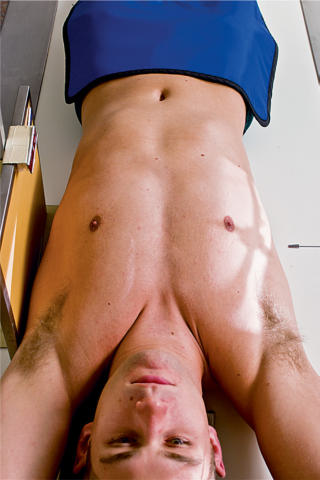
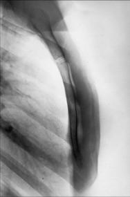
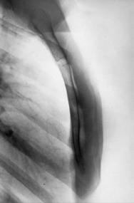

# Radiografie de profil (lateral) a sternului, incidență R sau L

  📷 Radiografie Convențională (Rx)
  <strong>Actualizat:</strong> 2026-09-15
  <strong>Autor:</strong> Departamentul de Radiologie / Referință Bontrager

---

-   __1. Rezumat Clinic & Indicații__

    ---

    === "Indicații Clinice"

        - Patologia sternului, inclusiv suspiciunea de fractură și procesele inflamatorii

    === "Ghid Național IRIS"

        !!! info "Referință Primară: Ghidul Național IRIS (Ordinul MS 1342/2012)"
            - **Capitol Ghid IRIS:** *Torace & Pulmon*
            - **Grad de Recomandare:** **Grad A**
            - **Nivel de Iradiere Estimată:** `Clasa 1 (Minimă < 0.1 mSv)`

            [:octicons-search-16: Deschide Ghidul IRIS](../../iris.md){ .md-button .md-button--primary } [:material-open-in-new: Aplicația Oficială PWA](https://radiologie-pediatrica.ro/iris/){ .md-button target="_blank" rel="noopener" }

-   __2. Poziționare & Centrare Fascicul__

    ---

    - **Poziție Pacient:** Pacient: Ortostatism (preferat) sau decubit lateral (vezi; Regiune anatomică: Poziționarea pacientului în ortostatism sau în poziție șezândă, în incidență de profil adevărat, cu planul mediosagital (MSP) paralel cu receptorul de imagine (RI), iar umerii și brațele retrase posterior. (Fig. 10.23). Se plasează partea superioară a receptorului de imagine la 1½ țoli (4 cm) deasupra incizurii jugulare (manubriului sternal). Se aliniază axa longitudinală a sternului cu raza centrală și cu linia mediană a grilei sau a mesei/stativului vertical Bucky. Se asigură incidența de profil adevărat, fără rotație anatomică: claviculele echidistante față de linia apofizelor spinoase.
    - **Punct de Centrare Fascicul:** Este perpendicular pe receptorul de imagine și orientat către centrul sternului (la jumătatea distanței dintre incizura jugulară (manubriul sternal) și apendicele xifoid). Pentru situații de traumatism acut / regim de urgență, consultați secțiunea Adaptare.
    - **Distanță Focar-Film (DFF / SID):** 100 cm
    - **Comandă Respiratorie:** Apnee pe durata expunerii, în inspir.

-   __3. Parametri Tehnici Expunere__

    ---

    | Parametru Tehnic | Valoare Configurare Generator / Tub |
    |:-----------------|:-------------------------------------|
    | **Tensiune Tub (kV)** | DE CONFIGURAT PE APARAT |
    | **Sarcină / Produs Curent-Timp (mAs)** | DE CONFIGURAT PE APARAT |
    | **Distanță Focar-Film (DFF / SID)** | 100 cm |
    | **Grilă Antidifuzoare (Bucky)** | Conform grosimii anatomice (> 10 cm cu grilă) |
    | **Dimensiune Focar** | Focar Mic (0.6 mm) |
    | **Camere de Ionizare AEC** | DE CONFIGURAT PE APARAT |
    | **Colimare Fascicul** | Câmp de colimare lung și îngust, la nivelul regiunii sternului |
    | **Filtrare Tub** | Totală ≥ 2.5 mm Al echivalent |

-   __4. Criterii de Calitate & Reușită Imagine__

    ---

    - Sternul în întregime, cu suprapunere minimă a țesuturilor moi (Fig. 10.25 și 10.26). Poziție:
    - Poziție corectă a pacientului, cu absența rotației anatomice: claviculele echidistante față de linia apofizelor spinoase evidențiază următoarele:
    - Sternul în întregime, fără suprapunerea coastelor (grilajului costal).
    - Porțiunea inferioară a sternului nu este obturată de sânii pacientei.
    - Colimare la aria de interes diagnostic. Expunere:
    - Expunere și contrast optimizate la receptorul de imagine pentru vizualizarea întregului stern.
    - Fără mișcare, indicată prin marginile osoase nete. Fig. 10.23 profil — Ortostatism. Imagine inserată, decubit lateral. Fig. 10.24 fascicul orizontal de profil. L Fig. 10.25 profilul sternului. L apendice xifoid corp unghi sternal manubriu sternal Fig. 10.26 profilul sternului.

-   __5. Protecție Radiologică (ALARA)__

    ---

    - Ecranare gonadică și a organelor radiosensibile conform procedurilor locale de radioprotecție ALARA.
    - Colimare strictă la aria de interes pentru limitarea radiației difuze.
    - Verificarea posibilității unei sarcini la pacientele de vârstă fertilă înainte de expunere.

!!! note "Observații Clinice & Tehnice"
    Dacă pacientul este poziționat în decubit (Fig. 10.24), acesta este plasat pe o parte, cu brațele ridicate deasupra capului și cu umerii menținuți posterior. Un burete de susținere poate fi plasat sub toracele inferior pentru a poziționa sternul orizontal și paralel cu receptorul de imagine. Sânii mari, pendulanți, ai pacientelor pot fi trași lateral și menținuți în poziție cu un bandaj lat, dacă este necesar. O imagine laterală adaptată poate fi obținută utilizând un fascicul orizontal de raze X, cu pacientul în decubit dorsal, dacă starea pacientului impune această modificare (Fig. 10.24). AEC nu este recomandat 24 (30) (35) Stern de rutină RAO lateral

### 🖼️ Imagini

<figure class="protocol-image-card" markdown>

<figcaption><strong>Fig. 10.23 profil — ortostatism. Imagine inserată, profil în decubit.</strong> — Poziționarea pacientului conform Ghidului Bontrager (Fig. 10.23 profil — în ortostatism. Imagine inserată, profil în decubit.)</figcaption>

</figure>

<figure class="protocol-image-card" markdown>

<figcaption><strong>Fig. 10.24 Incidență de profil cu fascicul orizontal.</strong> — Aspect radiografic de referință conform Ghidului Bontrager (Fig. 10.24 Incidență de profil cu fascicul orizontal).</figcaption>

</figure>

<figure class="protocol-image-card" markdown>

<figcaption><strong>Fig. 10.25 profil, stern.</strong> — Aspect radiografic de referință conform Ghidului Bontrager (Fig. 10.25 profil, stern.)</figcaption>

</figure>

<figure class="protocol-image-card" markdown>

<figcaption><strong>Fig. 10.26 profil, stern.</strong> — Aspect radiografic de referință conform Ghidului Bontrager (Fig. 10.26 profil, stern.)</figcaption>

</figure>

=== "Ghid Rapid de Execuție"

    1. **Identificarea și verificarea pacientului:** verificare identitate, zonă de examinat, consimțământ conform procedurii și evaluarea posibilității unei sarcini, când este relevantă.
    2. **Pregătire:** îndepărtarea oricăror obiecte radiopace (bijuterii, agrafe, fermoare, proteze, pansamente dense).
    3. **Poziționare precisă:** alinierea receptorului de imagine și a tubului la distanța prescrisă (100 cm).
    4. **Colimare strictă:** adaptarea fasciculului strict la regiunea de diagnostic pentru scăderea iradierii și reducerea radiației difuze.
    5. **Radioprotecție:** verificarea [politicii RX](../radioprotectie.md), cu măsuri distincte pentru pacient, personal și însoțitor.

## Surse de documentare

- [Bontrager's Textbook of Radiographic Positioning (Ed. 9/10), Pagina 389](https://www.elsevier.com/books/textbook-of-radiographic-positioning-and-related-anatomy/lampignano/978-0-323-65367-1)
