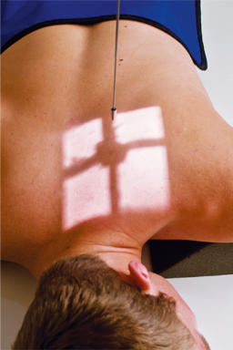
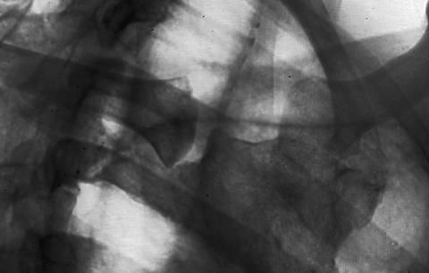

# Rx Oblică Anterioară (OAD și OAS) (STERNOCLAVICULAR - JOINTS)

  📷 Radiografie Convențională (Rx)
  <strong>Actualizat:</strong> 2026-09-15
  <strong>Autor:</strong> Departamentul de Radiologie / Referință Bontrager

---

-   __1. Rezumat Clinic & Indicații__

    ---

    === "Indicații Clinice"

        - articulație separation, subluxation, sau other pathology de sternoclavicular jointsBest visualizes downside articulații sternoclaviculare, which este evidențiat cel mai apropiat de coloană vertebrală pe radiografie (see NOTE 1 later; see NOTE 2 pentru less obliquity la visualize upside articulație).

    === "Ghid Național IRIS"

        !!! info "Referință Primară: Ghidul Național IRIS (Ordinul MS 1342/2012)"
            - **Capitol Ghid IRIS:** *Ghidul Național IRIS*
            - **Grad de Recomandare:** **De verificat pe indicație; fără grad atribuit automat**
            - **Nivel de Iradiere Estimată:** `De verificat pentru examinarea și populația selectate`

            [:octicons-search-16: Deschide Ghidul IRIS](../../iris.md){ .md-button .md-button--primary } [:material-open-in-new: Aplicația Oficială PWA](https://radiologie-pediatrica.ro/iris/){ .md-button target="_blank" rel="noopener" }
-   __2. Poziționare & Centrare Fascicul__

    ---

    - **Poziție Pacient:** Pacient: Decubit ventral sau Ortostatism facing receptorul de imagine cu slight rotație (10° la 15°) de thorax cu upside Cot flectat și Mână plasat adjacent la cap (see NOTES 1 și 2).; Regiune anatomică: Rotate pacient 10° la 15° spre side de interest, aligning articulații sternoclaviculare la center de receptorul de imagine. articulații sternoclaviculare will fie located la nivelul T2–T3, 1–2 inches lateral (spre upside) de coloană vertebrală (Fig. 10.30).
    - **Punct de Centrare Fascicul:** perpendicular pe receptorul de imagine la nivelul T2T3, located 3 inches (7.5 cm) distal la vertebra proeminentă (apofiza spinoasă C7), și 1 la 2 inches (2.5 la 5 cm) lateral (spre upside) la plan mediosagital
    - **Distanță Focar-Film (DFF / SID):** 100 cm
    - **Comandă Respiratorie:** apnee (oprirea respirației) pe expiration.

-   __3. Parametri Tehnici Expunere__

    ---

    | Parametru Tehnic | Valoare Configurare Generator / Tub |
    |:-----------------|:-------------------------------------|
    | **Tensiune Tub (kV)** | 75-85 kV |
    | **Sarcină / Produs Curent-Timp (mAs)** | DE CONFIGURAT PE APARAT |
    | **Distanță Focar-Film (DFF / SID)** | 100 cm |
    | **Grilă Antidifuzoare (Bucky)** | Cu grilă antidifuzoare Bucky |
    | **Dimensiune Focar** | Focar Mic (0.6 mm) |
    | **Camere de Ionizare AEC** | Camerele laterale (sau camera centrală funcție de regiune) |
    | **Colimare Fascicul** | Collimate tightly la region de articulații sternoclaviculare. |
    | **Filtrare Tub** | Totală ≥ 2.5 mm Al echivalent |

-   __4. Criterii de Calitate & Reușită Imagine__

    ---

    - downside articulații sternoclaviculare adjacent la coloană vertebrală, manubriu sternal, și medial portion de clavicles sunt best evidențiat (Figs. 10.31 și 10.32).
    - articulații sternoclaviculare pe upside will fie foreshortened și evidențiat farther de la coloană vertebrală. poziție:
    - Correct pacient rotație evidențiază downside articulații sternoclaviculare visualized cu fără superimposition de coloană vertebrală sau manubriu sternal. expunere:
    - optim receptorul de imagine expunere și contrast la visualize articulații sternoclaviculare through overlying Coaste (Grilaj Costal) și plămâni.
    - fără mișcare, ca indicated prin net bony margins. L Fig. 10.31 10° la 15° RAO, best evidențiază drept (downside) articulații sternoclaviculare. stâng Claviculă stâng articulații sternoclaviculare manubriu sternal L Fig. 10.32 10° la 15° RAO, drept articulații sternoclaviculare.

-   __5. Protecție Radiologică (ALARA)__

    ---

    - Ecranare gonadică și a organelor radiosensibile conform procedurilor locale de radioprotecție ALARA.
    - Colimare strictă la aria de interes pentru limitarea radiației difuze.
    - Verificarea posibilității unei sarcini la pacientele de vârstă fertilă înainte de expunere.

!!! note "Observații Clinice & Tehnice"
    cu less obliquity (5° la 10°), opposite articulații sternoclaviculare (upside articulație) would fie visualized next la coloană vertebrală. Adaptation—posterior oblic If pacientul’s condition requires this, oblic imagini poate fie obtained prin using posterior oblic cu 10° la 15° rotație away de la side de interest cu raza centrală centrală 1 la 2 inches (2.5 la 5 cm) lateral la midsagittal (spre downside). upside articulații sternoclaviculare would fie best visualized în this incidență. articulații sternoclaviculare ROUTINE PA anterior oblic Fig. 10.30 10° la 15° RAO, pentru drept articulații sternoclaviculare.

### 🖼️ Imagini

<figure class="protocol-image-card" markdown>

<figcaption><strong>Fig. 10.30 10° la 15° RAO, pentru drept articulații sternoclaviculare.</strong> — Poziționare pacient conform Ghidului Bontrager (Fig. 10.30 10° la 15° RAO, pentru drept articulații sternoclaviculare.)</figcaption>

</figure>

<figure class="protocol-image-card" markdown>

<figcaption><strong>Fig. 10.31 10° la 15° RAO, best evidențiază drept (downside) SC</strong> — Aspect radiografic de referință conform Ghidului Bontrager (Fig. 10.31 10° la 15° RAO, best evidențiază drept (downside) SC)</figcaption>

</figure>

<figure class="protocol-image-card" markdown>

<figcaption><strong>Fig. 10.32 10° la 15° RAO, drept articulații sternoclaviculare.</strong> — Aspect radiografic de referință conform Ghidului Bontrager (Fig. 10.32 10° la 15° RAO, drept articulații sternoclaviculare.)</figcaption>

</figure>

=== "Ghid Rapid de Execuție"

    1. **Identificarea și verificarea pacientului:** verificare identitate, zonă de examinat, consimțământ conform procedurii și evaluarea posibilității unei sarcini, când este relevantă.
    2. **Pregătire:** îndepărtarea oricăror obiecte radiopace (bijuterii, agrafe, fermoare, proteze, pansamente dense).
    3. **Poziționare precisă:** alinierea receptorului de imagine și a tubului la distanța prescrisă (100 cm).
    4. **Colimare strictă:** adaptarea fasciculului strict la regiunea de diagnostic pentru scăderea iradierii și reducerea radiației difuze.
    5. **Radioprotecție:** verificarea [politicii RX](../radioprotectie.md), cu măsuri distincte pentru pacient, personal și însoțitor.

## Surse de documentare

- [Bontrager's Textbook of Radiographic Positioning (Ed. 9/10), Pagina 391](https://www.elsevier.com/books/textbook-of-radiographic-positioning-and-related-anatomy/lampignano/978-0-323-65367-1)
