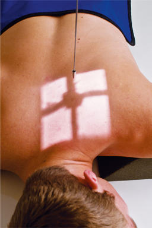
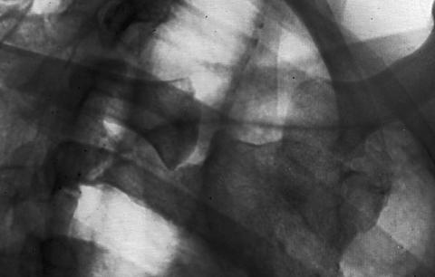

# Rx oblică anterioară (OAD și OAS) (ARTICULAȚII STERNOCLAVICULARE)

  📷 Radiografie Convențională (Rx)
  <strong>Actualizat:</strong> 2026-09-15
  <strong>Autor:</strong> Departamentul de Radiologie / Referință Bontrager

---

-   __1. Rezumat Clinic & Indicații__

    ---

    === "Indicații Clinice"

        - separarea articulației, subluxația sau altă patologie a articulațiilor sternoclaviculare. Vizualizează cel mai bine articulațiile sternoclaviculare de partea inferioară, care sunt evidențiate cel mai aproape de coloana vertebrală pe radiografie (vezi NOTA 1 mai jos; vezi NOTA 2 pentru o oblicitate mai redusă pentru vizualizarea articulației de partea superioară).

    === "Ghid Național IRIS"

        !!! info "Referință Primară: Ghidul Național IRIS (Ordinul MS 1342/2012)"
            - **Capitol Ghid IRIS:** *Torace & Pulmon*
            - **Grad de Recomandare:** **Grad A**
            - **Nivel de Iradiere Estimată:** `Clasa 1 (Minimă < 0.1 mSv)`

            [:octicons-search-16: Deschide Ghidul IRIS](../../iris.md){ .md-button .md-button--primary } [:material-open-in-new: Aplicația Oficială PWA](https://radiologie-pediatrica.ro/iris/){ .md-button target="_blank" rel="noopener" }

-   __2. Poziționare & Centrare Fascicul__

    ---

    - **Poziție Pacient:** Pacient: Decubit ventral sau ortostatism, cu fața spre receptorul de imagine, cu o ușoară rotație (10° la 15°) a toracelui, cu cotul de partea superioară flectat și mâna plasată adiacent capului (vezi NOTELE 1 și 2).; Regiune anatomică: Rotiți pacientul cu 10° la 15° spre partea de interes, aliniind articulațiile sternoclaviculare cu centrul receptorului de imagine. Articulațiile sternoclaviculare vor fi situate la nivelul T2–T3, la 1–2 țoli lateral (spre partea superioară) față de coloana vertebrală (Fig. 10.30).
    - **Punct de Centrare Fascicul:** perpendicular pe receptorul de imagine la nivelul T2–T3, situată la 3 țoli (7.5 cm) distal față de vertebra proeminentă (apofiza spinoasă C7) și la 1 la 2 țoli (2.5 la 5 cm) lateral (spre partea superioară) față de planul mediosagital
    - **Distanță Focar-Film (DFF / SID):** 100 cm
    - **Comandă Respiratorie:** Apnee (oprirea respirației) în expir.

-   __3. Parametri Tehnici Expunere__

    ---

    | Parametru Tehnic | Valoare Configurare Generator / Tub |
    |:-----------------|:-------------------------------------|
    | **Tensiune Tub (kV)** | 75-85 kV |
    | **Sarcină / Produs Curent-Timp (mAs)** | DE CONFIGURAT PE APARAT |
    | **Distanță Focar-Film (DFF / SID)** | 100 cm |
    | **Grilă Antidifuzoare (Bucky)** | Cu grilă antidifuzoare Bucky |
    | **Dimensiune Focar** | Focar Mic (0.6 mm) |
    | **Camere de Ionizare AEC** | Camerele laterale (sau camera centrală, în funcție de regiune) |
    | **Colimare Fascicul** | Colimați strâns la regiunea articulațiilor sternoclaviculare. |
    | **Filtrare Tub** | Totală ≥ 2.5 mm Al echivalent |

-   __4. Criterii de Calitate & Reușită Imagine__

    ---

    - Articulațiile sternoclaviculare de partea inferioară, adiacente coloanei vertebrale, manubriul sternal și porțiunea medială a claviculelor sunt cel mai bine evidențiate (Figs. 10.31 și 10.32).
    - Articulațiile sternoclaviculare de pe partea ridicată vor fi scurtate și evidențiate mai departe de coloana vertebrală. Poziție:
    - Rotația corectă a pacientului evidențiază articulațiile sternoclaviculare de partea inferioară fără suprapunerea coloanei vertebrale sau a manubriului sternal. expunere:
    - Expunere optimă a receptorului de imagine și contrast optim pentru vizualizarea articulațiilor sternoclaviculare prin coastele (grilajul costal) și plămânii suprapuși.
    - Fără mișcare, demonstrată prin contururi osoase nete. L Fig. 10.31 RAO de 10° la 15°, care evidențiază cel mai bine articulația sternoclaviculară dreaptă (de pe partea de jos). Clavicula stângă. Articulația sternoclaviculară stângă. Manubriul sternal. L Fig. 10.32 RAO de 10° la 15°, articulația sternoclaviculară dreaptă.

-   __5. Protecție Radiologică (ALARA)__

    ---

    - Ecranare gonadică și a organelor radiosensibile conform procedurilor locale de radioprotecție ALARA.
    - Colimare strictă la aria de interes pentru limitarea radiației difuze.
    - Verificarea posibilității unei sarcini la pacientele de vârstă fertilă înainte de expunere.

!!! note "Observații Clinice & Tehnice"
    cu o oblicitate mai redusă (5° la 10°), articulațiile sternoclaviculare opuse (articulația de partea superioară) ar fi vizualizate în continuare lângă coloana vertebrală. Adaptare—incidență oblică posterioară. Dacă starea pacientului impune acest lucru, imaginile oblice pot fi obținute utilizând o incidență oblică posterioară cu o rotație de 10° la 15° în sens opus față de partea de interes, cu raza centrală la 1 la 2 țoli (2.5 la 5 cm) lateral față de planul mediosagital (spre partea inferioară). Articulațiile sternoclaviculare de partea superioară ar fi cel mai bine vizualizate în această incidență. ARTICULAȚII STERNOCLAVICULARE INCIDENȚĂ PA oblică anterioară Fig. 10.30 10° la 15° RAO, pentru articulațiile sternoclaviculare drepte.

### 🖼️ Imagini

<figure class="protocol-image-card" markdown>

<figcaption><strong>Fig. 10.30 RAO de 10° la 15°, pentru articulația sternoclaviculară dreaptă.</strong> — Poziționarea pacientului conform Ghidului Bontrager (Fig. 10.30 RAO de 10° la 15°, pentru articulația sternoclaviculară dreaptă.)</figcaption>

</figure>

<figure class="protocol-image-card" markdown>

<figcaption><strong>Fig. 10.31 RAO de 10° la 15°, evidențiază cel mai bine SC dreaptă (de pe partea de jos)</strong> — Aspect radiografic de referință conform Ghidului Bontrager (Fig. 10.31 RAO de 10° la 15°, evidențiază cel mai bine SC dreaptă, de pe partea de jos)</figcaption>

</figure>

<figure class="protocol-image-card" markdown>

<figcaption><strong>Fig. 10.32 RAO de 10° la 15°, articulația sternoclaviculară dreaptă.</strong> — Aspect radiografic de referință conform Ghidului Bontrager (Fig. 10.32 RAO de 10° la 15°, articulația sternoclaviculară dreaptă.)</figcaption>

</figure>

=== "Ghid Rapid de Execuție"

    1. **Identificarea și verificarea pacientului:** verificare identitate, zonă de examinat, consimțământ conform procedurii și evaluarea posibilității unei sarcini, când este relevantă.
    2. **Pregătire:** îndepărtarea oricăror obiecte radiopace (bijuterii, agrafe, fermoare, proteze, pansamente dense).
    3. **Poziționare precisă:** alinierea receptorului de imagine și a tubului la distanța prescrisă (100 cm).
    4. **Colimare strictă:** adaptarea fasciculului strict la regiunea de diagnostic pentru scăderea iradierii și reducerea radiației difuze.
    5. **Radioprotecție:** verificarea [politicii RX](../radioprotectie.md), cu măsuri distincte pentru pacient, personal și însoțitor.

## Surse de documentare

- [Bontrager's Textbook of Radiographic Positioning (Ed. 9/10), Pagina 391](https://www.elsevier.com/books/textbook-of-radiographic-positioning-and-related-anatomy/lampignano/978-0-323-65367-1)
