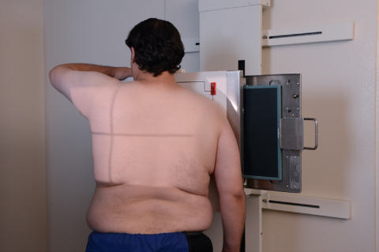
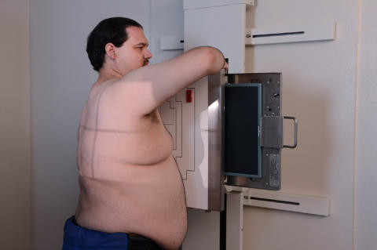
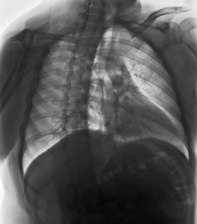

# Rx RAO AND LAO ANTERIOR OBLIQUE POSITIONS (Torace)

  📷 Radiografie Convențională (Rx)
  <strong>Actualizat:</strong> 2026-09-15
  <strong>Autor:</strong> Departamentul de Radiologie / Referință Bontrager

---

-   __1. Rezumat Clinic & Indicații__

    ---

    === "Indicații Clinice"

        - Investigate pathology involving the lung fields, trachea, and mediastinal structures.
        - Determine the size and contours of the heart and great vessels.

    === "Ghid Național IRIS"

        !!! info "Referință Primară: Ghidul Național IRIS (Ordinul MS 1342/2012)"
            - **Capitol Ghid IRIS:** *Ghidul Național IRIS*
            - **Grad de Recomandare:** **De verificat pe indicație; fără grad atribuit automat**
            - **Nivel de Iradiere Estimată:** `De verificat pentru examinarea și populația selectate`

            [:octicons-search-16: Deschide Ghidul IRIS](../../iris.md){ .md-button .md-button--primary } [:material-open-in-new: Aplicația Oficială PWA](https://radiologie-pediatrica.ro/iris/){ .md-button target="_blank" rel="noopener" }
-   __2. Poziționare & Centrare Fascicul__

    ---

    - **Poziție Pacient:** Pacient: Patient Ortostatism, rotated 45 degrees with right anterior Umăr against IR for RAO (Fig. 2.73) and 45 degrees with left anterior Umăr against IR for LAO (Fig. 2.74) (see NOTES for 60 degrees LAO) Patient’s arm flexed nearest IR and Mână placed on Șold, palm out Opposite arm raised to clear lung field and Mână rested on head or on Torace unit for support, keeping arm raised as high as possible Patient looking straight ahead; chin raised; Regiune anatomică: As viewed from the xray tube, center the patient to CR and to IR, with top of IR about 1 inch (2.5 cm) above vertebra proeminentă (apofiza spinoasă C7).
    - **Punct de Centrare Fascicul:** midway between midsagittal plane and lateral margin of thorax
    - **Distanță Focar-Film (DFF / SID):** 180 cm
    - **Comandă Respiratorie:** Apnee în inspir profund complet (după a doua inspirație).

-   __3. Parametri Tehnici Expunere__

    ---

    | Parametru Tehnic | Valoare Configurare Generator / Tub |
    |:-----------------|:-------------------------------------|
    | **Tensiune Tub (kV)** | 110-125 kV |
    | **Sarcină / Produs Curent-Timp (mAs)** | DE CONFIGURAT PE APARAT |
    | **Distanță Focar-Film (DFF / SID)** | 180 cm |
    | **Grilă Antidifuzoare (Bucky)** | Cu grilă antidifuzoare Bucky |
    | **Dimensiune Focar** | Focar Mare (1.0 - 1.2 mm) |
    | **Camere de Ionizare AEC** | Camerele laterale (sau camera centrală funcție de regiune) |
    | **Colimare Fascicul** | Collimate on four sides to area of lung fields (top border of light field to level of vertebra proeminentă (apofiza spinoasă C7)). |
    | **Filtrare Tub** | Totală ≥ 2.5 mm Al echivalent |

-   __4. Criterii de Calitate & Reușită Imagine__

    ---

    - Both lungs from the apices to the costophrenic angles should be included.
    - Airfilled trachea, great vessels, and heart outlines are best visualized with 60degree LAO position. Position
    - To evaluate for a 45degree rotation, the distance from the outer margin of the Coaste (Grilaj Costal) to the vertebral column on the side farthest from the IR should be approximately two times the distance of the side closest to the IR (Figs. 2.78 and 2.79).
    - CR centered at level of T7. Exposure
    - No motion; outline of the diaphragm and heart should appear sharp.
    - Optimal exposure and contrast allow visualization of vascular markings throughout the lungs and rib outlines except through the densest regions of the heart. L Fig. 2.75 45° RAO position.

-   __5. Protecție Radiologică (ALARA)__

    ---

    - Ecranare gonadică și a organelor radiosensibile conform procedurilor locale de radioprotecție ALARA.
    - Colimare strictă la aria de interes pentru limitarea radiației difuze.
    - Verificarea posibilității unei sarcini la pacientele de vârstă fertilă înainte de expunere.

!!! note "Observații Clinice & Tehnice"
    S: For anterior oblique, the side of interest generally is the side farthest from the IR. Thus, the RAO provides the best visualization of the left lung. Certain positions for studies of the heart and great vessels require oblique positions with an increase in rotation of 45 to 60 degrees (see Figs. 2.75 and 2.76). Less rotation (15 to 20 degrees) may be valuable for better visualization of the various areas of the lungs for possible pulmonary disease (Fig. 2.77). Exception Either Ortostatism or Decubit posterior oblique projections can be taken if the patient cannot assume an Ortostatism position for anterior oblique, or if supplementary projections are required. Torace SPECIAL AP upright or semierect Lateral decubitus (AP) AP lordotic Anterior oblique Fig. 2.74 45° LAO position. Fig. 2.73 45° RAO position. LAO RAO

### 🖼️ Imagini

<figure class="protocol-image-card" markdown>

<figcaption><strong>Fig. 2.74 45° LAO position.</strong> — Poziționare pacient conform Ghidului Bontrager (Fig. 2.74 45° LAO position.)</figcaption>

</figure>

<figure class="protocol-image-card" markdown>

<figcaption><strong>Fig. 2.73 45° RAO position.</strong> — Aspect radiografic de referință conform Ghidului Bontrager (Fig. 2.73 45° RAO position.)</figcaption>

</figure>

<figure class="protocol-image-card" markdown>

<figcaption><strong>Fig. 2.75 45° RAO position.</strong> — Aspect radiografic de referință conform Ghidului Bontrager (Fig. 2.75 45° RAO position.)</figcaption>

</figure>

=== "Ghid Rapid de Execuție"

    1. **Identificarea și verificarea pacientului:** verificare identitate, zonă de examinat, consimțământ conform procedurii și evaluarea posibilității unei sarcini, când este relevantă.
    2. **Pregătire:** îndepărtarea oricăror obiecte radiopace (bijuterii, agrafe, fermoare, proteze, pansamente dense).
    3. **Poziționare precisă:** alinierea receptorului de imagine și a tubului la distanța prescrisă (180 cm).
    4. **Colimare strictă:** adaptarea fasciculului strict la regiunea de diagnostic pentru scăderea iradierii și reducerea radiației difuze.
    5. **Radioprotecție:** verificarea [politicii RX](../radioprotectie.md), cu măsuri distincte pentru pacient, personal și însoțitor.

## Surse de documentare

- [Bontrager's Textbook of Radiographic Positioning (Ed. 9/10), Pagina 109](https://www.elsevier.com/books/textbook-of-radiographic-positioning-and-related-anatomy/lampignano/978-0-323-65367-1)
