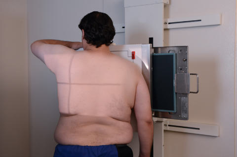
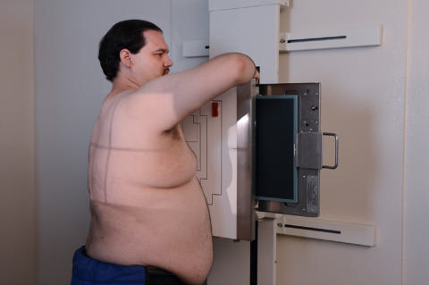
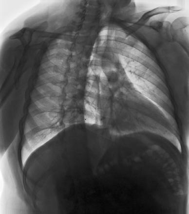

# Rx oblică anterioară (OAD și OAS) (torace)

  📷 Radiografie Convențională (Rx)
  <strong>Actualizat:</strong> 2026-09-15
  <strong>Autor:</strong> Departamentul de Radiologie / Referință Bontrager

---

-   __1. Rezumat Clinic & Indicații__

    ---

    === "Indicații Clinice"

        - Investigarea patologiei câmpurilor pulmonare, traheei și structurilor mediastinale.
        - Determinarea dimensiunilor și contururilor cordului și vaselor mari.

    === "Ghid Național IRIS"

        !!! info "Referință Primară: Ghidul Național IRIS (Ordinul MS 1342/2012)"
            - **Capitol Ghid IRIS:** *Torace & Pulmon*
            - **Grad de Recomandare:** **Grad A**
            - **Nivel de Iradiere Estimată:** `Clasa 1 (Minimă < 0.1 mSv)`

            [:octicons-search-16: Deschide Ghidul IRIS](../../iris.md){ .md-button .md-button--primary } [:material-open-in-new: Aplicația Oficială PWA](https://radiologie-pediatrica.ro/iris/){ .md-button target="_blank" rel="noopener" }

-   __2. Poziționare & Centrare Fascicul__

    ---

    - **Poziție Pacient:** Pacient: în ortostatism, rotit la 45 de grade, cu fața anterioară a umărului drept sprijinită de receptorul de imagine pentru RAO (Fig. 2.73), respectiv la 45 de grade, cu fața anterioară a umărului stâng sprijinită de receptor pentru LAO (Fig. 2.74) (vezi NOTELE pentru LAO la 60 de grade). Brațul cel mai apropiat de receptor este flectat, cu mâna pe șold și palma orientată în afară. Brațul opus este ridicat pentru a degaja câmpurile pulmonare, iar mâna este sprijinită pe cap sau pe stativul toracic, menținând brațul cât mai sus. Pacientul privește drept înainte, cu bărbia ridicată. Regiune anatomică: privind dinspre tubul de raze X, centrați pacientul la raza centrală și la receptorul de imagine, cu marginea superioară a receptorului la aproximativ 1 țol (2.5 cm) deasupra vertebrei proeminente (apofiza spinoasă C7).
    - **Punct de Centrare Fascicul:** La jumătatea distanței dintre planul mediosagital și marginea laterală a toracelui
    - **Distanță Focar-Film (DFF / SID):** 180 cm
    - **Comandă Respiratorie:** Apnee în inspir profund complet (după a doua inspirație).

-   __3. Parametri Tehnici Expunere__

    ---

    | Parametru Tehnic | Valoare Configurare Generator / Tub |
    |:-----------------|:-------------------------------------|
    | **Tensiune Tub (kV)** | 110-125 kV |
    | **Sarcină / Produs Curent-Timp (mAs)** | DE CONFIGURAT PE APARAT |
    | **Distanță Focar-Film (DFF / SID)** | 180 cm |
    | **Grilă Antidifuzoare (Bucky)** | Cu grilă antidifuzoare Bucky |
    | **Dimensiune Focar** | Focar Mare (1.0 - 1.2 mm) |
    | **Camere de Ionizare AEC** | Camerele laterale (sau camera centrală, în funcție de regiune) |
    | **Colimare Fascicul** | Colimați pe cele patru laturi la zona câmpurilor pulmonare (marginea superioară a câmpului luminos la nivelul vertebrei proeminente, apofiza spinoasă C7). |
    | **Filtrare Tub** | Totală ≥ 2.5 mm Al echivalent |

-   __4. Criterii de Calitate & Reușită Imagine__

    ---

    - Trebuie incluși ambii plămâni, de la apexuri (vârfurile pulmonare) până la sinusurile costodiafragmatice.
    - Traheea aerată, vasele mari și contururile cordului sunt vizualizate cel mai bine în poziția oblică anterioară stângă (OAS / LAO) la 60 de grade. Poziție
    - Pentru evaluarea rotației la 45 de grade, distanța dintre marginea externă a coastelor (grilajului costal) și coloana vertebrală pe partea cea mai îndepărtată de receptorul de imagine trebuie să fie de aproximativ două ori mai mare decât distanța de pe partea cea mai apropiată de receptor (Fig. 2.78 și 2.79).
    - Raza centrală este centrată la nivelul T7. Expunere
    - Fără mișcare; contururile cupolelor diafragmatice și cordului trebuie să fie nete.
    - Expunerea și contrastul optime permit vizualizarea desenului vascular în întregul parenchim pulmonar și a contururilor coastelor, cu excepția celor proiectate peste regiunile cele mai dense ale cordului. L Fig. 2.75 Poziție oblică anterioară dreaptă (OAD / RAO) la 45°.

-   __5. Protecție Radiologică (ALARA)__

    ---

    - Ecranare gonadică și a organelor radiosensibile conform procedurilor locale de radioprotecție ALARA.
    - Colimare strictă la aria de interes pentru limitarea radiației difuze.
    - Verificarea posibilității unei sarcini la pacientele de vârstă fertilă înainte de expunere.

!!! note "Observații Clinice & Tehnice"
    S: Pentru incidențele oblice anterioare, partea de interes este în general cea mai îndepărtată de receptorul de imagine. Astfel, RAO oferă cea mai bună vizualizare a plămânului stâng. Anumite poziții pentru examinarea cordului și vaselor mari necesită poziții oblice cu creșterea rotației de la 45 la 60 de grade (vezi Fig. 2.75 și 2.76). O rotație mai mică (15 la 20 de grade) poate fi utilă pentru o mai bună vizualizare a diferitelor regiuni pulmonare în cazul unei posibile boli pulmonare (Fig. 2.77). Excepție: se pot efectua incidențe oblice posterioare, fie în ortostatism, fie în decubit, dacă pacientul nu poate adopta poziția în ortostatism pentru incidențele oblice anterioare sau dacă sunt necesare incidențe suplimentare. Torace, incidențe SPECIALE: AP în ortostatism sau semierect; decubit lateral (AP); AP lordotică; oblică anterioară. Fig. 2.74 Poziție oblică anterioară stângă (OAS / LAO) la 45°. Fig. 2.73 Poziție oblică anterioară dreaptă (OAD / RAO) la 45°. LAO RAO

### 🖼️ Imagini

<figure class="protocol-image-card" markdown>

<figcaption><strong>Fig. 2.74 Poziție oblică anterioară stângă (OAS / LAO) la 45°.</strong> — Poziționarea pacientului conform Ghidului Bontrager (Fig. 2.74 Poziție oblică anterioară stângă (OAS / LAO) la 45°.)</figcaption>

</figure>

<figure class="protocol-image-card" markdown>

<figcaption><strong>Fig. 2.73 Poziție oblică anterioară dreaptă (OAD / RAO) la 45°.</strong> — Aspect radiografic de referință conform Ghidului Bontrager (Fig. 2.73 Poziție oblică anterioară dreaptă (OAD / RAO) la 45°.)</figcaption>

</figure>

<figure class="protocol-image-card" markdown>

<figcaption><strong>Fig. 2.75 Poziție oblică anterioară dreaptă (OAD / RAO) la 45°.</strong> — Aspect radiografic de referință conform Ghidului Bontrager (Fig. 2.75 Poziție oblică anterioară dreaptă (OAD / RAO) la 45°.)</figcaption>

</figure>

=== "Ghid Rapid de Execuție"

    1. **Identificarea și verificarea pacientului:** verificare identitate, zonă de examinat, consimțământ conform procedurii și evaluarea posibilității unei sarcini, când este relevantă.
    2. **Pregătire:** îndepărtarea oricăror obiecte radiopace (bijuterii, agrafe, fermoare, proteze, pansamente dense).
    3. **Poziționare precisă:** alinierea receptorului de imagine și a tubului la distanța prescrisă (180 cm).
    4. **Colimare strictă:** adaptarea fasciculului strict la regiunea de diagnostic pentru scăderea iradierii și reducerea radiației difuze.
    5. **Radioprotecție:** verificarea [politicii RX](../radioprotectie.md), cu măsuri distincte pentru pacient, personal și însoțitor.

## Surse de documentare

- [Bontrager's Textbook of Radiographic Positioning (Ed. 9/10), Pagina 109](https://www.elsevier.com/books/textbook-of-radiographic-positioning-and-related-anatomy/lampignano/978-0-323-65367-1)
