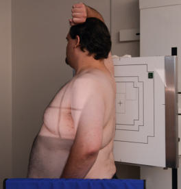
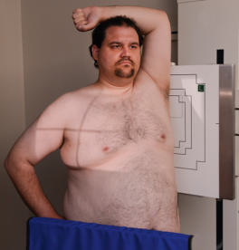
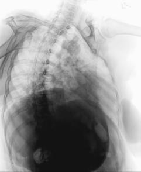
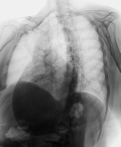

# Rx Oblică Posterioară (OPD și OPS) (Torace)

  📷 Radiografie Convențională (Rx)
  <strong>Actualizat:</strong> 2026-09-15
  <strong>Autor:</strong> Departamentul de Radiologie / Referință Bontrager

---

-   __1. Rezumat Clinic & Indicații__

    ---

    === "Indicații Clinice"

        - Investigate pathology involving câmpuri pulmonare, trachea, și mediastinal structures.
        - Determine size și contours de cordul și great vessels.

    === "Ghid Național IRIS"

        !!! info "Referință Primară: Ghidul Național IRIS (Ordinul MS 1342/2012)"
            - **Capitol Ghid IRIS:** *Ghidul Național IRIS*
            - **Grad de Recomandare:** **De verificat pe indicație; fără grad atribuit automat**
            - **Nivel de Iradiere Estimată:** `De verificat pentru examinarea și populația selectate`

            [:octicons-search-16: Deschide Ghidul IRIS](../../iris.md){ .md-button .md-button--primary } [:material-open-in-new: Aplicația Oficială PWA](https://radiologie-pediatrica.ro/iris/){ .md-button target="_blank" rel="noopener" }
-   __2. Poziționare & Centrare Fascicul__

    ---

    - **Poziție Pacient:** Pacient: (Decubit) If pacient cannot stand sau sit, perform posterior oblic incidențe pe table. Place supports under pacient’s cap și under ridicat Șold și Umăr.; Regiune anatomică: Top de receptorul de imagine about 1 inch (2 cm) above vertebra proeminentă (apofiza spinoasă C7) sau about 5 inches (12 cm) above level de incizura jugulară (manubriul sternal) (2 inches [5 cm] above umeri) Thorax centrat pe raza centrală și la receptorul de imagine
    - **Punct de Centrare Fascicul:** midway între plan mediosagital și lateral margin de thorax
    - **Distanță Focar-Film (DFF / SID):** 180 cm
    - **Comandă Respiratorie:** Make expunere after second Inspir profund adecvat: minim 9-10 arcuri costale posterioare vizibile.

-   __3. Parametri Tehnici Expunere__

    ---

    | Parametru Tehnic | Valoare Configurare Generator / Tub |
    |:-----------------|:-------------------------------------|
    | **Tensiune Tub (kV)** | 110-125 kV |
    | **Sarcină / Produs Curent-Timp (mAs)** | DE CONFIGURAT PE APARAT |
    | **Distanță Focar-Film (DFF / SID)** | 180 cm |
    | **Grilă Antidifuzoare (Bucky)** | Cu grilă antidifuzoare Bucky |
    | **Dimensiune Focar** | Focar Mare (1.0 - 1.2 mm) |
    | **Camere de Ionizare AEC** | Camerele laterale (sau camera centrală funcție de regiune) |
    | **Colimare Fascicul** | Collimate pe four sides la area de câmpuri pulmonare (top margine de light field la level de vertebra proeminentă (apofiza spinoasă C7)). |
    | **Filtrare Tub** | Totală ≥ 2.5 mm Al echivalent |

-   __4. Criterii de Calitate & Reușită Imagine__

    ---

    - sunt similar la criteria pentru anterior oblic poziții described earlier.
    - However, because de increased magnification de anterior cupole diafragmatice, câmpuri pulmonare usually appear shorter pe posterior oblic than pe anterior oblic incidențe.
    - cordul și great vessels also appear larger pe posterior oblic because they sunt farther de la receptorul de imagine (Figs. 2.84 și 2.85). Fig. 2.80 45° poziție oblică posterioară dreaptă (OPD / RPO). Fig. 2.81 45° poziție oblică posterioară stângă (OPS / LPO). R Fig. 2.82 45° la 60° poziție oblică posterioară dreaptă (OPD / RPO). R Fig. 2.83 45° la 60° poziție oblică posterioară stângă (OPS / LPO). Trachea R Heart Carina stâng Claviculă stâng sinusuri costodiafragmatice Fig. 2.84 45° la 60° poziție oblică posterioară dreaptă (OPD / RPO). drept Claviculă R drept lung Omoplat (Scapulă) stâng apex Heart Fig. 2.85 45° la 60° poziție oblică posterioară stângă (OPS / LPO).

-   __5. Protecție Radiologică (ALARA)__

    ---

    - Ecranare gonadică și a organelor radiosensibile conform procedurilor locale de radioprotecție ALARA.
    - Colimare strictă la aria de interes pentru limitarea radiației difuze.
    - Verificarea posibilității unei sarcini la pacientele de vârstă fertilă înainte de expunere.

!!! note "Observații Clinice & Tehnice"
    S: posterior oblic incidențe provide best visualization de side cel mai apropiat de receptorul de imagine. posterior poziții show same anatomy ca opposite anterior oblic poziții. Thus, RPO (Fig. 2.82) corresponds la poziție oblică anterioară stângă (OAS / LAO) și LPO (Fig. 2.83) corresponds la poziție oblică anterioară dreaptă (OAD / RAO). Torace SPECIAL AP în ortostatism sau semierect lateral decubit (AP) AP lordotic anterior oblic posterior oblic LPO RPO

### 🖼️ Imagini

<figure class="protocol-image-card" markdown>

<figcaption><strong>Fig. 2.80 45° poziție oblică posterioară dreaptă (OPD / RPO).</strong> — Poziționare pacient conform Ghidului Bontrager (Fig. 2.80 45° poziție oblică posterioară dreaptă (OPD / RPO).)</figcaption>

</figure>

<figure class="protocol-image-card" markdown>

<figcaption><strong>Fig. 2.81 45° poziție oblică posterioară stângă (OPS / LPO).</strong> — Aspect radiografic de referință conform Ghidului Bontrager (Fig. 2.81 45° poziție oblică posterioară stângă (OPS / LPO).)</figcaption>

</figure>

<figure class="protocol-image-card" markdown>

<figcaption><strong>Fig. 2.82 45° la 60° poziție oblică posterioară dreaptă (OPD / RPO).</strong> — Aspect radiografic de referință conform Ghidului Bontrager (Fig. 2.82 45° la 60° poziție oblică posterioară dreaptă (OPD / RPO).)</figcaption>

</figure>

<figure class="protocol-image-card" markdown>

<figcaption><strong>Fig. 2.83 45° la 60° poziție oblică posterioară stângă (OPS / LPO).</strong> — Aspect radiografic de referință conform Ghidului Bontrager (Fig. 2.83 45° la 60° poziție oblică posterioară stângă (OPS / LPO).)</figcaption>

</figure>

<figure class="protocol-image-card" markdown>

<figcaption><strong>Fig. 2.84 45° la 60° poziție oblică posterioară dreaptă (OPD / RPO).</strong> — Aspect radiografic de referință conform Ghidului Bontrager (Fig. 2.84 45° la 60° poziție oblică posterioară dreaptă (OPD / RPO).)</figcaption>

</figure>

<figure class="protocol-image-card" markdown>

<figcaption><strong>Fig. 2.85 45° la 60° poziție oblică posterioară stângă (OPS / LPO).</strong> — Aspect radiografic de referință conform Ghidului Bontrager (Fig. 2.85 45° la 60° poziție oblică posterioară stângă (OPS / LPO).)</figcaption>

</figure>

=== "Ghid Rapid de Execuție"

    1. **Identificarea și verificarea pacientului:** verificare identitate, zonă de examinat, consimțământ conform procedurii și evaluarea posibilității unei sarcini, când este relevantă.
    2. **Pregătire:** îndepărtarea oricăror obiecte radiopace (bijuterii, agrafe, fermoare, proteze, pansamente dense).
    3. **Poziționare precisă:** alinierea receptorului de imagine și a tubului la distanța prescrisă (180 cm).
    4. **Colimare strictă:** adaptarea fasciculului strict la regiunea de diagnostic pentru scăderea iradierii și reducerea radiației difuze.
    5. **Radioprotecție:** verificarea [politicii RX](../radioprotectie.md), cu măsuri distincte pentru pacient, personal și însoțitor.

## Surse de documentare

- [Bontrager's Textbook of Radiographic Positioning (Ed. 9/10), Pagina 111](https://www.elsevier.com/books/textbook-of-radiographic-positioning-and-related-anatomy/lampignano/978-0-323-65367-1)
