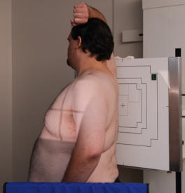
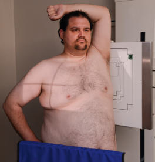
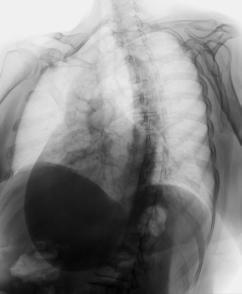
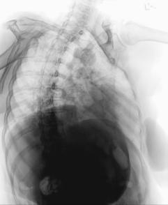

# Rx oblică posterioară (OPD și OPS) (torace)

  📷 Radiografie Convențională (Rx)
  <strong>Actualizat:</strong> 2026-09-15
  <strong>Autor:</strong> Departamentul de Radiologie / Referință Bontrager

---

-   __1. Rezumat Clinic & Indicații__

    ---

    === "Indicații Clinice"

        - Investigarea patologiei câmpurilor pulmonare, traheei și structurilor mediastinale.
        - Determinarea dimensiunilor și contururilor cordului și vaselor mari.

    === "Ghid Național IRIS"

        !!! info "Referință Primară: Ghidul Național IRIS (Ordinul MS 1342/2012)"
            - **Capitol Ghid IRIS:** *Ghidul Național IRIS*
            - **Grad de Recomandare:** **De verificat pe indicație; fără grad atribuit automat**
            - **Nivel de Iradiere Estimată:** `De verificat pentru examinarea și populația selectate`

            [:octicons-search-16: Deschide Ghidul IRIS](../../iris.md){ .md-button .md-button--primary } [:material-open-in-new: Aplicația Oficială PWA](https://radiologie-pediatrica.ro/iris/){ .md-button target="_blank" rel="noopener" }
-   __2. Poziționare & Centrare Fascicul__

    ---

    - **Poziție Pacient:** Pacient: (decubit) Dacă pacientul nu poate sta în picioare sau în șezut, efectuați incidențele oblice posterioare pe masă. Așezați suporturi sub capul pacientului și sub șoldul și umărul ridicate. Regiune anatomică: marginea superioară a receptorului de imagine la aproximativ 1 inch (2 cm) deasupra vertebrei proeminente (apofiza spinoasă C7) sau la aproximativ 5 inches (12 cm) deasupra incizurii jugulare (manubriului sternal) (2 inches [5 cm] deasupra umerilor). Toracele centrat la raza centrală și la receptorul de imagine.
    - **Punct de Centrare Fascicul:** La jumătatea distanței dintre planul mediosagital și marginea laterală a toracelui
    - **Distanță Focar-Film (DFF / SID):** 180 cm
    - **Comandă Respiratorie:** Efectuați expunerea după al doilea inspir profund adecvat: minimum 9-10 arcuri costale posterioare vizibile.

-   __3. Parametri Tehnici Expunere__

    ---

    | Parametru Tehnic | Valoare Configurare Generator / Tub |
    |:-----------------|:-------------------------------------|
    | **Tensiune Tub (kV)** | 110-125 kV |
    | **Sarcină / Produs Curent-Timp (mAs)** | DE CONFIGURAT PE APARAT |
    | **Distanță Focar-Film (DFF / SID)** | 180 cm |
    | **Grilă Antidifuzoare (Bucky)** | Cu grilă antidifuzoare Bucky |
    | **Dimensiune Focar** | Focar Mare (1.0 - 1.2 mm) |
    | **Camere de Ionizare AEC** | Camerele laterale (sau camera centrală, în funcție de regiune) |
    | **Colimare Fascicul** | Colimați pe cele patru laturi la zona câmpurilor pulmonare (marginea superioară a câmpului luminos la nivelul vertebrei proeminente, apofiza spinoasă C7). |
    | **Filtrare Tub** | Totală ≥ 2.5 mm Al echivalent |

-   __4. Criterii de Calitate & Reușită Imagine__

    ---

    - Sunt similare criteriilor pentru pozițiile oblice anterioare descrise anterior.
    - Totuși, din cauza măririi mai accentuate a porțiunilor anterioare ale cupolelor diafragmatice, câmpurile pulmonare apar de obicei mai scurte în incidențele oblice posterioare decât în cele oblice anterioare.
    - Cordul și vasele mari apar, de asemenea, mai mari în incidențele oblice posterioare, deoarece sunt mai îndepărtate de receptorul de imagine (Fig. 2.84 și 2.85). Fig. 2.80 Poziție oblică posterioară dreaptă (OPD / RPO) la 45°. Fig. 2.81 Poziție oblică posterioară stângă (OPS / LPO) la 45°. R Fig. 2.82 Poziție oblică posterioară dreaptă (OPD / RPO) la 45° la 60°. R Fig. 2.83 Poziție oblică posterioară stângă (OPS / LPO) la 45° la 60°. Trahee. R Cord. Carină. Claviculă stângă. Sinus costodiafragmatic stâng. Fig. 2.84 Poziție oblică posterioară dreaptă (OPD / RPO) la 45° la 60°. Claviculă dreaptă. R Plămân drept. Omoplat (scapulă). Apex stâng. Cord. Fig. 2.85 Poziție oblică posterioară stângă (OPS / LPO) la 45° la 60°.

-   __5. Protecție Radiologică (ALARA)__

    ---

    - Ecranare gonadică și a organelor radiosensibile conform procedurilor locale de radioprotecție ALARA.
    - Colimare strictă la aria de interes pentru limitarea radiației difuze.
    - Verificarea posibilității unei sarcini la pacientele de vârstă fertilă înainte de expunere.

!!! note "Observații Clinice & Tehnice"
    S: Incidențele oblice posterioare oferă cea mai bună vizualizare a părții celei mai apropiate de receptorul de imagine. Pozițiile posterioare evidențiază aceeași anatomie ca pozițiile oblice anterioare opuse. Astfel, RPO (Fig. 2.82) corespunde poziției oblice anterioare stângi (OAS / LAO), iar LPO (Fig. 2.83) corespunde poziției oblice anterioare drepte (OAD / RAO). Torace, incidențe SPECIALE: AP în ortostatism sau semierect; decubit lateral (AP); AP lordotică; oblică anterioară; oblică posterioară. LPO RPO

### 🖼️ Imagini

<figure class="protocol-image-card" markdown>

<figcaption><strong>Fig. 2.80 Poziție oblică posterioară dreaptă (OPD / RPO) la 45°.</strong> — Poziționarea pacientului conform Ghidului Bontrager (Fig. 2.80 Poziție oblică posterioară dreaptă (OPD / RPO) la 45°.)</figcaption>

</figure>

<figure class="protocol-image-card" markdown>

<figcaption><strong>Fig. 2.81 Poziție oblică posterioară stângă (OPS / LPO) la 45°.</strong> — Aspect radiografic de referință conform Ghidului Bontrager (Fig. 2.81 Poziție oblică posterioară stângă (OPS / LPO) la 45°.)</figcaption>

</figure>

<figure class="protocol-image-card" markdown>

<figcaption><strong>Fig. 2.82 Poziție oblică posterioară dreaptă (OPD / RPO) la 45° la 60°.</strong> — Aspect radiografic de referință conform Ghidului Bontrager (Fig. 2.82 Poziție oblică posterioară dreaptă (OPD / RPO) la 45° la 60°.)</figcaption>

</figure>

<figure class="protocol-image-card" markdown>

<figcaption><strong>Fig. 2.83 Poziție oblică posterioară stângă (OPS / LPO) la 45° la 60°.</strong> — Aspect radiografic de referință conform Ghidului Bontrager (Fig. 2.83 Poziție oblică posterioară stângă (OPS / LPO) la 45° la 60°.)</figcaption>

</figure>

<figure class="protocol-image-card" markdown>

<figcaption><strong>Fig. 2.84 Poziție oblică posterioară dreaptă (OPD / RPO) la 45° la 60°.</strong> — Aspect radiografic de referință conform Ghidului Bontrager (Fig. 2.84 Poziție oblică posterioară dreaptă (OPD / RPO) la 45° la 60°.)</figcaption>

</figure>

<figure class="protocol-image-card" markdown>

<figcaption><strong>Fig. 2.85 Poziție oblică posterioară stângă (OPS / LPO) la 45° la 60°.</strong> — Aspect radiografic de referință conform Ghidului Bontrager (Fig. 2.85 Poziție oblică posterioară stângă (OPS / LPO) la 45° la 60°.)</figcaption>

</figure>

=== "Ghid Rapid de Execuție"

    1. **Identificarea și verificarea pacientului:** verificare identitate, zonă de examinat, consimțământ conform procedurii și evaluarea posibilității unei sarcini, când este relevantă.
    2. **Pregătire:** îndepărtarea oricăror obiecte radiopace (bijuterii, agrafe, fermoare, proteze, pansamente dense).
    3. **Poziționare precisă:** alinierea receptorului de imagine și a tubului la distanța prescrisă (180 cm).
    4. **Colimare strictă:** adaptarea fasciculului strict la regiunea de diagnostic pentru scăderea iradierii și reducerea radiației difuze.
    5. **Radioprotecție:** verificarea [politicii RX](../radioprotectie.md), cu măsuri distincte pentru pacient, personal și însoțitor.

## Surse de documentare

- [Bontrager's Textbook of Radiographic Positioning (Ed. 9/10), Pagina 111](https://www.elsevier.com/books/textbook-of-radiographic-positioning-and-related-anatomy/lampignano/978-0-323-65367-1)
