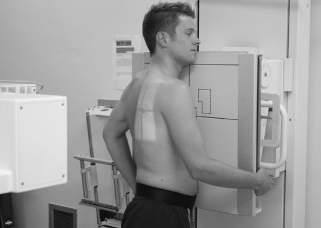
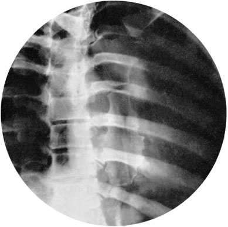
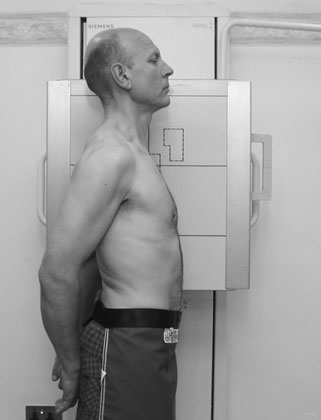
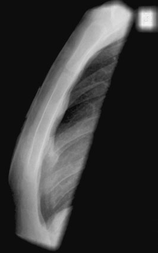
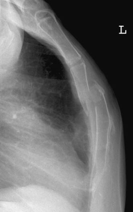

# Rx Stern Oblică Anterioară - trunk rotated

  📷 Radiografie Convențională (Rx)
  <strong>Actualizat:</strong> 2026-09-16
  <strong>Autor:</strong> Departamentul de Radiologie / Referință Clark (Ed. 12)

---

-   __1. Rezumat Clinic & Indicații__

    ---

    === "Indicații Clinice"

        - Profil (lateral) sternal incidență poate fie confusing, especially în elderly pacienți, who often have heavily calcified costal cartilages.
        - Interpretation de Profil (lateral) incidență este much easier when Stern este truly Profil (lateral) și la drept-angles la receptorul de imagine, cu corresponding superimposition de Coaste (Grilaj Costal) și cartilage.
        - It este important la remember that initial interpretation este often done în emergency department prin inexperienced observers; therefore, care trebuie să fie exercised la ensure that Stern este projected în true Profil (lateral) poziție.
        - Sternal suspiciune de fractură, especially when there este overlap de bone ends, poate fie associated cu compression (wedge) suspiciune de fractură de fourth la sixth Coloană Toracală. It este appropriate la imagine thoracic coloană vertebrală if this este suspected. Reference Unett EM, Carver BJ (2001). toracele X-ray: centring points și central rays – poate we stop confusing our students și ourselves? Synergy November:16. 228 Normal Profil (lateral) radiografie de Stern Profil (lateral) radiografie de Stern evidențiind suspiciune de fractură de corp cu overlap de bone ends

    === "Ghid Național IRIS"

        !!! info "Referință Primară: Ghidul Național IRIS (Ordinul MS 1342/2012)"
            - **Capitol Ghid IRIS:** *Ghidul Național IRIS*
            - **Grad de Recomandare:** **De verificat pe indicație; fără grad atribuit automat**
            - **Nivel de Iradiere Estimată:** `De verificat pentru examinarea și populația selectate`

            [:octicons-search-16: Deschide Ghidul IRIS](../../iris.md){ .md-button .md-button--primary } [:material-open-in-new: Aplicația Oficială PWA](https://radiologie-pediatrica.ro/iris/){ .md-button target="_blank" rel="noopener" }
-   __2. Poziționare & Centrare Fascicul__

    ---

    - **Poziție Pacient:** • pacientul initially sits sau stands facing stativ vertical Bucky sau lies Decubit ventral pe masa radiologică cu planul mediosagital la drept-angles la, și centred la, caseta.
• pacientul este then rotit approximately 20–30 grade, cu drept side raised la adopt stâng Oblică Anterioară poziție, which will ensure that less Cord și Siluetă Cardiovasculară shadow obscures Stern.
• pacientul este sprijinit în poziție cu non-opaque pads și imobilizare band where possible.
• caseta este centred la nivelul fifth thoracic vertebra.

• pacientul stă așezat sau stands, cu either Umăr against stativ vertical Bucky sau casetă stand.
• planul mediosagital de trunk este ajustat paralel cu casetă.
• Stern este centred la caseta sau Bucky.
• pacientul’s mâini sunt clasped behind back și umerii sunt pulled well back.
• caseta este centred la level 2.5 cm below sternal angle.
    - **Punct de Centrare Fascicul:** • se orientează raza centrală centrală perpendicular pe casetă și spre point 7.5 cm Profil (lateral) la fifth thoracic vertebra pe side nearest X-ray tube.

• Direct raza centrală orizontală centrală spre point 2.5 cm below sternal angle.
• expunere este made pe arrested inspir profund complet.
    - **Distanță Focar-Film (DFF / SID):** 100 cm
    - **Comandă Respiratorie:** expunere este made pe arrested inspir profund complet

-   __3. Parametri Tehnici Expunere__

    ---

    | Parametru Tehnic | Valoare Configurare Generator / Tub |
    |:-----------------|:-------------------------------------|
    | **Tensiune Tub (kV)** | DE CONFIGURAT PE APARAT |
    | **Sarcină / Produs Curent-Timp (mAs)** | Conform AEC / grosime anatomică |
    | **Distanță Focar-Film (DFF / SID)** | 100 cm |
    | **Grilă Antidifuzoare (Bucky)** | Cu grilă antidifuzoare Bucky |
    | **Dimensiune Focar** | Focar Mic (0.6 mm) |
    | **Camere de Ionizare AEC** | Camerele laterale (sau camera centrală funcție de regiune) |
    | **Colimare Fascicul** | Colimare strictă adaptată pe receptor 24 x 30 cm |
    | **Filtrare Tub** | Totală ≥ 2.5 mm Al echivalent (conform Clark: 3.0 mm Al eq.) |

-   __4. Criterii de Calitate & Reușită Imagine__

    ---

    - Vizualizarea clară întregii arii anatomice (Stern).
    - Absența artefactelor de mișcare; trabeculație osoasă și contururi nete.
    - Densitate optică și contrast adecvate pentru diferențierea țesuturilor moi de structurile osoase.

-   __5. Protecție Radiologică (ALARA)__

    ---

    - Ecranare gonadică cu șorț plumbat dacă gonadele sunt în apropierea fasciculului util (regula ALARA).
    - Colimare precisă la dimensiunea anatomică strict necesară pentru reducerea dozei și a radiației difuze.
    - Verificarea posibilității unei sarcini la pacientele de vârstă fertilă înainte de expunere.

!!! note "Observații Clinice & Tehnice"
    pacientul este allowed la breathe gently during expunere time de several seconds using low mA, provided that imobilizare este adecvat.
drept Oblică Anterioară Cord și Siluetă Cardiovasculară X-ray tube stâng lung drept lung Omoplat (Scapulă) Coaste (Grilaj Costal) Stern 30° Support 5th 6th TT 4th 3rd cc casetă Postero-anterior (PA) Oblică radiografie de Stern taken during gentle respirație

• Immediately before expunere, pacientul este asked la pull back umerii.
• If pacientul este în ortostatism, picioarele trebuie să fie separated la aid stability.
• FFD de 120 sau 150 cm este selected.

### 🖼️ Imagini

<figure class="protocol-image-card" markdown>

<figcaption><strong>Postero-anterior (PA) Oblică radiografie de Stern taken</strong> — Poziționare pacient și centrare fascicul conform Clark (Ed. 12)</figcaption>

</figure>

<figure class="protocol-image-card" markdown>

<figcaption><strong>Figura 2: Aspect radiografic / Poziționare (Clark Ed. 12)</strong> — Aspect radiografic / ghid de poziționare conform tratatului Clark (Ed. 12)</figcaption>

</figure>

<figure class="protocol-image-card" markdown>

<figcaption><strong>• Sternal suspiciune de fractură, especially when there este overlap de bone</strong> — Aspect radiografic / ghid de poziționare conform tratatului Clark (Ed. 12)</figcaption>

</figure>

<figure class="protocol-image-card" markdown>

<figcaption><strong>ends, poate fie associated cu compression (wedge) suspiciune de fractură</strong> — Aspect radiografic / ghid de poziționare conform tratatului Clark (Ed. 12)</figcaption>

</figure>

<figure class="protocol-image-card" markdown>

<figcaption><strong>Normal Profil (lateral) radiografie de Stern</strong> — Aspect radiografic / ghid de poziționare conform tratatului Clark (Ed. 12)</figcaption>

</figure>

=== "Ghid Rapid de Execuție"

    1. **Identificarea și verificarea pacientului:** verificare identitate, zonă de examinat, consimțământ conform procedurii și evaluarea posibilității unei sarcini, când este relevantă.
    2. **Pregătire:** îndepărtarea oricăror obiecte radiopace (bijuterii, agrafe, fermoare, proteze, pansamente dense).
    3. **Poziționare precisă:** alinierea receptorului de imagine și a tubului la distanța prescrisă (100 cm).
    4. **Colimare strictă:** adaptarea fasciculului strict la regiunea de diagnostic pentru scăderea iradierii și reducerea radiației difuze.
    5. **Radioprotecție:** verificarea [politicii RX](../radioprotectie.md), cu măsuri distincte pentru pacient, personal și însoțitor.

## Surse de documentare

- [Clark's Positioning in Radiography (Ed. 12), Pagina 242](../../assets/protocols/sources/Clark___Positioning_in_Radiography__12th_edition.pdf#page=242)
