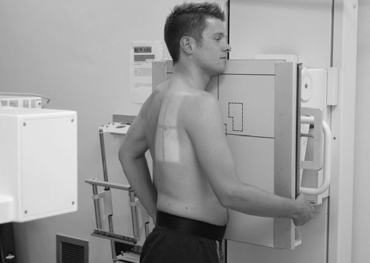
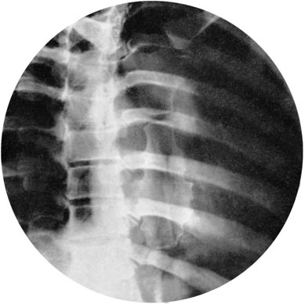
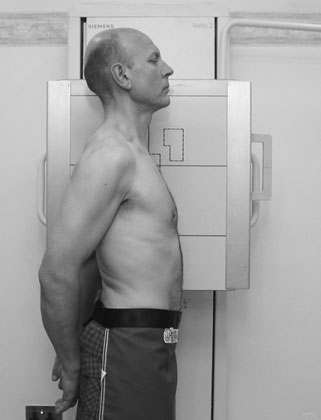
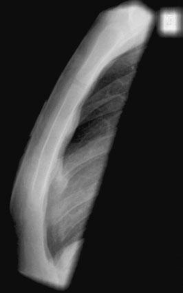
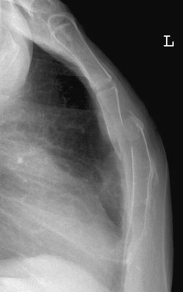

# Rx stern oblică anterioară – trunchiul rotit

  📷 Radiografie Convențională (Rx)
  <strong>Actualizat:</strong> 2026-09-16
  <strong>Autor:</strong> Departamentul de Radiologie / Referință Clark (Ed. 12)

---

-   __1. Rezumat Clinic & Indicații__

    ---

    === "Indicații Clinice"

        - Incidența de profil (lateral) a sternului poate fi dificil de interpretat, în special la pacienții vârstnici, care prezintă adesea calcificări accentuate ale cartilajelor costale.
        - Interpretarea incidenței de profil (lateral) este mult mai ușoară atunci când sternul este în profil strict, perpendicular pe receptorul de imagine, cu suprapunerea corespunzătoare a coastelor (grilajului costal) și cartilajelor.
        - Trebuie reținut că interpretarea inițială este adesea efectuată în departamentul de urgență de examinatori fără experiență; prin urmare, trebuie acordată atenție proiectării sternului în poziție de profil (lateral) strict.
        - Suspiciunea de fractură sternală, mai ales când există suprapunerea fragmentelor osoase, se poate asocia cu suspiciunea de fractură prin compresie (tasare cuneiformă) a vertebrelor toracice de la a patra la a șasea. Dacă există această suspiciune, este indicată examinarea imagistică a coloanei toracale. Referință: Unett EM, Carver BJ (2001). Radiografia toracică: puncte de centrare și raze centrale – putem înceta să ne derutăm studenții și pe noi înșine? Synergy noiembrie:16. 228 Radiografie normală de profil (lateral) a sternului. Radiografie de profil (lateral) a sternului care evidențiază suspiciune de fractură a corpului, cu suprapunerea fragmentelor osoase.

    === "Ghid Național IRIS"

        !!! info "Referință Primară: Ghidul Național IRIS (Ordinul MS 1342/2012)"
            - **Capitol Ghid IRIS:** *Torace & Pulmon*
            - **Grad de Recomandare:** **Grad A**
            - **Nivel de Iradiere Estimată:** `Clasa 1 (Minimă < 0.1 mSv)`

            [:octicons-search-16: Deschide Ghidul IRIS](../../iris.md){ .md-button .md-button--primary } [:material-open-in-new: Aplicația Oficială PWA](https://radiologie-pediatrica.ro/iris/){ .md-button target="_blank" rel="noopener" }

-   __2. Poziționare & Centrare Fascicul__

    ---

    - **Poziție Pacient:**
        - Inițial, pacientul stă în șezut sau în picioare cu fața spre stativul vertical Bucky, ori în decubit ventral pe masa radiologică, cu planul mediosagital perpendicular pe casetă și centrat la aceasta.
        - Pacientul este apoi rotit cu aproximativ 20–30 de grade, ridicând partea dreaptă pentru a adopta poziția oblică anterioară stângă, astfel încât o porțiune mai mică din umbra cordului și siluetei cardiovasculare să acopere sternul.
        - Pacientul este susținut în poziție cu perne radiotransparente și, dacă este posibil, cu o bandă de imobilizare.
        - Caseta este centrată la nivelul celei de-a cincea vertebre toracice.
        - Pacientul stă în șezut sau în picioare, cu oricare dintre umeri sprijinit de stativul vertical Bucky sau de suportul casetei.
        - Planul mediosagital al trunchiului este ajustat paralel cu caseta.
        - Sternul este centrat la casetă sau la Bucky.
        - Mâinile pacientului sunt împreunate la spate, iar umerii sunt trași bine înapoi.
        - Caseta este centrată la un nivel situat la 2.5 cm sub unghiul sternal.
    - **Punct de Centrare Fascicul:**
        - Orientați raza centrală perpendicular pe casetă, către un punct situat la 7.5 cm lateral de a cincea vertebră toracică, pe partea cea mai apropiată de tubul de raze X.
        - Orientați raza centrală orizontală către un punct situat la 2.5 cm sub unghiul sternal.
        - Expunerea se efectuează în apnee după un inspir profund complet.
    - **Distanță Focar-Film (DFF / SID):** 100 cm
    - **Comandă Respiratorie:** Expunerea se efectuează în apnee după un inspir profund complet.

-   __3. Parametri Tehnici Expunere__

    ---

    | Parametru Tehnic | Valoare Configurare Generator / Tub |
    |:-----------------|:-------------------------------------|
    | **Tensiune Tub (kV)** | DE CONFIGURAT PE APARAT |
    | **Sarcină / Produs Curent-Timp (mAs)** | Conform AEC / grosimii anatomice |
    | **Distanță Focar-Film (DFF / SID)** | 100 cm |
    | **Grilă Antidifuzoare (Bucky)** | Cu grilă antidifuzoare Bucky |
    | **Dimensiune Focar** | Focar Mic (0.6 mm) |
    | **Camere de Ionizare AEC** | Camerele laterale (sau camera centrală, în funcție de regiune) |
    | **Colimare Fascicul** | Colimare strictă adaptată pe receptor 24 x 30 cm |
    | **Filtrare Tub** | Totală ≥ 2.5 mm Al echivalent (conform Clark: 3.0 mm Al echivalent) |

-   __4. Criterii de Calitate & Reușită Imagine__

    ---

    - Vizualizarea clară a întregii arii anatomice (stern).
    - Absența artefactelor de mișcare; trabeculație osoasă și contururi nete.
    - Densitate optică și contrast adecvate pentru diferențierea țesuturilor moi de structurile osoase.

-   __5. Protecție Radiologică (ALARA)__

    ---

    - Ecranare gonadică cu șorț plumbat dacă gonadele sunt în apropierea fasciculului util (regula ALARA).
    - Colimare precisă la dimensiunea anatomică strict necesară pentru reducerea dozei și a radiației difuze.
    - Verificarea posibilității unei sarcini la pacientele de vârstă fertilă înainte de expunere.

!!! note "Observații Clinice & Tehnice"
    Pacientului i se permite să respire superficial în timpul expunerii de câteva secunde, utilizând un mA redus, cu condiția unei imobilizări adecvate. Oblică anterioară dreaptă. Cord și siluetă cardiovasculară. Tub de raze X. Plămân stâng. Plămân drept. Omoplat (scapulă). Coaste (grilaj costal). Stern. 30° Suport. A 5-a, a 6-a TT. A 4-a, a 3-a cc. Casetă. Radiografie oblică postero-anterioară (PA) a sternului, efectuată în timpul respirației superficiale.

    - Imediat înaintea expunerii, pacientului i se cere să tragă umerii înapoi.
    - Dacă pacientul este în ortostatism, picioarele trebuie depărtate pentru stabilitate.
    - Se selectează o FFD de 120 sau 150 cm.

### 🖼️ Imagini

<figure class="protocol-image-card" markdown>

<figcaption><strong>Radiografie oblică postero-anterioară (PA) a sternului efectuată</strong> — Poziționarea pacientului și centrarea fasciculului conform Clark (Ed. 12)</figcaption>

</figure>

<figure class="protocol-image-card" markdown>

<figcaption><strong>Figura 2: Aspect radiografic / Poziționare (Clark Ed. 12)</strong> — Aspect radiografic / ghid de poziționare conform tratatului Clark (Ed. 12)</figcaption>

</figure>

<figure class="protocol-image-card" markdown>

<figcaption><strong>• Suspiciune de fractură sternală, mai ales când există suprapunerea osului</strong> — Aspect radiografic / ghid de poziționare conform tratatului Clark (Ed. 12)</figcaption>

</figure>

<figure class="protocol-image-card" markdown>

<figcaption><strong>Extremități, se poate asocia cu suspiciune de fractură prin compresie (tasare cuneiformă)</strong> — Aspect radiografic / ghid de poziționare conform tratatului Clark (Ed. 12)</figcaption>

</figure>

<figure class="protocol-image-card" markdown>

<figcaption><strong>Radiografie normală de profil (lateral) a sternului</strong> — Aspect radiografic / ghid de poziționare conform tratatului Clark (Ed. 12)</figcaption>

</figure>

=== "Ghid Rapid de Execuție"

    1. **Identificarea și verificarea pacientului:** verificare identitate, zonă de examinat, consimțământ conform procedurii și evaluarea posibilității unei sarcini, când este relevantă.
    2. **Pregătire:** îndepărtarea oricăror obiecte radiopace (bijuterii, agrafe, fermoare, proteze, pansamente dense).
    3. **Poziționare precisă:** alinierea receptorului de imagine și a tubului la distanța prescrisă (100 cm).
    4. **Colimare strictă:** adaptarea fasciculului strict la regiunea de diagnostic pentru scăderea iradierii și reducerea radiației difuze.
    5. **Radioprotecție:** verificarea [politicii RX](../radioprotectie.md), cu măsuri distincte pentru pacient, personal și însoțitor.

## Surse de documentare

- [Clark's Positioning in Radiography (Ed. 12), Pagina 242](https://books.google.com/books/about/Clark_s_Positioning_in_Radiography.html?id=Xxu6MwEACAAJ)
