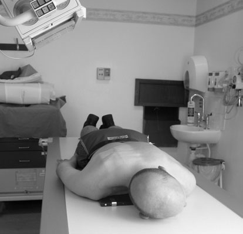
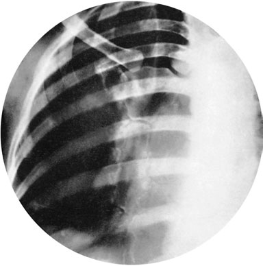

# Rx Stern Oblică Anterioară - tube angled

  📷 Radiografie Convențională (Rx)
  <strong>Actualizat:</strong> 2026-09-16
  <strong>Autor:</strong> Departamentul de Radiologie / Referință Clark (Ed. 12)

---

-   __1. Rezumat Clinic & Indicații__

    ---

    === "Indicații Clinice"

        - A 24  30-cm casetă cu grilă antidifuzoare fitted cu standard-speed screens este selected.

    === "Ghid Național IRIS"

        !!! info "Referință Primară: Ghidul Național IRIS (Ordinul MS 1342/2012)"
            - **Capitol Ghid IRIS:** *Ghidul Național IRIS*
            - **Grad de Recomandare:** **De verificat pe indicație; fără grad atribuit automat**
            - **Nivel de Iradiere Estimată:** `De verificat pentru examinarea și populația selectate`

            [:octicons-search-16: Deschide Ghidul IRIS](../../iris.md){ .md-button .md-button--primary } [:material-open-in-new: Aplicația Oficială PWA](https://radiologie-pediatrica.ro/iris/){ .md-button target="_blank" rel="noopener" }
-   __2. Poziționare & Centrare Fascicul__

    ---

    - **Poziție Pacient:** • pacientul stă în ortostatism sau sits facing stativ vertical Bucky sau lies Decubit ventral pe masa de examinare.
• medial plan sagital trebuie să fie la drept-angles la, și centred la, caseta.
• ca raza centrală este la fie înclinat across masa de examinare, caseta este plasat transversely la avoid grilă cut-off.
• If Bucky este la fie used pe masa de examinare, pacientul trebuie să lie pe trolley poziționat la drept-angles la masa de examinare, cu Torace resting pe masa radiologică.
• caseta este centred la nivelul fifth thoracic vertebra.
• imobilizare will fie assisted if it este possible la use imobilizare band.
    - **Punct de Centrare Fascicul:** • perpendicular raza centrală este centred initially la axilla de either side la nivelul fifth thoracic vertebra.
• raza centrală este then înclinat transversely astfel încât raza centrală este orientat la point 7.5 cm Profil (lateral) la linia mediană pe same side.
    - **Distanță Focar-Film (DFF / SID):** 100 cm
    - **Comandă Respiratorie:** Apnee completă pe durata expunerii.

-   __3. Parametri Tehnici Expunere__

    ---

    | Parametru Tehnic | Valoare Configurare Generator / Tub |
    |:-----------------|:-------------------------------------|
    | **Tensiune Tub (kV)** | DE CONFIGURAT PE APARAT |
    | **Sarcină / Produs Curent-Timp (mAs)** | Conform AEC / grosime anatomică |
    | **Distanță Focar-Film (DFF / SID)** | 100 cm |
    | **Grilă Antidifuzoare (Bucky)** | Cu grilă antidifuzoare Bucky |
    | **Dimensiune Focar** | Focar Mic (0.6 mm) |
    | **Camere de Ionizare AEC** | Camerele laterale (sau camera centrală funcție de regiune) |
    | **Colimare Fascicul** | Colimare strictă adaptată pe receptor 24 x 30 cm |
    | **Filtrare Tub** | Totală ≥ 2.5 mm Al echivalent (conform Clark: 3.0 mm Al eq.) |

-   __4. Criterii de Calitate & Reușită Imagine__

    ---

    - Vizualizarea clară întregii arii anatomice (Stern).
    - Absența artefactelor de mișcare; trabeculație osoasă și contururi nete.
    - Densitate optică și contrast adecvate pentru diferențierea țesuturilor moi de structurile osoase.

-   __5. Protecție Radiologică (ALARA)__

    ---

    - Ecranare gonadică cu șorț plumbat dacă gonadele sunt în apropierea fasciculului util (regula ALARA).
    - Colimare precisă la dimensiunea anatomică strict necesară pentru reducerea dozei și a radiației difuze.
    - Verificarea posibilității unei sarcini la pacientele de vârstă fertilă înainte de expunere.

!!! note "Observații Clinice & Tehnice"
    • pacientul este allowed la breathe gently during expunere time de several seconds using low mA.
• This technique diffuses lung și rib shadows, which otherwise tend la obscure Stern.
226 stâng Oblică Anterioară Cord și Siluetă Cardiovasculară X-ray tube vertical line de la tube stâng lung drept lung Omoplat (Scapulă) Omoplat (Scapulă) Coaste (Grilaj Costal) Stern 5th 6th 4th 3rd cc casetă 6th TV Postero-anterior (PA) Oblică radiografie de Stern taken during gentle respirație

### 🖼️ Imagini

<figure class="protocol-image-card" markdown>

<figcaption><strong>Postero-anterior (PA) Oblică radiografie de Stern taken</strong> — Poziționare pacient și centrare fascicul conform Clark (Ed. 12)</figcaption>

</figure>

<figure class="protocol-image-card" markdown>

<figcaption><strong>Figura 2: Aspect radiografic / Poziționare (Clark Ed. 12)</strong> — Aspect radiografic / ghid de poziționare conform tratatului Clark (Ed. 12)</figcaption>

</figure>

=== "Ghid Rapid de Execuție"

    1. **Identificarea și verificarea pacientului:** verificare identitate, zonă de examinat, consimțământ conform procedurii și evaluarea posibilității unei sarcini, când este relevantă.
    2. **Pregătire:** îndepărtarea oricăror obiecte radiopace (bijuterii, agrafe, fermoare, proteze, pansamente dense).
    3. **Poziționare precisă:** alinierea receptorului de imagine și a tubului la distanța prescrisă (100 cm).
    4. **Colimare strictă:** adaptarea fasciculului strict la regiunea de diagnostic pentru scăderea iradierii și reducerea radiației difuze.
    5. **Radioprotecție:** verificarea [politicii RX](../radioprotectie.md), cu măsuri distincte pentru pacient, personal și însoțitor.

## Surse de documentare

- [Clark's Positioning in Radiography (Ed. 12), Pagina 241](../../assets/protocols/sources/Clark___Positioning_in_Radiography__12th_edition.pdf#page=241)
