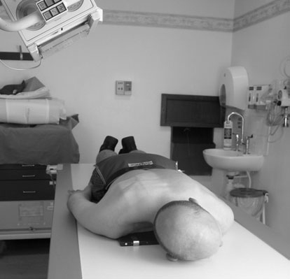
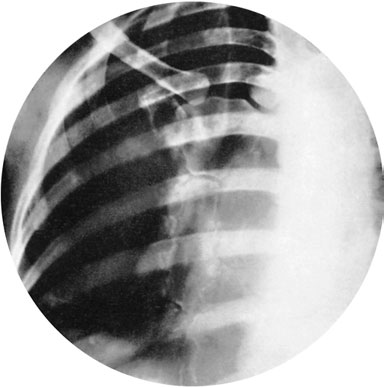

# Rx stern oblică anterioară – tubul înclinat

  📷 Radiografie Convențională (Rx)
  <strong>Actualizat:</strong> 2026-09-16
  <strong>Autor:</strong> Departamentul de Radiologie / Referință Clark (Ed. 12)

---

-   __1. Rezumat Clinic & Indicații__

    ---

    === "Indicații Clinice"

        - Se selectează o casetă de 24 × 30 cm cu grilă antidifuzoare și ecrane de sensibilitate standard.

    === "Ghid Național IRIS"

        !!! info "Referință Primară: Ghidul Național IRIS (Ordinul MS 1342/2012)"
            - **Capitol Ghid IRIS:** *Torace & Pulmon*
            - **Grad de Recomandare:** **Grad A**
            - **Nivel de Iradiere Estimată:** `Clasa 1 (Minimă < 0.1 mSv)`

            [:octicons-search-16: Deschide Ghidul IRIS](../../iris.md){ .md-button .md-button--primary } [:material-open-in-new: Aplicația Oficială PWA](https://radiologie-pediatrica.ro/iris/){ .md-button target="_blank" rel="noopener" }

-   __2. Poziționare & Centrare Fascicul__

    ---

    - **Poziție Pacient:**
        - Pacientul stă în ortostatism sau în șezut cu fața spre stativul vertical Bucky, ori în decubit ventral pe masa de examinare.
        - Planul mediosagital trebuie să fie perpendicular pe casetă și centrat la aceasta.
        - Deoarece raza centrală va fi înclinată transversal față de masa de examinare, caseta se așază transversal pentru a evita tăierea fasciculului de către grilă.
        - Dacă se utilizează Bucky-ul mesei de examinare, pacientul trebuie să stea culcat pe un cărucior poziționat perpendicular pe masă, cu toracele sprijinit pe masa radiologică.
        - Caseta este centrată la nivelul celei de-a cincea vertebre toracice.
        - Utilizarea unei benzi de imobilizare, dacă este posibilă, facilitează imobilizarea.
    - **Punct de Centrare Fascicul:**
        - Raza centrală perpendiculară este centrată inițial la axila de pe oricare parte, la nivelul celei de-a cincea vertebre toracice.
        - Raza centrală este apoi înclinată transversal, astfel încât să fie orientată către un punct situat la 7.5 cm lateral de linia mediană, pe aceeași parte.
    - **Distanță Focar-Film (DFF / SID):** 100 cm
    - **Comandă Respiratorie:** Apnee completă pe durata expunerii.

-   __3. Parametri Tehnici Expunere__

    ---

    | Parametru Tehnic | Valoare Configurare Generator / Tub |
    |:-----------------|:-------------------------------------|
    | **Tensiune Tub (kV)** | DE CONFIGURAT PE APARAT |
    | **Sarcină / Produs Curent-Timp (mAs)** | Conform AEC / grosimii anatomice |
    | **Distanță Focar-Film (DFF / SID)** | 100 cm |
    | **Grilă Antidifuzoare (Bucky)** | Cu grilă antidifuzoare Bucky |
    | **Dimensiune Focar** | Focar Mic (0.6 mm) |
    | **Camere de Ionizare AEC** | Camerele laterale (sau camera centrală, în funcție de regiune) |
    | **Colimare Fascicul** | Colimare strictă adaptată pe receptor 24 x 30 cm |
    | **Filtrare Tub** | Totală ≥ 2.5 mm Al echivalent (conform Clark: 3.0 mm Al echivalent) |

-   __4. Criterii de Calitate & Reușită Imagine__

    ---

    - Vizualizarea clară a întregii arii anatomice (stern).
    - Absența artefactelor de mișcare; trabeculație osoasă și contururi nete.
    - Densitate optică și contrast adecvate pentru diferențierea țesuturilor moi de structurile osoase.

-   __5. Protecție Radiologică (ALARA)__

    ---

    - Ecranare gonadică cu șorț plumbat dacă gonadele sunt în apropierea fasciculului util (regula ALARA).
    - Colimare precisă la dimensiunea anatomică strict necesară pentru reducerea dozei și a radiației difuze.
    - Verificarea posibilității unei sarcini la pacientele de vârstă fertilă înainte de expunere.

!!! note "Observații Clinice & Tehnice"
    - Pacientului i se permite să respire superficial în timpul expunerii de câteva secunde, utilizând un mA redus.
    - Această tehnică estompează umbrele pulmonare și costale, care altfel tind să acopere sternul. 226 Oblică anterioară stângă. Cord și siluetă cardiovasculară. Tub de raze X. Linie verticală de la tub. Plămân stâng. Plămân drept. Omoplat (scapulă). Omoplat (scapulă). Coaste (grilaj costal). Stern. A 5-a, a 6-a, a 4-a, a 3-a cc. Casetă. A 6-a TV. Radiografie oblică postero-anterioară (PA) a sternului, efectuată în timpul respirației superficiale.

### 🖼️ Imagini

<figure class="protocol-image-card" markdown>

<figcaption><strong>Radiografie oblică postero-anterioară (PA) a sternului efectuată</strong> — Poziționarea pacientului și centrarea fasciculului conform Clark (Ed. 12)</figcaption>

</figure>

<figure class="protocol-image-card" markdown>

<figcaption><strong>Figura 2: Aspect radiografic / Poziționare (Clark Ed. 12)</strong> — Aspect radiografic / ghid de poziționare conform tratatului Clark (Ed. 12)</figcaption>

</figure>

=== "Ghid Rapid de Execuție"

    1. **Identificarea și verificarea pacientului:** verificare identitate, zonă de examinat, consimțământ conform procedurii și evaluarea posibilității unei sarcini, când este relevantă.
    2. **Pregătire:** îndepărtarea oricăror obiecte radiopace (bijuterii, agrafe, fermoare, proteze, pansamente dense).
    3. **Poziționare precisă:** alinierea receptorului de imagine și a tubului la distanța prescrisă (100 cm).
    4. **Colimare strictă:** adaptarea fasciculului strict la regiunea de diagnostic pentru scăderea iradierii și reducerea radiației difuze.
    5. **Radioprotecție:** verificarea [politicii RX](../radioprotectie.md), cu măsuri distincte pentru pacient, personal și însoțitor.

## Surse de documentare

- [Clark's Positioning in Radiography (Ed. 12), Pagina 241](https://books.google.com/books/about/Clark_s_Positioning_in_Radiography.html?id=Xxu6MwEACAAJ)
