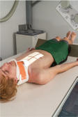
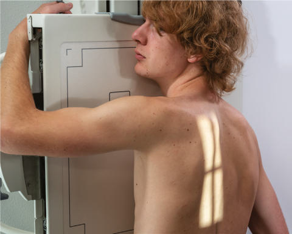
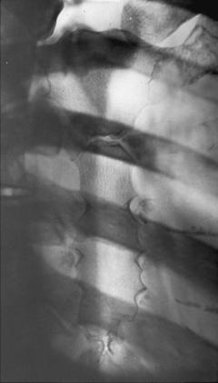

# Rx Stern Oblică Anterioară Dreaptă (OAD / RAO)

  📷 Radiografie Convențională (Rx)
  <strong>Actualizat:</strong> 2026-09-15
  <strong>Autor:</strong> Departamentul de Radiologie / Referință Bontrager

---

-   __1. Rezumat Clinic & Indicații__

    ---

    === "Indicații Clinice"

        - Pathology de Stern, including suspiciune de fractură și inflammatory processes

    === "Ghid Național IRIS"

        !!! info "Referință Primară: Ghidul Național IRIS (Ordinul MS 1342/2012)"
            - **Capitol Ghid IRIS:** *Ghidul Național IRIS*
            - **Grad de Recomandare:** **De verificat pe indicație; fără grad atribuit automat**
            - **Nivel de Iradiere Estimată:** `De verificat pentru examinarea și populația selectate`

            [:octicons-search-16: Deschide Ghidul IRIS](../../iris.md){ .md-button .md-button--primary } [:material-open-in-new: Aplicația Oficială PWA](https://radiologie-pediatrica.ro/iris/){ .md-button target="_blank" rel="noopener" }
-   __2. Poziționare & Centrare Fascicul__

    ---

    - **Poziție Pacient:** Pacient: Ortostatism, facing stativ vertical Bucky (preferred), sau semiprone poziție cu slight rotație, drept braț down prin side, și stâng braț raised.; Regiune anatomică: poziție pacient oblic, în a 15° la 20° drept anterior oblic (RAO) la shift Stern la stâng de coloană vertebrală și superimpose it over homogeneous heart shadow. large, deepchested thorax requires less rotație than thinchested thorax (see NOTE 1). Align axa longitudinală de Stern la raza centrală și la linia mediană mesei/stativ vertical Bucky. Place top de receptorul de imagine approximately 1½ inches (4 cm) superior la incizura jugulară (manubriul sternal).
    - **Punct de Centrare Fascicul:** Raza centrală (RC) perpendiculară pe receptorul de imagine, orientat la center de Stern (1 inch [2.5 cm] la stâng de midline și midway între incizura jugulară (manubriul sternal) și apendice xifoid) (Fig. 10.20). pentru traumatism acuttism / Regim Urgență situations see NOTE 2.
    - **Distanță Focar-Film (DFF / SID):** 100 cm
    - **Comandă Respiratorie:** technique: low mA cu a 3to 4second expunere time este used kVp range: 75–85

-   __3. Parametri Tehnici Expunere__

    ---

    | Parametru Tehnic | Valoare Configurare Generator / Tub |
    |:-----------------|:-------------------------------------|
    | **Tensiune Tub (kV)** | DE CONFIGURAT PE APARAT |
    | **Sarcină / Produs Curent-Timp (mAs)** | DE CONFIGURAT PE APARAT |
    | **Distanță Focar-Film (DFF / SID)** | 100 cm |
    | **Grilă Antidifuzoare (Bucky)** | Cu grilă antidifuzoare Bucky |
    | **Dimensiune Focar** | Focar Mic (0.6 mm) |
    | **Camere de Ionizare AEC** | Camerele laterale (sau camera centrală funcție de regiune) |
    | **Colimare Fascicul** | Long, narrow collimation field size la region de Stern AEC nu recommended project Stern lateromedfial angle la coloană vertebrală, onto cordul shadow (see Fig. 10.20, inset). portable grilă would fie required și trebuie să fie plasat landscape pe stretcher sau tabletop la prevent grilă cutoff. |
    | **Filtrare Tub** | Totală ≥ 2.5 mm Al echivalent |

-   __4. Criterii de Calitate & Reușită Imagine__

    ---

    - Stern este visualized, superimposed pe heart shadow (Figs. 10.21 și 10.22). poziție:
    - Correct pacient rotație este evidențiat prin visualizing Stern alongside coloană vertebrală cu fără superimposition prin vertebre. fără distortion de Stern due la excessive rotație de thorax.
    - Collimation la aria de interes diagnostic. expunere:
    - optim receptorul de imagine expunere și contrast evidențiind outline de Stern through overlying Coaste (Grilaj Costal), lung, și heart tissues.
    - Bony margins de Stern appear net, și lung markings sunt blurred if Tehnică de estompare prin respirație superficială (respirație technique) was used.
    - fără mișcare (cu Apnee pe durata expunerii). L Fig. 10.21 RAO Stern. manubriu sternal corp de Stern Claviculă apendice xifoid articulații sternoclaviculare L Fig. 10.22 RAO Stern.

-   __5. Protecție Radiologică (ALARA)__

    ---

    - Ecranare gonadică și a organelor radiosensibile conform procedurilor locale de radioprotecție ALARA.
    - Colimare strictă la aria de interes pentru limitarea radiației difuze.
    - Verificarea posibilității unei sarcini la pacientele de vârstă fertilă înainte de expunere.

!!! note "Observații Clinice & Tehnice"
    Adaptation: This poate fie obtained în poziție oblică posterioară stângă (OPS / LPO) if pacientul’s condition does nu permit poziție oblică anterioară dreaptă (OAD / RAO). (See Chapter 15 pentru traumatism acuttism / Regim Urgență poziții de Stern.) If pacientul cannot fie rotit, oblic imagine poate fie obtained prin angling raza centrală 15° la 20° across drept side de pacientul la

### 🖼️ Imagini

<figure class="protocol-image-card" markdown>

<figcaption><strong>Fig. 10.20 Ortostatism—RAO Stern. Inset, 15° la 20° lateromedial</strong> — Poziționare pacient conform Ghidului Bontrager (Fig. 10.20 în ortostatism—RAO sternum. Inset, 15° la 20° lateromedial)</figcaption>

</figure>

<figure class="protocol-image-card" markdown>

<figcaption><strong>Fig. 10.21 RAO Stern.</strong> — Aspect radiografic de referință conform Ghidului Bontrager (Fig. 10.21 RAO sternum.)</figcaption>

</figure>

<figure class="protocol-image-card" markdown>

<figcaption><strong>Fig. 10.22 RAO Stern.</strong> — Aspect radiografic de referință conform Ghidului Bontrager (Fig. 10.22 RAO sternum.)</figcaption>

</figure>

<figure class="protocol-image-card" markdown>

<figcaption><strong>Figura 4</strong> — Aspect radiografic de referință conform Ghidului Bontrager (Figura 4)</figcaption>

</figure>

=== "Ghid Rapid de Execuție"

    1. **Identificarea și verificarea pacientului:** verificare identitate, zonă de examinat, consimțământ conform procedurii și evaluarea posibilității unei sarcini, când este relevantă.
    2. **Pregătire:** îndepărtarea oricăror obiecte radiopace (bijuterii, agrafe, fermoare, proteze, pansamente dense).
    3. **Poziționare precisă:** alinierea receptorului de imagine și a tubului la distanța prescrisă (100 cm).
    4. **Colimare strictă:** adaptarea fasciculului strict la regiunea de diagnostic pentru scăderea iradierii și reducerea radiației difuze.
    5. **Radioprotecție:** verificarea [politicii RX](../radioprotectie.md), cu măsuri distincte pentru pacient, personal și însoțitor.

## Surse de documentare

- [Bontrager's Textbook of Radiographic Positioning (Ed. 9/10), Pagina 388](https://www.elsevier.com/books/textbook-of-radiographic-positioning-and-related-anatomy/lampignano/978-0-323-65367-1)
