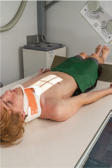
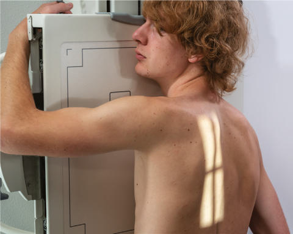
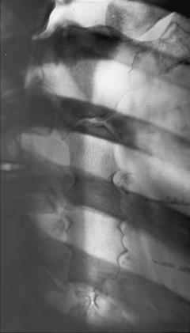

# Rx stern oblică anterioară dreaptă (OAD / RAO)

  📷 Radiografie Convențională (Rx)
  <strong>Actualizat:</strong> 2026-09-15
  <strong>Autor:</strong> Departamentul de Radiologie / Referință Bontrager

---

-   __1. Rezumat Clinic & Indicații__

    ---

    === "Indicații Clinice"

        - Patologia sternului, inclusiv suspiciunea de fractură și procesele inflamatorii

    === "Ghid Național IRIS"

        !!! info "Referință Primară: Ghidul Național IRIS (Ordinul MS 1342/2012)"
            - **Capitol Ghid IRIS:** *Torace & Pulmon*
            - **Grad de Recomandare:** **Grad A**
            - **Nivel de Iradiere Estimată:** `Clasa 1 (Minimă < 0.1 mSv)`

            [:octicons-search-16: Deschide Ghidul IRIS](../../iris.md){ .md-button .md-button--primary } [:material-open-in-new: Aplicația Oficială PWA](https://radiologie-pediatrica.ro/iris/){ .md-button target="_blank" rel="noopener" }

-   __2. Poziționare & Centrare Fascicul__

    ---

    - **Poziție Pacient:** Pacient: în ortostatism, cu fața spre stativul vertical Bucky (preferabil), sau în poziție semiventrală, ușor rotit, cu brațul drept coborât pe lângă corp și brațul stâng ridicat. Regiune anatomică: poziționați pacientul oblic anterior drept (RAO), la 15° la 20°, pentru a deplasa proiecția sternului la stânga coloanei vertebrale și a-l suprapune peste umbra omogenă a cordului. Un torace voluminos, cu diametru anteroposterior mare, necesită mai puțină rotație decât un torace subțire (vezi NOTA 1). Aliniați axa longitudinală a sternului la raza centrală și la linia mediană a mesei/stativului vertical Bucky. Plasați marginea superioară a receptorului de imagine la aproximativ 1½ țoli (4 cm) superior de incizura jugulară a manubriului sternal.
    - **Punct de Centrare Fascicul:** Raza centrală (RC) perpendiculară pe receptorul de imagine, orientată spre centrul sternului (1 țol [2.5 cm] la stânga liniei mediane și la jumătatea distanței dintre incizura jugulară a manubriului sternal și apendicele xifoid) (Fig. 10.20). Pentru traumatisme acute / regim de urgență, vezi NOTA 2.
    - **Distanță Focar-Film (DFF / SID):** 100 cm
    - **Comandă Respiratorie:** Tehnică: se utilizează mA redus, cu un timp de expunere de 3 la 4 secunde; interval kVp: 75–85

-   __3. Parametri Tehnici Expunere__

    ---

    | Parametru Tehnic | Valoare Configurare Generator / Tub |
    |:-----------------|:-------------------------------------|
    | **Tensiune Tub (kV)** | DE CONFIGURAT PE APARAT |
    | **Sarcină / Produs Curent-Timp (mAs)** | DE CONFIGURAT PE APARAT |
    | **Distanță Focar-Film (DFF / SID)** | 100 cm |
    | **Grilă Antidifuzoare (Bucky)** | Cu grilă antidifuzoare Bucky |
    | **Dimensiune Focar** | Focar Mic (0.6 mm) |
    | **Camere de Ionizare AEC** | Camerele laterale (sau camera centrală, în funcție de regiune) |
    | **Colimare Fascicul** | Câmp de colimare lung și îngust, limitat la regiunea sternului. AEC nu este recomandat. Proiectați sternul sub un unghi lateromedial față de coloana vertebrală, peste umbra cordului (vezi inserția din Fig. 10.20). Este necesară o grilă portabilă, care trebuie așezată transversal pe targă sau pe blatul mesei pentru a preveni tăierea fasciculului de către grilă. |
    | **Filtrare Tub** | Totală ≥ 2.5 mm Al echivalent |

-   __4. Criterii de Calitate & Reușită Imagine__

    ---

    - Sternul este vizualizat suprapus peste umbra cordului (Fig. 10.21 și 10.22). Poziție:
    - Rotația corectă a pacientului este demonstrată prin vizualizarea sternului alături de coloana vertebrală, fără suprapunerea vertebrelor. Fără distorsiunea sternului cauzată de rotația excesivă a toracelui.
    - Colimare la aria de interes diagnostic. Expunere:
    - Expunere optimă a receptorului de imagine și contrast optim, care evidențiază conturul sternului prin coastele (grilajul costal), plămânul și țesuturile cardiace suprapuse.
    - Marginile osoase ale sternului sunt nete, iar desenul pulmonar este estompat dacă s-a utilizat tehnica de estompare prin respirație superficială.
    - Fără mișcare (cu apnee pe durata expunerii). L Fig. 10.21 Stern în RAO. Manubriu sternal. Corpul sternului. Claviculă. Apendice xifoid. Articulații sternoclaviculare. L Fig. 10.22 Stern în RAO.

-   __5. Protecție Radiologică (ALARA)__

    ---

    - Ecranare gonadică și a organelor radiosensibile conform procedurilor locale de radioprotecție ALARA.
    - Colimare strictă la aria de interes pentru limitarea radiației difuze.
    - Verificarea posibilității unei sarcini la pacientele de vârstă fertilă înainte de expunere.

!!! note "Observații Clinice & Tehnice"
    Adaptare: această incidență se poate obține în poziție oblică posterioară stângă (OPS / LPO) dacă starea pacientului nu permite poziția oblică anterioară dreaptă (OAD / RAO). (Vezi capitolul 15 pentru pozițiile sternului în traumatisme acute / regim de urgență.) Dacă pacientul nu poate fi rotit, imaginea oblică se poate obține prin înclinarea razei centrale cu 15° la 20° transversal, dinspre partea dreaptă a pacientului către

### 🖼️ Imagini

<figure class="protocol-image-card" markdown>

<figcaption><strong>Fig. 10.20 În ortostatism — stern în RAO. Inserție: 15° la 20° lateromedial</strong> — Poziționarea pacientului conform Ghidului Bontrager (Fig. 10.20 În ortostatism — stern în RAO. Inserție: 15° la 20° lateromedial)</figcaption>

</figure>

<figure class="protocol-image-card" markdown>

<figcaption><strong>Fig. 10.21 Stern în RAO.</strong> — Aspect radiografic de referință conform Ghidului Bontrager (Fig. 10.21 Stern în RAO.)</figcaption>

</figure>

<figure class="protocol-image-card" markdown>

<figcaption><strong>Fig. 10.22 Stern în RAO.</strong> — Aspect radiografic de referință conform Ghidului Bontrager (Fig. 10.22 Stern în RAO.)</figcaption>

</figure>

<figure class="protocol-image-card" markdown>

<figcaption><strong>Figura 4</strong> — Aspect radiografic de referință conform Ghidului Bontrager (Figura 4)</figcaption>

</figure>

=== "Ghid Rapid de Execuție"

    1. **Identificarea și verificarea pacientului:** verificare identitate, zonă de examinat, consimțământ conform procedurii și evaluarea posibilității unei sarcini, când este relevantă.
    2. **Pregătire:** îndepărtarea oricăror obiecte radiopace (bijuterii, agrafe, fermoare, proteze, pansamente dense).
    3. **Poziționare precisă:** alinierea receptorului de imagine și a tubului la distanța prescrisă (100 cm).
    4. **Colimare strictă:** adaptarea fasciculului strict la regiunea de diagnostic pentru scăderea iradierii și reducerea radiației difuze.
    5. **Radioprotecție:** verificarea [politicii RX](../radioprotectie.md), cu măsuri distincte pentru pacient, personal și însoțitor.

## Surse de documentare

- [Bontrager's Textbook of Radiographic Positioning (Ed. 9/10), Pagina 388](https://www.elsevier.com/books/textbook-of-radiographic-positioning-and-related-anatomy/lampignano/978-0-323-65367-1)
