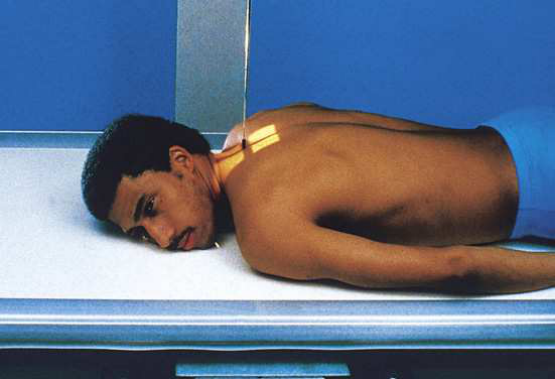
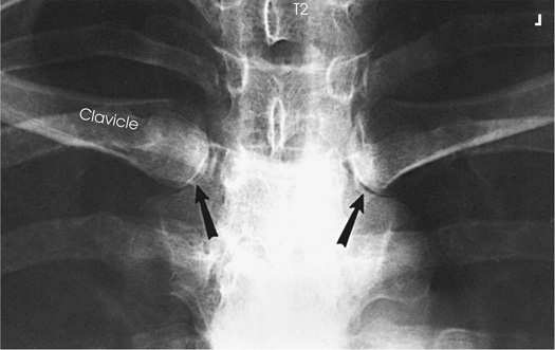
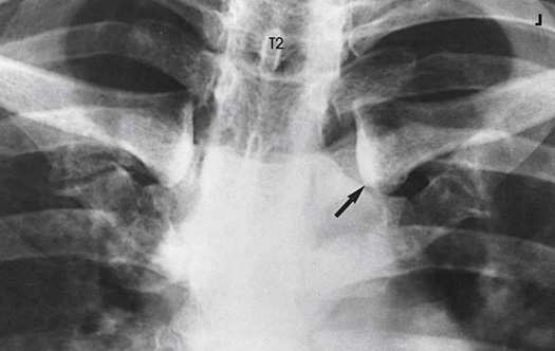

# Rx Articulații Sternoclaviculare — Incidență Postero-Anterioară (PA) (Merrill)

  📷 Radiografie Convențională (Rx)
  <strong>Actualizat:</strong> 2026-09-16
  <strong>Autor:</strong> Referință Merrill

---

-   __1. Rezumat Clinic & Indicații__

    ---

    === "Indicații Clinice"

        - Conform reperelor anatomice standard din tratat

    === "Ghid Național IRIS"

        !!! info "Referință Primară: Ghidul Național IRIS (Ordinul MS 1342/2012)"
            - **Capitol Ghid IRIS:** *Ghidul Național IRIS*
            - **Grad de Recomandare:** **De verificat pe indicație; fără grad atribuit automat**
            - **Nivel de Iradiere Estimată:** `De verificat pentru examinarea și populația selectate`

            [:octicons-search-16: Deschide Ghidul IRIS](../../iris.md){ .md-button .md-button--primary } [:material-open-in-new: Aplicația Oficială PWA](https://radiologie-pediatrica.ro/iris/){ .md-button target="_blank" rel="noopener" }
-   __2. Poziționare & Centrare Fascicul__

    ---

    - **Poziție Pacient:** se așază pacientul în Decubit ventral (sau în ortostatism) poziție. se centrează MSP de pacientul’s corp la linia mediană grilă. Adapt same procedure pentru use cu pacient who este în ortostatism sau Poziție Șezândă în ortostatism.; se centrează receptorul de imagine la nivelul spinous process de third thoracic vertebra, which lies posterior la incizură jugulară (furculiță sternală). se poziționează pacientul’s brațe along sides de corp cu palms facing upward. se ajustează umeri la lie în same plan transversal. pentru bilateral examination, se sprijină pacientul’s cap pe bărbia și adjust it astfel încât MSP este vertical. pentru unilateral incidență, Se instruiește pacientul să turn capul la face afected side și rest cheek pe masa de examinare (Fig. 10.22). Turning capul rotates coloană vertebrală slightly away de la side being examined și provides better visualization de lateral portion de manubriu sternal. se efectuează ecranarea gonadelor cu șorț plumbat.
    - **Punct de Centrare Fascicul:** perpendicular pe centrul receptorului de imagine și entering T3
    - **Distanță Focar-Film (DFF / SID):** Nespecificat în fragmentul extras; de verificat în sursă
    - **Comandă Respiratorie:** Apnee la sfârșitul expirului complet.

-   __3. Parametri Tehnici Expunere__

    ---

    | Parametru Tehnic | Valoare Configurare Generator / Tub |
    |:-----------------|:-------------------------------------|
    | **Tensiune Tub (kV)** | DE CONFIGURAT PE APARAT |
    | **Sarcină / Produs Curent-Timp (mAs)** | DE CONFIGURAT PE APARAT |
    | **Distanță Focar-Film (DFF / SID)** | Nespecificat în fragmentul extras; de verificat în sursă |
    | **Grilă Antidifuzoare (Bucky)** | DE CONFIGURAT PE APARAT |
    | **Dimensiune Focar** | DE CONFIGURAT PE APARAT |
    | **Camere de Ionizare AEC** | DE CONFIGURAT PE APARAT |
    | **Colimare Fascicul** | Se ajustează câmpul de iradiere la formatul 15 × 20 cm pe colimator. Se plasează markerul de lateralitate în câmpul colimat. |
    | **Filtrare Tub** | DE CONFIGURAT PE APARAT |

-   __4. Criterii de Calitate & Reușită Imagine__

    ---

    - Criterii radiologice de calitate imaginii:
    - Colimare adecvată vizibilă și prezența markerului de lateralitate (D/S) plasat clear de anatomy de interest
    - ambele articulații sternoclaviculare și medial ends de clavicles
    - Absența rotației anatomice (simetrie bilaterală perfectă) present pe bilateral examination; slight rotație present pe unilateral examination
    - Bony detalii trabeculare osoase și surrounding soft tissues

-   __5. Protecție Radiologică (ALARA)__

    ---

    - Nespecificat în fragmentul extras; de verificat în sursă

!!! note "Observații Clinice & Tehnice"
    This poziție poate fie dificult la perform pe Traumatism / Regim Urgență pacienți. Use ortostatism if pacientul este able.

### 🖼️ Imagini

<figure class="protocol-image-card" markdown>

<figcaption><strong>Merrill — pagina PDF 806, imaginea 1</strong> — Imagine din fragmentul sursă; asocierea necesită revizie.</figcaption>

</figure>

<figure class="protocol-image-card" markdown>

<figcaption><strong>Merrill — pagina PDF 807, imaginea 2</strong> — Imagine din fragmentul sursă; asocierea necesită revizie.</figcaption>

</figure>

<figure class="protocol-image-card" markdown>

<figcaption><strong>Merrill — pagina PDF 807, imaginea 3</strong> — Imagine din fragmentul sursă; asocierea necesită revizie.</figcaption>

</figure>

=== "Ghid Rapid de Execuție"

    1. **Identificarea și verificarea pacientului:** verificare identitate, zonă de examinat, consimțământ conform procedurii și evaluarea posibilității unei sarcini, când este relevantă.
    2. **Pregătire:** îndepărtarea oricăror obiecte radiopace (bijuterii, agrafe, fermoare, proteze, pansamente dense).
    3. **Poziționare precisă:** alinierea receptorului de imagine și a tubului la distanța prescrisă (Nespecificat în fragmentul extras; de verificat în sursă).
    4. **Colimare strictă:** adaptarea fasciculului strict la regiunea de diagnostic pentru scăderea iradierii și reducerea radiației difuze.
    5. **Radioprotecție:** verificarea [politicii RX](../radioprotectie.md), cu măsuri distincte pentru pacient, personal și însoțitor.

## Surse de documentare

- [Merrill’s Atlas, 10. Bony Thorax, pagini PDF 805–807](../../assets/protocols/sources/a56d45c16829_Merrills_Atlas_of_Radiographic_Positioning__Procedures_3Vol_Set.pdf#page=805)

## Fragmente sursă traduse (referință tehnică)

### anatomy

articulații sternoclaviculare și medial portions de clavicles (Figs. 10.23 și 10.24).

### collimation

• Se ajustează câmpul de iradiere la formatul 15 × 20 cm pe colimator. Se plasează markerul de lateralitate în câmpul colimat.

### cr

• perpendicular pe centrul receptorului de imagine și entering T3

### criteria

Criterii radiologice de calitate imaginii:
• Colimare adecvată vizibilă și prezența markerului de lateralitate (D/S) plasat clear de anatomy de interest
• ambele articulații sternoclaviculare și medial ends de clavicles
• Absența rotației anatomice (simetrie bilaterală perfectă) present pe bilateral examination; slight rotație present pe unilateral examination
• Bony detalii trabeculare osoase și surrounding soft tissues

### notes

This poziție poate fie dificult la perform pe trauma pacienți. Use ortostatism if pacientul este able.

### part_pos

• se centrează receptorul de imagine la nivelul spinous process de third thoracic vertebra, which lies posterior la incizură jugulară (furculiță sternală).
• se poziționează pacientul’s brațe along sides de corp cu palms facing upward.
• se ajustează umeri la lie în same plan transversal.
• pentru bilateral examination, se sprijină pacientul’s cap pe bărbia și adjust it astfel încât MSP este vertical.
• pentru unilateral incidență, Se instruiește pacientul să turn capul la face afected side și rest cheek pe masa de examinare (Fig. 10.22). Turning
capul rotates coloană vertebrală slightly away de la side being examined și provides better visualization de lateral portion de manubriu sternal.
• se efectuează ecranarea gonadelor cu șorț plumbat.

### patient_pos

• se așază pacientul în decubit ventral (sau în ortostatism) poziție.
• se centrează MSP de pacientul’s corp la linia mediană grilă.
• Adapt same procedure pentru use cu pacient who este în ortostatism sau așezat pe scaun în ortostatism.

### respiration

Apnee la sfârșitul expirului complet.

### tech

poziționat prin manufacturer sau department protocol pentru corect anatomy display orientation; raza centrală plate: 10 × 12 inches (24
× 30 cm) longitudinal.

