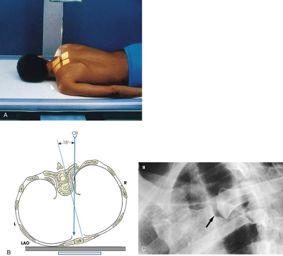

# Rx Articulații Sternoclaviculare — Oblică Postero-Anterioară (PA) — Body Rotation Method RAO or Oblică Anterioară Stângă (OAS / LAO) (Merrill)

  📷 Radiografie Convențională (Rx)
  <strong>Actualizat:</strong> 2026-09-16
  <strong>Autor:</strong> Referință Merrill

---

-   __1. Rezumat Clinic & Indicații__

    ---

    === "Indicații Clinice"

        - Conform reperelor anatomice standard din tratat

    === "Ghid Național IRIS"

        !!! info "Referință Primară: Ghidul Național IRIS (Ordinul MS 1342/2012)"
            - **Capitol Ghid IRIS:** *Ghidul Național IRIS*
            - **Grad de Recomandare:** **De verificat pe indicație; fără grad atribuit automat**
            - **Nivel de Iradiere Estimată:** `De verificat pentru examinarea și populația selectate`

            [:octicons-search-16: Deschide Ghidul IRIS](../../iris.md){ .md-button .md-button--primary } [:material-open-in-new: Aplicația Oficială PWA](https://radiologie-pediatrica.ro/iris/){ .md-button target="_blank" rel="noopener" }
-   __2. Poziționare & Centrare Fascicul__

    ---

    - **Poziție Pacient:** se așază pacientul în Decubit ventral sau Poziție Șezândă-ortostatism.; Keeping afected side adjacent la receptorul de imagine, se poziționează pacientul la enough de oblic angle la project vertebre well behind articulații sternoclaviculare cel mai apropiat de receptorul de imagine. angle este usually approximately 10 la 15 grade. se ajustează pacient’s poziție la se centrează articulație la linia mediană grilă. se ajustează umeri la lie în same plan transversal (Fig. 10.25A și B). se efectuează ecranarea gonadelor cu șorț plumbat.
    - **Punct de Centrare Fascicul:** perpendicular pe articulații sternoclaviculare cel mai apropiat de receptorul de imagine. raza centrală enters la nivelul T2-3 (approximately 3 inches [7.6 cm] distal la vertebral prominens) și 1 la 2 inches (2.5 la 5 cm) lateral de la MSP. If raza centrală enters drept side, stâng articulații sternoclaviculare este vizualizat, și vice versa (see Fig. 10.25B). Se centrează receptorul de imagine pe raza centrală.
    - **Distanță Focar-Film (DFF / SID):** Nespecificat în fragmentul extras; de verificat în sursă
    - **Comandă Respiratorie:** Apnee la sfârșitul expirului complet.

-   __3. Parametri Tehnici Expunere__

    ---

    | Parametru Tehnic | Valoare Configurare Generator / Tub |
    |:-----------------|:-------------------------------------|
    | **Tensiune Tub (kV)** | DE CONFIGURAT PE APARAT |
    | **Sarcină / Produs Curent-Timp (mAs)** | DE CONFIGURAT PE APARAT |
    | **Distanță Focar-Film (DFF / SID)** | Nespecificat în fragmentul extras; de verificat în sursă |
    | **Grilă Antidifuzoare (Bucky)** | DE CONFIGURAT PE APARAT |
    | **Dimensiune Focar** | DE CONFIGURAT PE APARAT |
    | **Camere de Ionizare AEC** | DE CONFIGURAT PE APARAT |
    | **Colimare Fascicul** | Se ajustează câmpul de iradiere la formatul 15 × 20 cm pe colimator. Se plasează markerul de lateralitate în câmpul colimat. |
    | **Filtrare Tub** | DE CONFIGURAT PE APARAT |

-   __4. Criterii de Calitate & Reușită Imagine__

    ---

    - Criterii radiologice de calitate imaginii:
    - Colimare adecvată vizibilă și prezența markerului de lateralitate (D/S) plasat clear de anatomy de interest
    - articulații sternoclaviculare de interest în center de radiografie, cu manubriu sternal și medial end de Claviculă included
    - Open articulații sternoclaviculare space
    - articulații sternoclaviculare de interest immediately adjacent la coloană vertebrală cu minimal obliquity
    - Bony detalii trabeculare osoase și surrounding soft tissues

-   __5. Protecție Radiologică (ALARA)__

    ---

    - Nespecificat în fragmentul extras; de verificat în sursă

!!! note "Observații Clinice & Tehnice"
    This poziție poate fie dificult în Traumatism / Regim Urgență pacienți. Use ortostatism if pacientul este able.

### 🖼️ Imagini

<figure class="protocol-image-card" markdown>

<figcaption><strong>Merrill — pagina PDF 809, imaginea 1</strong> — Imagine din fragmentul sursă; asocierea necesită revizie.</figcaption>

</figure>

=== "Ghid Rapid de Execuție"

    1. **Identificarea și verificarea pacientului:** verificare identitate, zonă de examinat, consimțământ conform procedurii și evaluarea posibilității unei sarcini, când este relevantă.
    2. **Pregătire:** îndepărtarea oricăror obiecte radiopace (bijuterii, agrafe, fermoare, proteze, pansamente dense).
    3. **Poziționare precisă:** alinierea receptorului de imagine și a tubului la distanța prescrisă (Nespecificat în fragmentul extras; de verificat în sursă).
    4. **Colimare strictă:** adaptarea fasciculului strict la regiunea de diagnostic pentru scăderea iradierii și reducerea radiației difuze.
    5. **Radioprotecție:** verificarea [politicii RX](../radioprotectie.md), cu măsuri distincte pentru pacient, personal și însoțitor.

## Surse de documentare

- [Merrill’s Atlas, 10. Bony Thorax, pagini PDF 807–809](../../assets/protocols/sources/a56d45c16829_Merrills_Atlas_of_Radiographic_Positioning__Procedures_3Vol_Set.pdf#page=807)

## Fragmente sursă traduse (referință tehnică)

### anatomy

slightly oblic articulații sternoclaviculare (see Fig. 10.25C).

### collimation

• Se ajustează câmpul de iradiere la formatul 15 × 20 cm pe colimator. Se plasează markerul de lateralitate în câmpul colimat.

### cr

• perpendicular pe articulații sternoclaviculare cel mai apropiat de receptorul de imagine. raza centrală enters la nivelul T2-3 (approximately 3 inches [7.6 cm] distal la
vertebral prominens) și 1 la 2 inches (2.5 la 5 cm) lateral de la MSP. If raza centrală enters drept side, stâng sternoclavicular
articulație este vizualizat, și vice versa (see Fig. 10.25B).
• Se centrează receptorul de imagine pe raza centrală.

### criteria

Criterii radiologice de calitate imaginii:
• Colimare adecvată vizibilă și prezența markerului de lateralitate (D/S) plasat clear de anatomy de interest
• articulații sternoclaviculare de interest în center de radiografie, cu manubriu sternal și medial end de clavicle included
• Open articulații sternoclaviculare space
• articulații sternoclaviculare de interest immediately adjacent la coloană vertebrală cu minimal obliquity
• Bony detalii trabeculare osoase și surrounding soft tissues

### notes

This poziție poate fie dificult în trauma pacienți. Use ortostatism if pacientul este able.

### part_pos

• Keeping afected side adjacent la receptorul de imagine, se poziționează pacientul la enough de oblic angle la project vertebre well behind articulații sternoclaviculare cel mai apropiat de receptorul de imagine. angle este usually approximately 10 la 15 grade.
• se ajustează pacient’s poziție la se centrează articulație la linia mediană grilă.
• se ajustează umeri la lie în same plan transversal (Fig. 10.25A și B).
• se efectuează ecranarea gonadelor cu șorț plumbat.

### patient_pos

• se așază pacientul în decubit ventral sau așezat pe scaun-ortostatism.

### respiration

Apnee la sfârșitul expirului complet.

### tech

poziționat prin manufacturer sau department protocol pentru corect anatomy display orientation; raza centrală plate: 10 × 12 inches (24 × 30 cm) longitudinal.

