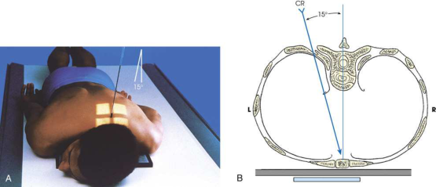

# Rx articulații sternoclaviculare — Oblică postero-anterioară (PA) — Metoda angulării CR (Merrill)

  📷 Radiografie Convențională (Rx)
  <strong>Actualizat:</strong> 2026-09-16
  <strong>Autor:</strong> Referință Merrill

---

-   __1. Rezumat Clinic & Indicații__

    ---

    === "Indicații Clinice"

        - Conform reperelor anatomice standard din tratat

    === "Ghid Național IRIS"

        !!! info "Referință Primară: Ghidul Național IRIS (Ordinul MS 1342/2012)"
            - **Capitol Ghid IRIS:** *Torace & Pulmon*
            - **Grad de Recomandare:** **Grad A**
            - **Nivel de Iradiere Estimată:** `Clasa 1 (Minimă < 0.1 mSv)`

            [:octicons-search-16: Deschide Ghidul IRIS](../../iris.md){ .md-button .md-button--primary } [:material-open-in-new: Aplicația Oficială PWA](https://radiologie-pediatrica.ro/iris/){ .md-button target="_blank" rel="noopener" }

-   __2. Poziționare & Centrare Fascicul__

    ---

    - **Poziție Pacient:** Așezați pacientul în decubit ventral pe receptorul de imagine cu grilă, poziționat direct sub partea superioară a toracelui. Centrați grila la nivelul articulațiilor sternoclaviculare. Pentru a evita tăierea fasciculului de către grilă, așezați grila pe masa radiologică cu axa longitudinală perpendiculară pe axa longitudinală a mesei de examinare. Întindeți brațele pacientului de-a lungul corpului, cu palmele în sus. Aliniați umerii în același plan transversal. Cereți pacientului să sprijine capul pe bărbie sau să rotească bărbia spre partea articulației radiografiate (Fig. 10.26).
    - **Punct de Centrare Fascicul:** Dinspre partea opusă celei examinate, orientați raza către mijlocul receptorului de imagine, la un unghi de 15 grade spre MSP. Unghiul mic este satisfăcător pentru examinarea articulațiilor sternoclaviculare, deoarece suprapunerea anteroposterioară dintre vertebre și aceste articulații este redusă. Raza centrală trebuie să intre la nivelul T2-3 (aproximativ 3 țoli [7.6 cm] distal de vertebra proeminentă) și la 1 la 2 țoli (2.5 la 5 cm) lateral de MSP. Dacă raza centrală intră pe partea stângă, este vizualizată partea dreaptă și invers.
    - **Distanță Focar-Film (DFF / SID):** Nespecificat în fragmentul extras; de verificat în sursă
    - **Comandă Respiratorie:** Conform reperelor anatomice standard din tratat

-   __3. Parametri Tehnici Expunere__

    ---

    | Parametru Tehnic | Valoare Configurare Generator / Tub |
    |:-----------------|:-------------------------------------|
    | **Tensiune Tub (kV)** | DE CONFIGURAT PE APARAT |
    | **Sarcină / Produs Curent-Timp (mAs)** | DE CONFIGURAT PE APARAT |
    | **Distanță Focar-Film (DFF / SID)** | Nespecificat în fragmentul extras; de verificat în sursă |
    | **Grilă Antidifuzoare (Bucky)** | DE CONFIGURAT PE APARAT |
    | **Dimensiune Focar** | DE CONFIGURAT PE APARAT |
    | **Camere de Ionizare AEC** | DE CONFIGURAT PE APARAT |
    | **Colimare Fascicul** | Se ajustează câmpul de iradiere la formatul 15 × 20 cm pe colimator. Se plasează markerul de lateralitate în câmpul colimat. |
    | **Filtrare Tub** | DE CONFIGURAT PE APARAT |

-   __4. Criterii de Calitate & Reușită Imagine__

    ---

    - Criterii radiologice de calitate a imaginii:
    - Colimare adecvată vizibilă și prezența markerului de lateralitate (D/S) plasat în afara structurilor anatomice de interes
    - Articulația sternoclaviculară de interes în centrul radiografiei, cu includerea manubriului sternal și a extremității mediale a claviculei
    - Spațiul articulației sternoclaviculare deschis
    - Articulația sternoclaviculară de interes imediat lângă coloana vertebrală, cu oblicitate minimă
    - Detalii trabeculare osoase și țesuturile moi înconjurătoare

-   __5. Protecție Radiologică (ALARA)__

    ---

    - Nespecificat în fragmentul extras; de verificat în sursă

!!! note "Observații Clinice & Tehnice"
    În această incidență, articulația este mai aproape de receptorul de imagine, iar distorsiunea este mai mică decât în metoda rotației corpului descrisă anterior. Receptorul de imagine cu grilă, plasat pe blatul mesei, permite proiectarea articulației cu distorsiune minimă. Această poziție poate fi dificil de realizat la pacienții cu traumatisme / în regim de urgență. Utilizați ortostatismul dacă pacientul poate adopta această poziție.

### 🖼️ Imagini

<figure class="protocol-image-card" markdown>

<figcaption><strong>Merrill — pagina 810, imaginea 1</strong> — Imagine din fragmentul sursă; asocierea necesită revizie.</figcaption>

</figure>

=== "Ghid Rapid de Execuție"

    1. **Identificarea și verificarea pacientului:** verificare identitate, zonă de examinat, consimțământ conform procedurii și evaluarea posibilității unei sarcini, când este relevantă.
    2. **Pregătire:** îndepărtarea oricăror obiecte radiopace (bijuterii, agrafe, fermoare, proteze, pansamente dense).
    3. **Poziționare precisă:** alinierea receptorului de imagine și a tubului la distanța prescrisă (Nespecificat în fragmentul extras; de verificat în sursă).
    4. **Colimare strictă:** adaptarea fasciculului strict la regiunea de diagnostic pentru scăderea iradierii și reducerea radiației difuze.
    5. **Radioprotecție:** verificarea [politicii RX](../radioprotectie.md), cu măsuri distincte pentru pacient, personal și însoțitor.

## Surse de documentare

- [Merrill’s Atlas, 10. Bony Thorax, pagini 809–810](https://books.google.com/books/about/Merrill_s_Atlas_of_Radiographic_Position.html?id=BM0lEQAAQBAJ)
