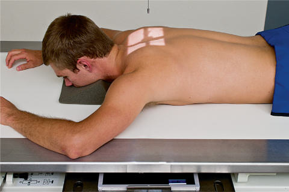
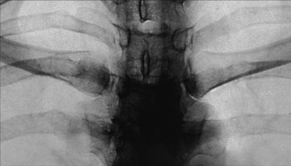

# Rx STERNOCLAVICULAR JOINTS PA (Postero-Anterior)

  📷 Radiografie Convențională (Rx)
  <strong>Actualizat:</strong> 2026-09-15
  <strong>Autor:</strong> Departamentul de Radiologie / Referință Bontrager

---

-   __1. Rezumat Clinic & Indicații__

    ---

    === "Indicații Clinice"

        - Joint subluxation or other pathology of the sternoclavicular joints

    === "Ghid Național IRIS"

        !!! info "Referință Primară: Ghidul Național IRIS (Ordinul MS 1342/2012)"
            - **Capitol Ghid IRIS:** *Ghidul Național IRIS*
            - **Grad de Recomandare:** **De verificat pe indicație; fără grad atribuit automat**
            - **Nivel de Iradiere Estimată:** `De verificat pentru examinarea și populația selectate`

            [:octicons-search-16: Deschide Ghidul IRIS](../../iris.md){ .md-button .md-button--primary } [:material-open-in-new: Aplicația Oficială PWA](https://radiologie-pediatrica.ro/iris/){ .md-button target="_blank" rel="noopener" }
-   __2. Poziționare & Centrare Fascicul__

    ---

    - **Poziție Pacient:** Pacient: Patient Decubit Ventral with head straight and chin resting on radiolucent positioning sponge, arms up beside head or down by side (Fig. 10.27). Projection may also be taken Ortostatism.; Regiune anatomică: Align midsagittal plan to the midline of IR. Allow Absența rotației anatomice: clavicule echidistante față de linia apofizelor spinoase of shoulders or thorax.
    - **Punct de Centrare Fascicul:** perpendicular to IR, centered to midsagittal plane at the level of T2–T3, or 3 inches (7 cm) distal to vertebra proeminentă (apofiza spinoasă C7) (spinous process of C7)
    - **Distanță Focar-Film (DFF / SID):** 100 cm
    - **Comandă Respiratorie:** Suspend on expiration. Sternoclavicular Joints ROUTINE PA Anterior oblique Fig. 10.27 PA bilateral, SC joints.

-   __3. Parametri Tehnici Expunere__

    ---

    | Parametru Tehnic | Valoare Configurare Generator / Tub |
    |:-----------------|:-------------------------------------|
    | **Tensiune Tub (kV)** | 75-85 kV |
    | **Sarcină / Produs Curent-Timp (mAs)** | DE CONFIGURAT PE APARAT |
    | **Distanță Focar-Film (DFF / SID)** | 100 cm |
    | **Grilă Antidifuzoare (Bucky)** | Cu grilă antidifuzoare Bucky |
    | **Dimensiune Focar** | Focar Mic (0.6 mm) |
    | **Camere de Ionizare AEC** | Camerele laterale (sau camera centrală funcție de regiune) |
    | **Colimare Fascicul** | Collimate tightly to the region of the sternoclavicular joints (approximately 2 inches [5 cm] on either side of the Coloană Toracală). |
    | **Filtrare Tub** | Totală ≥ 2.5 mm Al echivalent |

-   __4. Criterii de Calitate & Reușită Imagine__

    ---

    - Bilateral right and left sternoclavicular joints equidistant from the Coloană Toracală. Lateral aspect of manubrium and medial portion of the clavicles visualized lateral to vertebral column through superimposing Coaste (Grilaj Costal) and lungs (Figs. 10.28 and 10.29). Position:
    - Absența rotației anatomice: clavicule echidistante față de linia apofizelor spinoase of patient, as demonstrated by equal distance of sternoclavicular joints from vertebral column on both sides.
    - Collimation to area of interest. Exposure:
    - Optimal image receptor exposure and contrast to visualize the manubrium and medial portion of the clavicles through superimposing Coaste (Grilaj Costal) and lungs.
    - no motion, as indicated by sharp bony margins. L Fig. 10.28 PA bilateral, SC joints. Manubrium Left sternoclavicular joint Right sternoclavicular joint Right Claviculă Left Claviculă L Fig. 10.29 PA bilateral, SC joints.

-   __5. Protecție Radiologică (ALARA)__

    ---

    - Ecranare gonadică și a organelor radiosensibile conform procedurilor locale de radioprotecție ALARA.
    - Colimare strictă la aria de interes pentru limitarea radiației difuze.
    - Verificarea posibilității unei sarcini la pacientele de vârstă fertilă înainte de expunere.

### 🖼️ Imagini

<figure class="protocol-image-card" markdown>

<figcaption><strong>Fig. 10.27 PA bilateral, SC joints.</strong> — Poziționare pacient conform Ghidului Bontrager (Fig. 10.27 PA bilateral, SC joints.)</figcaption>

</figure>

<figure class="protocol-image-card" markdown>

<figcaption><strong>Fig. 10.28 PA bilateral, SC joints.</strong> — Aspect radiografic de referință conform Ghidului Bontrager (Fig. 10.28 PA bilateral, SC joints.)</figcaption>

</figure>

<figure class="protocol-image-card" markdown>

<figcaption><strong>Fig. 10.29 PA bilateral, SC joints.</strong> — Aspect radiografic de referință conform Ghidului Bontrager (Fig. 10.29 PA bilateral, SC joints.)</figcaption>

</figure>

=== "Ghid Rapid de Execuție"

    1. **Identificarea și verificarea pacientului:** verificare identitate, zonă de examinat, consimțământ conform procedurii și evaluarea posibilității unei sarcini, când este relevantă.
    2. **Pregătire:** îndepărtarea oricăror obiecte radiopace (bijuterii, agrafe, fermoare, proteze, pansamente dense).
    3. **Poziționare precisă:** alinierea receptorului de imagine și a tubului la distanța prescrisă (100 cm).
    4. **Colimare strictă:** adaptarea fasciculului strict la regiunea de diagnostic pentru scăderea iradierii și reducerea radiației difuze.
    5. **Radioprotecție:** verificarea [politicii RX](../radioprotectie.md), cu măsuri distincte pentru pacient, personal și însoțitor.

## Surse de documentare

- [Bontrager's Textbook of Radiographic Positioning (Ed. 9/10), Pagina 390](https://www.elsevier.com/books/textbook-of-radiographic-positioning-and-related-anatomy/lampignano/978-0-323-65367-1)
