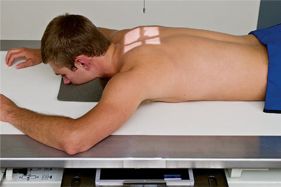
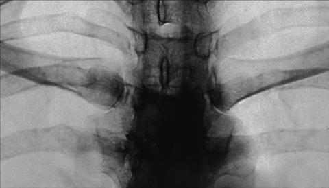

# Rx ARTICULAȚII STERNOCLAVICULARE PA (postero-anterior)

  📷 Radiografie Convențională (Rx)
  <strong>Actualizat:</strong> 2026-09-15
  <strong>Autor:</strong> Departamentul de Radiologie / Referință Bontrager

---

-   __1. Rezumat Clinic & Indicații__

    ---

    === "Indicații Clinice"

        - Subluxație articulară sau altă patologie a articulațiilor sternoclaviculare

    === "Ghid Național IRIS"

        !!! info "Referință Primară: Ghidul Național IRIS (Ordinul MS 1342/2012)"
            - **Capitol Ghid IRIS:** *Ghidul Național IRIS*
            - **Grad de Recomandare:** **De verificat pe indicație; fără grad atribuit automat**
            - **Nivel de Iradiere Estimată:** `De verificat pentru examinarea și populația selectate`

            [:octicons-search-16: Deschide Ghidul IRIS](../../iris.md){ .md-button .md-button--primary } [:material-open-in-new: Aplicația Oficială PWA](https://radiologie-pediatrica.ro/iris/){ .md-button target="_blank" rel="noopener" }
-   __2. Poziționare & Centrare Fascicul__

    ---

    - **Poziție Pacient:** Pacient: în decubit ventral, cu capul drept și bărbia sprijinită pe un burete radiotransparent de poziționare, cu brațele ridicate lângă cap sau coborâte de-a lungul corpului (Fig. 10.27). Incidența poate fi realizată și în ortostatism. Regiune anatomică: aliniați planul mediosagital cu linia mediană a receptorului de imagine. Asigurați absența rotației umerilor sau toracelui: claviculele echidistante față de linia apofizelor spinoase.
    - **Punct de Centrare Fascicul:** Perpendicular pe receptorul de imagine, centrat pe planul mediosagital la nivelul T2–T3 sau la 3 inches (7 cm) distal de vertebra proeminentă (apofiza spinoasă C7) (apofiza spinoasă a C7)
    - **Distanță Focar-Film (DFF / SID):** 100 cm
    - **Comandă Respiratorie:** Apnee (oprirea respirației) în expir. Articulații sternoclaviculare, incidențe de RUTINĂ: PA; oblică anterioară. Fig. 10.27 Articulații sternoclaviculare, PA bilateral.

-   __3. Parametri Tehnici Expunere__

    ---

    | Parametru Tehnic | Valoare Configurare Generator / Tub |
    |:-----------------|:-------------------------------------|
    | **Tensiune Tub (kV)** | 75-85 kV |
    | **Sarcină / Produs Curent-Timp (mAs)** | DE CONFIGURAT PE APARAT |
    | **Distanță Focar-Film (DFF / SID)** | 100 cm |
    | **Grilă Antidifuzoare (Bucky)** | Cu grilă antidifuzoare Bucky |
    | **Dimensiune Focar** | Focar Mic (0.6 mm) |
    | **Camere de Ionizare AEC** | Camerele laterale (sau camera centrală, în funcție de regiune) |
    | **Colimare Fascicul** | Colimați strâns la regiunea articulațiilor sternoclaviculare (aproximativ 2 inches [5 cm] de fiecare parte a coloanei toracale). |
    | **Filtrare Tub** | Totală ≥ 2.5 mm Al echivalent |

-   __4. Criterii de Calitate & Reușită Imagine__

    ---

    - Articulațiile sternoclaviculare dreaptă și stângă, bilateral, echidistante față de coloana toracală. Aspectul lateral al manubriului sternal și porțiunea medială a claviculelor sunt vizualizate lateral de coloana vertebrală, prin coastele (grilajul costal) și plămânii suprapuși (Fig. 10.28 și 10.29). Poziție:
    - Absența rotației anatomice a pacientului: claviculele echidistante față de linia apofizelor spinoase, demonstrată prin distanța egală dintre articulațiile sternoclaviculare și coloana vertebrală pe ambele părți (bilateral).
    - Colimare la aria de interes diagnostic. Expunere:
    - Expunere optimă a receptorului de imagine și contrast optim pentru vizualizarea manubriului sternal și a porțiunii mediale a claviculelor prin coastele (grilajul costal) și plămânii suprapuși.
    - Fără mișcare, demonstrată prin contururi osoase nete. L Fig. 10.28 Articulații sternoclaviculare, PA bilateral. Manubriu sternal. Articulație sternoclaviculară stângă. Articulație sternoclaviculară dreaptă. Claviculă dreaptă. Claviculă stângă. L Fig. 10.29 Articulații sternoclaviculare, PA bilateral.

-   __5. Protecție Radiologică (ALARA)__

    ---

    - Ecranare gonadică și a organelor radiosensibile conform procedurilor locale de radioprotecție ALARA.
    - Colimare strictă la aria de interes pentru limitarea radiației difuze.
    - Verificarea posibilității unei sarcini la pacientele de vârstă fertilă înainte de expunere.

### 🖼️ Imagini

<figure class="protocol-image-card" markdown>

<figcaption><strong>Fig. 10.27 Articulații sternoclaviculare, PA bilateral.</strong> — Poziționarea pacientului conform Ghidului Bontrager (Fig. 10.27 Articulații sternoclaviculare, PA bilateral.)</figcaption>

</figure>

<figure class="protocol-image-card" markdown>

<figcaption><strong>Fig. 10.28 Articulații sternoclaviculare, PA bilateral.</strong> — Aspect radiografic de referință conform Ghidului Bontrager (Fig. 10.28 Articulații sternoclaviculare, PA bilateral.)</figcaption>

</figure>

<figure class="protocol-image-card" markdown>

<figcaption><strong>Fig. 10.29 Articulații sternoclaviculare, PA bilateral.</strong> — Aspect radiografic de referință conform Ghidului Bontrager (Fig. 10.29 Articulații sternoclaviculare, PA bilateral.)</figcaption>

</figure>

=== "Ghid Rapid de Execuție"

    1. **Identificarea și verificarea pacientului:** verificare identitate, zonă de examinat, consimțământ conform procedurii și evaluarea posibilității unei sarcini, când este relevantă.
    2. **Pregătire:** îndepărtarea oricăror obiecte radiopace (bijuterii, agrafe, fermoare, proteze, pansamente dense).
    3. **Poziționare precisă:** alinierea receptorului de imagine și a tubului la distanța prescrisă (100 cm).
    4. **Colimare strictă:** adaptarea fasciculului strict la regiunea de diagnostic pentru scăderea iradierii și reducerea radiației difuze.
    5. **Radioprotecție:** verificarea [politicii RX](../radioprotectie.md), cu măsuri distincte pentru pacient, personal și însoțitor.

## Surse de documentare

- [Bontrager's Textbook of Radiographic Positioning (Ed. 9/10), Pagina 390](https://www.elsevier.com/books/textbook-of-radiographic-positioning-and-related-anatomy/lampignano/978-0-323-65367-1)
