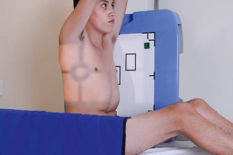
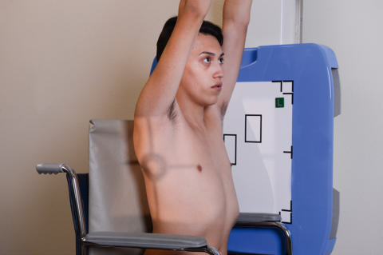
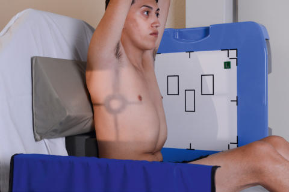

# Rx Torace Variante de Poziționare pentru Incidența de Profil (Lateral)

  📷 Radiografie Convențională (Rx)
  <strong>Actualizat:</strong> 2026-09-15
  <strong>Autor:</strong> Departamentul de Radiologie / Referință Bontrager

---

-   __1. Rezumat Clinic & Indicații__

    ---

    === "Indicații Clinice"

        - A 90degree perspective de la PA poate evidențiază pathology situated posterior la cordul, great vessels, și Stern.

    === "Ghid Național IRIS"

        !!! info "Referință Primară: Ghidul Național IRIS (Ordinul MS 1342/2012)"
            - **Capitol Ghid IRIS:** *Ghidul Național IRIS*
            - **Grad de Recomandare:** **De verificat pe indicație; fără grad atribuit automat**
            - **Nivel de Iradiere Estimată:** `De verificat pentru examinarea și populația selectate`

            [:octicons-search-16: Deschide Ghidul IRIS](../../iris.md){ .md-button .md-button--primary } [:material-open-in-new: Aplicația Oficială PWA](https://radiologie-pediatrica.ro/iris/){ .md-button target="_blank" rel="noopener" }
-   __2. Poziționare & Centrare Fascicul__

    ---

    - **Poziție Pacient:** Pacient: în Wheelchair Remove armrests, if possible, sau place pillow sau other support under smaller pacienți so that armrests de wheelchair do nu superimpose lower plămâni (Fig. 2.62). Turn pacient în wheelchair la Incidență de Profil (lateral) ca close la receptorul de imagine ca possible. Have pacient lean forward și place support blocks behind back; raise brațe above cap și have pacient hold pe la support bar—keeping brațe high.; Regiune anatomică: Center pacient la raza centrală și la receptorul de imagine prin checking anterior și posterior aspects de thorax; adjust raza centrală și receptorul de imagine la level de T7. Ensure Absența rotației anatomice: clavicule echidistante față de linia apofizelor spinoase prin viewing pacient de la tube poziție.
    - **Punct de Centrare Fascicul:** perpendicular, orientat la level de T7 (3 la 4 inches [8 la 10 cm] below level de incizura jugulară (manubriul sternal)) Top de receptorul de imagine approximately 1 inch (2.5 cm) above vertebra proeminentă (apofiza spinoasă C7)
    - **Distanță Focar-Film (DFF / SID):** 180 cm
    - **Comandă Respiratorie:** Apnee în inspir profund complet (după doua inspirație).

-   __3. Parametri Tehnici Expunere__

    ---

    | Parametru Tehnic | Valoare Configurare Generator / Tub |
    |:-----------------|:-------------------------------------|
    | **Tensiune Tub (kV)** | 110-125 kV |
    | **Sarcină / Produs Curent-Timp (mAs)** | DE CONFIGURAT PE APARAT |
    | **Distanță Focar-Film (DFF / SID)** | 180 cm |
    | **Grilă Antidifuzoare (Bucky)** | Cu grilă antidifuzoare Bucky |
    | **Dimensiune Focar** | Focar Mare (1.0 - 1.2 mm) |
    | **Camere de Ionizare AEC** | Camerele laterale (sau camera centrală funcție de regiune) |
    | **Colimare Fascicul** | Collimate pe four sides la area de câmpuri pulmonare (top margine de light field la level de vertebra proeminentă (apofiza spinoasă C7)). |
    | **Filtrare Tub** | Totală ≥ 2.5 mm Al echivalent |

-   __4. Criterii de Calitate & Reușită Imagine__

    ---

    - radiografie trebuie să appear similar la ambulatory Incidență de Profil (lateral) ca described under Evaluation Criteria pe preceding page.

-   __5. Protecție Radiologică (ALARA)__

    ---

    - Ecranare gonadică și a organelor radiosensibile conform procedurilor locale de radioprotecție ALARA.
    - Colimare strictă la aria de interes pentru limitarea radiației difuze.
    - Verificarea posibilității unei sarcini la pacientele de vârstă fertilă înainte de expunere.

!!! note "Observații Clinice & Tehnice"
    Always attempt la have pacient sit completely Ortostatism în wheelchair sau pe cart if possible. However, if pacientul’s condition does nu allow this, capul end de cart poate fie raised ca nearly Ortostatism ca possible cu radiolucent support behind back (Fig. 2.63). toate attempts trebuie să fie made la get pacient ca nearly Ortostatism ca possible. Torace ROUTINE PA lateral Fig. 2.63 Ortostatism, sprijinit stâng Incidență de Profil (lateral). Fig. 2.62 stâng Incidență de Profil (lateral) în wheelchair (brațe up, support behind back). Fig. 2.61 stâng lateral Torace poziție pe cart.

### 🖼️ Imagini

<figure class="protocol-image-card" markdown>

<figcaption><strong>Fig. 2.63 Ortostatism, sprijinit stâng Incidență de Profil (lateral).</strong> — Poziționare pacient conform Ghidului Bontrager (Fig. 2.63 în ortostatism, sprijinit stâng poziție de profil (lateral).)</figcaption>

</figure>

<figure class="protocol-image-card" markdown>

<figcaption><strong>Fig. 2.62 stâng Incidență de Profil (lateral) în wheelchair (brațe up, support behind</strong> — Aspect radiografic de referință conform Ghidului Bontrager (Fig. 2.62 stâng poziție de profil (lateral) în wheelchair (brațe up, support behind)</figcaption>

</figure>

<figure class="protocol-image-card" markdown>

<figcaption><strong>Fig. 2.61 stâng lateral Torace poziție pe cart.</strong> — Aspect radiografic de referință conform Ghidului Bontrager (Fig. 2.61 stâng lateral chest poziție pe cart.)</figcaption>

</figure>

=== "Ghid Rapid de Execuție"

    1. **Identificarea și verificarea pacientului:** verificare identitate, zonă de examinat, consimțământ conform procedurii și evaluarea posibilității unei sarcini, când este relevantă.
    2. **Pregătire:** îndepărtarea oricăror obiecte radiopace (bijuterii, agrafe, fermoare, proteze, pansamente dense).
    3. **Poziționare precisă:** alinierea receptorului de imagine și a tubului la distanța prescrisă (180 cm).
    4. **Colimare strictă:** adaptarea fasciculului strict la regiunea de diagnostic pentru scăderea iradierii și reducerea radiației difuze.
    5. **Radioprotecție:** verificarea [politicii RX](../radioprotectie.md), cu măsuri distincte pentru pacient, personal și însoțitor.

## Surse de documentare

- [Bontrager's Textbook of Radiographic Positioning (Ed. 9/10), Pagina 105](https://www.elsevier.com/books/textbook-of-radiographic-positioning-and-related-anatomy/lampignano/978-0-323-65367-1)
