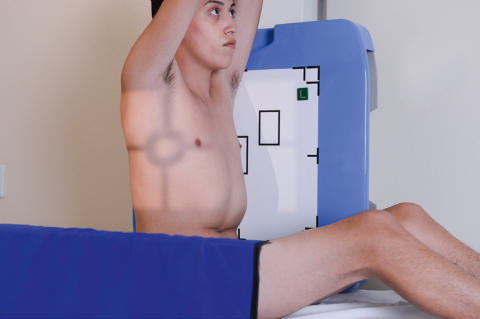
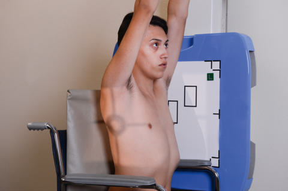
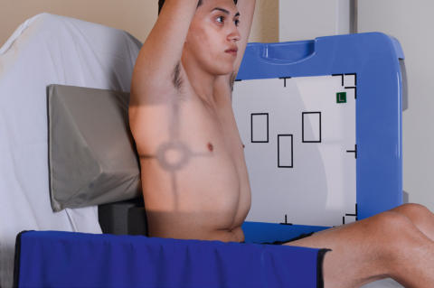

# Rx torace — Variante de poziționare pentru incidența de profil (lateral) (pacient nedeplasabil / scaun rulant / targă)

  📷 Radiografie Convențională (Rx)
  <strong>Actualizat:</strong> 2026-09-15
  <strong>Autor:</strong> Departamentul de Radiologie / Referință Bontrager

---

-   __1. Rezumat Clinic & Indicații__

    ---

    === "Indicații Clinice"

        - O perspectivă la 90 de grade față de PA poate evidenția patologia situată posterior de cord, vasele mari și stern.

    === "Ghid Național IRIS"

        !!! info "Referință Primară: Ghidul Național IRIS (Ordinul MS 1342/2012)"
            - **Capitol Ghid IRIS:** *Torace & Pulmon*
            - **Grad de Recomandare:** **Grad A**
            - **Nivel de Iradiere Estimată:** `Clasa 1 (Minimă < 0.1 mSv)`

            [:octicons-search-16: Deschide Ghidul IRIS](../../iris.md){ .md-button .md-button--primary } [:material-open-in-new: Aplicația Oficială PWA](https://radiologie-pediatrica.ro/iris/){ .md-button target="_blank" rel="noopener" }

-   __2. Poziționare & Centrare Fascicul__

    ---

    - **Poziție Pacient:** Pacient: în scaun rulant. Scoateți cotierele, dacă este posibil, sau așezați o pernă ori alt suport sub pacienții de talie mică, astfel încât cotierele scaunului rulant să nu se suprapună peste porțiunea inferioară a plămânilor (Fig. 2.62). Rotiți pacientul în scaunul rulant în poziție de profil (lateral), cât mai aproape de receptorul de imagine. Cereți pacientului să se aplece înainte și așezați blocuri de sprijin în spatele său; ridicați-i brațele deasupra capului și cereți-i să se țină de bara de sprijin, menținând brațele sus. Regiune anatomică: centrați pacientul la raza centrală și la receptorul de imagine, verificând fețele anterioară și posterioară ale toracelui; ajustați raza centrală și receptorul de imagine la nivelul T7. Asigurați absența rotației anatomice, cu claviculele echidistante față de linia apofizelor spinoase, privind pacientul din poziția tubului.
    - **Punct de Centrare Fascicul:** Perpendicular, orientat la nivelul T7 (3 la 4 țoli [8 la 10 cm] sub nivelul incizurii jugulare a manubriului sternal). Marginea superioară a receptorului de imagine la aproximativ 1 țol (2.5 cm) deasupra vertebrei proeminente (apofiza spinoasă C7)
    - **Distanță Focar-Film (DFF / SID):** 180 cm
    - **Comandă Respiratorie:** Apnee în inspir profund complet (după a doua inspirație).

-   __3. Parametri Tehnici Expunere__

    ---

    | Parametru Tehnic | Valoare Configurare Generator / Tub |
    |:-----------------|:-------------------------------------|
    | **Tensiune Tub (kV)** | 110-125 kV |
    | **Sarcină / Produs Curent-Timp (mAs)** | DE CONFIGURAT PE APARAT |
    | **Distanță Focar-Film (DFF / SID)** | 180 cm |
    | **Grilă Antidifuzoare (Bucky)** | Cu grilă antidifuzoare Bucky |
    | **Dimensiune Focar** | Focar Mare (1.0 - 1.2 mm) |
    | **Camere de Ionizare AEC** | Camerele laterale (sau camera centrală, în funcție de regiune) |
    | **Colimare Fascicul** | Colimați pe cele patru laturi la zona câmpurilor pulmonare (marginea superioară a câmpului luminos la nivelul vertebrei proeminente, apofiza spinoasă C7). |
    | **Filtrare Tub** | Totală ≥ 2.5 mm Al echivalent |

-   __4. Criterii de Calitate & Reușită Imagine__

    ---

    - Radiografia trebuie să aibă un aspect similar celei de profil (lateral) a pacientului mobil, conform descrierii din Criteriile de evaluare de pe pagina precedentă.

-   __5. Protecție Radiologică (ALARA)__

    ---

    - Ecranare gonadică și a organelor radiosensibile conform procedurilor locale de radioprotecție ALARA.
    - Colimare strictă la aria de interes pentru limitarea radiației difuze.
    - Verificarea posibilității unei sarcini la pacientele de vârstă fertilă înainte de expunere.

!!! note "Observații Clinice & Tehnice"
    Încercați întotdeauna să așezați pacientul cu trunchiul complet vertical în scaunul rulant sau pe targă, dacă este posibil. Totuși, dacă starea pacientului nu permite acest lucru, capătul tărgii dinspre cap poate fi ridicat cât mai aproape de verticală, cu un suport radiotransparent în spatele pacientului (Fig. 2.63). Trebuie depuse toate eforturile pentru a poziționa pacientul cât mai aproape de verticală. Torace, incidențe de RUTINĂ: PA; profil. Fig. 2.63 Profil stâng (lateral), în poziție verticală, cu sprijin. Fig. 2.62 Profil stâng (lateral) în scaun rulant (brațele ridicate, suport în spatele pacientului). Fig. 2.61 Poziție de profil stâng a toracelui pe targă.

### 🖼️ Imagini

<figure class="protocol-image-card" markdown>

<figcaption><strong>Fig. 2.63 Profil stâng (lateral), în poziție verticală, cu sprijin.</strong> — Poziționarea pacientului conform Ghidului Bontrager (Fig. 2.63 Poziție de profil stâng (lateral), în poziție verticală, cu sprijin.)</figcaption>

</figure>

<figure class="protocol-image-card" markdown>

<figcaption><strong>Fig. 2.62 Profil stâng (lateral) în scaun rulant (brațele ridicate, suport în spate</strong> — Aspect radiografic de referință conform Ghidului Bontrager (Fig. 2.62 Poziție de profil stâng (lateral) în scaun rulant (brațele ridicate, suport în spate)</figcaption>

</figure>

<figure class="protocol-image-card" markdown>

<figcaption><strong>Fig. 2.61 Poziție de profil stâng a toracelui pe targă.</strong> — Aspect radiografic de referință conform Ghidului Bontrager (Fig. 2.61 Poziție de profil stâng a toracelui pe targă.)</figcaption>

</figure>

=== "Ghid Rapid de Execuție"

    1. **Identificarea și verificarea pacientului:** verificare identitate, zonă de examinat, consimțământ conform procedurii și evaluarea posibilității unei sarcini, când este relevantă.
    2. **Pregătire:** îndepărtarea oricăror obiecte radiopace (bijuterii, agrafe, fermoare, proteze, pansamente dense).
    3. **Poziționare precisă:** alinierea receptorului de imagine și a tubului la distanța prescrisă (180 cm).
    4. **Colimare strictă:** adaptarea fasciculului strict la regiunea de diagnostic pentru scăderea iradierii și reducerea radiației difuze.
    5. **Radioprotecție:** verificarea [politicii RX](../radioprotectie.md), cu măsuri distincte pentru pacient, personal și însoțitor.

## Surse de documentare

- [Bontrager's Textbook of Radiographic Positioning (Ed. 9/10), Pagina 105](https://www.elsevier.com/books/textbook-of-radiographic-positioning-and-related-anatomy/lampignano/978-0-323-65367-1)
