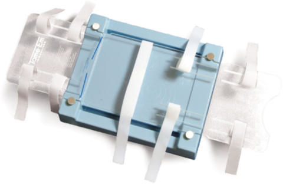
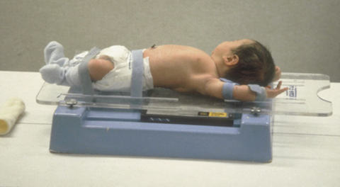

# Rx Torace AP AND PA Torace PROJECTION

  📷 Radiografie Convențională (Rx)
  <strong>Actualizat:</strong> 2026-09-15
  <strong>Autor:</strong> Departamentul de Radiologie / Referință Bontrager

---

-   __1. Rezumat Clinic & Indicații__

    ---

    === "Indicații Clinice"

        - Pathology involving lung fields, diaphragm, Grilaj Costal și Stern, and mediastinum, including the heart and major vessels

    === "Ghid Național IRIS"

        !!! info "Referință Primară: Ghidul Național IRIS (Ordinul MS 1342/2012)"
            - **Capitol Ghid IRIS:** *Ghidul Național IRIS*
            - **Grad de Recomandare:** **De verificat pe indicație; fără grad atribuit automat**
            - **Nivel de Iradiere Estimată:** `De verificat pentru examinarea și populația selectate`

            [:octicons-search-16: Deschide Ghidul IRIS](../../iris.md){ .md-button .md-button--primary } [:material-open-in-new: Aplicația Oficială PWA](https://radiologie-pediatrica.ro/iris/){ .md-button target="_blank" rel="noopener" }
-   __2. Poziționare & Centrare Fascicul__

    ---

    - **Poziție Pacient:** Pacient: Patient Decubit Dorsal Immobilization techniques should be used when necessary (Fig. 16.23). Patient is Decubit Dorsal, and arms are extended to remove Omoplat (Scapulă) from the lung fields. Legs are extended to prevent rotation of the Bazin (Pelvis). With parental assistance (if parent is not pregnant), do the following: 1. Have parent remove child’s Torace clothing. 2. Provide parent with lead apron and gloves or shield. 3. Place child on IR. 4. Parent should extend child’s arms over head with one Mână while keeping head tilted back to prevent superimposing upper lungs. With other Mână, parent holds child’s legs at level of the knees, applying pressure as necessary to prevent movement. 5. Place parent in a position that does not obstruct technologist’s view of patient while exposure is made. 6. Place lead gloves or lead shield over the top of parent’s hands if parent is not wearing the gloves. (It may be easier to hold on to the patient if not wearing the lead gloves.); Regiune anatomică: Place patient in the middle of IR with shoulders 2 inches (5 cm) below top of IR. Ensure that thorax is not rotated.
    - **Punct de Centrare Fascicul:** perpendicular to IR, centered to the midsagittal plane at the level of midthorax, which is approximately at the mammillary (nipple) line
    - **Distanță Focar-Film (DFF / SID):** 150 cm
    - **Comandă Respiratorie:** and make exposure immediately after the child fully inhales. A B Fig. 16.23 (A) Tamem board. (B) Decubit Dorsal AP using immobilizer. (A Courtesy Cone Instruments.) Torace ROUTINE AP or PA Lateral

-   __3. Parametri Tehnici Expunere__

    ---

    | Parametru Tehnic | Valoare Configurare Generator / Tub |
    |:-----------------|:-------------------------------------|
    | **Tensiune Tub (kV)** | 75-85 kV |
    | **Sarcină / Produs Curent-Timp (mAs)** | DE CONFIGURAT PE APARAT |
    | **Distanță Focar-Film (DFF / SID)** | 150 cm |
    | **Grilă Antidifuzoare (Bucky)** | Cu grilă antidifuzoare Bucky |
    | **Dimensiune Focar** | Focar Mare (1.0 - 1.2 mm) |
    | **Camere de Ionizare AEC** | Camerele laterale (sau camera centrală funcție de regiune) |
    | **Colimare Fascicul** | Field Size Closely collimate on four sides to outer Torace margins. |
    | **Filtrare Tub** | Totală ≥ 2.5 mm Al echivalent |

-   __4. Criterii de Calitate & Reușită Imagine__

    ---

    - Vizualizarea completă a regiunii anatomice explorate
    - Absența artefactelor de mișcare sau a suprapunerilor neadecvate
    - Contrast și penetrare optime pentru decelarea structurilor osoase și a părților moi

-   __5. Protecție Radiologică (ALARA)__

    ---

    - Ecranare gonadică și a organelor radiosensibile conform procedurilor locale de radioprotecție ALARA.
    - Colimare strictă la aria de interes pentru limitarea radiației difuze.
    - Verificarea posibilității unei sarcini la pacientele de vârstă fertilă înainte de expunere.

!!! note "Observații Clinice & Tehnice"
    Patient should be Ortostatism, if possible, to demonstrate air/fluid levels. Generally, pediatric patients, if old enough, should be examined in an Ortostatism position with the use of a PiggO- Stat or similar Ortostatism immobilization device (Fig. 16.24). Exceptions are infants in an isolette and infants too young to support their heads.

### 🖼️ Imagini

<figure class="protocol-image-card" markdown>

<figcaption><strong>Fig. 16.23 (A) Tam-</strong> — Poziționare pacient conform Ghidului Bontrager (Fig. 16.23 (A) Tam-)</figcaption>

</figure>

<figure class="protocol-image-card" markdown>

<figcaption><strong>Figura 2</strong> — Aspect radiografic de referință conform Ghidului Bontrager (Figura 2)</figcaption>

</figure>

=== "Ghid Rapid de Execuție"

    1. **Identificarea și verificarea pacientului:** verificare identitate, zonă de examinat, consimțământ conform procedurii și evaluarea posibilității unei sarcini, când este relevantă.
    2. **Pregătire:** îndepărtarea oricăror obiecte radiopace (bijuterii, agrafe, fermoare, proteze, pansamente dense).
    3. **Poziționare precisă:** alinierea receptorului de imagine și a tubului la distanța prescrisă (150 cm).
    4. **Colimare strictă:** adaptarea fasciculului strict la regiunea de diagnostic pentru scăderea iradierii și reducerea radiației difuze.
    5. **Radioprotecție:** verificarea [politicii RX](../radioprotectie.md), cu măsuri distincte pentru pacient, personal și însoțitor.

## Surse de documentare

- [Bontrager's Textbook of Radiographic Positioning (Ed. 9/10), Pagina 653](https://www.elsevier.com/books/textbook-of-radiographic-positioning-and-related-anatomy/lampignano/978-0-323-65367-1)
