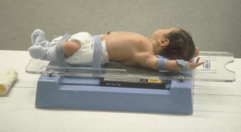

# Radiografie toracică AP și PA — incidență toracică

  📷 Radiografie Convențională (Rx)
  <strong>Actualizat:</strong> 2026-09-15
  <strong>Autor:</strong> Departamentul de Radiologie / Referință Bontrager

---

-   __1. Rezumat Clinic & Indicații__

    ---

    === "Indicații Clinice"

        - Patologia câmpurilor pulmonare, cupolelor diafragmatice, grilajului costal și sternului, precum și a mediastinului, inclusiv a cordului și vaselor mari

    === "Ghid Național IRIS"

        !!! info "Referință Primară: Ghidul Național IRIS (Ordinul MS 1342/2012)"
            - **Capitol Ghid IRIS:** *Torace & Pulmon*
            - **Grad de Recomandare:** **Grad A**
            - **Nivel de Iradiere Estimată:** `Clasa 1 (Minimă < 0.1 mSv)`

            [:octicons-search-16: Deschide Ghidul IRIS](../../iris.md){ .md-button .md-button--primary } [:material-open-in-new: Aplicația Oficială PWA](https://radiologie-pediatrica.ro/iris/){ .md-button target="_blank" rel="noopener" }

-   __2. Poziționare & Centrare Fascicul__

    ---

    - **Poziție Pacient:** Pacient: Pacientul este în decubit dorsal. Tehnicile de imobilizare trebuie utilizate când este necesar (Fig. 16.23). Pacientul este în decubit dorsal, iar brațele sunt extinse pentru a îndepărta omoplații (scapulele) din câmpurile pulmonare. Membrele inferioare sunt extinse pentru a preveni rotația bazinului (pelvisului). Cu ajutorul părintelui (dacă părintele nu este gravid), procedați după cum urmează: 1. Solicitați părintelui să îndepărteze îmbrăcămintea copilului de pe torace. 2. Puneți la dispoziția părintelui un șorț plumbat și mănuși sau un paravan plumbat. 3. Așezați copilul pe receptorul de imagine. 4. Părintele trebuie să extindă brațele copilului deasupra capului cu o mână, menținând în același timp capul înclinat posterior pentru a preveni suprapunerea plămânilor superiori. Cu cealaltă mână, părintele ține membrele inferioare ale copilului la nivelul genunchilor, aplicând presiune după cum este necesar pentru a preveni mișcarea. 5. Așezați părintele într-o poziție care nu obstrucționează incidența pacientului efectuată de tehnician. 6. Așezați mănuși plumbate sau un paravan plumbat peste mâinile părintelui dacă acesta nu poartă mănuși. (Poate fi mai ușor să țină pacientul dacă nu poartă mănuși plumbate.); Regiune anatomică: Așezați pacientul în mijlocul receptorului de imagine, cu umerii la 2 țoli (5 cm) sub marginea superioară a receptorului de imagine. Asigurați-vă că toracele nu este rotit.
    - **Punct de Centrare Fascicul:** Perpendicular pe receptorul de imagine, centrat pe planul mediosagital la mijlocul toracelui, aproximativ la linia mamilară (a mameloanelor)
    - **Distanță Focar-Film (DFF / SID):** 150 cm
    - **Comandă Respiratorie:** și efectuați expunerea imediat după ce copilul inspiră complet. B Fig. 16.23 (A) Placă Tamem. (B) AP în decubit dorsal, cu dispozitiv de imobilizare. (Prin amabilitatea Cone Instruments.) Torace, incidențe de RUTINĂ: AP sau PA; profil

-   __3. Parametri Tehnici Expunere__

    ---

    | Parametru Tehnic | Valoare Configurare Generator / Tub |
    |:-----------------|:-------------------------------------|
    | **Tensiune Tub (kV)** | 75-85 kV |
    | **Sarcină / Produs Curent-Timp (mAs)** | DE CONFIGURAT PE APARAT |
    | **Distanță Focar-Film (DFF / SID)** | 150 cm |
    | **Grilă Antidifuzoare (Bucky)** | Cu grilă antidifuzoare Bucky |
    | **Dimensiune Focar** | Focar Mare (1.0 - 1.2 mm) |
    | **Camere de Ionizare AEC** | Camerele laterale (sau camera centrală, în funcție de regiune) |
    | **Colimare Fascicul** | Dimensiunea câmpului: se colimează strâns pe cele patru laturi la marginile externe ale toracelui. |
    | **Filtrare Tub** | Totală ≥ 2.5 mm Al echivalent |

-   __4. Criterii de Calitate & Reușită Imagine__

    ---

    - Vizualizarea completă a regiunii anatomice explorate
    - Absența artefactelor de mișcare sau a suprapunerilor neadecvate
    - Contrast și penetrare optime pentru decelarea structurilor osoase și a părților moi

-   __5. Protecție Radiologică (ALARA)__

    ---

    - Ecranare gonadică și a organelor radiosensibile conform procedurilor locale de radioprotecție ALARA.
    - Colimare strictă la aria de interes pentru limitarea radiației difuze.
    - Verificarea posibilității unei sarcini la pacientele de vârstă fertilă înainte de expunere.

!!! note "Observații Clinice & Tehnice"
    Pacientul trebuie să fie în poziție verticală, dacă este posibil, pentru a evidenția aerul/nivelurile hidroaerice. În general, pacienții pediatrici, dacă au vârsta necesară, trebuie examinați în poziție verticală cu ajutorul unui PiggO- Stat sau al unui dispozitiv similar de imobilizare în poziție verticală (Fig. 16.24). Excepțiile sunt sugarii aflați în incubator și cei prea mici pentru a-și susține capul.

### 🖼️ Imagini

<figure class="protocol-image-card" markdown>

![Fig. 16.23 (A) Tam- [fragment incomplet în sursă]](../../assets/images/protocols/bontrager/rx-torace-ap-and-pa-torace-projection-bontrager/fig_1.jpeg)

<figcaption><strong>Fig. 16.23 (A) Tam- [fragment incomplet în sursă]</strong> — Poziționarea pacientului conform Ghidului Bontrager (Fig. 16.23 (A) Tam-). [fragment incomplet în sursă]</figcaption>

</figure>

<figure class="protocol-image-card" markdown>

<figcaption><strong>Figura 2</strong> — Aspect radiografic de referință conform Ghidului Bontrager (Figura 2)</figcaption>

</figure>

=== "Ghid Rapid de Execuție"

    1. **Identificarea și verificarea pacientului:** verificare identitate, zonă de examinat, consimțământ conform procedurii și evaluarea posibilității unei sarcini, când este relevantă.
    2. **Pregătire:** îndepărtarea oricăror obiecte radiopace (bijuterii, agrafe, fermoare, proteze, pansamente dense).
    3. **Poziționare precisă:** alinierea receptorului de imagine și a tubului la distanța prescrisă (150 cm).
    4. **Colimare strictă:** adaptarea fasciculului strict la regiunea de diagnostic pentru scăderea iradierii și reducerea radiației difuze.
    5. **Radioprotecție:** verificarea [politicii RX](../radioprotectie.md), cu măsuri distincte pentru pacient, personal și însoțitor.

## Surse de documentare

- [Bontrager's Textbook of Radiographic Positioning (Ed. 9/10), Pagina 653](https://www.elsevier.com/books/textbook-of-radiographic-positioning-and-related-anatomy/lampignano/978-0-323-65367-1)
