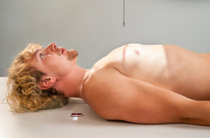
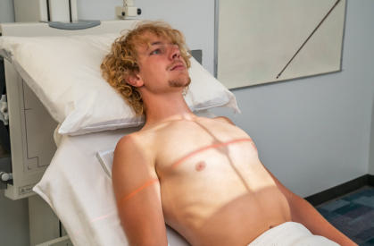
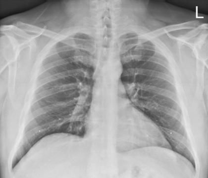

# Rx Torace AP (Antero-Posterior)

  📷 Radiografie Convențională (Rx)
  <strong>Actualizat:</strong> 2026-09-15
  <strong>Autor:</strong> Departamentul de Radiologie / Referință Bontrager

---

-   __1. Rezumat Clinic & Indicații__

    ---

    === "Indicații Clinice"

        - evidențiază pathology involving plămânii, cupole diafragmatice, și mediastinum.
        - Determining airfluid levels (revărsat pleural (pleurezie)) requires completely Ortostatism poziție cu orizontal raza centrală, ca în PA, AP, sau decubit Torace incidență.

    === "Ghid Național IRIS"

        !!! info "Referință Primară: Ghidul Național IRIS (Ordinul MS 1342/2012)"
            - **Capitol Ghid IRIS:** *Ghidul Național IRIS*
            - **Grad de Recomandare:** **De verificat pe indicație; fără grad atribuit automat**
            - **Nivel de Iradiere Estimată:** `De verificat pentru examinarea și populația selectate`

            [:octicons-search-16: Deschide Ghidul IRIS](../../iris.md){ .md-button .md-button--primary } [:material-open-in-new: Aplicația Oficială PWA](https://radiologie-pediatrica.ro/iris/){ .md-button target="_blank" rel="noopener" }
-   __2. Poziționare & Centrare Fascicul__

    ---

    - **Poziție Pacient:** Pacient: pacient este Decubit dorsal pe cart; if possible, capul end de cart sau bed trebuie să fie raised into semierect poziție (see NOTES). Alternatively, pacient poate fie Poziție Șezândă Ortostatism, membre inferioare over edge, back pe / sprijinit de receptorul de imagine. Roll pacient’s umeri forward prin rotating brațe medially sau internally.; Regiune anatomică: Place receptorul de imagine under sau behind pacient; align center de receptorul de imagine la raza centrală (top de receptorul de imagine about 1½ inches [4 la 5 cm] above umeri) (Fig. 2.64). Center pacient la raza centrală și la receptorul de imagine Ensure Absența rotației anatomice: clavicule echidistante față de linia apofizelor spinoase de thorax prin placing planul mediocoronal paralel cu receptorul de imagine.
    - **Punct de Centrare Fascicul:** la level de T7, 3 la 4 inches (8 la 10 cm) below incizura jugulară (manubriul sternal)
    - **Distanță Focar-Film (DFF / SID):** 180 cm
    - **Comandă Respiratorie:** Apnee în inspir profund complet (după doua inspirație).

-   __3. Parametri Tehnici Expunere__

    ---

    | Parametru Tehnic | Valoare Configurare Generator / Tub |
    |:-----------------|:-------------------------------------|
    | **Tensiune Tub (kV)** | 110-125 kV |
    | **Sarcină / Produs Curent-Timp (mAs)** | DE CONFIGURAT PE APARAT |
    | **Distanță Focar-Film (DFF / SID)** | 180 cm |
    | **Grilă Antidifuzoare (Bucky)** | Cu grilă antidifuzoare Bucky |
    | **Dimensiune Focar** | Focar Mare (1.0 - 1.2 mm) |
    | **Camere de Ionizare AEC** | Camerele laterale (sau camera centrală funcție de regiune) |
    | **Colimare Fascicul** | Collimate pe four sides la area de câmpuri pulmonare (top margine de light field la level de vertebra proeminentă (apofiza spinoasă C7)). |
    | **Filtrare Tub** | Totală ≥ 2.5 mm Al echivalent |

-   __4. Criterii de Calitate & Reușită Imagine__

    ---

    - Criteria pentru Torace radiografii taken în semierect sau în ortostatism poziții trebuie să fie similar la criteria pentru Incidență Postero-Anterioară (PA) described earlier, cu three exceptions: cordul appears larger ca result de increased magnification de la shorter SID și increased OID de cordul. pentru semierect pacient, possible revărsat pleural (pleurezie) often obscures vascular lung markings compared cu fully Ortostatism PA Torace incidență. fără orizontal fascicul, nivele hidroaerice poate nu fie evidențiat. Usually, inspiration este nu ca full, și only eight sau nine posterior Coaste (Grilaj Costal) sunt visualized above cupole diafragmatice. plămânii poate appear denser because they sunt nu ca fully aerated (Fig. 2.66).
    - Correct raza centrală angle: clavicles trebuie să fie în same plan orizontal cu unobstructed incidență de apical region.4 Fig. 2.66 AP semierect.

-   __5. Protecție Radiologică (ALARA)__

    ---

    - Ecranare gonadică și a organelor radiosensibile conform procedurilor locale de radioprotecție ALARA.
    - Colimare strictă la aria de interes pentru limitarea radiației difuze.
    - Verificarea posibilității unei sarcini la pacientele de vârstă fertilă înainte de expunere.

!!! note "Observații Clinice & Tehnice"
    S: transversal receptorul de imagine placement este recommended pentru large sau hypersthenic sau broadchested pacienți la minimize chance de lateral cutoff. This requires precis raza centrală alignment cu center de receptorul de imagine cu only minimal caudal angle la prevent grilă cutoff if grilă este used. pentru semierect poziție, use 72inch (180cm) SID if possible. Always place markeri pe receptorul de imagine sau label imagine la indicate SID used; also indicate incidențe obtained, such ca AP semierect sau AP în ortostatism (Fig. 2.65). Torace SPECIAL AP în ortostatism semierect Fig. 2.64 AP Decubit dorsal. Fig. 2.65 AP semierect.

### 🖼️ Imagini

<figure class="protocol-image-card" markdown>

<figcaption><strong>Fig. 2.64 AP Decubit dorsal.</strong> — Poziționare pacient conform Ghidului Bontrager (Fig. 2.64 AP în decubit dorsal.)</figcaption>

</figure>

<figure class="protocol-image-card" markdown>

<figcaption><strong>Fig. 2.65 AP semierect.</strong> — Aspect radiografic de referință conform Ghidului Bontrager (Fig. 2.65 AP semierect.)</figcaption>

</figure>

<figure class="protocol-image-card" markdown>

<figcaption><strong>Fig. 2.66 AP semierect.</strong> — Aspect radiografic de referință conform Ghidului Bontrager (Fig. 2.66 AP semierect.)</figcaption>

</figure>

=== "Ghid Rapid de Execuție"

    1. **Identificarea și verificarea pacientului:** verificare identitate, zonă de examinat, consimțământ conform procedurii și evaluarea posibilității unei sarcini, când este relevantă.
    2. **Pregătire:** îndepărtarea oricăror obiecte radiopace (bijuterii, agrafe, fermoare, proteze, pansamente dense).
    3. **Poziționare precisă:** alinierea receptorului de imagine și a tubului la distanța prescrisă (180 cm).
    4. **Colimare strictă:** adaptarea fasciculului strict la regiunea de diagnostic pentru scăderea iradierii și reducerea radiației difuze.
    5. **Radioprotecție:** verificarea [politicii RX](../radioprotectie.md), cu măsuri distincte pentru pacient, personal și însoțitor.

## Surse de documentare

- [Bontrager's Textbook of Radiographic Positioning (Ed. 9/10), Pagina 106](https://www.elsevier.com/books/textbook-of-radiographic-positioning-and-related-anatomy/lampignano/978-0-323-65367-1)
