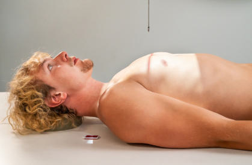
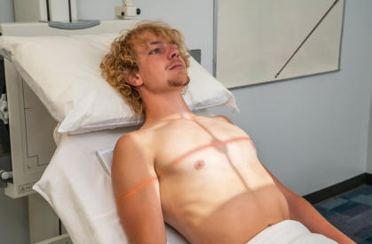
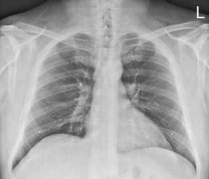

# Radiografie toracică AP (antero-posterioară)

  📷 Radiografie Convențională (Rx)
  <strong>Actualizat:</strong> 2026-09-15
  <strong>Autor:</strong> Departamentul de Radiologie / Referință Bontrager

---

-   __1. Rezumat Clinic & Indicații__

    ---

    === "Indicații Clinice"

        - Evidențiază patologia care implică plămânii, cupolele diafragmatice și mediastinul.
        - Determinarea nivelurilor hidroaerice (revărsat pleural) necesită poziția complet ortostatică, cu raza centrală orizontală, ca în incidența PA, AP sau în decubit pentru torace.

    === "Ghid Național IRIS"

        !!! info "Referință Primară: Ghidul Național IRIS (Ordinul MS 1342/2012)"
            - **Capitol Ghid IRIS:** *Torace & Pulmon*
            - **Grad de Recomandare:** **Grad A**
            - **Nivel de Iradiere Estimată:** `Clasa 1 (Minimă < 0.1 mSv)`

            [:octicons-search-16: Deschide Ghidul IRIS](../../iris.md){ .md-button .md-button--primary } [:material-open-in-new: Aplicația Oficială PWA](https://radiologie-pediatrica.ro/iris/){ .md-button target="_blank" rel="noopener" }

-   __2. Poziționare & Centrare Fascicul__

    ---

    - **Poziție Pacient:** Pacient: Pacientul este în decubit dorsal pe targa mobilă; dacă este posibil, capătul cefalic al tărgii sau al patului trebuie ridicat în poziție semierectă (vezi NOTELE). Alternativ, pacientul poate fi în poziție șezândă sau în ortostatism, cu membrele inferioare peste margine și spatele sprijinit de receptorul de imagine. Rulați umerii pacientului anterior prin rotirea brațelor medial sau intern.; Regiune anatomică: Așezați receptorul de imagine sub sau în spatele pacientului; aliniați centrul receptorului de imagine cu raza centrală (partea superioară a receptorului de imagine la aproximativ 1½ țoli [4 la 5 cm] deasupra umerilor) (Fig. 2.64). Centrați pacientul pe raza centrală și pe receptorul de imagine. Asigurați absența rotației anatomice: claviculele sunt echidistante față de linia apofizelor spinoase ale toracelui prin plasarea planului mediocoronal paralel cu receptorul de imagine.
    - **Punct de Centrare Fascicul:** La nivelul T7, 3 la 4 țoli (8 la 10 cm) sub incizura jugulară (manubriul sternal)
    - **Distanță Focar-Film (DFF / SID):** 180 cm
    - **Comandă Respiratorie:** Apnee în inspir profund complet (după a doua inspirație).

-   __3. Parametri Tehnici Expunere__

    ---

    | Parametru Tehnic | Valoare Configurare Generator / Tub |
    |:-----------------|:-------------------------------------|
    | **Tensiune Tub (kV)** | 110-125 kV |
    | **Sarcină / Produs Curent-Timp (mAs)** | DE CONFIGURAT PE APARAT |
    | **Distanță Focar-Film (DFF / SID)** | 180 cm |
    | **Grilă Antidifuzoare (Bucky)** | Cu grilă antidifuzoare Bucky |
    | **Dimensiune Focar** | Focar Mare (1.0 - 1.2 mm) |
    | **Camere de Ionizare AEC** | Camerele laterale (sau camera centrală, în funcție de regiune) |
    | **Colimare Fascicul** | Colimați pe cele patru laturi la zona câmpurilor pulmonare (marginea superioară a câmpului luminos la nivelul vertebrei proeminente, apofiza spinoasă C7). |
    | **Filtrare Tub** | Totală ≥ 2.5 mm Al echivalent |

-   __4. Criterii de Calitate & Reușită Imagine__

    ---

    - Criteriile pentru radiografiile toracelui efectuate în poziție semierectă sau în ortostatism trebuie să fie similare cu criteriile pentru incidența postero-anterioară (PA) descrise anterior, cu trei excepții: cordul apare mai mare ca urmare a măririi magnificației determinată de SID mai scurt și OID crescut al cordului. La pacientul în poziție semierectă, posibilul revărsat pleural obscurizează adesea desenul vascular pulmonar în comparație cu incidența PA a toracelui în ortostatism complet. Fără fascicul orizontal, nivelurile hidroaerice pot să nu fie evidențiate. De obicei, inspirația nu este la fel de profundă, iar numai opt sau nouă coaste posterioare sunt vizualizate deasupra cupolelor diafragmatice. Plămânii pot apărea mai denși deoarece nu sunt la fel de complet aerizați (Fig. 2.66).
    - Unghiul corect al razei centrale: claviculele trebuie să fie în același plan orizontal, cu regiunea apicală neobstrucționată.4 Fig. 2.66 AP semiortostatic.

-   __5. Protecție Radiologică (ALARA)__

    ---

    - Ecranare gonadică și a organelor radiosensibile conform procedurilor locale de radioprotecție ALARA.
    - Colimare strictă la aria de interes pentru limitarea radiației difuze.
    - Verificarea posibilității unei sarcini la pacientele de vârstă fertilă înainte de expunere.

!!! note "Observații Clinice & Tehnice"
    S: Amplasarea transversală a receptorului de imagine este recomandată pentru pacienții mari, hiperstenici sau cu torace lat, pentru a reduce posibilitatea decupării laterale. Aceasta necesită alinierea precisă a razei centrale cu centrul receptorului de imagine, cu un unghi caudal minim pentru a preveni decuparea grilei dacă se utilizează grila. Pentru poziția semierectă, utilizați SID de 72 țoli (180 cm), dacă este posibil. Așezați întotdeauna markeri pe receptorul de imagine sau etichetați imaginea pentru a indica SID utilizat; indicați, de asemenea, incidențele obținute, cum ar fi AP semierectă sau AP în ortostatism (Fig. 2.65). TORACE SPECIAL AP în ortostatism, semierectă Fig. 2.64 AP în decubit dorsal. Fig. 2.65 AP semierectă.

### 🖼️ Imagini

<figure class="protocol-image-card" markdown>

<figcaption><strong>Fig. 2.64 AP în decubit dorsal.</strong> — Poziționarea pacientului conform Ghidului Bontrager (Fig. 2.64 AP în decubit dorsal.)</figcaption>

</figure>

<figure class="protocol-image-card" markdown>

<figcaption><strong>Fig. 2.65 AP semiortostatic.</strong> — Aspect radiografic de referință conform Ghidului Bontrager (Fig. 2.65 AP semiortostatic.)</figcaption>

</figure>

<figure class="protocol-image-card" markdown>

<figcaption><strong>Fig. 2.66 AP semiortostatic.</strong> — Aspect radiografic de referință conform Ghidului Bontrager (Fig. 2.66 AP semiortostatic.)</figcaption>

</figure>

=== "Ghid Rapid de Execuție"

    1. **Identificarea și verificarea pacientului:** verificare identitate, zonă de examinat, consimțământ conform procedurii și evaluarea posibilității unei sarcini, când este relevantă.
    2. **Pregătire:** îndepărtarea oricăror obiecte radiopace (bijuterii, agrafe, fermoare, proteze, pansamente dense).
    3. **Poziționare precisă:** alinierea receptorului de imagine și a tubului la distanța prescrisă (180 cm).
    4. **Colimare strictă:** adaptarea fasciculului strict la regiunea de diagnostic pentru scăderea iradierii și reducerea radiației difuze.
    5. **Radioprotecție:** verificarea [politicii RX](../radioprotectie.md), cu măsuri distincte pentru pacient, personal și însoțitor.

## Surse de documentare

- [Bontrager's Textbook of Radiographic Positioning (Ed. 9/10), Pagina 106](https://www.elsevier.com/books/textbook-of-radiographic-positioning-and-related-anatomy/lampignano/978-0-323-65367-1)
