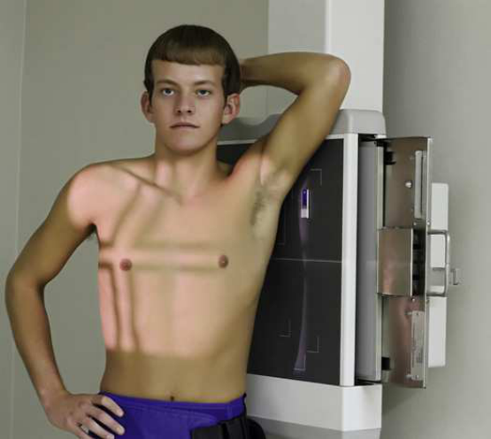
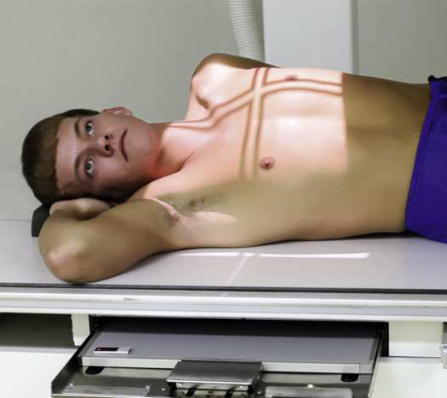
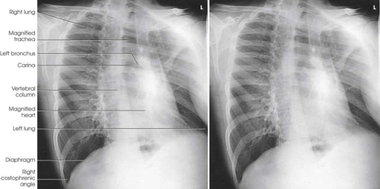

# Rx Torace — Oblică Antero-Posterioară (AP) — RPO and Oblică Posterioară Stângă (OPS / LPO)s (Merrill)

  📷 Radiografie Convențională (Rx)
  <strong>Actualizat:</strong> 2026-09-16
  <strong>Autor:</strong> Referință Merrill

---

-   __1. Rezumat Clinic & Indicații__

    ---

    === "Indicații Clinice"

        - Conform reperelor anatomice standard din tratat

    === "Ghid Național IRIS"

        !!! info "Referință Primară: Ghidul Național IRIS (Ordinul MS 1342/2012)"
            - **Capitol Ghid IRIS:** *Ghidul Național IRIS*
            - **Grad de Recomandare:** **De verificat pe indicație; fără grad atribuit automat**
            - **Nivel de Iradiere Estimată:** `De verificat pentru examinarea și populația selectate`

            [:octicons-search-16: Deschide Ghidul IRIS](../../iris.md){ .md-button .md-button--primary } [:material-open-in-new: Aplicația Oficială PWA](https://radiologie-pediatrica.ro/iris/){ .md-button target="_blank" rel="noopener" }
-   __2. Poziționare & Centrare Fascicul__

    ---

    - **Poziție Pacient:** cu pacientul Decubit dorsal sau facing x-ray tube, either în ortostatism sau Decubit, se ajustează receptorul de imagine astfel încât upper margine de receptorul de imagine este approximately 1.5 la 2 inches (3.8 la 5 cm) above vertebral prominens sau approximately 5 inches (12.7 cm) above incizură jugulară (furculiță sternală).; se rotește pacient spre correct side, se ajustează corp la a 45-grade angle, și se centrează thorax la grila. If pacientul este Decubit, support ridicat Șold și braț. Ensure that ambele părți (bilateral) de Torace sunt poziționat la receptorul de imagine. se flectează pacient’s coate și place mâinile pe șoldurile cu palms facing outward sau pronate mâinile beside șoldurile. braț closer la receptorul de imagine poate fie raised if Umăr este rotit anteriorly. se ajustează umeri la lie în same plan transversal în poziție de forward rotație (Figs. 3.53 și 3.54). se efectuează ecranarea gonadelor cu șorț plumbat.
    - **Punct de Centrare Fascicul:** perpendicular pe centrul receptorului de imagine la level 3 inches (7.6 cm) below incizură jugulară (furculiță sternală) (raza centrală exits la T7).
    - **Distanță Focar-Film (DFF / SID):** Minimum SID of 72 inches (183 cm) is recommended to decrease magnification of the heart and increase spatial resolution of the thoracic structures.
    - **Comandă Respiratorie:** Inspir profund complet. expunere este made after second Inspir profund complet la ensure maximum expansion de plămânii.

-   __3. Parametri Tehnici Expunere__

    ---

    | Parametru Tehnic | Valoare Configurare Generator / Tub |
    |:-----------------|:-------------------------------------|
    | **Tensiune Tub (kV)** | DE CONFIGURAT PE APARAT |
    | **Sarcină / Produs Curent-Timp (mAs)** | DE CONFIGURAT PE APARAT |
    | **Distanță Focar-Film (DFF / SID)** | Minimum SID of 72 inches (183 cm) is recommended to decrease magnification of the heart and increase spatial resolution of the thoracic structures. |
    | **Grilă Antidifuzoare (Bucky)** | DE CONFIGURAT PE APARAT |
    | **Dimensiune Focar** | DE CONFIGURAT PE APARAT |
    | **Camere de Ionizare AEC** | DE CONFIGURAT PE APARAT |
    | **Colimare Fascicul** | Adjust câmp de iradiere la 17 inches (43 cm) longitudinal și 1 inch (2.5 cm) beyond shadows pe ambele părți (bilateral) but fără more than 14 inches (35 cm). vertical dimension poate fie less pentru smaller pacienți. Place marker de lateralitate (D/S) în collimated expunere field. |
    | **Filtrare Tub** | DE CONFIGURAT PE APARAT |

-   __4. Criterii de Calitate & Reușită Imagine__

    ---

    - Criterii radiologice de calitate imaginii:
    - Evidence de corect collimation și presence de marker de lateralitate (D/S) plasat clear de anatomy de interest
    - ambele plămâni included de la apexuri (vârfuri pulmonare) la sinusuri costodiafragmatice
    - Trachea filled cu air
    - stâng lung best evidențiat pe LPO
    - drept lung best evidențiat pe RPO
    - Pulmonary vascular markings de la hilar regions la periphery de lung

-   __5. Protecție Radiologică (ALARA)__

    ---

    - Nespecificat în fragmentul extras; de verificat în sursă

!!! note "Observații Clinice & Tehnice"
    Conform reperelor anatomice standard din tratat

### 🖼️ Imagini

<figure class="protocol-image-card" markdown>

<figcaption><strong>Merrill — pagina PDF 186, imaginea 1</strong> — Imagine din fragmentul sursă; asocierea necesită revizie.</figcaption>

</figure>

<figure class="protocol-image-card" markdown>

<figcaption><strong>Merrill — pagina PDF 187, imaginea 2</strong> — Imagine din fragmentul sursă; asocierea necesită revizie.</figcaption>

</figure>

<figure class="protocol-image-card" markdown>

<figcaption><strong>Merrill — pagina PDF 188, imaginea 3</strong> — Imagine din fragmentul sursă; asocierea necesită revizie.</figcaption>

</figure>

=== "Ghid Rapid de Execuție"

    1. **Identificarea și verificarea pacientului:** verificare identitate, zonă de examinat, consimțământ conform procedurii și evaluarea posibilității unei sarcini, când este relevantă.
    2. **Pregătire:** îndepărtarea oricăror obiecte radiopace (bijuterii, agrafe, fermoare, proteze, pansamente dense).
    3. **Poziționare precisă:** alinierea receptorului de imagine și a tubului la distanța prescrisă (Minimum SID of 72 inches (183 cm) is recommended to decrease magnification of the heart and increase spatial resolution of the thoracic structures.).
    4. **Colimare strictă:** adaptarea fasciculului strict la regiunea de diagnostic pentru scăderea iradierii și reducerea radiației difuze.
    5. **Radioprotecție:** verificarea [politicii RX](../radioprotectie.md), cu măsuri distincte pentru pacient, personal și însoțitor.

## Surse de documentare

- [Merrill’s Atlas, 3. Thoracic Viscera: Chest and Upper Airway, pagini PDF 185–188](../../assets/protocols/sources/a56d45c16829_Merrills_Atlas_of_Radiographic_Positioning__Procedures_3Vol_Set.pdf#page=185)

## Fragmente sursă traduse (referință tehnică)

### anatomy

This radiografie presents AP oblic incidență de thoracic viscera similar la corresponding PA oblic incidență (Fig. 3.55). RPO
poziție este comparable cu poziție oblică anterioară stângă (OAS / LAO). However, câmpuri pulmonare de ridicat side usually appears shorter because de magnification de
cupole diafragmatice. cordul și great vessels also cast magnified shadows ca result de being farther de la receptorul de imagine.

### collimation

• Adjust câmp de iradiere la 17 inches (43 cm) longitudinal și 1 inch (2.5 cm) beyond shadows pe ambele părți (bilateral) but fără more than 14 inches
(35 cm). vertical dimension poate fie less pentru smaller pacienți. Place marker de lateralitate (D/S) în collimated expunere field.

### cr

• perpendicular pe centrul receptorului de imagine la level 3 inches (7.6 cm) below incizură jugulară (furculiță sternală) (raza centrală exits la T7).

### criteria

Criterii radiologice de calitate imaginii:
• Evidence de corect collimation și presence de marker de lateralitate (D/S) plasat clear de anatomy de interest
• ambele plămâni included de la apexuri (vârfuri pulmonare) la sinusuri costodiafragmatice
• Trachea filled cu air
• stâng lung best evidențiat pe LPO
• drept lung best evidențiat pe RPO
• Pulmonary vascular markings de la hilar regions la periphery de lung

### part_pos

• se rotește pacient spre correct side, se ajustează corp la a 45-grade angle, și se centrează thorax la grila.
• If pacientul este recumbent, support ridicat hip și braț. Ensure that ambele părți (bilateral) de toracele sunt poziționat la receptorul de imagine.
• se flectează pacient’s coate și place mâinile pe șoldurile cu palms facing outward sau pronate mâinile beside șoldurile. braț
closer la receptorul de imagine poate fie raised if umăr este rotit anteriorly.
• se ajustează umeri la lie în same plan transversal în poziție de forward rotație (Figs. 3.53 și 3.54).
• se efectuează ecranarea gonadelor cu șorț plumbat.

### patient_pos

• cu pacientul în decubit dorsal sau facing x-ray tube, either în ortostatism sau recumbent, se ajustează receptorul de imagine astfel încât upper margine de receptorul de imagine este
approximately 1.5 la 2 inches (3.8 la 5 cm) above vertebral prominens sau approximately 5 inches (12.7 cm) above incizură jugulară (furculiță sternală).

### respiration

Inspir profund complet. expunere este made after second Inspir profund complet la ensure maximum expansion de plămânii.

### sid

Minimum SID de 72 inches (183 cm) este recommended la decrease magnification de cordul și increase spatial resolution de thoracic
structures.

### tech

poziționat prin manufacturer sau department protocol pentru corect anatomy display orientation; raza centrală plate: 14 × 17 inches (35
× 43 cm) longitudinal.

