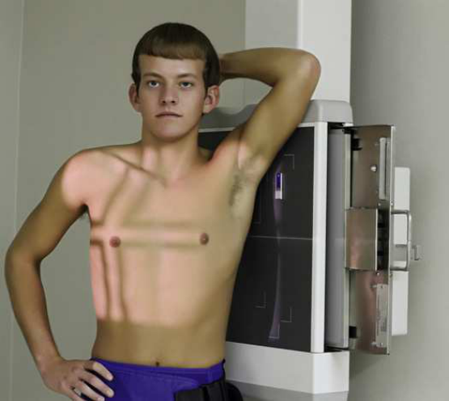
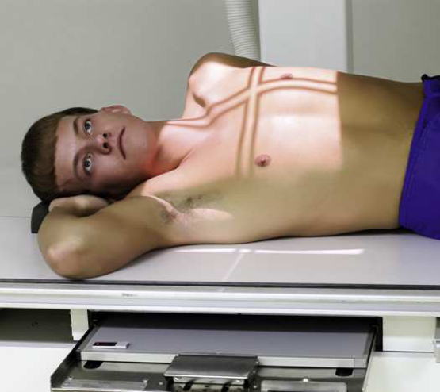
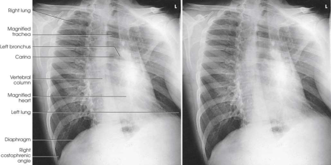

# Rx torace — incidență oblică antero-posterioară (AP) — poziții oblice posterioare dreaptă (RPO) și stângă (OPS / LPO) (Merrill)

  📷 Radiografie Convențională (Rx)
  <strong>Actualizat:</strong> 2026-09-16
  <strong>Autor:</strong> Referință Merrill

---

-   __1. Rezumat Clinic & Indicații__

    ---

    === "Indicații Clinice"

        - Conform reperelor anatomice standard din tratat

    === "Ghid Național IRIS"

        !!! info "Referință Primară: Ghidul Național IRIS (Ordinul MS 1342/2012)"
            - **Capitol Ghid IRIS:** *Torace & Pulmon*
            - **Grad de Recomandare:** **Grad A**
            - **Nivel de Iradiere Estimată:** `Clasa 1 (Minimă < 0.1 mSv)`

            [:octicons-search-16: Deschide Ghidul IRIS](../../iris.md){ .md-button .md-button--primary } [:material-open-in-new: Aplicația Oficială PWA](https://radiologie-pediatrica.ro/iris/){ .md-button target="_blank" rel="noopener" }

-   __2. Poziționare & Centrare Fascicul__

    ---

    - **Poziție Pacient:** Cu pacientul în decubit dorsal sau cu fața spre tubul radiogen, fie în ortostatism, fie în decubit, ajustați receptorul de imagine astfel încât marginea superioară a receptorului de imagine să fie la aproximativ 1.5 la 2 țoli (3.8 la 5 cm) deasupra vertebrei proeminente sau la aproximativ 5 țoli (12.7 cm) deasupra incizurii jugulare (furculiței sternale).; Rotiți pacientul spre partea corectă, ajustați corpul la un unghi de 45 de grade și centrați toracele pe grilă. Dacă pacientul este în decubit, ridicați și susțineți șoldul și brațul. Asigurați-vă că ambele părți ale toracelui sunt poziționate pe receptorul de imagine. Flectați coatele pacientului și așezați mâinile pe șolduri, cu palmele orientate în exterior, sau pronați mâinile lângă șolduri. Brațul mai apropiat de receptorul de imagine poate fi ridicat dacă umărul este rotit anterior. Ajustați umerii astfel încât să se afle în același plan transversal, în poziție de rotație anterioară (Figs. 3.53 și 3.54). Efectuați ecranarea gonadelor cu șorț plumbat.
    - **Punct de Centrare Fascicul:** Perpendicular pe centrul receptorului de imagine, la nivelul situat 3 țoli (7.6 cm) sub incizura jugulară (furculița sternală) (raza centrală iese la T7).
    - **Distanță Focar-Film (DFF / SID):** Se recomandă o SID minimă de 72 inci (183 cm), pentru a reduce magnificarea inimii și a crește rezoluția spațială a structurilor toracice.
    - **Comandă Respiratorie:** Inspir profund complet. Expunerea se efectuează după al doilea inspir profund complet pentru a asigura expansiunea maximă a plămânilor.

-   __3. Parametri Tehnici Expunere__

    ---

    | Parametru Tehnic | Valoare Configurare Generator / Tub |
    |:-----------------|:-------------------------------------|
    | **Tensiune Tub (kV)** | DE CONFIGURAT PE APARAT |
    | **Sarcină / Produs Curent-Timp (mAs)** | DE CONFIGURAT PE APARAT |
    | **Distanță Focar-Film (DFF / SID)** | Se recomandă o SID minimă de 72 inci (183 cm), pentru a reduce magnificarea inimii și a crește rezoluția spațială a structurilor toracice. |
    | **Grilă Antidifuzoare (Bucky)** | DE CONFIGURAT PE APARAT |
    | **Dimensiune Focar** | DE CONFIGURAT PE APARAT |
    | **Camere de Ionizare AEC** | DE CONFIGURAT PE APARAT |
    | **Colimare Fascicul** | Ajustați câmpul de iradiere la 17 țoli (43 cm) longitudinal și la 1 țol (2.5 cm) dincolo de umbre pe ambele părți, dar fără mai mult de 14 țoli (35 cm). Dimensiunea verticală poate fi mai mică pentru pacienții mai mici. Plasați markerul de lateralitate (D/S) în câmpul de expunere colimat. |
    | **Filtrare Tub** | DE CONFIGURAT PE APARAT |

-   __4. Criterii de Calitate & Reușită Imagine__

    ---

    - Criterii radiologice de calitate a imaginii:
    - Evidențierea colimării corecte și prezența markerului de lateralitate (D/S), plasat fără a se suprapune peste anatomia de interes
    - Ambii plămâni incluși de la apexuri (vârfurile pulmonare) la sinusurile costodiafragmatice
    - Trahee umplută cu aer
    - Plămânul stâng este cel mai bine evidențiat pe LPO
    - Plămânul drept este cel mai bine evidențiat pe RPO
    - Desenul vascular pulmonar de la regiunile hilare până la periferia plămânului

-   __5. Protecție Radiologică (ALARA)__

    ---

    - Nespecificat în fragmentul extras; de verificat în sursă

!!! note "Observații Clinice & Tehnice"
    Conform reperelor anatomice standard din tratat

### 🖼️ Imagini

<figure class="protocol-image-card" markdown>

<figcaption><strong>Merrill — pagina 186, imaginea 1</strong> — Imagine din fragmentul sursă; asocierea necesită revizie.</figcaption>

</figure>

<figure class="protocol-image-card" markdown>

<figcaption><strong>Merrill — pagina 187, imaginea 2</strong> — Imagine din fragmentul sursă; asocierea necesită revizie.</figcaption>

</figure>

<figure class="protocol-image-card" markdown>

<figcaption><strong>Merrill — pagina 188, imaginea 3</strong> — Imagine din fragmentul sursă; asocierea necesită revizie.</figcaption>

</figure>

=== "Ghid Rapid de Execuție"

    1. **Identificarea și verificarea pacientului:** verificare identitate, zonă de examinat, consimțământ conform procedurii și evaluarea posibilității unei sarcini, când este relevantă.
    2. **Pregătire:** îndepărtarea oricăror obiecte radiopace (bijuterii, agrafe, fermoare, proteze, pansamente dense).
    3. **Poziționare precisă:** alinierea receptorului de imagine și a tubului la distanța prescrisă (Se recomandă o SID minimă de 72 inci (183 cm), pentru a reduce magnificarea inimii și a crește rezoluția spațială a structurilor toracice.).
    4. **Colimare strictă:** adaptarea fasciculului strict la regiunea de diagnostic pentru scăderea iradierii și reducerea radiației difuze.
    5. **Radioprotecție:** verificarea [politicii RX](../radioprotectie.md), cu măsuri distincte pentru pacient, personal și însoțitor.

## Surse de documentare

- [Merrill’s Atlas, 3. Thoracic Viscera: Chest and Upper Airway, pagini 185–188](https://books.google.com/books/about/Merrill_s_Atlas_of_Radiographic_Position.html?id=BM0lEQAAQBAJ)
