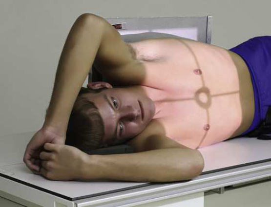
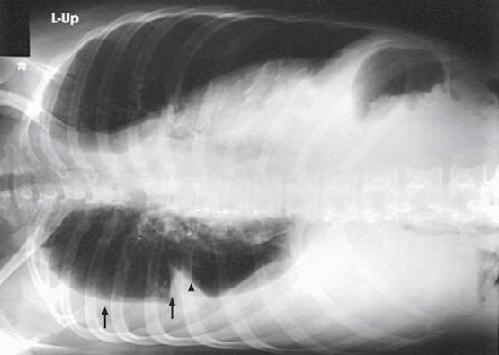
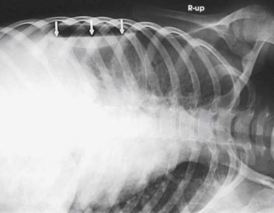
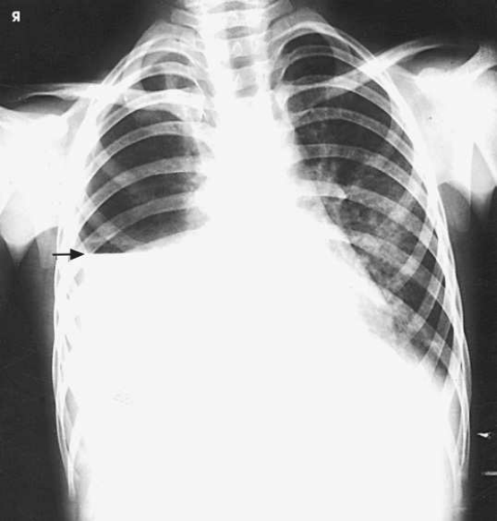

# Rx Torace — AP or Incidență Postero-Anterioară (PA) a — R or L Decubit Lateral Poziționare (Merrill)

  📷 Radiografie Convențională (Rx)
  <strong>Actualizat:</strong> 2026-09-16
  <strong>Autor:</strong> Referință Merrill

---

-   __1. Rezumat Clinic & Indicații__

    ---

    === "Indicații Clinice"

        - Conform reperelor anatomice standard din tratat

    === "Ghid Național IRIS"

        !!! info "Referință Primară: Ghidul Național IRIS (Ordinul MS 1342/2012)"
            - **Capitol Ghid IRIS:** *Ghidul Național IRIS*
            - **Grad de Recomandare:** **De verificat pe indicație; fără grad atribuit automat**
            - **Nivel de Iradiere Estimată:** `De verificat pentru examinarea și populația selectate`

            [:octicons-search-16: Deschide Ghidul IRIS](../../iris.md){ .md-button .md-button--primary } [:material-open-in-new: Aplicația Oficială PWA](https://radiologie-pediatrica.ro/iris/){ .md-button target="_blank" rel="noopener" }
-   __2. Poziționare & Centrare Fascicul__

    ---

    - **Poziție Pacient:** se așază pacientul în Incidență Decubit lateral, culcat pe either afected sau unafected side, ca indicated prin existing condition. small amount de lichid în pleural cavity, pleural effusion, este usually best vizualizat cu pacientul culcat pe affected side. cu this positioning, mediastinal shadows și lichid do nu overlap. small amount de aer liber în pleural cavity, Pneumotorax (colaps pulmonar), este generally best vizualizat cu pacientul culcat pe unaffected side. Exercise care la ensure that pacientul does nu fall de cart. If cart este used, lock toate wheels securely în poziție. Achieve best visualization prin allowing pacientul la remain în poziție pentru 5 minutes before expunere. This allows lichid la settle și air la rise.; If pacientul este culcat pe afected side la evidențiază presence de pleural efusion, elevate corp 2 la 3 inches (5 la 7.6 cm) pe suitable platform sau firm pad. se extinde brațe well above capul și se ajustează thorax în true Incidență de Profil (lateral) (Fig. 3.67). Place anterior sau posterior surface de Torace against stativ vertical Bucky. se ajustează receptorul de imagine la place cephalic edge it 1.5 la 2 inches (3.8 la 5 cm) above umerii. se efectuează ecranarea gonadelor cu șorț plumbat.
    - **Punct de Centrare Fascicul:** Horizon̍ al și perpendicular pe centrul receptorului de imagine la level 3 inches (7.6 cm) below incizură jugulară (furculiță sternală) pentru AP și T7 pentru PA.
    - **Distanță Focar-Film (DFF / SID):** Nespecificat în fragmentul extras; de verificat în sursă
    - **Comandă Respiratorie:** Inspir profund complet. expunere este made after second Inspir profund complet la ensure maximum expansion de plămânii.

-   __3. Parametri Tehnici Expunere__

    ---

    | Parametru Tehnic | Valoare Configurare Generator / Tub |
    |:-----------------|:-------------------------------------|
    | **Tensiune Tub (kV)** | DE CONFIGURAT PE APARAT |
    | **Sarcină / Produs Curent-Timp (mAs)** | DE CONFIGURAT PE APARAT |
    | **Distanță Focar-Film (DFF / SID)** | Nespecificat în fragmentul extras; de verificat în sursă |
    | **Grilă Antidifuzoare (Bucky)** | DE CONFIGURAT PE APARAT |
    | **Dimensiune Focar** | DE CONFIGURAT PE APARAT |
    | **Camere de Ionizare AEC** | DE CONFIGURAT PE APARAT |
    | **Colimare Fascicul** | Se ajustează câmpul de iradiere la formatul 35 × 43 cm pe colimator. Place marker de lateralitate (D/S) și decubit marker în collimated expunere field. |
    | **Filtrare Tub** | DE CONFIGURAT PE APARAT |

-   __4. Criterii de Calitate & Reușită Imagine__

    ---

    - Criterii radiologice de calitate imaginii:
    - Evidence de corect collimation și presence de marker de lateralitate (D/S) și decubit marker plasat clear de anatomy de interest
    - Afected side în its entirety, de la apex la sinusuri costodiafragmatice
    - Absența rotației anatomice (simetrie bilaterală perfectă) de pacientul, ca evidențiat prin sternal ends de clavicles echidistant față de coloană vertebrală
    - pacient’s brațe nu vizibil în field de interest
    - Faintly vizibil coloană vertebrală și pulmonary vascular markings de la hilar regions la periphery de plămânii

-   __5. Protecție Radiologică (ALARA)__

    ---

    - Nespecificat în fragmentul extras; de verificat în sursă

!!! note "Observații Clinice & Tehnice"
    Conform reperelor anatomice standard din tratat

### 🖼️ Imagini

<figure class="protocol-image-card" markdown>

<figcaption><strong>Merrill — pagina PDF 199, imaginea 1</strong> — Imagine din fragmentul sursă; asocierea necesită revizie.</figcaption>

</figure>

<figure class="protocol-image-card" markdown>

<figcaption><strong>Merrill — pagina PDF 200, imaginea 2</strong> — Imagine din fragmentul sursă; asocierea necesită revizie.</figcaption>

</figure>

<figure class="protocol-image-card" markdown>

<figcaption><strong>Merrill — pagina PDF 200, imaginea 3</strong> — Imagine din fragmentul sursă; asocierea necesită revizie.</figcaption>

</figure>

<figure class="protocol-image-card" markdown>

<figcaption><strong>Merrill — pagina PDF 201, imaginea 4</strong> — Imagine din fragmentul sursă; asocierea necesită revizie.</figcaption>

</figure>

=== "Ghid Rapid de Execuție"

    1. **Identificarea și verificarea pacientului:** verificare identitate, zonă de examinat, consimțământ conform procedurii și evaluarea posibilității unei sarcini, când este relevantă.
    2. **Pregătire:** îndepărtarea oricăror obiecte radiopace (bijuterii, agrafe, fermoare, proteze, pansamente dense).
    3. **Poziționare precisă:** alinierea receptorului de imagine și a tubului la distanța prescrisă (Nespecificat în fragmentul extras; de verificat în sursă).
    4. **Colimare strictă:** adaptarea fasciculului strict la regiunea de diagnostic pentru scăderea iradierii și reducerea radiației difuze.
    5. **Radioprotecție:** verificarea [politicii RX](../radioprotectie.md), cu măsuri distincte pentru pacient, personal și însoțitor.

## Surse de documentare

- [Merrill’s Atlas, 3. Thoracic Viscera: Chest and Upper Airway, pagini PDF 198–201](../../assets/protocols/sources/a56d45c16829_Merrills_Atlas_of_Radiographic_Positioning__Procedures_3Vol_Set.pdf#page=198)

## Fragmente sursă traduse (referință tehnică)

### anatomy

AP sau PA incidență obtained using lateral decubit poziție shows change în lichid poziție și reveals orice previously obscured
pulmonary areas sau, în case de suspected Pneumotorax (colaps pulmonar), presence de orice aer liber (Figs. 3.68 through 3.70).

### collimation

• Se ajustează câmpul de iradiere la formatul 35 × 43 cm pe colimator. Place marker de lateralitate (D/S) și decubit marker în collimated
expunere field.

### cr

• Horizon̍ al și perpendicular pe centrul receptorului de imagine la level 3 inches (7.6 cm) below incizură jugulară (furculiță sternală) pentru AP și T7 pentru PA.

### criteria

Criterii radiologice de calitate imaginii:
• Evidence de corect collimation și presence de marker de lateralitate (D/S) și decubit marker plasat clear de anatomy de interest
• Afected side în its entirety, de la apex la sinusuri costodiafragmatice
• Absența rotației anatomice (simetrie bilaterală perfectă) de pacientul, ca evidențiat prin sternal ends de clavicles echidistant față de coloană vertebrală
• pacient’s brațe nu vizibil în field de interest
• Faintly vizibil coloană vertebrală și pulmonary vascular markings de la hilar regions la periphery de plămânii

### part_pos

• If pacientul este culcat pe afected side la evidențiază presence de pleural efusion, elevate corp 2 la 3 inches (5 la 7.6 cm) pe suitable platform sau firm pad.
• se extinde brațe well above capul și se ajustează thorax în true poziție de profil (lateral) (Fig. 3.67).
• Place anterior sau posterior surface de toracele against stativ vertical Bucky.
• se ajustează receptorul de imagine la place cephalic edge it 1.5 la 2 inches (3.8 la 5 cm) above umerii.
• se efectuează ecranarea gonadelor cu șorț plumbat.

### patient_pos

• se așază pacientul în lateral decubit poziție, culcat pe either afected sau unafected side, ca indicated prin existing
condition. small amount de lichid în pleural cavity, pleural effusion, este usually best vizualizat cu pacientul culcat pe affected
side. cu this positioning, mediastinal shadows și lichid do nu overlap. small amount de aer liber în pleural cavity, Pneumotorax (colaps pulmonar), este generally best vizualizat cu pacientul culcat pe unaffected side.
• Exercise care la ensure that pacientul does nu fall de cart. If cart este used, lock toate wheels securely în poziție.
• Achieve best visualization prin allowing pacientul la remain în poziție pentru 5 minutes before expunere. This allows lichid la
settle și air la rise.

### respiration

Inspir profund complet. expunere este made after second Inspir profund complet la ensure maximum expansion de plămânii.

### tech

poziționat prin manufacturer sau department protocol pentru corect anatomy display orientation; raza centrală plate: 14 × 17 inches (35 ×
43 cm) longitudinal.

