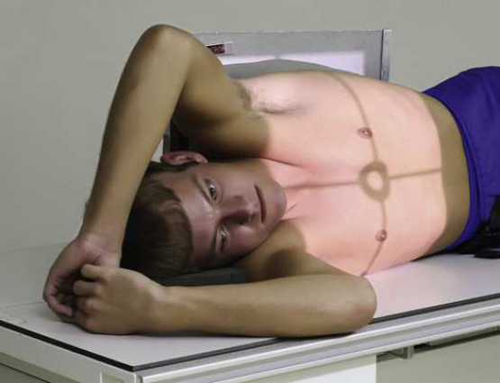
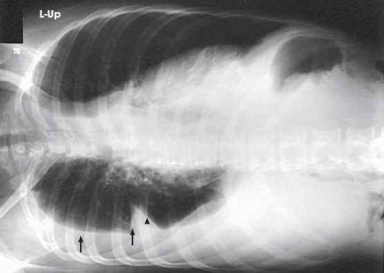
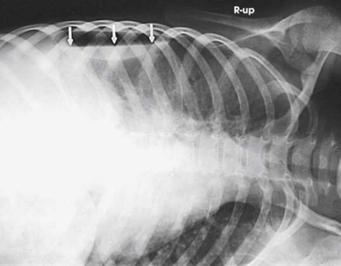
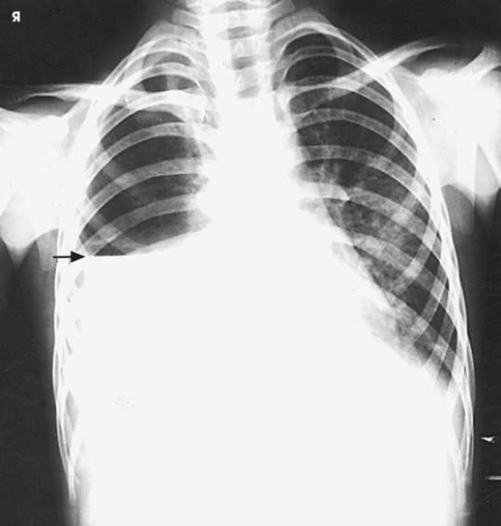

# Rx torace — incidență AP sau postero-anterioară (PA), varianta a — poziții în decubit lateral drept (R) sau stâng (L) (Merrill)

  📷 Radiografie Convențională (Rx)
  <strong>Actualizat:</strong> 2026-09-16
  <strong>Autor:</strong> Referință Merrill

---

-   __1. Rezumat Clinic & Indicații__

    ---

    === "Indicații Clinice"

        - Conform reperelor anatomice standard din tratat

    === "Ghid Național IRIS"

        !!! info "Referință Primară: Ghidul Național IRIS (Ordinul MS 1342/2012)"
            - **Capitol Ghid IRIS:** *Torace & Pulmon*
            - **Grad de Recomandare:** **Grad A**
            - **Nivel de Iradiere Estimată:** `Clasa 1 (Minimă < 0.1 mSv)`

            [:octicons-search-16: Deschide Ghidul IRIS](../../iris.md){ .md-button .md-button--primary } [:material-open-in-new: Aplicația Oficială PWA](https://radiologie-pediatrica.ro/iris/){ .md-button target="_blank" rel="noopener" }

-   __2. Poziționare & Centrare Fascicul__

    ---

    - **Poziție Pacient:** Se așază pacientul în decubit lateral, culcat pe partea afectată sau neafectată, după cum indică afecțiunea existentă. O cantitate mică de lichid în cavitatea pleurală, revărsatul pleural, este de obicei cel mai bine vizualizată cu pacientul culcat pe partea afectată. Cu această poziționare, umbrele mediastinale și lichidul nu se suprapun. O cantitate mică de aer liber în cavitatea pleurală, pneumotoraxul (colaps pulmonar), este în general cel mai bine vizualizată cu pacientul culcat pe partea neafectată. Se acordă atenție pentru a se asigura că pacientul nu cade de pe cărucior. Dacă se utilizează un cărucior, se blochează ferm toate roțile. Cea mai bună vizualizare se obține permițând pacientului să rămână în poziție timp de 5 minutes înainte de expunere. Aceasta permite lichidului să se așeze și aerului să se ridice.; Dacă pacientul este culcat pe partea afectată pentru a evidenția prezența revărsatului pleural, se ridică trunchiul cu 2 la 3 țoli (5 la 7.6 cm) pe o platformă adecvată sau pe un suport ferm. Se extind brațele mult deasupra capului și se ajustează toracele în adevărata incidență de profil (laterală) (Fig. 3.67). Se plasează suprafața anterioară sau posterioară a toracelui pe stativul vertical Bucky. Se ajustează receptorul de imagine astfel încât marginea sa cefalică să fie la 1.5 la 2 țoli (3.8 la 5 cm) deasupra umerilor. Se efectuează ecranarea gonadelor cu șorț plumbat.
    - **Punct de Centrare Fascicul:** Orizontal și perpendicular pe centrul receptorului de imagine la nivelul de 3 țoli (7.6 cm) sub incizura jugulară (furculița sternală) pentru AP și la T7 pentru PA.
    - **Distanță Focar-Film (DFF / SID):** Nespecificat în fragmentul extras; de verificat în sursă
    - **Comandă Respiratorie:** Inspir profund complet. Expunerea se efectuează după al doilea inspir profund complet pentru a asigura expansiunea maximă a plămânilor.

-   __3. Parametri Tehnici Expunere__

    ---

    | Parametru Tehnic | Valoare Configurare Generator / Tub |
    |:-----------------|:-------------------------------------|
    | **Tensiune Tub (kV)** | DE CONFIGURAT PE APARAT |
    | **Sarcină / Produs Curent-Timp (mAs)** | DE CONFIGURAT PE APARAT |
    | **Distanță Focar-Film (DFF / SID)** | Nespecificat în fragmentul extras; de verificat în sursă |
    | **Grilă Antidifuzoare (Bucky)** | DE CONFIGURAT PE APARAT |
    | **Dimensiune Focar** | DE CONFIGURAT PE APARAT |
    | **Camere de Ionizare AEC** | DE CONFIGURAT PE APARAT |
    | **Colimare Fascicul** | Se ajustează câmpul de iradiere la formatul 35 × 43 cm pe colimator. Se plasează markerul de lateralitate (D/S) și markerul de decubit în câmpul de expunere colimat. |
    | **Filtrare Tub** | DE CONFIGURAT PE APARAT |

-   __4. Criterii de Calitate & Reușită Imagine__

    ---

    - Criterii radiologice de calitate a imaginii:
    - Dovada colimării corecte și prezența markerului de lateralitate (D/S) și a markerului de decubit, plasate clar față de anatomia de interes
    - Partea afectată în întregime, de la apex până la sinusurile costodiafragmatice
    - Absența rotației anatomice (simetrie bilaterală perfectă) a pacientului, evidențiată prin poziționarea echidistantă a extremităților sternale ale claviculelor față de coloana vertebrală
    - Brațele pacientului nu sunt vizibile în câmpul de interes
    - Coloana vertebrală abia vizibilă și desenul vascular pulmonar de la regiunile hilare până la periferia plămânilor

-   __5. Protecție Radiologică (ALARA)__

    ---

    - Nespecificat în fragmentul extras; de verificat în sursă

!!! note "Observații Clinice & Tehnice"
    Conform reperelor anatomice standard din tratat

### 🖼️ Imagini

<figure class="protocol-image-card" markdown>

<figcaption><strong>Merrill — pagina 199, imaginea 1</strong> — Imagine din fragmentul sursă; asocierea necesită revizie.</figcaption>

</figure>

<figure class="protocol-image-card" markdown>

<figcaption><strong>Merrill — pagina 200, imaginea 2</strong> — Imagine din fragmentul sursă; asocierea necesită revizie.</figcaption>

</figure>

<figure class="protocol-image-card" markdown>

<figcaption><strong>Merrill — pagina 200, imaginea 3</strong> — Imagine din fragmentul sursă; asocierea necesită revizie.</figcaption>

</figure>

<figure class="protocol-image-card" markdown>

<figcaption><strong>Merrill — pagina 201, imaginea 4</strong> — Imagine din fragmentul sursă; asocierea necesită revizie.</figcaption>

</figure>

=== "Ghid Rapid de Execuție"

    1. **Identificarea și verificarea pacientului:** verificare identitate, zonă de examinat, consimțământ conform procedurii și evaluarea posibilității unei sarcini, când este relevantă.
    2. **Pregătire:** îndepărtarea oricăror obiecte radiopace (bijuterii, agrafe, fermoare, proteze, pansamente dense).
    3. **Poziționare precisă:** alinierea receptorului de imagine și a tubului la distanța prescrisă (Nespecificat în fragmentul extras; de verificat în sursă).
    4. **Colimare strictă:** adaptarea fasciculului strict la regiunea de diagnostic pentru scăderea iradierii și reducerea radiației difuze.
    5. **Radioprotecție:** verificarea [politicii RX](../radioprotectie.md), cu măsuri distincte pentru pacient, personal și însoțitor.

## Surse de documentare

- [Merrill’s Atlas, 3. Thoracic Viscera: Chest and Upper Airway, pagini 198–201](https://books.google.com/books/about/Merrill_s_Atlas_of_Radiographic_Position.html?id=BM0lEQAAQBAJ)
