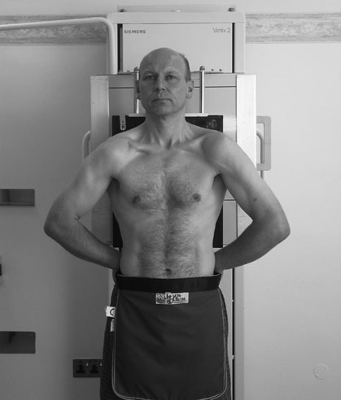
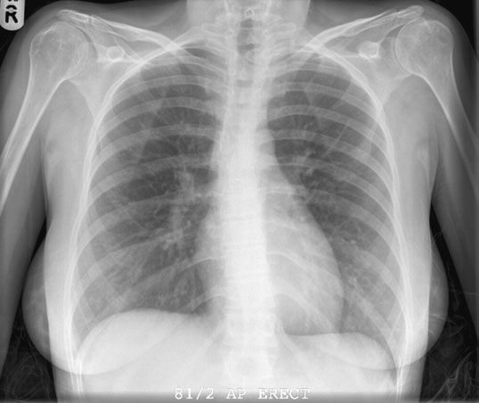
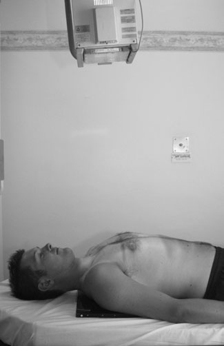
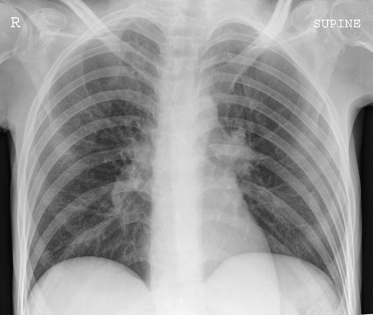

# Rx Torace (Câmpuri Pulmonare) Antero-Posterior (AP) - Ortostatism

  📷 Radiografie Convențională (Rx)
  <strong>Actualizat:</strong> 2026-09-16
  <strong>Autor:</strong> Departamentul de Radiologie / Referință Clark (Ed. 12)

---

-   __1. Rezumat Clinic & Indicații__

    ---

    === "Indicații Clinice"

        - This incidență moves Cord și Siluetă Cardiovasculară away de la film radiologic plane, increasing magnification și reducing accuracy de assessment de Cord și Siluetă Cardiovasculară size (în this incidență, cardiothoracic ratio (CRT) de greater than 50% does nu necessarily indicate cardiomegaly).
        - Compared cu Postero-anterior (PA) incidență, this incidență moves Cord și Siluetă Cardiovasculară away de la receptorul de imagine plane, increasing magnification și reducing accuracy de assessment de Cord și Siluetă Cardiovasculară size (în this incidență, CTR de greater than 50% does nu necessarily indicate cardiomegaly).
        - normal biomechanics de blood flow sunt different de la those în Ortostatism poziție, producing relative prominence de upper-lobe vessels și mimicking signs de Cord și Siluetă Cardiovasculară failure.
        - Pleural lichid will layer pe / sprijinit de posterior chest perete, producing ill-defined increase attenuation de affected hemithorax rather than usual blunting de sinusuri costodiafragmatice; nivele hidroaerice sunt nu seen.
        - pneumotorax, if present, will fie located la front de toracele în Decubit dorsal poziție. Unless it este large, it will fie more difficult la detect if Profil (lateral) Fascicul Orizontal imagine este nu employed. Normal Decubit dorsal radiografie de Torace

    === "Ghid Național IRIS"

        !!! info "Referință Primară: Ghidul Național IRIS (Ordinul MS 1342/2012)"
            - **Capitol Ghid IRIS:** *Ghidul Național IRIS*
            - **Grad de Recomandare:** **De verificat pe indicație; fără grad atribuit automat**
            - **Nivel de Iradiere Estimată:** `De verificat pentru examinarea și populația selectate`

            [:octicons-search-16: Deschide Ghidul IRIS](../../iris.md){ .md-button .md-button--primary } [:material-open-in-new: Aplicația Oficială PWA](https://radiologie-pediatrica.ro/iris/){ .md-button target="_blank" rel="noopener" }
-   __2. Poziționare & Centrare Fascicul__

    ---

    - **Poziție Pacient:** • pacientul poate fie în ortostatism sau Poziție Șezândă cu their back sprijinit pe casetă, which este sprijinit vertically cu upper edge de caseta above lung Vârfuri Pulmonare (Apexuri).
• planul mediosagital este ajustat la drept-angles la middle de caseta.
• umerii sunt brought downward și forward, cu backs de mâinile below șoldurile și coate well forward, which has effect de projecting scapulae clear de câmpuri pulmonare.
• în unwell pacient, it poate nu fie possible la perform this procedure, cu result that scapulae poate fie rotit și superimposed pe Profil (lateral) chest margins. This causes increase în radiation absorption, making it difficulty la observe underlying lung tissue. în this situation, it este preferable that pacientul’s brațe sunt rotit laterally și sprijinit cu palms de mâinile facing forward. în this poziție, scapulae sunt superimposed pe Torace (Câmpuri Pulmonare) but effect de absorption este less, și comparison de either side de upper Profil (lateral) segments de lung este made easier.

• cu assistance, casetă este carefully poziționat under pacientul’s chest cu upper edge de caseta above lung Vârfuri Pulmonare (Apexuri).
• planul mediosagital este ajustat la drept-angles la middle de caseta, și pacientul’s Bazin (bazin (pelvis)) este checked la ensure that it este nu rotit.
• brațele sunt rotit laterally și sprijinit prin side de trunk. capul este sprijinit pe pillow, cu bărbia slightly raised.
    - **Punct de Centrare Fascicul:** • orizontal ray este orientat first la drept-angles la caseta și spre incizură jugulară (furculiță sternală).
• raza centrală este then înclinat until it este coincident cu middle de caseta. This has effect de confining câmp de iradiere la film radiologic, thus avoiding unnecessary expunere de eyes.
• expunere este taken pe normal inspir profund complet.

• raza centrală este orientat first la drept-angles și spre incizură jugulară (furculiță sternală).
• raza centrală este then înclinat until it este coincident cu middle de film radiologic, thus avoiding unnecessary expunere la eyes.
    - **Distanță Focar-Film (DFF / SID):** 100 cm
    - **Comandă Respiratorie:** Apnee pe durata expunerii (apnee în inspir pentru torace; expir pentru Abdomen/bazin).

-   __3. Parametri Tehnici Expunere__

    ---

    | Parametru Tehnic | Valoare Configurare Generator / Tub |
    |:-----------------|:-------------------------------------|
    | **Tensiune Tub (kV)** | DE CONFIGURAT PE APARAT |
    | **Sarcină / Produs Curent-Timp (mAs)** | Conform AEC / grosime anatomică |
    | **Distanță Focar-Film (DFF / SID)** | 100 cm |
    | **Grilă Antidifuzoare (Bucky)** | Conform grosimii anatomice (> 10-12 cm cu grilă) |
    | **Dimensiune Focar** | Focar Mic (0.6 mm) |
    | **Camere de Ionizare AEC** | DE CONFIGURAT PE APARAT |
    | **Colimare Fascicul** | Colimare strictă la aria anatomică de interes diagnostic |
    | **Filtrare Tub** | Totală ≥ 2.5 mm Al echivalent (conform Clark: 3.0 mm Al eq.) |

-   __4. Criterii de Calitate & Reușită Imagine__

    ---

    - Vizualizarea clară întregii arii anatomice (Torace (Câmpuri Pulmonare)).
    - Absența artefactelor de mișcare; trabeculație osoasă și contururi nete.
    - Densitate optică și contrast adecvate pentru diferențierea țesuturilor moi de structurile osoase.

-   __5. Protecție Radiologică (ALARA)__

    ---

    - Ecranare gonadică cu șorț plumbat dacă gonadele sunt în apropierea fasciculului util (regula ALARA).
    - Colimare precisă la dimensiunea anatomică strict necesară pentru reducerea dozei și a radiației difuze.
    - Verificarea posibilității unei sarcini la pacientele de vârstă fertilă înainte de expunere.

!!! note "Observații Clinice & Tehnice"
    • use de lower centring point combined cu Fascicul Orizontal has undesirable effect de projecting clavicles above Vârfuri Pulmonare (Apexuri) de Torace (Câmpuri Pulmonare).
• radiografie opposite este de similar appearance la that de Postero-anterior (PA) chest radiografie described pe p. 206.
However, this incidență este valuable în elucidation de relative poziții de opacities seen pe Postero-anterior (PA) incidență.
• Small lesions previously obscured prin rib poate also fie evidențiat.
208 Normal Antero-posterior (AP) radiografie de Torace

• expunere este taken pe full normal inspiration.
• FFD de la least 120 cm este essential la reduce unequal magnification de intra-thoracic structures.
• în this incidență, maximum lung demonstration este lost due la absence de gravity effect de abdominal organs, which este present în Ortostatism poziție.
• imagini de heavy breasts sunt nu readily diffused.

### 🖼️ Imagini

<figure class="protocol-image-card" markdown>

<figcaption><strong>• expunere este taken pe normal inspir profund complet.</strong> — Poziționare pacient și centrare fascicul conform Clark (Ed. 12)</figcaption>

</figure>

<figure class="protocol-image-card" markdown>

<figcaption><strong>• radiografie opposite este de similar appearance la that de</strong> — Aspect radiografic / ghid de poziționare conform tratatului Clark (Ed. 12)</figcaption>

</figure>

<figure class="protocol-image-card" markdown>

<figcaption><strong>• expunere este taken pe full normal inspiration.</strong> — Aspect radiografic / ghid de poziționare conform tratatului Clark (Ed. 12)</figcaption>

</figure>

<figure class="protocol-image-card" markdown>

<figcaption><strong>• normal biomechanics de blood flow sunt different de la</strong> — Aspect radiografic / ghid de poziționare conform tratatului Clark (Ed. 12)</figcaption>

</figure>

=== "Ghid Rapid de Execuție"

    1. **Identificarea și verificarea pacientului:** verificare identitate, zonă de examinat, consimțământ conform procedurii și evaluarea posibilității unei sarcini, când este relevantă.
    2. **Pregătire:** îndepărtarea oricăror obiecte radiopace (bijuterii, agrafe, fermoare, proteze, pansamente dense).
    3. **Poziționare precisă:** alinierea receptorului de imagine și a tubului la distanța prescrisă (100 cm).
    4. **Colimare strictă:** adaptarea fasciculului strict la regiunea de diagnostic pentru scăderea iradierii și reducerea radiației difuze.
    5. **Radioprotecție:** verificarea [politicii RX](../radioprotectie.md), cu măsuri distincte pentru pacient, personal și însoțitor.

## Surse de documentare

- [Clark's Positioning in Radiography (Ed. 12), Pagina 223](../../assets/protocols/sources/Clark___Positioning_in_Radiography__12th_edition.pdf#page=223)
