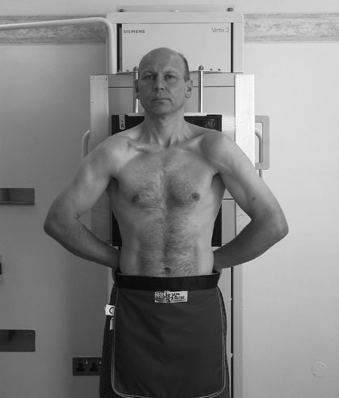
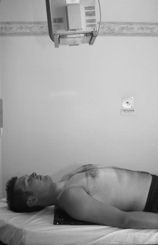

# Radiografie toracică (câmpuri pulmonare) antero-posterioară (AP) — ortostatism

  📷 Radiografie Convențională (Rx)
  <strong>Actualizat:</strong> 2026-09-16
  <strong>Autor:</strong> Departamentul de Radiologie / Referință Clark (Ed. 12)

---

-   __1. Rezumat Clinic & Indicații__

    ---

    === "Indicații Clinice"

        - Această incidență îndepărtează cordul și silueta cardiovasculară de planul filmului radiologic, crescând magnificația și reducând exactitatea evaluării dimensiunii cordului și a siluetei cardiovasculare (în această incidență, un raport cardiotoracic (CRT) mai mare de 50% nu indică neapărat cardiomegalie).
        - Comparativ cu incidența postero-anterioară (PA), această incidență îndepărtează cordul și silueta cardiovasculară de planul receptorului de imagine, crescând magnificația și reducând exactitatea evaluării dimensiunii cordului și a siluetei cardiovasculare (în această incidență, un CTR mai mare de 50% nu indică neapărat cardiomegalie).
        - Biomecanica normală a fluxului sanguin este diferită de cea din poziția în ortostatism, producând o proeminență relativă a vaselor lobului superior și imitând semnele insuficienței cardiace și ale siluetei cardiovasculare.
        - Lichidul pleural se va dispune de-a lungul / se va sprijini pe peretele toracic posterior, producând o creștere slab delimitată a atenuării hemitoracelui afectat, mai degrabă decât obliterarea obișnuită a sinusurilor costodiafragmatice; nivelurile hidroaerice nu sunt vizibile.
        - Pneumotoraxul, dacă este prezent, va fi localizat anterior în torace în decubit dorsal. Dacă nu este mare, va fi mai dificil de detectat dacă nu se utilizează o imagine de profil cu fascicul orizontal. Radiografie normală de torace în decubit dorsal

    === "Ghid Național IRIS"

        !!! info "Referință Primară: Ghidul Național IRIS (Ordinul MS 1342/2012)"
            - **Capitol Ghid IRIS:** *Torace & Pulmon*
            - **Grad de Recomandare:** **Grad A**
            - **Nivel de Iradiere Estimată:** `Clasa 1 (Minimă < 0.1 mSv)`

            [:octicons-search-16: Deschide Ghidul IRIS](../../iris.md){ .md-button .md-button--primary } [:material-open-in-new: Aplicația Oficială PWA](https://radiologie-pediatrica.ro/iris/){ .md-button target="_blank" rel="noopener" }

-   __2. Poziționare & Centrare Fascicul__

    ---

    - **Poziție Pacient:**
        - Pacientul poate fi în ortostatism sau în poziție șezândă, cu spatele sprijinit pe casetă, care este susținută vertical, cu marginea superioară a casetei deasupra vârfurilor pulmonare (apexurilor).
        - Planul mediosagital este ajustat în unghi drept față de centrul casetei.
        - Umerii sunt coborâți și aduși înainte, cu dosul mâinilor sub șolduri și coatele mult înainte, ceea ce are efectul de a proiecta scapulele în afara câmpurilor pulmonare.
        - La un pacient cu stare generală alterată, este posibil să nu fie posibilă efectuarea acestei proceduri, rezultând rotația scapulelor și suprapunerea lor peste marginile toracice de profil (lateral). Aceasta determină creșterea absorbției radiației, îngreunând observarea țesutului pulmonar subiacent. În această situație, este preferabil ca brațele pacientului să fie rotite lateral și sprijinite, cu palmele orientate înainte. În această poziție, scapulele se suprapun peste torace (câmpurile pulmonare), dar efectul de absorbție este mai redus, iar comparația dintre segmentele superioare de profil (lateral) ale plămânului de fiecare parte este mai ușoară.
        - Cu ajutor, caseta este poziționată cu grijă sub toracele pacientului, cu marginea superioară a casetei deasupra vârfurilor pulmonare (apexurilor).
        - Planul mediosagital este ajustat în unghi drept față de centrul casetei, iar bazinul pacientului este verificat pentru a se asigura că nu este rotit.
        - Brațele sunt rotite lateral și sprijinite pe lângă trunchi. Capul este sprijinit pe o pernă, cu bărbia ușor ridicată.
    - **Punct de Centrare Fascicul:**
        - Fasciculul orizontal este orientat inițial în unghi drept față de casetă și către incizura jugulară (furculița sternală).
        - Raza centrală este apoi înclinată până când coincide cu centrul casetei. Aceasta are efectul de a limita câmpul de iradiere la filmul radiologic, evitând astfel expunerea inutilă a ochilor.
        - Expunerea se efectuează în timpul unei inspirații profunde normale.
        - Raza centrală este orientată inițial în unghi drept și către incizura jugulară (furculița sternală).
        - Raza centrală este apoi înclinată până când coincide cu centrul filmului radiologic, evitând astfel expunerea inutilă a ochilor.
    - **Distanță Focar-Film (DFF / SID):** 100 cm
    - **Comandă Respiratorie:** Apnee pe durata expunerii (apnee în inspir pentru torace; expir pentru Abdomen/bazin).

-   __3. Parametri Tehnici Expunere__

    ---

    | Parametru Tehnic | Valoare Configurare Generator / Tub |
    |:-----------------|:-------------------------------------|
    | **Tensiune Tub (kV)** | DE CONFIGURAT PE APARAT |
    | **Sarcină / Produs Curent-Timp (mAs)** | Conform AEC / grosimii anatomice |
    | **Distanță Focar-Film (DFF / SID)** | 100 cm |
    | **Grilă Antidifuzoare (Bucky)** | Conform grosimii anatomice (> 10-12 cm cu grilă) |
    | **Dimensiune Focar** | Focar Mic (0.6 mm) |
    | **Camere de Ionizare AEC** | DE CONFIGURAT PE APARAT |
    | **Colimare Fascicul** | Colimare strictă la aria anatomică de interes diagnostic |
    | **Filtrare Tub** | Totală ≥ 2.5 mm Al echivalent (conform Clark: 3.0 mm Al echivalent) |

-   __4. Criterii de Calitate & Reușită Imagine__

    ---

    - Vizualizarea clară a întregii arii anatomice (toracele (câmpurile pulmonare)).
    - Absența artefactelor de mișcare; trabeculație osoasă și contururi nete.
    - Densitate optică și contrast adecvate pentru diferențierea țesuturilor moi de structurile osoase.

-   __5. Protecție Radiologică (ALARA)__

    ---

    - Ecranare gonadică cu șorț plumbat dacă gonadele sunt în apropierea fasciculului util (regula ALARA).
    - Colimare precisă la dimensiunea anatomică strict necesară pentru reducerea dozei și a radiației difuze.
    - Verificarea posibilității unei sarcini la pacientele de vârstă fertilă înainte de expunere.

!!! note "Observații Clinice & Tehnice"
    - Utilizarea unui punct de centrare inferior, combinată cu fasciculul orizontal, are efectul nedorit de a proiecta claviculele deasupra vârfurilor pulmonare (apexurilor) toracelui (câmpurilor pulmonare).
    - Radiografia opusă are un aspect similar celui al radiografiei toracice postero-anterioare (PA) descrise la p. 206. Totuși, această incidență este valoroasă pentru elucidarea pozițiilor relative ale opacităților observate în incidența postero-anterioară (PA).
    - Leziunile mici, anterior obscure din cauza unei coaste, pot fi de asemenea evidențiate. 208 Radiografie toracică antero-posterioară (AP) normală
    - Expunerea se efectuează în timpul unei inspirații profunde normale complete.
    - FFD de cel puțin 120 cm este esențial pentru reducerea magnificației inegale a structurilor intratoracice.
    - În această incidență, demonstrarea maximă a plămânilor este pierdută din cauza absenței efectului gravitației asupra organelor abdominale, prezent în poziția în ortostatism.
    - Imaginile obținute prin sâni voluminoși nu sunt difuzate cu ușurință.

### 🖼️ Imagini

<figure class="protocol-image-card" markdown>

<figcaption><strong>• Expunerea se efectuează în inspir profund complet, normal.</strong> — Poziționarea pacientului și centrarea fasciculului conform Clark (Ed. 12)</figcaption>

</figure>

<figure class="protocol-image-card" markdown>

![• Radiografia alăturată are un aspect similar cu cea de [fragment incomplet în sursă].](../../assets/images/protocols/clark/rx-torace-campuri-pulmonare-antero-posterior-ortostatism-p223-clark/fig_2.jpeg)

<figcaption><strong>• Radiografia alăturată are un aspect similar cu cea de [fragment incomplet în sursă].</strong> — Aspect radiografic / ghid de poziționare conform tratatului Clark (Ed. 12)</figcaption>

</figure>

<figure class="protocol-image-card" markdown>

<figcaption><strong>• Expunerea se efectuează în inspir complet normal.</strong> — Aspect radiografic / ghid de poziționare conform tratatului Clark (Ed. 12)</figcaption>

</figure>

<figure class="protocol-image-card" markdown>

![• Biomecanica normală a fluxului sanguin este diferită față de [fragment incomplet în sursă].](../../assets/images/protocols/clark/rx-torace-campuri-pulmonare-antero-posterior-ortostatism-p223-clark/fig_4.jpeg)

<figcaption><strong>• Biomecanica normală a fluxului sanguin este diferită față de [fragment incomplet în sursă].</strong> — Aspect radiografic / ghid de poziționare conform tratatului Clark (Ed. 12)</figcaption>

</figure>

=== "Ghid Rapid de Execuție"

    1. **Identificarea și verificarea pacientului:** verificare identitate, zonă de examinat, consimțământ conform procedurii și evaluarea posibilității unei sarcini, când este relevantă.
    2. **Pregătire:** îndepărtarea oricăror obiecte radiopace (bijuterii, agrafe, fermoare, proteze, pansamente dense).
    3. **Poziționare precisă:** alinierea receptorului de imagine și a tubului la distanța prescrisă (100 cm).
    4. **Colimare strictă:** adaptarea fasciculului strict la regiunea de diagnostic pentru scăderea iradierii și reducerea radiației difuze.
    5. **Radioprotecție:** verificarea [politicii RX](../radioprotectie.md), cu măsuri distincte pentru pacient, personal și însoțitor.

## Surse de documentare

- [Clark's Positioning in Radiography (Ed. 12), Pagina 223](https://books.google.com/books/about/Clark_s_Positioning_in_Radiography.html?id=Xxu6MwEACAAJ)
