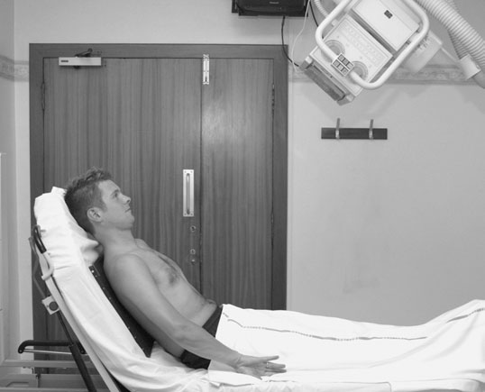
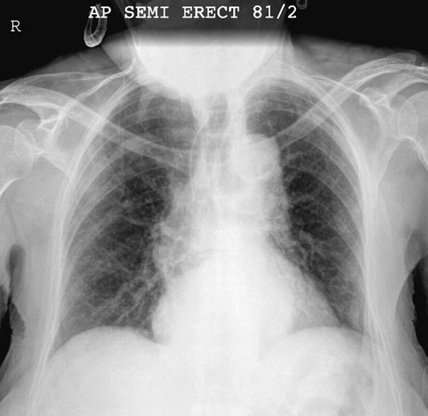
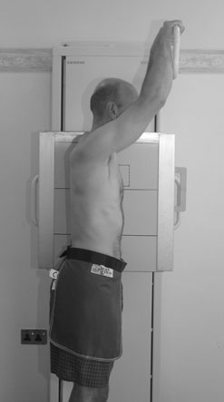
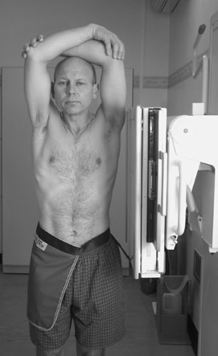
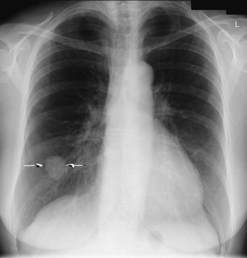
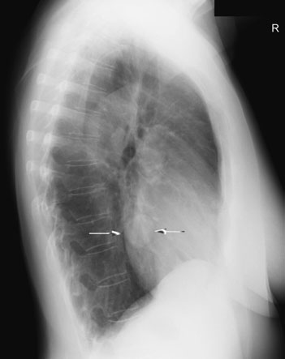

# Rx Torace (Câmpuri Pulmonare) Antero-Posterior (AP) - semi - Ortostatism

  📷 Radiografie Convențională (Rx)
  <strong>Actualizat:</strong> 2026-09-16
  <strong>Autor:</strong> Departamentul de Radiologie / Referință Clark (Ed. 12)

---

-   __1. Rezumat Clinic & Indicații__

    ---

    === "Indicații Clinice"

        - assessment de cardiac configuration la identify individual chamber enlargement este essential, even if there este increase în overall magnification due la shorter FFD associated cu some low-powered mobiles. It este important, therefore, that pacientul este nu rotit. 210 Normal semi-Ortostatism radiografie de Torace. bărbia este just superimposed pe upper Torace (see notes)
        - Insufficient elevation de brațele will cause soft tissues de upper brațe la obscure lung Vârfuri Pulmonare (Apexuri) și thoracic inlet, și even retrosternal window, leading la masses sau other lesions în these areas being missed.
        - rotație will also partially obscure retrosternal window, masking anterior mediastinal masses. It will also render Stern less distinct, which poate fie important în setting de trauma when sternal suspiciune de fractură poate fie overlooked. Postero-anterior (PA) și Profil (lateral) radiografii de same pacient evidențiind proces proliferativ tumoral în drept lower lobe

    === "Ghid Național IRIS"

        !!! info "Referință Primară: Ghidul Național IRIS (Ordinul MS 1342/2012)"
            - **Capitol Ghid IRIS:** *Ghidul Național IRIS*
            - **Grad de Recomandare:** **De verificat pe indicație; fără grad atribuit automat**
            - **Nivel de Iradiere Estimată:** `De verificat pentru examinarea și populația selectate`

            [:octicons-search-16: Deschide Ghidul IRIS](../../iris.md){ .md-button .md-button--primary } [:material-open-in-new: Aplicația Oficială PWA](https://radiologie-pediatrica.ro/iris/){ .md-button target="_blank" rel="noopener" }
-   __2. Poziționare & Centrare Fascicul__

    ---

    - **Poziție Pacient:** • pacientul este sprijinit în Semi-Șezând poziție, facing X-ray tube. grade la which they poate sit Ortostatism will depend pe their medical condition.
• casetă este sprijinit pe / sprijinit de back, using pillows sau large 45-grade foam pad, cu its upper edge above câmpuri pulmonare.
• Care trebuie să fie taken la ensure that caseta este paralel cu plan coronal.
• planul mediosagital este ajustat la drept-angles la, și în linia mediană de, caseta.
• rotație de pacientul este prevented prin use de foam pads.
• brațele sunt rotit medially, cu umerii brought forward la bring scapulae clear de câmpuri pulmonare.

• pacientul este întors la bring side under investigation în contact cu caseta.
• planul mediosagital este ajustat paralel cu casetă.
• brațele sunt folded over capul sau raised above capul la rest pe orizontal bar.
• mid-axillary line este coincident cu middle de film radiologic, și caseta este ajustat pentru include Vârfuri Pulmonare (Apexuri) și lower lobes la level de first lumbar vertebra.
    - **Punct de Centrare Fascicul:** • raza centrală este orientat first la drept-angles la caseta și spre incizură jugulară (furculiță sternală).
• raza centrală este then înclinat until it este coincident cu middle de film radiologic, thus avoiding unnecessary expunere la eyes.

• Direct raza centrală orizontală centrală la drept-angles la middle de caseta la mid-axillary line.
    - **Distanță Focar-Film (DFF / SID):** 100 cm
    - **Comandă Respiratorie:** Apnee pe durata expunerii (apnee în inspir pentru torace; expir pentru Abdomen/bazin).

-   __3. Parametri Tehnici Expunere__

    ---

    | Parametru Tehnic | Valoare Configurare Generator / Tub |
    |:-----------------|:-------------------------------------|
    | **Tensiune Tub (kV)** | DE CONFIGURAT PE APARAT |
    | **Sarcină / Produs Curent-Timp (mAs)** | Conform AEC / grosime anatomică |
    | **Distanță Focar-Film (DFF / SID)** | 100 cm |
    | **Grilă Antidifuzoare (Bucky)** | Conform grosimii anatomice (> 10-12 cm cu grilă) |
    | **Dimensiune Focar** | Focar Mic (0.6 mm) |
    | **Camere de Ionizare AEC** | DE CONFIGURAT PE APARAT |
    | **Colimare Fascicul** | Colimare strictă la aria anatomică de interes diagnostic |
    | **Filtrare Tub** | Totală ≥ 2.5 mm Al echivalent (conform Clark: 3.0 mm Al eq.) |

-   __4. Criterii de Calitate & Reușită Imagine__

    ---

    - Vizualizarea clară întregii arii anatomice (Torace (Câmpuri Pulmonare)).
    - Absența artefactelor de mișcare; trabeculație osoasă și contururi nete.
    - Densitate optică și contrast adecvate pentru diferențierea țesuturilor moi de structurile osoase.

-   __5. Protecție Radiologică (ALARA)__

    ---

    - Ecranare gonadică cu șorț plumbat dacă gonadele sunt în apropierea fasciculului util (regula ALARA).
    - Colimare precisă la dimensiunea anatomică strict necesară pentru reducerea dozei și a radiației difuze.
    - Verificarea posibilității unei sarcini la pacientele de vârstă fertilă înainte de expunere.

!!! note "Observații Clinice & Tehnice"
    • Difficulties sometimes arise în positioning caseta paralel cu plan coronal, cu resultant effect that imagine de toracele este foreshortened.
• use de orizontal raza centrală este essential la evidențiază nivele hidroaerice, e.g. revărsat pleural (pleurezie). în this situation, pacientul este ajustat cu toracele Ortostatism ca much ca possible. raza centrală orizontală centrală este orientat la drept-angles la middle de caseta. clavicles în resultant imagine will fie projected above Vârfuri Pulmonare (Apexuri).
• If pacientul este unable la sit Ortostatism, nivele hidroaerice sunt evidențiat using orizontal ray cu pacientul adopting Profil (lateral) decubit sau dorsal decubit poziție.
• Sick pacienți poate fie unable la support their own cap în Ortostatism poziție, resulting în superimposition de bărbia over upper Torace. Care trebuie să fie taken la avoid sau minimize this if la toate possible ca apical lesions will fie obscured.

### 🖼️ Imagini

<figure class="protocol-image-card" markdown>

<figcaption><strong>Normal semi-Ortostatism radiografie de Torace. bărbia este just superimposed</strong> — Poziționare pacient și centrare fascicul conform Clark (Ed. 12)</figcaption>

</figure>

<figure class="protocol-image-card" markdown>

<figcaption><strong>Figura 2: Aspect radiografic / Poziționare (Clark Ed. 12)</strong> — Aspect radiografic / ghid de poziționare conform tratatului Clark (Ed. 12)</figcaption>

</figure>

<figure class="protocol-image-card" markdown>

<figcaption><strong>Postero-anterior (PA) incidență. Profil (lateral) radiografii, however, sunt</strong> — Aspect radiografic / ghid de poziționare conform tratatului Clark (Ed. 12)</figcaption>

</figure>

<figure class="protocol-image-card" markdown>

<figcaption><strong>de trauma when sternal suspiciune de fractură poate fie overlooked.</strong> — Aspect radiografic / ghid de poziționare conform tratatului Clark (Ed. 12)</figcaption>

</figure>

<figure class="protocol-image-card" markdown>

<figcaption><strong>Postero-anterior (PA) și Profil (lateral) radiografii de same pacient evidențiind proces proliferativ tumoral în</strong> — Aspect radiografic / ghid de poziționare conform tratatului Clark (Ed. 12)</figcaption>

</figure>

<figure class="protocol-image-card" markdown>

<figcaption><strong>Figura 6: Aspect radiografic / Poziționare (Clark Ed. 12)</strong> — Aspect radiografic / ghid de poziționare conform tratatului Clark (Ed. 12)</figcaption>

</figure>

=== "Ghid Rapid de Execuție"

    1. **Identificarea și verificarea pacientului:** verificare identitate, zonă de examinat, consimțământ conform procedurii și evaluarea posibilității unei sarcini, când este relevantă.
    2. **Pregătire:** îndepărtarea oricăror obiecte radiopace (bijuterii, agrafe, fermoare, proteze, pansamente dense).
    3. **Poziționare precisă:** alinierea receptorului de imagine și a tubului la distanța prescrisă (100 cm).
    4. **Colimare strictă:** adaptarea fasciculului strict la regiunea de diagnostic pentru scăderea iradierii și reducerea radiației difuze.
    5. **Radioprotecție:** verificarea [politicii RX](../radioprotectie.md), cu măsuri distincte pentru pacient, personal și însoțitor.

## Surse de documentare

- [Clark's Positioning in Radiography (Ed. 12), Pagina 225](../../assets/protocols/sources/Clark___Positioning_in_Radiography__12th_edition.pdf#page=225)
