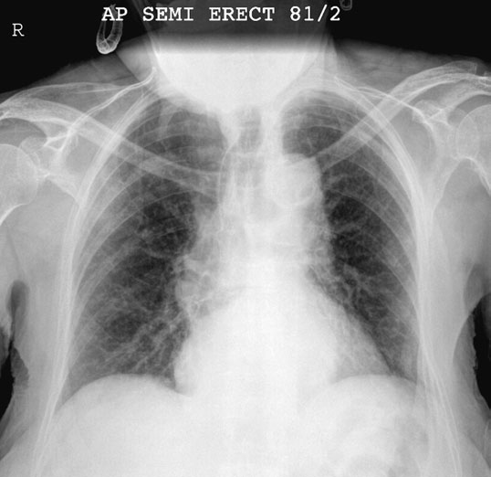
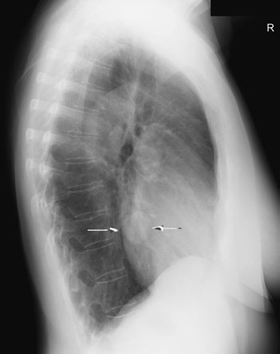

# Radiografie toracică (câmpuri pulmonare) antero-posterioară (AP) — semi-ortostatism

  📷 Radiografie Convențională (Rx)
  <strong>Actualizat:</strong> 2026-09-16
  <strong>Autor:</strong> Departamentul de Radiologie / Referință Clark (Ed. 12)

---

-   __1. Rezumat Clinic & Indicații__

    ---

    === "Indicații Clinice"

        - Evaluarea configurației cardiace pentru identificarea măririi individuale a camerelor este esențială, chiar dacă există o creștere a magnificației globale din cauza FFD mai scurte asociate unor aparate mobile de putere redusă. Prin urmare, este important ca pacientul să nu fie rotit. 210 Radiografie toracică normală în semiortostatism. Bărbia este doar suprapusă peste partea superioară a toracelui (a se vedea notele)
        - Ridicarea insuficientă a brațelor va determina suprapunerea țesuturilor moi ale brațelor superioare peste vârfurile pulmonare și inletul toracic și chiar peste fereastra retrosternală, ceea ce poate duce la omisiunea maselor sau a altor leziuni din aceste zone.
        - Rotația va obscura, de asemenea, parțial fereastra retrosternală, mascând masele mediastinale anterioare. De asemenea, va face sternul mai puțin distinct, ceea ce poate fi important în contextul unui traumatism, când suspiciunea de fractură sternală poate fi omisă. Radiografii postero-anterioară (PA) și de profil (lateral) ale aceluiași pacient, evidențiind un proces proliferativ tumoral în lobul inferior drept

    === "Ghid Național IRIS"

        !!! info "Referință Primară: Ghidul Național IRIS (Ordinul MS 1342/2012)"
            - **Capitol Ghid IRIS:** *Torace & Pulmon*
            - **Grad de Recomandare:** **Grad A**
            - **Nivel de Iradiere Estimată:** `Clasa 1 (Minimă < 0.1 mSv)`

            [:octicons-search-16: Deschide Ghidul IRIS](../../iris.md){ .md-button .md-button--primary } [:material-open-in-new: Aplicația Oficială PWA](https://radiologie-pediatrica.ro/iris/){ .md-button target="_blank" rel="noopener" }

-   __2. Poziționare & Centrare Fascicul__

    ---

    - **Poziție Pacient:**
        - pacientul este sprijinit în poziție semișezândă, cu fața către tubul de raze X. Gradul în care poate sta în ortostatism va depinde de starea sa medicală.
        - caseta este sprijinită de spate, folosind perne sau un suport mare din spumă de 45 de grade, cu marginea superioară deasupra câmpurilor pulmonare.
        - Trebuie să se aibă grijă ca caseta să fie paralelă cu planul coronal.
        - planul mediosagital este ajustat perpendicular pe casetă și pe linia mediană a acesteia.
        - rotația pacientului este prevenită prin utilizarea unor suporturi din spumă.
        - brațele sunt rotite medial, iar umerii sunt aduși anterior pentru a îndepărta omoplații de câmpurile pulmonare.
        - pacientul este întors pentru a aduce partea examinată în contact cu caseta.
        - planul mediosagital este ajustat paralel cu caseta.
        - brațele sunt pliate peste cap sau ridicate deasupra capului pentru a se sprijini pe bara orizontală.
        - linia medioaxilară coincide cu mijlocul filmului radiologic, iar caseta este ajustată pentru a include vârfurile pulmonare (apexurile) și lobii inferiori până la nivelul primei vertebre lombare.
    - **Punct de Centrare Fascicul:**
        - Raza centrală este orientată inițial în unghi drept față de casetă și către incizura jugulară (furculița sternală).
        - Raza centrală este apoi înclinată până când coincide cu centrul filmului radiologic, evitând astfel expunerea inutilă a ochilor.
        - Se direcționează raza centrală orizontală în unghi drept către centrul casetei, la linia medioaxilară.
    - **Distanță Focar-Film (DFF / SID):** 100 cm
    - **Comandă Respiratorie:** Apnee pe durata expunerii (apnee în inspir pentru torace; expir pentru Abdomen/bazin).

-   __3. Parametri Tehnici Expunere__

    ---

    | Parametru Tehnic | Valoare Configurare Generator / Tub |
    |:-----------------|:-------------------------------------|
    | **Tensiune Tub (kV)** | DE CONFIGURAT PE APARAT |
    | **Sarcină / Produs Curent-Timp (mAs)** | Conform AEC / grosimii anatomice |
    | **Distanță Focar-Film (DFF / SID)** | 100 cm |
    | **Grilă Antidifuzoare (Bucky)** | Conform grosimii anatomice (> 10-12 cm cu grilă) |
    | **Dimensiune Focar** | Focar Mic (0.6 mm) |
    | **Camere de Ionizare AEC** | DE CONFIGURAT PE APARAT |
    | **Colimare Fascicul** | Colimare strictă la aria anatomică de interes diagnostic |
    | **Filtrare Tub** | Totală ≥ 2.5 mm Al echivalent (conform Clark: 3.0 mm Al echivalent) |

-   __4. Criterii de Calitate & Reușită Imagine__

    ---

    - Vizualizarea clară a întregii arii anatomice (toracele (câmpurile pulmonare)).
    - Absența artefactelor de mișcare; trabeculație osoasă și contururi nete.
    - Densitate optică și contrast adecvate pentru diferențierea țesuturilor moi de structurile osoase.

-   __5. Protecție Radiologică (ALARA)__

    ---

    - Ecranare gonadică cu șorț plumbat dacă gonadele sunt în apropierea fasciculului util (regula ALARA).
    - Colimare precisă la dimensiunea anatomică strict necesară pentru reducerea dozei și a radiației difuze.
    - Verificarea posibilității unei sarcini la pacientele de vârstă fertilă înainte de expunere.

!!! note "Observații Clinice & Tehnice"
    - Uneori apar dificultăți în poziționarea casetei paralel cu planul coronal, cu efectul rezultat că imaginea toracelui este scurtată.
    - Utilizarea razei centrale orizontale este esențială pentru evidențierea nivelurilor hidroaerice, de exemplu revărsatul pleural (pleurezia). În această situație, pacientul este poziționat cu toracele în ortostatism cât mai mult posibil. Raza centrală orizontală este orientată în unghi drept către centrul casetei. Claviculele din imaginea rezultată vor fi proiectate deasupra vârfurilor pulmonare (apexurilor).
    - Dacă pacientul nu poate sta în ortostatism, nivelurile hidroaerice sunt evidențiate utilizând fasciculul orizontal, cu pacientul adoptând poziția de decubit lateral sau decubit dorsal.
    - Pacienții bolnavi pot fi incapabili să își susțină capul în poziție ortostatică, rezultând suprapunerea bărbiei peste partea superioară a toracelui. Trebuie acordată atenție pentru a evita sau minimiza acest lucru, dacă este posibil, deoarece leziunile apicale vor fi obscure.

### 🖼️ Imagini

<figure class="protocol-image-card" markdown>

![Radiografie toracică normală în semi-ortostatism. Bărbia este ușor suprapusă [fragment incomplet în sursă].](../../assets/images/protocols/clark/rx-torace-campuri-pulmonare-antero-posterior-semi-ortostatism-p225-clark/fig_1.jpeg)

<figcaption><strong>Radiografie toracică normală în semi-ortostatism. Bărbia este ușor suprapusă [fragment incomplet în sursă].</strong> — Poziționarea pacientului și centrarea fasciculului conform Clark (Ed. 12)</figcaption>

</figure>

<figure class="protocol-image-card" markdown>

<figcaption><strong>Figura 2: Aspect radiografic / Poziționare (Clark Ed. 12)</strong> — Aspect radiografic / ghid de poziționare conform tratatului Clark (Ed. 12)</figcaption>

</figure>

<figure class="protocol-image-card" markdown>

![Incidență postero-anterioară (PA). Radiografiile de profil, însă, sunt [fragment incomplet în sursă].](../../assets/images/protocols/clark/rx-torace-campuri-pulmonare-antero-posterior-semi-ortostatism-p225-clark/fig_3.jpeg)

<figcaption><strong>Incidență postero-anterioară (PA). Radiografiile de profil, însă, sunt [fragment incomplet în sursă].</strong> — Aspect radiografic / ghid de poziționare conform tratatului Clark (Ed. 12)</figcaption>

</figure>

<figure class="protocol-image-card" markdown>

![[Fragment incomplet în sursă] în traumatisme, când suspiciunea unei fracturi sternale poate fi trecută cu vederea.](../../assets/images/protocols/clark/rx-torace-campuri-pulmonare-antero-posterior-semi-ortostatism-p225-clark/fig_4.jpeg)

<figcaption><strong>[Fragment incomplet în sursă] în traumatisme, când suspiciunea unei fracturi sternale poate fi trecută cu vederea.</strong> — Aspect radiografic / ghid de poziționare conform tratatului Clark (Ed. 12)</figcaption>

</figure>

<figure class="protocol-image-card" markdown>

![Radiografii postero-anterioară (PA) și de profil ale aceluiași pacient, evidențiind un proces proliferativ tumoral în [fragment incomplet în sursă].](../../assets/images/protocols/clark/rx-torace-campuri-pulmonare-antero-posterior-semi-ortostatism-p225-clark/fig_5.jpeg)

<figcaption><strong>Radiografii postero-anterioară (PA) și de profil ale aceluiași pacient, evidențiind un proces proliferativ tumoral în [fragment incomplet în sursă].</strong> — Aspect radiografic / ghid de poziționare conform tratatului Clark (Ed. 12)</figcaption>

</figure>

<figure class="protocol-image-card" markdown>

<figcaption><strong>Figura 6: Aspect radiografic / Poziționare (Clark Ed. 12)</strong> — Aspect radiografic / ghid de poziționare conform tratatului Clark (Ed. 12)</figcaption>

</figure>

=== "Ghid Rapid de Execuție"

    1. **Identificarea și verificarea pacientului:** verificare identitate, zonă de examinat, consimțământ conform procedurii și evaluarea posibilității unei sarcini, când este relevantă.
    2. **Pregătire:** îndepărtarea oricăror obiecte radiopace (bijuterii, agrafe, fermoare, proteze, pansamente dense).
    3. **Poziționare precisă:** alinierea receptorului de imagine și a tubului la distanța prescrisă (100 cm).
    4. **Colimare strictă:** adaptarea fasciculului strict la regiunea de diagnostic pentru scăderea iradierii și reducerea radiației difuze.
    5. **Radioprotecție:** verificarea [politicii RX](../radioprotectie.md), cu măsuri distincte pentru pacient, personal și însoțitor.

## Surse de documentare

- [Clark's Positioning in Radiography (Ed. 12), Pagina 225](https://books.google.com/books/about/Clark_s_Positioning_in_Radiography.html?id=Xxu6MwEACAAJ)
