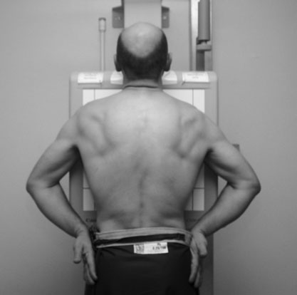
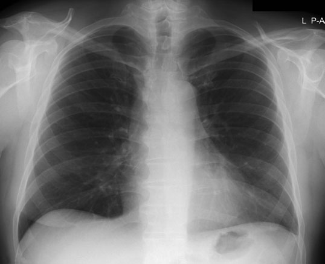
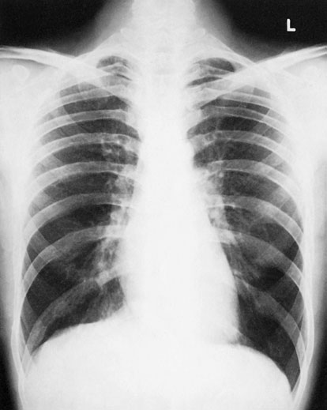
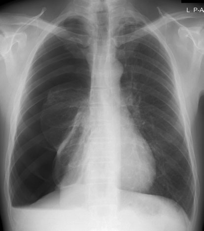

# Rx Torace (Câmpuri Pulmonare) Postero-Anterior (PA) - Ortostatism

  📷 Radiografie Convențională (Rx)
  <strong>Actualizat:</strong> 2026-09-16
  <strong>Autor:</strong> Departamentul de Radiologie / Referință Clark (Ed. 12)

---

-   __1. Rezumat Clinic & Indicații__

    ---

    === "Indicații Clinice"

        - toate comments în general section apply.
        - Soft tissues: în large pacienți, overlying părți moi la bases (obesity sau large breasts) obscures detail de lung bases și pleura ca well ca giving unnecessary radiation la Sân (Mamografie). This poate fie made worse prin many de factors outlined above. pentru diagnostic reasons și pentru dose reduction, female pacienți poate hold their breasts out de main field.
        - în thin pacienți, skin folds poate produce linear artefacts, which could mimic pleural lichid sau even pneumotorax. Creasing de skin sprijinit pe stativul Bucky sau casetă trebuie să fie avoided.

    === "Ghid Național IRIS"

        !!! info "Referință Primară: Ghidul Național IRIS (Ordinul MS 1342/2012)"
            - **Capitol Ghid IRIS:** *Ghidul Național IRIS*
            - **Grad de Recomandare:** **De verificat pe indicație; fără grad atribuit automat**
            - **Nivel de Iradiere Estimată:** `De verificat pentru examinarea și populația selectate`

            [:octicons-search-16: Deschide Ghidul IRIS](../../iris.md){ .md-button .md-button--primary } [:material-open-in-new: Aplicația Oficială PWA](https://radiologie-pediatrica.ro/iris/){ .md-button target="_blank" rel="noopener" }
-   __2. Poziționare & Centrare Fascicul__

    ---

    - **Poziție Pacient:** • pacientul este poziționat facing caseta, cu bărbia extins și centred la middle de top de caseta.
• picioarele sunt paced slightly apart astfel încât pacient este able la remain steady.
• planul mediosagital este ajustat la drept-angles la middle de caseta. umerii sunt rotit forward și pressed downward în contact cu caseta.
• This este achieved prin placing dorsal aspect de mâinile behind și below șoldurile, cu coate brought forward, sau prin allowing brațele la encircle caseta.
    - **Punct de Centrare Fascicul:** • orizontal central fascicul este orientat la drept-angles la caseta la nivelul eighth Coloană Toracală (i.e. spinous process de T7), which este coincident cu lung midpoint (Unett și Carver 2001).
• surface marking de T7 spinous process poate fie assessed prin using inferior angle de Omoplat (Scapulă) before umerii sunt pushed forward.
• Apnee în inspir profund complet.
• în number de automatic chest film radiologic-changer devices, central fascicul este centred automatically la middle de film radiologic.
    - **Distanță Focar-Film (DFF / SID):** 100 cm
    - **Comandă Respiratorie:** Apnee în inspir profund complet

-   __3. Parametri Tehnici Expunere__

    ---

    | Parametru Tehnic | Valoare Configurare Generator / Tub |
    |:-----------------|:-------------------------------------|
    | **Tensiune Tub (kV)** | 70 kV |
    | **Sarcină / Produs Curent-Timp (mAs)** | Conform AEC / grosime anatomică |
    | **Distanță Focar-Film (DFF / SID)** | 100 cm |
    | **Grilă Antidifuzoare (Bucky)** | Cu grilă antidifuzoare Bucky |
    | **Dimensiune Focar** | Focar Mic (0.6 mm) |
    | **Camere de Ionizare AEC** | Camerele laterale (sau camera centrală funcție de regiune) |
    | **Colimare Fascicul** | Colimare strictă adaptată pe receptor 35 x 43 cm |
    | **Filtrare Tub** | Totală ≥ 2.5 mm Al echivalent (conform Clark: 3.0 mm Al eq.) |

-   __4. Criterii de Calitate & Reușită Imagine__

    ---

    - ideal Postero-anterior (PA) chest radiografie trebuie să evidențiază following:
    - Câmpuri pulmonare complet vizibile, cu scapulele proiectate în afara ariei pulmonare away de la câmpuri pulmonare.
    - clavicles simetric și echidistant față de procese spinoase și nu obscuring lung Vârfuri Pulmonare (Apexuri).
    - Torace (Câmpuri Pulmonare) well inflated, i.e. it trebuie să fie possible la visualize either six Coaste (Grilaj Costal) anteriorly sau ten Coaste (Grilaj Costal) posteriorly.
    - sinusuri costodiafragmatice și cupole diafragmatice outlined clearly.
    - mediastinum și Cord și Siluetă Cardiovasculară central și defined sharply.
    - fine demarcation de lung tissues vizualizat de la hilum la periphery.
    - Erori de evitat / remedii: scapulae sometimes obscure outer edges de câmpuri pulmonare. If pacientul este unable la adopt basic braț poziție, then brațele trebuie să fie allowed la encircle stativ vertical Bucky.
    - Erori de evitat / remedii: rotație de pacientul will result în Cord și Siluetă Cardiovasculară nu being central, thus making assessment de Cord și Siluetă Cardiovasculară size impossible. Attention la how pacientul este made la stand este essential la ensure that they sunt comfortable și poate maintain poziție. picioarele trebuie să fie well separated și Bazin (bazin (pelvis)) simetric în respect la stativ vertical Bucky.
    - Erori de evitat / remedii: câmpuri pulmonare sometimes sunt nu well inflated. Explanation și rehearsal de Tehnică de estompare prin respirație superficială (respirație technique) before expunere este therefore essential.

-   __5. Protecție Radiologică (ALARA)__

    ---

    - The patient is provided with a waist-fitting lead-rubber apron, and the radiation beam is restricted to the size of the cassette. Postero-Anterior (PA) radiograph of chest taken using conventional kVp technique (70 kVp) Postero-Anterior (PA) radiograph of Torace showing large right pneumotorax
    - Ecranare gonadică cu șorț plumbat dacă gonadele sunt în apropierea fasciculului util (regula ALARA).
    - Colimare precisă la dimensiunea anatomică strict necesară pentru reducerea dozei și a radiației difuze.
    - Verificarea posibilității unei sarcini la pacientele de vârstă fertilă înainte de expunere.

!!! note "Observații Clinice & Tehnice"
    radiografie poate fie taken pe expir profund complet la confirm presence de pneumotorax. This has effect de increasing intrapleural pressure, which results în compression de lung, making pneumotorax bigger. technique este useful 206 Postero-anterior (PA) radiografie de chest taken using high kVp technique în evidențiind small pneumotorax și este also used la evidențiază effects de air-trapping associated cu inhaled corp străin radiopac obstructing passage de air into segment de lung, și extent de diaphragmatic movement.

• Careful pacient preparation este essential, cu toate radio-opaque objects removed before examination.
• When intravenous drip este în situ în braț, care trebuie să fie exercised la ensure that drip este secured properly pe drip stand before expunere.
• pacienți cu underwater-seal bottles require particular care la ensure that chest tubes sunt nu dislodged, și bottle este nu raised deasupra nivelului toracele.
• Postero-anterior (PA) clip-type marker este normally used, și imagine este identified cu identification marker set la Postero-anterior (PA) poziție. Care trebuie să fie made nu la misdiagnose case de dextracardia.
• Long, plaited hair poate cause artefacts și trebuie să fie clipped out de imagine field.
• Reduction în expunere este required în pacienți suffering de la emphysema.
• pentru imagini taken în expiration, kilovoltage este increased prin five when using conventional kilovoltage technique.

### 🖼️ Imagini

<figure class="protocol-image-card" markdown>

<figcaption><strong>• Apnee în inspir profund complet.</strong> — Poziționare pacient și centrare fascicul conform Clark (Ed. 12)</figcaption>

</figure>

<figure class="protocol-image-card" markdown>

<figcaption><strong>ideal Postero-anterior (PA) chest radiografie trebuie să evidențiază</strong> — Aspect radiografic / ghid de poziționare conform tratatului Clark (Ed. 12)</figcaption>

</figure>

<figure class="protocol-image-card" markdown>

<figcaption><strong>could mimic pleural lichid sau even pneumotorax. Creasing de</strong> — Aspect radiografic / ghid de poziționare conform tratatului Clark (Ed. 12)</figcaption>

</figure>

<figure class="protocol-image-card" markdown>

<figcaption><strong>• Postero-anterior (PA) clip-type marker este normally used, și the</strong> — Aspect radiografic / ghid de poziționare conform tratatului Clark (Ed. 12)</figcaption>

</figure>

=== "Ghid Rapid de Execuție"

    1. **Identificarea și verificarea pacientului:** verificare identitate, zonă de examinat, consimțământ conform procedurii și evaluarea posibilității unei sarcini, când este relevantă.
    2. **Pregătire:** îndepărtarea oricăror obiecte radiopace (bijuterii, agrafe, fermoare, proteze, pansamente dense).
    3. **Poziționare precisă:** alinierea receptorului de imagine și a tubului la distanța prescrisă (100 cm).
    4. **Colimare strictă:** adaptarea fasciculului strict la regiunea de diagnostic pentru scăderea iradierii și reducerea radiației difuze.
    5. **Radioprotecție:** verificarea [politicii RX](../radioprotectie.md), cu măsuri distincte pentru pacient, personal și însoțitor.

## Surse de documentare

- [Clark's Positioning in Radiography (Ed. 12), Pagina 221](../../assets/protocols/sources/Clark___Positioning_in_Radiography__12th_edition.pdf#page=221)
