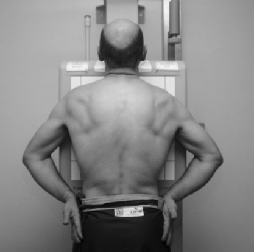

# Radiografie toracică (câmpuri pulmonare) postero-anterioară (PA) — ortostatism

  📷 Radiografie Convențională (Rx)
  <strong>Actualizat:</strong> 2026-09-16
  <strong>Autor:</strong> Departamentul de Radiologie / Referință Clark (Ed. 12)

---

-   __1. Rezumat Clinic & Indicații__

    ---

    === "Indicații Clinice"

        - Toate comentariile din secțiunea generală se aplică.
        - Țesuturi moi: la pacienții mari, țesuturile moi suprapuse la baze (obezitatea sau sânii voluminoși) estompează detaliile bazelor pulmonare și ale pleurei, precum și produc o iradiere inutilă a sânului (mamografiei). Acest lucru poate fi agravat de mulți dintre factorii prezentați mai sus. Din motive diagnostice și pentru reducerea dozei, pacientele își pot ține sânii în afara câmpului principal.
        - La pacienții slabi, pliurile cutanate pot produce artefacte liniare, care pot mima lichidul pleural sau chiar pneumotoraxul. Formarea de cute ale pielii pe stativul Bucky sau pe casetă trebuie evitată.

    === "Ghid Național IRIS"

        !!! info "Referință Primară: Ghidul Național IRIS (Ordinul MS 1342/2012)"
            - **Capitol Ghid IRIS:** *Torace & Pulmon*
            - **Grad de Recomandare:** **Grad A**
            - **Nivel de Iradiere Estimată:** `Clasa 1 (Minimă < 0.1 mSv)`

            [:octicons-search-16: Deschide Ghidul IRIS](../../iris.md){ .md-button .md-button--primary } [:material-open-in-new: Aplicația Oficială PWA](https://radiologie-pediatrica.ro/iris/){ .md-button target="_blank" rel="noopener" }

-   __2. Poziționare & Centrare Fascicul__

    ---

    - **Poziție Pacient:**
        - pacientul este poziționat cu fața către casetă, cu bărbia extinsă și centrată la mijlocul marginii superioare a casetei.
        - picioarele sunt așezate ușor depărtat, astfel încât pacientul să poată rămâne stabil.
        - planul mediosagital este ajustat perpendicular pe mijlocul casetei. Umerii sunt rotiți anterior și apăsați în jos, în contact cu caseta.
        - acest lucru se realizează prin plasarea feței dorsale a mâinilor posterior și inferior de șolduri, cu coatele aduse anterior, sau prin permiterea înconjurării casetei cu brațele.
    - **Punct de Centrare Fascicul:**
        - fasciculul central orizontal este orientat perpendicular pe casetă, la nivelul celei de-a opta vertebre toracale (adică apofiza spinoasă a T7), care coincide cu mijlocul longitudinal (Unett și Carver 2001).
        - reperarea de suprafață a apofizei spinoase T7 poate fi realizată folosind unghiul inferior al omoplatului (scapulei), înainte ca umerii să fie împinși anterior.
        - Apnee în inspir profund complet.
        - La multe dispozitive automate de schimbare a filmului radiologic toracic, fasciculul central este centrat automat la mijlocul filmului radiologic.
    - **Distanță Focar-Film (DFF / SID):** 100 cm
    - **Comandă Respiratorie:** Apnee în inspir profund complet

-   __3. Parametri Tehnici Expunere__

    ---

    | Parametru Tehnic | Valoare Configurare Generator / Tub |
    |:-----------------|:-------------------------------------|
    | **Tensiune Tub (kV)** | 70 kV |
    | **Sarcină / Produs Curent-Timp (mAs)** | Conform AEC / grosimii anatomice |
    | **Distanță Focar-Film (DFF / SID)** | 100 cm |
    | **Grilă Antidifuzoare (Bucky)** | Cu grilă antidifuzoare Bucky |
    | **Dimensiune Focar** | Focar Mic (0.6 mm) |
    | **Camere de Ionizare AEC** | Camerele laterale (sau camera centrală, în funcție de regiune) |
    | **Colimare Fascicul** | Colimare strictă adaptată pe receptor 35 x 43 cm |
    | **Filtrare Tub** | Totală ≥ 2.5 mm Al echivalent (conform Clark: 3.0 mm Al echivalent) |

-   __4. Criterii de Calitate & Reușită Imagine__

    ---

    - Radiografia toracică postero-anterioară (PA) ideală trebuie să evidențieze următoarele:
    - Câmpuri pulmonare complet vizibile, cu scapulele proiectate în afara ariei pulmonare, îndepărtate de câmpurile pulmonare.
    - Clavicule simetrice și echidistante față de procesele spinoase și care nu obstrucționează vârfurile pulmonare (apexurile).
    - Torace (Câmpuri Pulmonare) bine expandat, adică trebuie să fie posibilă vizualizarea fie a șase coaste (grilaj costal) anterior, fie a zece coaste (grilaj costal) posterior.
    - Sinusurile costodiafragmatice și cupolele diafragmatice conturate clar.
    - Mediastinul, cordul și silueta cardiovasculară situate central și bine delimitate.
    - Delimitare fină a țesuturilor pulmonare vizualizate de la hil până la periferie.
    - Erori de evitat / remedii: omoplații obstrucționează uneori marginile externe ale câmpurilor pulmonare. Dacă pacientul nu poate adopta poziția de bază a brațelor, atunci brațelor trebuie să li se permită să înconjoare stativul vertical Bucky.
    - Erori de evitat / remedii: rotația pacientului va face ca inima și silueta cardiovasculară să nu fie centrale, făcând astfel imposibilă evaluarea dimensiunii inimii și a siluetei cardiovasculare. Este esențial să se acorde atenție modului în care pacientul este așezat în ortostatism, pentru a se asigura că este confortabil și poate menține poziția. Picioarele trebuie să fie bine depărtate, iar bazinul (pelvisul) simetric față de stativul vertical Bucky.
    - Erori de evitat / remedii: câmpurile pulmonare nu sunt uneori bine expandate. Explicarea și repetarea tehnicii de estompare prin respirație superficială înainte de expunere sunt, prin urmare, esențiale.

-   __5. Protecție Radiologică (ALARA)__

    ---

    - Pacientului i se pune un șorț din cauciuc plumbat, ajustat pe talie, iar fasciculul de radiații este limitat la dimensiunea casetei. Radiografie postero-anterioară (PA) a toracelui, realizată folosind tehnica convențională cu kVp (70 kVp). Radiografie postero-anterioară (PA) a toracelui care evidențiază un pneumotorax drept voluminos.
    - Ecranare gonadică cu șorț plumbat dacă gonadele sunt în apropierea fasciculului util (regula ALARA).
    - Colimare precisă la dimensiunea anatomică strict necesară pentru reducerea dozei și a radiației difuze.
    - Verificarea posibilității unei sarcini la pacientele de vârstă fertilă înainte de expunere.

!!! note "Observații Clinice & Tehnice"
    Radiografia poate fi efectuată în apnee după expir profund complet pentru a confirma prezența pneumotoraxului. Aceasta are ca efect creșterea presiunii intrapleurale, ceea ce duce la comprimarea plămânului, făcând pneumotoraxul mai mare. Tehnica este utilă 206 pentru evidențierea unui pneumotorax mic pe radiografia toracică postero-anterioară (PA), realizată folosind o tehnică cu kVp ridicat, și este utilizată, de asemenea, pentru evidențierea efectelor retenției de aer asociate cu un corp străin radiopac inhalat, care obstruează trecerea aerului într-un segment pulmonar, precum și a amplitudinii mișcării diafragmatice.

    - Pregătirea atentă a pacientului este esențială, toate obiectele radioopace fiind îndepărtate înaintea examinării.
    - Atunci când o perfuzie intravenoasă este montată la braț, trebuie să se verifice ca perfuzia să fie fixată corespunzător pe stativul pentru perfuzie înainte de expunere.
    - Pacienții cu recipiente cu închidere subacvatică necesită o atenție deosebită pentru a se asigura că tuburile toracice nu sunt dislocate și că recipientul nu este ridicat deasupra nivelului toracelui.
    - De regulă se utilizează un marker tip clips pentru incidența postero-anterioară (PA), iar imaginea este identificată cu markerul de identificare plasat în poziție postero-anterioară (PA). Trebuie avut grijă să nu se diagnosticheze greșit un caz de dextrocardie.
    - Părul lung împletit poate produce artefacte și trebuie prins în afara câmpului imagistic.
    - La pacienții cu emfizem este necesară reducerea expunerii.
    - Pentru imaginile realizate în expir, kilovoltajul este crescut cu five atunci când se utilizează tehnica convențională cu kilovoltaj.

### 🖼️ Imagini

<figure class="protocol-image-card" markdown>

<figcaption><strong>• Apnee în inspir profund complet.</strong> — Poziționarea pacientului și centrarea fasciculului conform Clark (Ed. 12)</figcaption>

</figure>

<figure class="protocol-image-card" markdown>

![Radiografia toracică postero-anterioară (PA) ideală trebuie să evidențieze [fragment incomplet în sursă].](../../assets/images/protocols/clark/rx-torace-campuri-pulmonare-postero-anterior-ortostatism-p221-clark/fig_2.jpeg)

<figcaption><strong>Radiografia toracică postero-anterioară (PA) ideală trebuie să evidențieze [fragment incomplet în sursă].</strong> — Aspect radiografic / ghid de poziționare conform tratatului Clark (Ed. 12)</figcaption>

</figure>

<figure class="protocol-image-card" markdown>

![[Fragment incomplet în sursă] ar putea imita prezența lichidului pleural sau chiar un pneumotorax. Formarea cutelor [fragment incomplet în sursă].](../../assets/images/protocols/clark/rx-torace-campuri-pulmonare-postero-anterior-ortostatism-p221-clark/fig_3.jpeg)

<figcaption><strong>[Fragment incomplet în sursă] ar putea imita prezența lichidului pleural sau chiar un pneumotorax. Formarea cutelor [fragment incomplet în sursă].</strong> — Aspect radiografic / ghid de poziționare conform tratatului Clark (Ed. 12)</figcaption>

</figure>

<figure class="protocol-image-card" markdown>

![• Markerul postero-anterior (PA) de tip clips este utilizat în mod normal, iar [fragment incomplet în sursă].](../../assets/images/protocols/clark/rx-torace-campuri-pulmonare-postero-anterior-ortostatism-p221-clark/fig_4.jpeg)

<figcaption><strong>• Markerul postero-anterior (PA) de tip clips este utilizat în mod normal, iar [fragment incomplet în sursă].</strong> — Aspect radiografic / ghid de poziționare conform tratatului Clark (Ed. 12)</figcaption>

</figure>

=== "Ghid Rapid de Execuție"

    1. **Identificarea și verificarea pacientului:** verificare identitate, zonă de examinat, consimțământ conform procedurii și evaluarea posibilității unei sarcini, când este relevantă.
    2. **Pregătire:** îndepărtarea oricăror obiecte radiopace (bijuterii, agrafe, fermoare, proteze, pansamente dense).
    3. **Poziționare precisă:** alinierea receptorului de imagine și a tubului la distanța prescrisă (100 cm).
    4. **Colimare strictă:** adaptarea fasciculului strict la regiunea de diagnostic pentru scăderea iradierii și reducerea radiației difuze.
    5. **Radioprotecție:** verificarea [politicii RX](../radioprotectie.md), cu măsuri distincte pentru pacient, personal și însoțitor.

## Surse de documentare

- [Clark's Positioning in Radiography (Ed. 12), Pagina 221](https://books.google.com/books/about/Clark_s_Positioning_in_Radiography.html?id=Xxu6MwEACAAJ)
