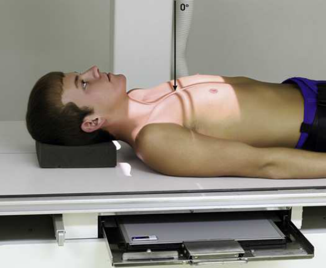
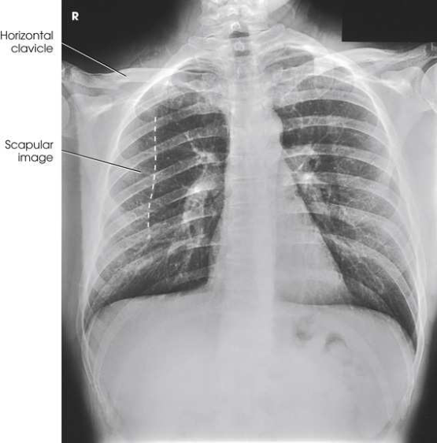

# Rx Torace — Incidență Antero-Posterioară (AP) a — Decubit Dorsal or Ortostatism (Merrill)

  📷 Radiografie Convențională (Rx)
  <strong>Actualizat:</strong> 2026-09-16
  <strong>Autor:</strong> Referință Merrill

---

-   __1. Rezumat Clinic & Indicații__

    ---

    === "Indicații Clinice"

        - Conform reperelor anatomice standard din tratat

    === "Ghid Național IRIS"

        !!! info "Referință Primară: Ghidul Național IRIS (Ordinul MS 1342/2012)"
            - **Capitol Ghid IRIS:** *Ghidul Național IRIS*
            - **Grad de Recomandare:** **De verificat pe indicație; fără grad atribuit automat**
            - **Nivel de Iradiere Estimată:** `De verificat pentru examinarea și populația selectate`

            [:octicons-search-16: Deschide Ghidul IRIS](../../iris.md){ .md-button .md-button--primary } [:material-open-in-new: Aplicația Oficială PWA](https://radiologie-pediatrica.ro/iris/){ .md-button target="_blank" rel="noopener" }
-   __2. Poziționare & Centrare Fascicul__

    ---

    - **Poziție Pacient:** se așază pacientul în Decubit dorsal sau ortostatism cu back pe / sprijinit de grilă.; se centrează plan mediosagital de Torace la receptorul de imagine. se ajustează receptorul de imagine astfel încât upper margine este 1.5 la 2 inches (3.8 la 5 cm) above relaxat umeri. If pacient condition allows, se flectează pacient’s coate, pronate mâinile, și place mâinile pe șoldurile la draw scapulae laterally. se ajustează umeri la lie în same plan transversal (Fig. 3.56). se efectuează ecranarea gonadelor cu șorț plumbat.
    - **Punct de Centrare Fascicul:** perpendicular pe axa longitudinală de Stern și center de receptorul de imagine. raza centrală trebuie să enter approximately 3 inches (7.6 cm) below incizură jugulară (furculiță sternală).
    - **Distanță Focar-Film (DFF / SID):** SID of 72 inches (183 cm) is recommended. A shorter SID may be required depending on the equipment and space available.
    - **Comandă Respiratorie:** Inspir profund complet. expunere este made after second Inspir profund complet la ensure maximum expansion de plămânii.

-   __3. Parametri Tehnici Expunere__

    ---

    | Parametru Tehnic | Valoare Configurare Generator / Tub |
    |:-----------------|:-------------------------------------|
    | **Tensiune Tub (kV)** | DE CONFIGURAT PE APARAT |
    | **Sarcină / Produs Curent-Timp (mAs)** | DE CONFIGURAT PE APARAT |
    | **Distanță Focar-Film (DFF / SID)** | SID of 72 inches (183 cm) is recommended. A shorter SID may be required depending on the equipment and space available. |
    | **Grilă Antidifuzoare (Bucky)** | DE CONFIGURAT PE APARAT |
    | **Dimensiune Focar** | DE CONFIGURAT PE APARAT |
    | **Camere de Ionizare AEC** | DE CONFIGURAT PE APARAT |
    | **Colimare Fascicul** | Adjust câmp de iradiere la 17 inches (43 cm) longitudinal și 1 inch (2.5 cm) beyond shadows pe ambele părți (bilateral) but fără more than 14 inches (35 cm). opposite dimensions sunt used pentru transversal receptorul de imagine. vertical dimension poate fie less pentru smaller pacienți. Place marker de lateralitate (D/S) în collimated expunere field. |
    | **Filtrare Tub** | DE CONFIGURAT PE APARAT |

-   __4. Criterii de Calitate & Reușită Imagine__

    ---

    - Criterii radiologice de calitate imaginii:
    - Evidence de corect collimation și presence de marker de lateralitate (D/S) plasat clear de anatomy de interest
    - Entire plămâni, de la apexuri (vârfuri pulmonare) la sinusuri costodiafragmatice
    - Absența rotației anatomice (simetrie bilaterală perfectă)
    - Sternal ends de clavicles echidistant față de coloană vertebrală
    - Trachea vizibil în linia mediană
    - Equal distance de la coloană vertebrală la lateral margine de Coaste (Grilaj Costal) pe fiecare side
    - Clavicles appear more orizontal than în Incidență Postero-Anterioară (PA).
    - Approximately 1 inch de pulmonary apexuri (vârfuri pulmonare) trebuie să fie seen superior la clavicles.
    - Pulmonary vascular markings de la hilar regions la periphery de plămânii

-   __5. Protecție Radiologică (ALARA)__

    ---

    - Nespecificat în fragmentul extras; de verificat în sursă

!!! note "Observații Clinice & Tehnice"
    Decubit dorsal poziție este used when pacientul este too ill la sit sau stand. ortostatism este used pentru pacienți în wheelchair who cannot stand și trebuie să remain în wheelchair pentru radiografie. în addition, pacienți pe stretcher poate fie radiographed așezat up cu their membre inferioare dangling over side de stretcher și their back pe / sprijinit de în ortostatism receptorul de imagine. Resnick 2 recommended înclinat Incidență Antero-Posterioară (AP) la liber basal portions de câmpuri pulmonare de la superimposition prin anterior diaphragmatic, abdominal, și cardiac structures. He reported that this incidență also diferitiates middle lobe și lingular processes de la lower lobe disease. pentru this incidență, pacientul poate fie either în ortostatism sau Decubit dorsal, și raza centrală este orientat la midsternal region la un unghi de 30 grade caudal. Resnick stated that more suitable angulation poate fie chosen based pe preliminary imagini.

### 🖼️ Imagini

<figure class="protocol-image-card" markdown>

<figcaption><strong>Merrill — pagina PDF 189, imaginea 1</strong> — Imagine din fragmentul sursă; asocierea necesită revizie.</figcaption>

</figure>

<figure class="protocol-image-card" markdown>

<figcaption><strong>Merrill — pagina PDF 190, imaginea 2</strong> — Imagine din fragmentul sursă; asocierea necesită revizie.</figcaption>

</figure>

=== "Ghid Rapid de Execuție"

    1. **Identificarea și verificarea pacientului:** verificare identitate, zonă de examinat, consimțământ conform procedurii și evaluarea posibilității unei sarcini, când este relevantă.
    2. **Pregătire:** îndepărtarea oricăror obiecte radiopace (bijuterii, agrafe, fermoare, proteze, pansamente dense).
    3. **Poziționare precisă:** alinierea receptorului de imagine și a tubului la distanța prescrisă (SID of 72 inches (183 cm) is recommended. A shorter SID may be required depending on the equipment and space available.).
    4. **Colimare strictă:** adaptarea fasciculului strict la regiunea de diagnostic pentru scăderea iradierii și reducerea radiației difuze.
    5. **Radioprotecție:** verificarea [politicii RX](../radioprotectie.md), cu măsuri distincte pentru pacient, personal și însoțitor.

## Surse de documentare

- [Merrill’s Atlas, 3. Thoracic Viscera: Chest and Upper Airway, pagini PDF 188–190](../../assets/protocols/sources/a56d45c16829_Merrills_Atlas_of_Radiographic_Positioning__Procedures_3Vol_Set.pdf#page=188)

## Fragmente sursă traduse (referință tehnică)

### anatomy

AP incidență de thoracic viscera (Fig. 3.57) shows imagine similar la PA incidență (Fig. 3.58). Being farther de la receptorul de imagine, cordul
și great vessels sunt magnified și engorged, și câmpuri pulmonare appear shorter because abdominal compression moves cupole diafragmatice la higher
level. clavicles sunt projected higher, și coaste assume more orizontal appearance.

### collimation

• Adjust câmp de iradiere la 17 inches (43 cm) longitudinal și 1 inch (2.5 cm) beyond shadows pe ambele părți (bilateral) but fără more than 14 inches
(35 cm). opposite dimensions sunt used pentru transversal receptorul de imagine. vertical dimension poate fie less pentru smaller pacienți. Place marker de lateralitate (D/S)
în collimated expunere field.

### cr

• perpendicular pe axa longitudinală de sternum și center de receptorul de imagine. raza centrală trebuie să enter approximately 3 inches (7.6 cm) below incizură jugulară (furculiță sternală).

### criteria

Criterii radiologice de calitate imaginii:
• Evidence de corect collimation și presence de marker de lateralitate (D/S) plasat clear de anatomy de interest
• Entire plămâni, de la apexuri (vârfuri pulmonare) la sinusuri costodiafragmatice
• Absența rotației anatomice (simetrie bilaterală perfectă)
• Sternal ends de clavicles echidistant față de coloană vertebrală
• Trachea vizibil în linia mediană
• Equal distance de la coloană vertebrală la lateral margine de coaste pe fiecare side
• Clavicles appear more orizontal than în PA incidență.
• Approximately 1 inch de pulmonary apexuri (vârfuri pulmonare) trebuie să fie seen superior la clavicles.
• Pulmonary vascular markings de la hilar regions la periphery de plămânii

### notes

decubit dorsal este used when pacientul este too ill la sit sau stand. ortostatism este used pentru pacienți în wheelchair who cannot
stand și trebuie să remain în wheelchair pentru radiografie. în addition, pacienți pe stretcher poate fie radiographed așezat up cu their membre inferioare
dangling over side de stretcher și their back pe / sprijinit de în ortostatism receptorul de imagine.
Resnick 2 recommended înclinat AP incidență la liber basal portions de câmpuri pulmonare de la superimposition prin anterior
diaphragmatic, abdominal, și cardiac structures. He reported that this incidență also diferitiates middle lobe și lingular processes de la
lower lobe disease. pentru this incidență, pacientul poate fie either în ortostatism sau în decubit dorsal, și raza centrală este orientat la midsternal region la angle
de 30 grade caudal. Resnick stated that more suitable angulation poate fie chosen based pe preliminary imagini.

### part_pos

• se centrează plan mediosagital de toracele la receptorul de imagine.
• se ajustează receptorul de imagine astfel încât upper margine este 1.5 la 2 inches (3.8 la 5 cm) above relaxat umeri.
• If pacient condition allows, se flectează pacient’s coate, pronate mâinile, și place mâinile pe șoldurile la draw scapulae laterally.
• se ajustează umeri la lie în same plan transversal (Fig. 3.56).
• se efectuează ecranarea gonadelor cu șorț plumbat.

### patient_pos

• se așază pacientul în decubit dorsal sau ortostatism cu back pe / sprijinit de grilă.

### respiration

Inspir profund complet. expunere este made after second Inspir profund complet la ensure maximum expansion de plămânii.

### sid

SID de 72 inches (183 cm) este recommended. shorter SID poate fie required depending pe equipment și space available.

### tech

poziționat prin manufacturer sau department protocol pentru corect anatomy display orientation; raza centrală plate: 14 × 17 inches (35 ×
43 cm) longitudinal sau transversal pentru hypersthenic pacienți.

