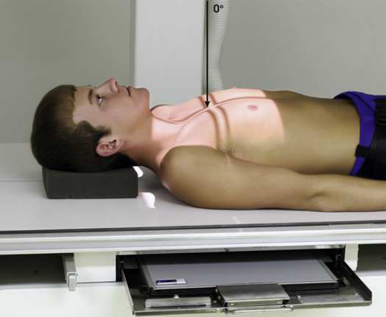
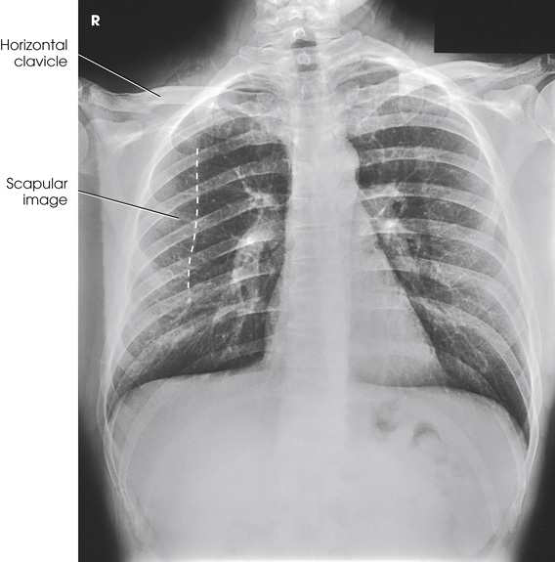

# Rx Torace — Incidență Antero-Posterioară (AP) a — Decubit Dorsal sau Ortostatism (Merrill)

  📷 Radiografie Convențională (Rx)
  <strong>Actualizat:</strong> 2026-09-16
  <strong>Autor:</strong> Referință Merrill

---

-   __1. Rezumat Clinic & Indicații__

    ---

    === "Indicații Clinice"

        - Conform reperelor anatomice standard din tratat

    === "Ghid Național IRIS"

        !!! info "Referință Primară: Ghidul Național IRIS (Ordinul MS 1342/2012)"
            - **Capitol Ghid IRIS:** *Torace & Pulmon*
            - **Grad de Recomandare:** **Grad A**
            - **Nivel de Iradiere Estimată:** `Clasa 1 (Minimă < 0.1 mSv)`

            [:octicons-search-16: Deschide Ghidul IRIS](../../iris.md){ .md-button .md-button--primary } [:material-open-in-new: Aplicația Oficială PWA](https://radiologie-pediatrica.ro/iris/){ .md-button target="_blank" rel="noopener" }

-   __2. Poziționare & Centrare Fascicul__

    ---

    - **Poziție Pacient:** Se așază pacientul în decubit dorsal sau în ortostatism, cu spatele pe / sprijinit de grilă.; se centrează planul mediosagital al toracelui la receptorul de imagine. Se ajustează receptorul de imagine astfel încât marginea superioară să fie cu 1.5 până la 2 țoli (3.8 până la 5 cm) deasupra umerilor relaxați. Dacă starea pacientului permite, se flectează coatele pacientului, se pronează mâinile și se așază mâinile pe șolduri pentru a deplasa omoplații lateral. Se ajustează umerii pentru a se afla în același plan transversal (Fig. 3.56). Se efectuează ecranarea gonadelor cu șorț plumbat.
    - **Punct de Centrare Fascicul:** Perpendicular pe axa longitudinală a sternului și centrat pe receptorul de imagine. Raza centrală trebuie să intre la aproximativ 3 țoli (7.6 cm) sub incizura jugulară (furculița sternală).
    - **Distanță Focar-Film (DFF / SID):** Se recomandă o SID de 72 inci (183 cm). Poate fi necesară o SID mai mică, în funcție de echipament și de spațiul disponibil.
    - **Comandă Respiratorie:** Inspir profund complet. Expunerea se efectuează după al doilea inspir profund complet pentru a asigura expansiunea maximă a plămânilor.

-   __3. Parametri Tehnici Expunere__

    ---

    | Parametru Tehnic | Valoare Configurare Generator / Tub |
    |:-----------------|:-------------------------------------|
    | **Tensiune Tub (kV)** | DE CONFIGURAT PE APARAT |
    | **Sarcină / Produs Curent-Timp (mAs)** | DE CONFIGURAT PE APARAT |
    | **Distanță Focar-Film (DFF / SID)** | Se recomandă o SID de 72 inci (183 cm). Poate fi necesară o SID mai mică, în funcție de echipament și de spațiul disponibil. |
    | **Grilă Antidifuzoare (Bucky)** | DE CONFIGURAT PE APARAT |
    | **Dimensiune Focar** | DE CONFIGURAT PE APARAT |
    | **Camere de Ionizare AEC** | DE CONFIGURAT PE APARAT |
    | **Colimare Fascicul** | Se ajustează câmpul de iradiere la 17 inci (43 cm) longitudinal și la 1 țol (2.5 cm) dincolo de contururi pe ambele părți (bilateral), dar fără a depăși 14 inci (35 cm). Pentru receptorul de imagine orientat transversal, dimensiunile se inversează. Dimensiunea verticală poate fi mai mică la pacienții de talie mică. Se plasează markerul de lateralitate (D/S) în câmpul de expunere colimat. |
    | **Filtrare Tub** | DE CONFIGURAT PE APARAT |

-   __4. Criterii de Calitate & Reușită Imagine__

    ---

    - Criterii radiologice de calitate a imaginii:
    - Evidențierea colimării corecte și prezența markerului de lateralitate (D/S), plasat fără a se suprapune peste anatomia de interes
    - Plămânii în întregime, de la apexuri (vârfuri pulmonare) la sinusurile costodiafragmatice
    - Absența rotației anatomice (simetrie bilaterală perfectă)
    - Capetele sternale ale claviculelor echidistante față de coloana vertebrală
    - Traheea vizibilă pe linia mediană
    - Distanță egală de la coloana vertebrală la marginea laterală a coastelor (grilajului costal) de fiecare parte
    - Claviculele apar mai orizontale decât în incidența postero-anterioară (PA).
    - Aproximativ 1 țol din apexurile pulmonare (vârfurile pulmonare) trebuie să fie vizibil deasupra claviculelor.
    - Desenul vascular pulmonar de la regiunile hilare până la periferia plămânilor

-   __5. Protecție Radiologică (ALARA)__

    ---

    - Nespecificat în fragmentul extras; de verificat în sursă

!!! note "Observații Clinice & Tehnice"
    Poziția în decubit dorsal este utilizată când pacientul este prea bolnav pentru a sta așezat sau în ortostatism. Ortostatismul este utilizat pentru pacienții aflați în scaun cu rotile, care nu pot sta în picioare și trebuie să rămână în scaunul cu rotile pentru radiografie. În plus, pacienții aflați pe targă pot fi radiografiați în poziție șezândă, cu membrele inferioare atârnând peste marginea tărgii și cu spatele pe / sprijinit de receptorul de imagine utilizat în ortostatism. Resnick 2 a recomandat o incidență antero-posterioară (AP) înclinat pentru a elibera porțiunile bazale ale câmpurilor pulmonare de suprapunerea structurilor diafragmatice, abdominale și cardiace anterioare. El a raportat că această incidență diferențiază, de asemenea, procesele lobului mijlociu și lingulare de afecțiunile lobului inferior. Pentru această incidență, pacientul poate fi fie în ortostatism, fie în decubit dorsal, iar raza centrală este orientată către regiunea midsternală, la un unghi caudal de 30 grade. Resnick a afirmat că o angulare mai potrivită poate fi aleasă pe baza imaginilor preliminare.

### 🖼️ Imagini

<figure class="protocol-image-card" markdown>

<figcaption><strong>Merrill — pagina 189, imaginea 1</strong> — Imagine din fragmentul sursă; asocierea necesită revizie.</figcaption>

</figure>

<figure class="protocol-image-card" markdown>

<figcaption><strong>Merrill — pagina 190, imaginea 2</strong> — Imagine din fragmentul sursă; asocierea necesită revizie.</figcaption>

</figure>

=== "Ghid Rapid de Execuție"

    1. **Identificarea și verificarea pacientului:** verificare identitate, zonă de examinat, consimțământ conform procedurii și evaluarea posibilității unei sarcini, când este relevantă.
    2. **Pregătire:** îndepărtarea oricăror obiecte radiopace (bijuterii, agrafe, fermoare, proteze, pansamente dense).
    3. **Poziționare precisă:** alinierea receptorului de imagine și a tubului la distanța prescrisă (Se recomandă o SID de 72 inci (183 cm). Poate fi necesară o SID mai mică, în funcție de echipament și de spațiul disponibil.).
    4. **Colimare strictă:** adaptarea fasciculului strict la regiunea de diagnostic pentru scăderea iradierii și reducerea radiației difuze.
    5. **Radioprotecție:** verificarea [politicii RX](../radioprotectie.md), cu măsuri distincte pentru pacient, personal și însoțitor.

## Surse de documentare

- [Merrill’s Atlas, 3. Thoracic Viscera: Chest and Upper Airway, pagini 188–190](https://books.google.com/books/about/Merrill_s_Atlas_of_Radiographic_Position.html?id=BM0lEQAAQBAJ)
