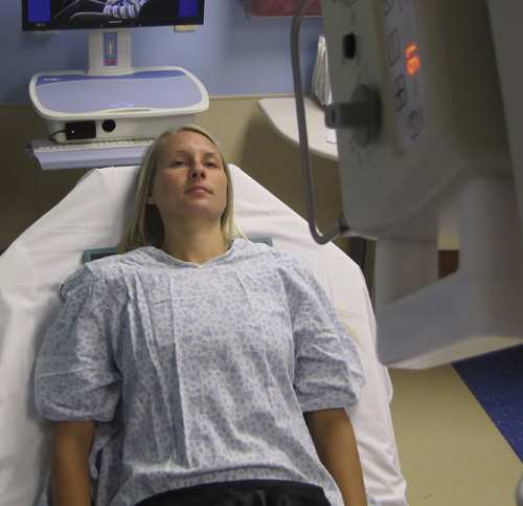
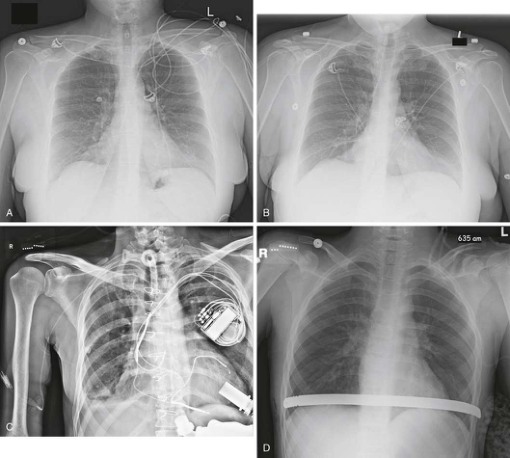

# Rx Torace — Incidență Antero-Posterioară (AP) b — Ortostatism or Decubit Dorsal (Merrill)

  📷 Radiografie Convențională (Rx)
  <strong>Actualizat:</strong> 2026-09-16
  <strong>Autor:</strong> Referință Merrill

---

-   __1. Rezumat Clinic & Indicații__

    ---

    === "Indicații Clinice"

        - Conform reperelor anatomice standard din tratat

    === "Ghid Național IRIS"

        !!! info "Referință Primară: Ghidul Național IRIS (Ordinul MS 1342/2012)"
            - **Capitol Ghid IRIS:** *Ghidul Național IRIS*
            - **Grad de Recomandare:** **De verificat pe indicație; fără grad atribuit automat**
            - **Nivel de Iradiere Estimată:** `De verificat pentru examinarea și populația selectate`

            [:octicons-search-16: Deschide Ghidul IRIS](../../iris.md){ .md-button .md-button--primary } [:material-open-in-new: Aplicația Oficială PWA](https://radiologie-pediatrica.ro/iris/){ .md-button target="_blank" rel="noopener" }
-   __2. Poziționare & Centrare Fascicul__

    ---

    - **Poziție Pacient:** Depending pe condition de pacientul, incidență trebuie să fie performed cu pacientul în ortostatism sau la greatest angle pacientul poate tolerate (if possible). Use Decubit dorsal poziție pentru critically ill sau injured pacienți.; se centrează plan mediosagital la receptorul de imagine. pentru include entire Torace, poziție receptorul de imagine under pacientul cu top about 2 inches (5 cm) above relaxat umeri. exact distance depends pe size de pacientul. When pacientul este Decubit dorsal, umerii poate move la higher poziție relative la plămânii. Adjust accordingly. Make sure that pacientul’s umeri sunt relaxat, then internally se rotește pacient’s brațe la prevent scapular superimposition de câmpuri pulmonare if nu contraindicated. Make sure that pacientul’s upper torso este nu rotit sau leaning spre one side (Fig. 20.10). se efectuează ecranarea gonadelor cu șorț plumbat.
    - **Punct de Centrare Fascicul:** perpendicular pe axa longitudinală de Stern și center de receptorul de imagine; raza centrală trebuie să enter about 3 inches (7.6 cm) below incizură jugulară (furculiță sternală) la nivelul T7.
    - **Distanță Focar-Film (DFF / SID):** Nespecificat în fragmentul extras; de verificat în sursă
    - **Comandă Respiratorie:** Inspiration unless otherwise requested. If pacientul este receiving respiratory assistance, carefully watch pacientul’s Torace la determine inspiratory phase pentru expunere.

-   __3. Parametri Tehnici Expunere__

    ---

    | Parametru Tehnic | Valoare Configurare Generator / Tub |
    |:-----------------|:-------------------------------------|
    | **Tensiune Tub (kV)** | DE CONFIGURAT PE APARAT |
    | **Sarcină / Produs Curent-Timp (mAs)** | DE CONFIGURAT PE APARAT |
    | **Distanță Focar-Film (DFF / SID)** | Nespecificat în fragmentul extras; de verificat în sursă |
    | **Grilă Antidifuzoare (Bucky)** | DE CONFIGURAT PE APARAT |
    | **Dimensiune Focar** | DE CONFIGURAT PE APARAT |
    | **Camere de Ionizare AEC** | DE CONFIGURAT PE APARAT |
    | **Colimare Fascicul** | Adjust la least 14 × 17 inches (35 × 43 cm) pe collimator, less pentru smaller pacienți. |
    | **Filtrare Tub** | DE CONFIGURAT PE APARAT |

-   __4. Criterii de Calitate & Reușită Imagine__

    ---

    - following trebuie să fie clearly vizualizat:
    - Evidence de corect collimation
    - fără mișcare și well-defined (nu blurred) diaphragmatic domes și câmpuri pulmonare
    - câmpuri pulmonare în their entirety, including sinusuri costodiafragmatice
    - Pleural markings
    - Coaste (Grilaj Costal) și thoracic intervertebral disk spaces faintly vizibil through heart shadow
    - Absența rotației anatomice (simetrie bilaterală perfectă) cu medial portion de clavicles și lateral margine de Coaste (Grilaj Costal) echidistant față de coloană vertebrală
    - radiografie markeri ca appropriate (R sau L marker, și orice la indicate how pacientul este poziționat; that este, Decubit dorsal, așezat în ortostatism, etc.).

-   __5. Protecție Radiologică (ALARA)__

    ---

    - Nespecificat în fragmentul extras; de verificat în sursă

!!! note "Observații Clinice & Tehnice"
    la ensure corect angle de la x-ray tube la receptorul de imagine, radiographer poate double-check shadow de umerii de la field light projected onto receptorul de imagine. If shadow de umerii este thrown far above upper edge de receptorul de imagine, angle de tubul trebuie să fie corrected.

### 🖼️ Imagini

<figure class="protocol-image-card" markdown>

<figcaption><strong>Merrill — pagina PDF 1484, imaginea 1</strong> — Imagine din fragmentul sursă; asocierea necesită revizie.</figcaption>

</figure>

<figure class="protocol-image-card" markdown>

<figcaption><strong>Merrill — pagina PDF 1485, imaginea 2</strong> — Imagine din fragmentul sursă; asocierea necesită revizie.</figcaption>

</figure>

=== "Ghid Rapid de Execuție"

    1. **Identificarea și verificarea pacientului:** verificare identitate, zonă de examinat, consimțământ conform procedurii și evaluarea posibilității unei sarcini, când este relevantă.
    2. **Pregătire:** îndepărtarea oricăror obiecte radiopace (bijuterii, agrafe, fermoare, proteze, pansamente dense).
    3. **Poziționare precisă:** alinierea receptorului de imagine și a tubului la distanța prescrisă (Nespecificat în fragmentul extras; de verificat în sursă).
    4. **Colimare strictă:** adaptarea fasciculului strict la regiunea de diagnostic pentru scăderea iradierii și reducerea radiației difuze.
    5. **Radioprotecție:** verificarea [politicii RX](../radioprotectie.md), cu măsuri distincte pentru pacient, personal și însoțitor.

## Surse de documentare

- [Merrill’s Atlas, 20. Mobile Radiography, pagini PDF 1483–1485](../../assets/protocols/sources/a56d45c16829_Merrills_Atlas_of_Radiographic_Positioning__Procedures_3Vol_Set.pdf#page=1483)

## Fragmente sursă traduse (referință tehnică)

### anatomy

This incidență shows anatomy de thorax, including cordul, trachea, diaphragmatic domes, și most importantly, entire câmpuri pulmonare
(including vascular markings) (Fig. 20.11).

### collimation

• Adjust la least 14 × 17 inches (35 × 43 cm) pe collimator, less pentru smaller pacienți.

### cr

• perpendicular pe axa longitudinală de sternum și center de receptorul de imagine; raza centrală trebuie să enter about 3 inches (7.6 cm) below incizură jugulară (furculiță sternală) la nivelul T7.

### criteria

following trebuie să fie clearly vizualizat:
• Evidence de corect collimation
• fără mișcare și well-defined (nu blurred) diaphragmatic domes și câmpuri pulmonare
• câmpuri pulmonare în their entirety, including sinusuri costodiafragmatice
• Pleural markings
• coaste și thoracic intervertebral disk spaces faintly vizibil through heart shadow
• Absența rotației anatomice (simetrie bilaterală perfectă) cu medial portion de clavicles și lateral margine de coaste echidistant față de coloană vertebrală
• radiografie markeri ca appropriate (R sau L marker, și orice la indicate how pacientul este poziționat; that este, în decubit dorsal, așezat în ortostatism,
etc.).

### notes

la ensure corect angle de la x-ray tube la receptorul de imagine, radiographer poate double-check shadow de umerii de la field light projected onto receptorul de imagine. If shadow de umerii este thrown far above upper edge de receptorul de imagine, angle de tubul trebuie să fie
corrected.

### part_pos

• se centrează plan mediosagital la receptorul de imagine.
• pentru include entire chest, poziție receptorul de imagine under pacientul cu top about 2 inches (5 cm) above relaxat umeri. exact
distance depends pe size de pacientul. When pacientul este în decubit dorsal, umerii poate move la higher poziție relative la plămâni. Adjust accordingly.
• Make sure that pacientul’s umeri sunt relaxat, then internally se rotește pacient’s brațe la prevent scapular superimposition de câmpuri pulmonare if nu contraindicated.
• Make sure that pacientul’s upper torso este nu rotit sau leaning spre one side (Fig. 20.10).
• se efectuează ecranarea gonadelor cu șorț plumbat.

### patient_pos

Depending pe condition de pacientul, incidență trebuie să fie performed cu pacientul în ortostatism sau la greatest angle
pacientul poate tolerate (if possible). Use decubit dorsal pentru critically ill sau injured pacienți.

### respiration

Inspiration unless otherwise requested. If pacientul este receiving respiratory assistance, carefully watch pacientul’s chest
la determine inspiratory phase pentru expunere.

### tech

receptorul de imagine trebuie să fie 14 × 17 inches (35 × 43 cm) longitudinal sau transversal, depending pe corp habitus.

