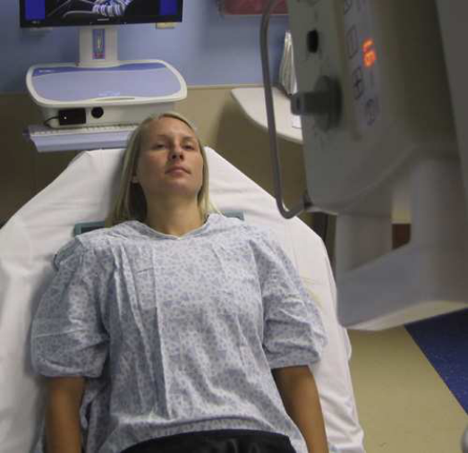
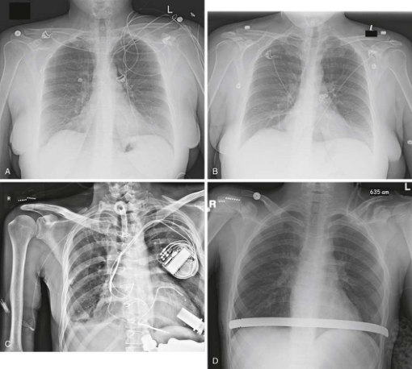

# Rx Torace — Incidență Antero-Posterioară (AP) b — Ortostatism sau Decubit Dorsal (Merrill)

  📷 Radiografie Convențională (Rx)
  <strong>Actualizat:</strong> 2026-09-16
  <strong>Autor:</strong> Referință Merrill

---

-   __1. Rezumat Clinic & Indicații__

    ---

    === "Indicații Clinice"

        - Conform reperelor anatomice standard din tratat

    === "Ghid Național IRIS"

        !!! info "Referință Primară: Ghidul Național IRIS (Ordinul MS 1342/2012)"
            - **Capitol Ghid IRIS:** *Torace & Pulmon*
            - **Grad de Recomandare:** **Grad A**
            - **Nivel de Iradiere Estimată:** `Clasa 1 (Minimă < 0.1 mSv)`

            [:octicons-search-16: Deschide Ghidul IRIS](../../iris.md){ .md-button .md-button--primary } [:material-open-in-new: Aplicația Oficială PWA](https://radiologie-pediatrica.ro/iris/){ .md-button target="_blank" rel="noopener" }

-   __2. Poziționare & Centrare Fascicul__

    ---

    - **Poziție Pacient:** În funcție de starea pacientului, incidența trebuie efectuată cu pacientul în ortostatism sau la cel mai mare unghi pe care îl poate tolera (dacă este posibil). Se utilizează decubitul dorsal la pacienții în stare critică sau traumatizați. Se centrează planul mediosagital pe receptorul de imagine. Pentru a include întregul torace, se poziționează receptorul de imagine sub pacient, cu marginea superioară la aproximativ 2 inci (5 cm) deasupra umerilor relaxați. Distanța exactă depinde de dimensiunile pacientului. Când pacientul este în decubit dorsal, umerii se pot deplasa într-o poziție mai înaltă față de plămâni. Se ajustează corespunzător. Se verifică dacă umerii pacientului sunt relaxați, apoi se rotesc intern brațele pentru a preveni suprapunerea scapulelor peste câmpurile pulmonare, dacă nu există contraindicații. Se verifică dacă partea superioară a trunchiului pacientului nu este rotită sau înclinată într-o parte (Fig. 20.10). Se efectuează ecranarea gonadelor cu șorț plumbat.
    - **Punct de Centrare Fascicul:** Perpendicular pe axa longitudinală a sternului și centrat pe receptorul de imagine; raza centrală trebuie să pătrundă la aproximativ 3 inci (7.6 cm) sub incizura jugulară (furculița sternală), la nivelul T7.
    - **Distanță Focar-Film (DFF / SID):** Nespecificat în fragmentul extras; de verificat în sursă
    - **Comandă Respiratorie:** Inspir, dacă nu se solicită altfel. Dacă pacientul beneficiază de asistență respiratorie, se urmărește atent toracele pacientului pentru a identifica faza inspiratorie în vederea expunerii.

-   __3. Parametri Tehnici Expunere__

    ---

    | Parametru Tehnic | Valoare Configurare Generator / Tub |
    |:-----------------|:-------------------------------------|
    | **Tensiune Tub (kV)** | DE CONFIGURAT PE APARAT |
    | **Sarcină / Produs Curent-Timp (mAs)** | DE CONFIGURAT PE APARAT |
    | **Distanță Focar-Film (DFF / SID)** | Nespecificat în fragmentul extras; de verificat în sursă |
    | **Grilă Antidifuzoare (Bucky)** | DE CONFIGURAT PE APARAT |
    | **Dimensiune Focar** | DE CONFIGURAT PE APARAT |
    | **Camere de Ionizare AEC** | DE CONFIGURAT PE APARAT |
    | **Colimare Fascicul** | Se reglează colimatorul la cel puțin 14 × 17 inci (35 × 43 cm), mai puțin pentru pacienții de talie mică. |
    | **Filtrare Tub** | DE CONFIGURAT PE APARAT |

-   __4. Criterii de Calitate & Reușită Imagine__

    ---

    - Următoarele trebuie să fie clar vizualizate:
    - Dovada unei colimări corecte
    - Absența mișcării și cupole diafragmatice și câmpuri pulmonare bine definite (neestompate)
    - Câmpurile pulmonare în întregime, inclusiv sinusurile costodiafragmatice
    - Desenul pleural
    - Coastele (grilajul costal) și spațiile discale intervertebrale toracice slab vizibile prin umbra cordului
    - Absența rotației anatomice (simetrie bilaterală perfectă), cu porțiunile mediale ale claviculelor și marginile laterale ale coastelor (grilajului costal) echidistante față de coloana vertebrală
    - Markeri radiografici adecvați (marker R sau L și orice marker care indică poziția pacientului: decubit dorsal, șezut cu trunchiul vertical etc.).

-   __5. Protecție Radiologică (ALARA)__

    ---

    - Nespecificat în fragmentul extras; de verificat în sursă

!!! note "Observații Clinice & Tehnice"
    Pentru a asigura unghiul corect dintre tubul de raze X și receptorul de imagine, tehnicianul radiolog poate verifica suplimentar umbra umerilor produsă de câmpul luminos proiectat pe receptorul de imagine. Dacă umbra umerilor este proiectată mult deasupra marginii superioare a receptorului de imagine, trebuie corectat unghiul tubului.

### 🖼️ Imagini

<figure class="protocol-image-card" markdown>

<figcaption><strong>Merrill — pagina 1484, imaginea 1</strong> — Imagine din fragmentul sursă; asocierea necesită revizie.</figcaption>

</figure>

<figure class="protocol-image-card" markdown>

<figcaption><strong>Merrill — pagina 1485, imaginea 2</strong> — Imagine din fragmentul sursă; asocierea necesită revizie.</figcaption>

</figure>

=== "Ghid Rapid de Execuție"

    1. **Identificarea și verificarea pacientului:** verificare identitate, zonă de examinat, consimțământ conform procedurii și evaluarea posibilității unei sarcini, când este relevantă.
    2. **Pregătire:** îndepărtarea oricăror obiecte radiopace (bijuterii, agrafe, fermoare, proteze, pansamente dense).
    3. **Poziționare precisă:** alinierea receptorului de imagine și a tubului la distanța prescrisă (Nespecificat în fragmentul extras; de verificat în sursă).
    4. **Colimare strictă:** adaptarea fasciculului strict la regiunea de diagnostic pentru scăderea iradierii și reducerea radiației difuze.
    5. **Radioprotecție:** verificarea [politicii RX](../radioprotectie.md), cu măsuri distincte pentru pacient, personal și însoțitor.

## Surse de documentare

- [Merrill’s Atlas, 20. Mobile Radiography, pagini 1483–1485](https://books.google.com/books/about/Merrill_s_Atlas_of_Radiographic_Position.html?id=BM0lEQAAQBAJ)
