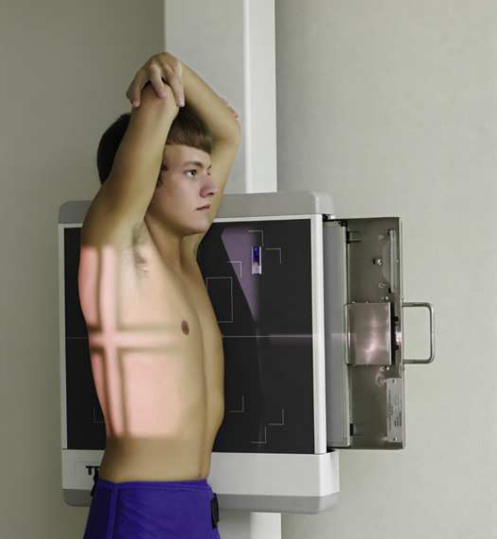
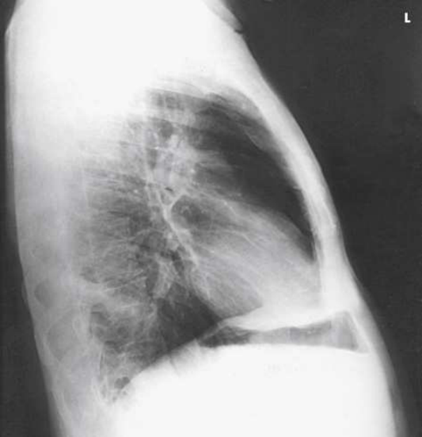
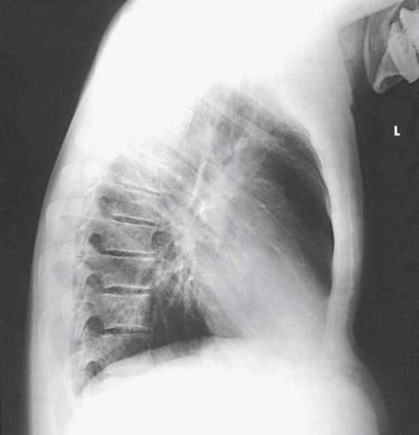
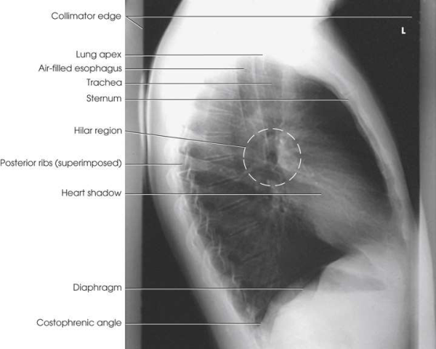
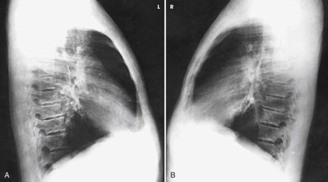
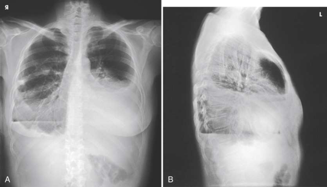

# Rx Torace — Incidență de Profil (Lateral) — Profil Drept sau Stâng (Merrill)

  📷 Radiografie Convențională (Rx)
  <strong>Actualizat:</strong> 2026-09-16
  <strong>Autor:</strong> Referință Merrill

---

-   __1. Rezumat Clinic & Indicații__

    ---

    === "Indicații Clinice"

        - Conform reperelor anatomice standard din tratat

    === "Ghid Național IRIS"

        !!! info "Referință Primară: Ghidul Național IRIS (Ordinul MS 1342/2012)"
            - **Capitol Ghid IRIS:** *Ghidul Național IRIS*
            - **Grad de Recomandare:** **De verificat pe indicație; fără grad atribuit automat**
            - **Nivel de Iradiere Estimată:** `De verificat pentru examinarea și populația selectate`

            [:octicons-search-16: Deschide Ghidul IRIS](../../iris.md){ .md-button .md-button--primary } [:material-open-in-new: Aplicația Oficială PWA](https://radiologie-pediatrica.ro/iris/){ .md-button target="_blank" rel="noopener" }
-   __2. Poziționare & Centrare Fascicul__

    ---

    - **Poziție Pacient:** If possible, always examine pacientul în ortostatism, either în ortostatism sau Poziție Șezândă, astfel încât cupole diafragmatice este la its lowest poziție, și air și nivele hidroaerice poate fie seen. Engorgement de pulmonary vessels este also avoided. Turn pacientul la true Incidență de Profil (lateral), cu brațe prin sides. la show cordul și stâng lung, use stâng Incidență de Profil (lateral) cu pacientul’s stâng side pe / sprijinit de receptorul de imagine. Use drept Incidență de Profil (lateral) la best show drept lung.; se ajustează poziție de pacientul astfel încât plan mediosagital de corp este paralel cu receptorul de imagine și adjacent Umăr este touching grila device. se centrează thorax la grila; planul mediocoronal trebuie să fie perpendicular și centrat pe linia mediană grilă. Se instruiește pacientul să se extinde brațe directly upward, se flectează coate, și cu forearms resting pe capul, hold brațele în poziție (Fig. 3.41). Place intravenous catheter stand în front de unsteady pacient. Se instruiește pacientul să se extinde brațe și grasp stand ca high ca possible pentru support. se ajustează height de receptorul de imagine astfel încât upper margine este 1.5 la 2 inches (3.8 la 5 cm) above umerii. Recheck poziție de corp; planul mediosagital trebuie să fie vertical. Depending pe width de umerii, lower part de thorax și hips poate fie greater distance de la receptorul de imagine, but this corp poziție este necessary pentru true Incidență de Profil (lateral). Having pacientul lean pe / sprijinit de grilă device (foreshortening) results în distortion de toate thoracic structures (Fig. 3.42). Forward bending also results în distorted structural outlines (Fig. 3.43). se efectuează ecranarea gonadelor cu șorț plumbat.
    - **Punct de Centrare Fascicul:** perpendicular pe centrul receptorului de imagine. raza centrală enters pacientul pe planul mediocoronal la nivelul T7 sau la inferior aspect de Omoplat (Scapulă).
    - **Distanță Focar-Film (DFF / SID):** Minimum SID of 72 inches (183 cm) is recommended to decrease magnification of the heart and increase spatial resolution of the thoracic structures.
    - **Comandă Respiratorie:** Inspir profund complet. expunere este made after second Inspir profund complet la ensure maximum expansion de plămânii.

-   __3. Parametri Tehnici Expunere__

    ---

    | Parametru Tehnic | Valoare Configurare Generator / Tub |
    |:-----------------|:-------------------------------------|
    | **Tensiune Tub (kV)** | DE CONFIGURAT PE APARAT |
    | **Sarcină / Produs Curent-Timp (mAs)** | DE CONFIGURAT PE APARAT |
    | **Distanță Focar-Film (DFF / SID)** | Minimum SID of 72 inches (183 cm) is recommended to decrease magnification of the heart and increase spatial resolution of the thoracic structures. |
    | **Grilă Antidifuzoare (Bucky)** | DE CONFIGURAT PE APARAT |
    | **Dimensiune Focar** | DE CONFIGURAT PE APARAT |
    | **Camere de Ionizare AEC** | DE CONFIGURAT PE APARAT |
    | **Colimare Fascicul** | Adjust câmp de iradiere la 17 inches (43 cm) longitudinal și 1 inch (2.5 cm) beyond anterior și posterior shadows but fără more than 14 inches (35 cm). vertical dimension poate fie less pentru smaller pacienți. Place marker de lateralitate (D/S) în collimated expunere field. |
    | **Filtrare Tub** | DE CONFIGURAT PE APARAT |

-   __4. Criterii de Calitate & Reușită Imagine__

    ---

    - Criterii radiologice de calitate imaginii:
    - Evidence de corect collimation și presence de marker de lateralitate (D/S) plasat clear de anatomy de interest
    - braț sau its soft tissues nu overlapping superior câmpuri pulmonare
    - sinusuri costodiafragmatice și portions de pulmonary apexuri (vârfuri pulmonare) nu obscured prin brațele și umeri
    - Absența rotației anatomice (simetrie bilaterală perfectă)
    - Hila în approximate center de radiografie
    - Superimposition de Coaste (Grilaj Costal) posterior la coloană vertebrală
    - Stern în profile
    - Trachea vizibil în linia mediană
    - axa longitudinală de câmpuri pulmonare vizualizat în vertical poziție, fără forward sau backward leaning
    - Open thoracic intervertebral spații articulare și intervertebral foramina, except în pacienți cu scoliosis
    - net outlines de heart și cupole diafragmatice
    - Pulmonary vascular markings de la hilar regions la periphery de plămânii

-   __5. Protecție Radiologică (ALARA)__

    ---

    - Nespecificat în fragmentul extras; de verificat în sursă

!!! note "Observații Clinice & Tehnice"
    Conform reperelor anatomice standard din tratat

### 🖼️ Imagini

<figure class="protocol-image-card" markdown>

<figcaption><strong>Merrill — pagina PDF 175, imaginea 1</strong> — Imagine din fragmentul sursă; asocierea necesită revizie.</figcaption>

</figure>

<figure class="protocol-image-card" markdown>

<figcaption><strong>Merrill — pagina PDF 176, imaginea 2</strong> — Imagine din fragmentul sursă; asocierea necesită revizie.</figcaption>

</figure>

<figure class="protocol-image-card" markdown>

<figcaption><strong>Merrill — pagina PDF 177, imaginea 3</strong> — Imagine din fragmentul sursă; asocierea necesită revizie.</figcaption>

</figure>

<figure class="protocol-image-card" markdown>

<figcaption><strong>Merrill — pagina PDF 177, imaginea 4</strong> — Imagine din fragmentul sursă; asocierea necesită revizie.</figcaption>

</figure>

<figure class="protocol-image-card" markdown>

<figcaption><strong>Merrill — pagina PDF 178, imaginea 5</strong> — Imagine din fragmentul sursă; asocierea necesită revizie.</figcaption>

</figure>

<figure class="protocol-image-card" markdown>

<figcaption><strong>Merrill — pagina PDF 178, imaginea 6</strong> — Imagine din fragmentul sursă; asocierea necesită revizie.</figcaption>

</figure>

=== "Ghid Rapid de Execuție"

    1. **Identificarea și verificarea pacientului:** verificare identitate, zonă de examinat, consimțământ conform procedurii și evaluarea posibilității unei sarcini, când este relevantă.
    2. **Pregătire:** îndepărtarea oricăror obiecte radiopace (bijuterii, agrafe, fermoare, proteze, pansamente dense).
    3. **Poziționare precisă:** alinierea receptorului de imagine și a tubului la distanța prescrisă (Minimum SID of 72 inches (183 cm) is recommended to decrease magnification of the heart and increase spatial resolution of the thoracic structures.).
    4. **Colimare strictă:** adaptarea fasciculului strict la regiunea de diagnostic pentru scăderea iradierii și reducerea radiației difuze.
    5. **Radioprotecție:** verificarea [politicii RX](../radioprotectie.md), cu măsuri distincte pentru pacient, personal și însoțitor.

## Surse de documentare

- [Merrill’s Atlas, 3. Thoracic Viscera: Chest and Upper Airway, pagini PDF 174–178](../../assets/protocols/sources/a56d45c16829_Merrills_Atlas_of_Radiographic_Positioning__Procedures_3Vol_Set.pdf#page=174)

## Fragmente sursă traduse (referință tehnică)

### anatomy

preliminary stâng lateral chest poziție este used la show cordul, aorta, și stâng-sided pulmonary lesions (Figs. 3.44 și 3.45). drept
lateral chest poziție este used la show drept-sided pulmonary lesions (Fig. 3.46). These lateral incidențe sunt used extensively la show interlobar fissures, la diferitiate lobes, și la localize pulmonary lesions.

### collimation

• Adjust câmp de iradiere la 17 inches (43 cm) longitudinal și 1 inch (2.5 cm) beyond anterior și posterior shadows but fără more than
14 inches (35 cm). vertical dimension poate fie less pentru smaller pacienți. Place marker de lateralitate (D/S) în collimated expunere field.

### cr

• perpendicular pe centrul receptorului de imagine. raza centrală enters pacientul pe planul mediocoronal la nivelul T7 sau la inferior aspect de
scapula.

### criteria

Criterii radiologice de calitate imaginii:
• Evidence de corect collimation și presence de marker de lateralitate (D/S) plasat clear de anatomy de interest
• braț sau its soft tissues nu overlapping superior câmpuri pulmonare
• sinusuri costodiafragmatice și portions de pulmonary apexuri (vârfuri pulmonare) nu obscured prin brațele și umeri
• Absența rotației anatomice (simetrie bilaterală perfectă)
• Hila în approximate center de radiografie
• Superimposition de coaste posterior la coloană vertebrală
• Sternum în profile
• Trachea vizibil în linia mediană
• axa longitudinală de câmpuri pulmonare vizualizat în vertical poziție, fără forward sau backward leaning
• Open thoracic intervertebral spații articulare și intervertebral foramina, except în pacienți cu scoliosis
• net outlines de heart și cupole diafragmatice
• Pulmonary vascular markings de la hilar regions la periphery de plămânii

### part_pos

• se ajustează poziție de pacientul astfel încât plan mediosagital de corp este paralel cu receptorul de imagine și adjacent umăr este touching
grila device.
• se centrează thorax la grila; planul mediocoronal trebuie să fie perpendicular și centrat pe linia mediană grilă.
• Se instruiește pacientul să se extinde brațe directly upward, se flectează coate, și cu forearms resting pe capul, hold brațele în poziție
(Fig. 3.41).
• Place intravenous catheter stand în front de unsteady pacient. Se instruiește pacientul să se extinde brațe și grasp stand ca high ca
possible pentru support.
• se ajustează height de receptorul de imagine astfel încât upper margine este 1.5 la 2 inches (3.8 la 5 cm) above umerii.
• Recheck poziție de corp; planul mediosagital trebuie să fie vertical. Depending pe width de umerii, lower part de
thorax și hips poate fie greater distance de la receptorul de imagine, but this corp poziție este necessary pentru true lateral incidență. Having pacient lean pe / sprijinit de grilă device (foreshortening) results în distortion de toate thoracic structures (Fig. 3.42). Forward bending also
results în distorted structural outlines (Fig. 3.43).
• se efectuează ecranarea gonadelor cu șorț plumbat.

### patient_pos

• If possible, always examine pacientul în ortostatism, either în ortostatism sau așezat pe scaun, astfel încât cupole diafragmatice este la its lowest poziție,
și air și nivele hidroaerice poate fie seen. Engorgement de pulmonary vessels este also avoided.
• Turn pacientul la true poziție de profil (lateral), cu brațe prin sides.
• la show cordul și stâng lung, use stâng poziție de profil (lateral) cu pacientul’s stâng side pe / sprijinit de receptorul de imagine.
• Use drept poziție de profil (lateral) la best show drept lung.

### respiration

Inspir profund complet. expunere este made after second Inspir profund complet la ensure maximum expansion de plămânii.

### sid

Minimum SID de 72 inches (183 cm) este recommended la decrease magnification de cordul și increase spatial resolution de thoracic
structures.

### tech

poziționat prin manufacturer sau department protocol pentru corect anatomy display orientation; raza centrală plate: 14 × 17 inches (35 ×
43 cm) longitudinal.

