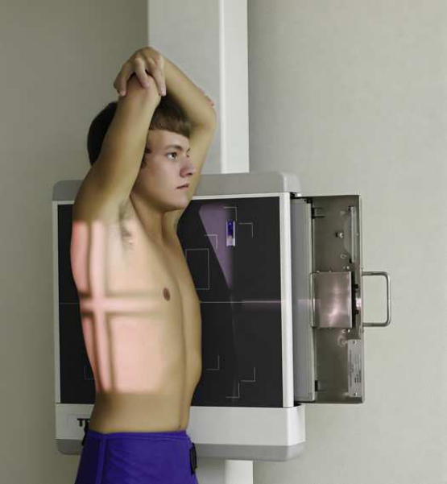
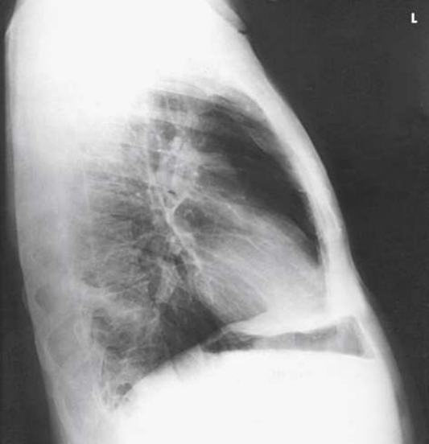
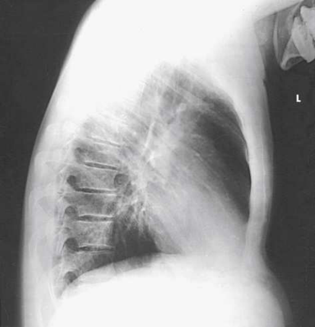
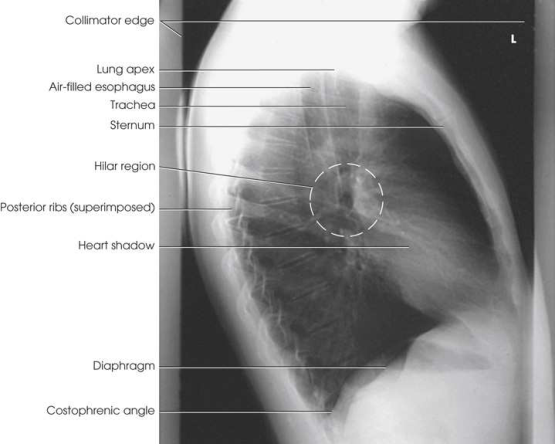
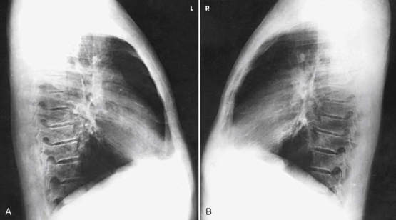
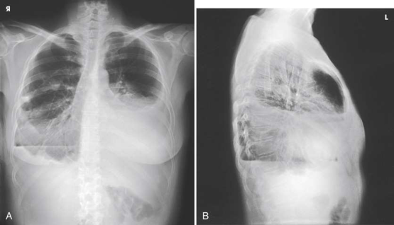

# Rx Torace — Incidență de Profil (Lateral) — Profil Drept sau Stâng (Merrill)

  📷 Radiografie Convențională (Rx)
  <strong>Actualizat:</strong> 2026-09-16
  <strong>Autor:</strong> Referință Merrill

---

-   __1. Rezumat Clinic & Indicații__

    ---

    === "Indicații Clinice"

        - Conform reperelor anatomice standard din tratat

    === "Ghid Național IRIS"

        !!! info "Referință Primară: Ghidul Național IRIS (Ordinul MS 1342/2012)"
            - **Capitol Ghid IRIS:** *Torace & Pulmon*
            - **Grad de Recomandare:** **Grad A**
            - **Nivel de Iradiere Estimată:** `Clasa 1 (Minimă < 0.1 mSv)`

            [:octicons-search-16: Deschide Ghidul IRIS](../../iris.md){ .md-button .md-button--primary } [:material-open-in-new: Aplicația Oficială PWA](https://radiologie-pediatrica.ro/iris/){ .md-button target="_blank" rel="noopener" }

-   __2. Poziționare & Centrare Fascicul__

    ---

    - **Poziție Pacient:** Dacă este posibil, pacientul se examinează întotdeauna cu trunchiul vertical, în ortostatism sau așezat pe scaun, astfel încât cupolele diafragmatice să fie în poziția cea mai joasă și să se poată vizualiza aerul și nivelurile hidroaerice. Se evită și congestia vaselor pulmonare. Se rotește pacientul într-o poziție de profil strict, cu brațele pe lângă corp. Pentru a evidenția cordul și plămânul stâng, se utilizează poziția de profil stâng, cu partea stângă a pacientului sprijinită de receptorul de imagine. Se utilizează poziția de profil drept pentru a evidenția cel mai bine plămânul drept. Se ajustează poziția pacientului astfel încât planul mediosagital al corpului să fie paralel cu receptorul de imagine, iar umărul apropiat să atingă dispozitivul cu grilă. Se centrează toracele pe grilă; planul mediocoronal trebuie să fie perpendicular pe grilă și centrat pe linia mediană a acesteia. Se instruiește pacientul să întindă brațele direct în sus, să flecteze coatele și, cu antebrațele sprijinite pe cap, să mențină brațele în poziție (Fig. 3.41). Se plasează un stativ pentru perfuzii în fața pacientului instabil. Se instruiește pacientul să întindă brațele și să apuce stativul cât mai sus posibil pentru sprijin. Se ajustează înălțimea receptorului de imagine astfel încât marginea superioară să fie la 1.5 până la 2 inci (3.8 până la 5 cm) deasupra umerilor. Se verifică din nou poziția corpului; planul mediosagital trebuie să fie vertical. În funcție de lățimea umerilor, partea inferioară a toracelui și șoldurile pot fi mai îndepărtate de receptorul de imagine, dar această poziție a corpului este necesară pentru o incidență de profil strict. Înclinarea pacientului spre dispozitivul cu grilă (scurtare în proiecție) produce distorsiunea tuturor structurilor toracice (Fig. 3.42). Aplecarea înainte produce, de asemenea, distorsiunea contururilor structurilor (Fig. 3.43). Se efectuează ecranarea gonadelor cu șorț plumbat.
    - **Punct de Centrare Fascicul:** Perpendicular pe centrul receptorului de imagine. Raza centrală pătrunde în pacient în planul mediocoronal, la nivelul T7 sau al extremității inferioare a omoplatului (scapulei).
    - **Distanță Focar-Film (DFF / SID):** Se recomandă o SID minimă de 72 inci (183 cm), pentru a reduce magnificarea inimii și a crește rezoluția spațială a structurilor toracice.
    - **Comandă Respiratorie:** Inspir profund complet. Expunerea se efectuează după al doilea inspir profund complet pentru a asigura expansiunea maximă a plămânilor.

-   __3. Parametri Tehnici Expunere__

    ---

    | Parametru Tehnic | Valoare Configurare Generator / Tub |
    |:-----------------|:-------------------------------------|
    | **Tensiune Tub (kV)** | DE CONFIGURAT PE APARAT |
    | **Sarcină / Produs Curent-Timp (mAs)** | DE CONFIGURAT PE APARAT |
    | **Distanță Focar-Film (DFF / SID)** | Se recomandă o SID minimă de 72 inci (183 cm), pentru a reduce magnificarea inimii și a crește rezoluția spațială a structurilor toracice. |
    | **Grilă Antidifuzoare (Bucky)** | DE CONFIGURAT PE APARAT |
    | **Dimensiune Focar** | DE CONFIGURAT PE APARAT |
    | **Camere de Ionizare AEC** | DE CONFIGURAT PE APARAT |
    | **Colimare Fascicul** | Se ajustează câmpul de iradiere la 17 inci (43 cm) longitudinal și la 1 țol (2.5 cm) dincolo de contururile anterior și posterior, dar fără a depăși 14 inci (35 cm). Dimensiunea verticală poate fi mai mică la pacienții de talie mică. Se plasează markerul de lateralitate (D/S) în câmpul de expunere colimat. |
    | **Filtrare Tub** | DE CONFIGURAT PE APARAT |

-   __4. Criterii de Calitate & Reușită Imagine__

    ---

    - Criterii radiologice de calitate a imaginii:
    - Evidențierea colimării corecte și prezența markerului de lateralitate (D/S), plasat fără a se suprapune peste anatomia de interes
    - Brațul sau părțile moi ale acestuia nu se suprapun peste câmpurile pulmonare superioare
    - Sinusurile costodiafragmatice și porțiuni ale apexurilor pulmonare (vârfurilor pulmonare) nu sunt mascate de brațe și umeri
    - Absența rotației anatomice (simetrie bilaterală perfectă)
    - Hilurile situate aproximativ în centrul radiografiei
    - Suprapunerea coastelor (grilajului costal) posterior de coloana vertebrală
    - Sternul văzut din profil
    - Traheea vizibilă pe linia mediană
    - Axa longitudinală a câmpurilor pulmonare vizualizată în poziție verticală, fără înclinare înainte sau înapoi
    - Spațiile articulare intervertebrale toracice și foramenele intervertebrale deschise, cu excepția pacienților cu scolioză
    - Contururi nete ale cordului și cupolelor diafragmatice
    - Desenul vascular pulmonar de la regiunile hilare până la periferia plămânilor

-   __5. Protecție Radiologică (ALARA)__

    ---

    - Nespecificat în fragmentul extras; de verificat în sursă

!!! note "Observații Clinice & Tehnice"
    Conform reperelor anatomice standard din tratat

### 🖼️ Imagini

<figure class="protocol-image-card" markdown>

<figcaption><strong>Merrill — pagina 175, imaginea 1</strong> — Imagine din fragmentul sursă; asocierea necesită revizie.</figcaption>

</figure>

<figure class="protocol-image-card" markdown>

<figcaption><strong>Merrill — pagina 176, imaginea 2</strong> — Imagine din fragmentul sursă; asocierea necesită revizie.</figcaption>

</figure>

<figure class="protocol-image-card" markdown>

<figcaption><strong>Merrill — pagina 177, imaginea 3</strong> — Imagine din fragmentul sursă; asocierea necesită revizie.</figcaption>

</figure>

<figure class="protocol-image-card" markdown>

<figcaption><strong>Merrill — pagina 177, imaginea 4</strong> — Imagine din fragmentul sursă; asocierea necesită revizie.</figcaption>

</figure>

<figure class="protocol-image-card" markdown>

<figcaption><strong>Merrill — pagina 178, imaginea 5</strong> — Imagine din fragmentul sursă; asocierea necesită revizie.</figcaption>

</figure>

<figure class="protocol-image-card" markdown>

<figcaption><strong>Merrill — pagina 178, imaginea 6</strong> — Imagine din fragmentul sursă; asocierea necesită revizie.</figcaption>

</figure>

=== "Ghid Rapid de Execuție"

    1. **Identificarea și verificarea pacientului:** verificare identitate, zonă de examinat, consimțământ conform procedurii și evaluarea posibilității unei sarcini, când este relevantă.
    2. **Pregătire:** îndepărtarea oricăror obiecte radiopace (bijuterii, agrafe, fermoare, proteze, pansamente dense).
    3. **Poziționare precisă:** alinierea receptorului de imagine și a tubului la distanța prescrisă (Se recomandă o SID minimă de 72 inci (183 cm), pentru a reduce magnificarea inimii și a crește rezoluția spațială a structurilor toracice.).
    4. **Colimare strictă:** adaptarea fasciculului strict la regiunea de diagnostic pentru scăderea iradierii și reducerea radiației difuze.
    5. **Radioprotecție:** verificarea [politicii RX](../radioprotectie.md), cu măsuri distincte pentru pacient, personal și însoțitor.

## Surse de documentare

- [Merrill’s Atlas, 3. Thoracic Viscera: Chest and Upper Airway, pagini 174–178](https://books.google.com/books/about/Merrill_s_Atlas_of_Radiographic_Position.html?id=BM0lEQAAQBAJ)
