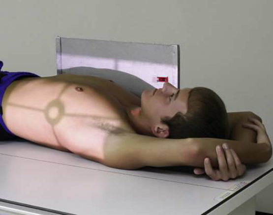
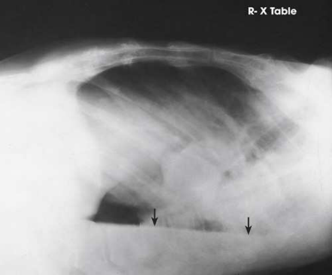
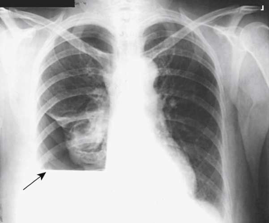

# Rx Torace — Incidență de Profil (Lateral) — Profil Drept sau Stâng Ventral or Incidență Decubit Dorsal (Merrill)

  📷 Radiografie Convențională (Rx)
  <strong>Actualizat:</strong> 2026-09-16
  <strong>Autor:</strong> Referință Merrill

---

-   __1. Rezumat Clinic & Indicații__

    ---

    === "Indicații Clinice"

        - Conform reperelor anatomice standard din tratat

    === "Ghid Național IRIS"

        !!! info "Referință Primară: Ghidul Național IRIS (Ordinul MS 1342/2012)"
            - **Capitol Ghid IRIS:** *Ghidul Național IRIS*
            - **Grad de Recomandare:** **De verificat pe indicație; fără grad atribuit automat**
            - **Nivel de Iradiere Estimată:** `De verificat pentru examinarea și populația selectate`

            [:octicons-search-16: Deschide Ghidul IRIS](../../iris.md){ .md-button .md-button--primary } [:material-open-in-new: Aplicația Oficială PWA](https://radiologie-pediatrica.ro/iris/){ .md-button target="_blank" rel="noopener" }
-   __2. Poziționare & Centrare Fascicul__

    ---

    - **Poziție Pacient:** cu pacientul în Decubit ventral sau Decubit dorsal poziție, elevate thorax 2 la 3 inches (5 la 7.6 cm) pe folded sheets sau firm pad, centering thorax la grila. Achieve best visualization prin allowing pacientul la remain în poziție pentru 5 minutes before expunere. This allows lichid la settle și air la rise.; se ajustează corp în true Decubit ventral sau Decubit dorsal poziție și se extinde brațe well above capul. Place afected side against stativ vertical Bucky, then place cephalic edge de receptorul de imagine la nivelul cartilaj tiroid (mărul lui Adam) (Fig. 3.71). se efectuează ecranarea gonadelor cu șorț plumbat.
    - **Punct de Centrare Fascicul:** Horizon̍ al și centrat pe receptorul de imagine. raza centrală enters la nivelul planul mediocoronal și 3 la 4 inches (7.6 la 10.2 cm) below incizură jugulară (furculiță sternală) pentru dorsal decubit și la T7 pentru ventral decubit.
    - **Distanță Focar-Film (DFF / SID):** Nespecificat în fragmentul extras; de verificat în sursă
    - **Comandă Respiratorie:** Inspir profund complet. expunere este made after second Inspir profund complet la ensure maximum expansion de plămânii.

-   __3. Parametri Tehnici Expunere__

    ---

    | Parametru Tehnic | Valoare Configurare Generator / Tub |
    |:-----------------|:-------------------------------------|
    | **Tensiune Tub (kV)** | DE CONFIGURAT PE APARAT |
    | **Sarcină / Produs Curent-Timp (mAs)** | DE CONFIGURAT PE APARAT |
    | **Distanță Focar-Film (DFF / SID)** | Nespecificat în fragmentul extras; de verificat în sursă |
    | **Grilă Antidifuzoare (Bucky)** | DE CONFIGURAT PE APARAT |
    | **Dimensiune Focar** | DE CONFIGURAT PE APARAT |
    | **Camere de Ionizare AEC** | DE CONFIGURAT PE APARAT |
    | **Colimare Fascicul** | Se ajustează câmpul de iradiere la formatul 35 × 43 cm pe colimator. Place marker de lateralitate (D/S) în collimated expunere field. |
    | **Filtrare Tub** | DE CONFIGURAT PE APARAT |

-   __4. Criterii de Calitate & Reușită Imagine__

    ---

    - Criterii radiologice de calitate imaginii:
    - Evidence de corect collimation și presence de side și decubit markeri plasat clear de anatomy de interest
    - Entire câmpuri pulmonare, including anterior și posterior surfaces
    - Upper câmpuri pulmonare nu obscured prin brațele
    - Absența rotației anatomice (simetrie bilaterală perfectă) de thorax de la true Incidență de Profil (lateral)
    - T7 în center de receptorul de imagine
    - Pulmonary vascular markings de la hilar regions la periphery de plămânii

-   __5. Protecție Radiologică (ALARA)__

    ---

    - Nespecificat în fragmentul extras; de verificat în sursă

!!! note "Observații Clinice & Tehnice"
    Conform reperelor anatomice standard din tratat

### 🖼️ Imagini

<figure class="protocol-image-card" markdown>

<figcaption><strong>Merrill — pagina PDF 202, imaginea 1</strong> — Imagine din fragmentul sursă; asocierea necesită revizie.</figcaption>

</figure>

<figure class="protocol-image-card" markdown>

<figcaption><strong>Merrill — pagina PDF 202, imaginea 2</strong> — Imagine din fragmentul sursă; asocierea necesită revizie.</figcaption>

</figure>

<figure class="protocol-image-card" markdown>

<figcaption><strong>Merrill — pagina PDF 203, imaginea 3</strong> — Imagine din fragmentul sursă; asocierea necesită revizie.</figcaption>

</figure>

=== "Ghid Rapid de Execuție"

    1. **Identificarea și verificarea pacientului:** verificare identitate, zonă de examinat, consimțământ conform procedurii și evaluarea posibilității unei sarcini, când este relevantă.
    2. **Pregătire:** îndepărtarea oricăror obiecte radiopace (bijuterii, agrafe, fermoare, proteze, pansamente dense).
    3. **Poziționare precisă:** alinierea receptorului de imagine și a tubului la distanța prescrisă (Nespecificat în fragmentul extras; de verificat în sursă).
    4. **Colimare strictă:** adaptarea fasciculului strict la regiunea de diagnostic pentru scăderea iradierii și reducerea radiației difuze.
    5. **Radioprotecție:** verificarea [politicii RX](../radioprotectie.md), cu măsuri distincte pentru pacient, personal și însoțitor.

## Surse de documentare

- [Merrill’s Atlas, 3. Thoracic Viscera: Chest and Upper Airway, pagini PDF 201–203](../../assets/protocols/sources/a56d45c16829_Merrills_Atlas_of_Radiographic_Positioning__Procedures_3Vol_Set.pdf#page=201)

## Fragmente sursă traduse (referință tehnică)

### anatomy

lateral incidență în decubit poziție shows change în poziție de lichid și reveals pulmonary areas that sunt obscured prin lichid
în standard incidențe (Figs. 3.72 și 3.73).

### collimation

• Se ajustează câmpul de iradiere la formatul 35 × 43 cm pe colimator. Place marker de lateralitate (D/S) în collimated expunere field.

### cr

• Horizon̍ al și centrat pe receptorul de imagine. raza centrală enters la nivelul planul mediocoronal și 3 la 4 inches (7.6 la 10.2 cm) below jugular
notch pentru dorsal decubit și la T7 pentru ventral decubit.

### criteria

Criterii radiologice de calitate imaginii:
• Evidence de corect collimation și presence de side și decubit markeri plasat clear de anatomy de interest
• Entire câmpuri pulmonare, including anterior și posterior surfaces
• Upper câmpuri pulmonare nu obscured prin brațele
• Absența rotației anatomice (simetrie bilaterală perfectă) de thorax de la true poziție de profil (lateral)
• T7 în center de receptorul de imagine
• Pulmonary vascular markings de la hilar regions la periphery de plămânii

### part_pos

• se ajustează corp în true în decubit ventral sau decubit dorsal și se extinde brațe well above capul.
• Place afected side against stativ vertical Bucky, then place cephalic edge de receptorul de imagine la nivelul cartilaj tiroid (mărul lui Adam) (Fig. 3.71).
• se efectuează ecranarea gonadelor cu șorț plumbat.

### patient_pos

• cu pacientul în decubit ventral sau decubit dorsal, elevate thorax 2 la 3 inches (5 la 7.6 cm) pe folded sheets sau firm pad, centering
thorax la grila.
• Achieve best visualization prin allowing pacientul la remain în poziție pentru 5 minutes before expunere. This allows lichid la
settle și air la rise.

### respiration

Inspir profund complet. expunere este made after second Inspir profund complet la ensure maximum expansion de plămânii.

### tech

poziționat prin manufacturer sau department protocol pentru corect anatomy display orientation; raza centrală plate: 14 × 17 inches (35 ×
43 cm) longitudinal.

