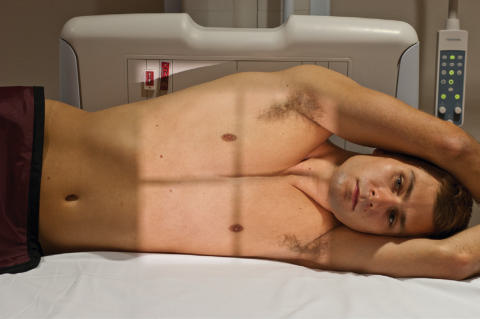
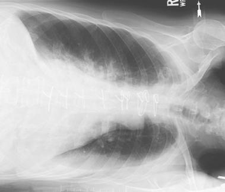
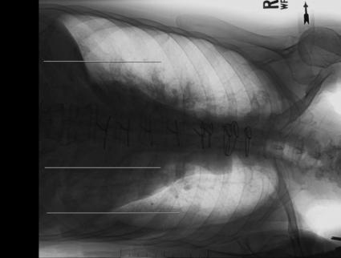

# Rx Torace Incidență Decubit Lateral (AP (Antero-Posterior))

  📷 Radiografie Convențională (Rx)
  <strong>Actualizat:</strong> 2026-09-15
  <strong>Autor:</strong> Departamentul de Radiologie / Referință Bontrager

---

-   __1. Rezumat Clinic & Indicații__

    ---

    === "Indicații Clinice"

        - Small revărsat pleural (pleurezie)s are demonstrated by airfluid levels in pleural space.
        - Small amounts of air in pleural cavity may demonstrate a possible pneumotorax (see NOTES).

    === "Ghid Național IRIS"

        !!! info "Referință Primară: Ghidul Național IRIS (Ordinul MS 1342/2012)"
            - **Capitol Ghid IRIS:** *Ghidul Național IRIS*
            - **Grad de Recomandare:** **De verificat pe indicație; fără grad atribuit automat**
            - **Nivel de Iradiere Estimată:** `De verificat pentru examinarea și populația selectate`

            [:octicons-search-16: Deschide Ghidul IRIS](../../iris.md){ .md-button .md-button--primary } [:material-open-in-new: Aplicația Oficială PWA](https://radiologie-pediatrica.ro/iris/){ .md-button target="_blank" rel="noopener" }
-   __2. Poziționare & Centrare Fascicul__

    ---

    - **Poziție Pacient:** Pacient: Cardiac board on the cart or radiolucent pad under patient Patient lying on right side for right lateral decubitus and on left side for left lateral decubitus (see NOTES) Patient’s chin extended and both arms raised above head to clear lung field; back of patient firmly against IR; cart secured to prevent patient from moving forward and possibly falling; pillow under patient’s head (Fig. 2.67) Knees flexed slightly and coronal plane parallel to IR with no body rotation; Regiune anatomică: Adjust height of IR to center thorax to IR (see NOTES). Adjust patient and cart to center midsagittal plane and T7 to CR (top of IR is approximately 1 inch [2.5 cm] above vertebra proeminentă (apofiza spinoasă C7)).
    - **Punct de Centrare Fascicul:** horizontal, directed to center of IR, to level of T7, 3 to 4 inches (8 to 10 cm) inferior to level of incizura jugulară (manubriul sternal). A horizontal beam must be used to show airfluid level or pneumotorax.
    - **Distanță Focar-Film (DFF / SID):** 180 cm
    - **Comandă Respiratorie:** Apnee în inspir profund complet (după a doua inspirație). Alternative Positioning Some department protocols state that the head should be 10° lower than the hips to reduce the apical lift caused by the Umăr, allowing the entire Torace to remain horizontal (requires support under hips). Radiograph may be taken as a right or left lateral decubitus. To produce the most diagnostic images, both lungs should be included on the image. For possible fluid in the pleural cavity (revărsat pleural (pleurezie)), the suspected side should be down. Do not cut off that side of the Torace. The anatomic side marker must correspond with the patient’s left or right side of the body. The marker must be placed on the IR before exposure. It is unacceptable practice to indicate the side of the body either digitally or with a marking pen after the exposure. For possible small amounts of air in the pleural cavity (pneumotorax), the affected side should be up, and care must be taken not to cut off this side of the Torace.

-   __3. Parametri Tehnici Expunere__

    ---

    | Parametru Tehnic | Valoare Configurare Generator / Tub |
    |:-----------------|:-------------------------------------|
    | **Tensiune Tub (kV)** | DE CONFIGURAT PE APARAT |
    | **Sarcină / Produs Curent-Timp (mAs)** | DE CONFIGURAT PE APARAT |
    | **Distanță Focar-Film (DFF / SID)** | 180 cm |
    | **Grilă Antidifuzoare (Bucky)** | Conform grosimii anatomice (> 10 cm cu grilă) |
    | **Dimensiune Focar** | Focar Mare (1.0 - 1.2 mm) |
    | **Camere de Ionizare AEC** | DE CONFIGURAT PE APARAT |
    | **Colimare Fascicul** | Collimate on four sides to area of lung fields (top border of light field to level of vertebra proeminentă (apofiza spinoasă C7)) (see NOTES). |
    | **Filtrare Tub** | Totală ≥ 2.5 mm Al echivalent |

-   __4. Criterii de Calitate & Reușită Imagine__

    ---

    - Entire lungs, including apices, both costophrenic angles, and both lateral borders of Coaste (Grilaj Costal), should be included (Figs. 2.68 and 2.69). Position
    - Absența rotației anatomice: clavicule echidistante față de linia apofizelor spinoase: Should show equal distance from the vertebral column to the lateral borders of the Coaste (Grilaj Costal) on both sides; sternoclavicular joints should be the same distance from the vertebral column.
    - Arms should not superimpose upper lungs.
    - Collimation field (CR) should be centered to the area of T7 on averagesized patients. Exposure
    - No motion; diaphragm, rib, and heart borders and lung markings should appear sharp.
    - Optimal contrast scale and exposure should result in faint visualization of vertebrae and Coaste (Grilaj Costal) through heart shadow.

-   __5. Protecție Radiologică (ALARA)__

    ---

    - Ecranare gonadică și a organelor radiosensibile conform procedurilor locale de radioprotecție ALARA.
    - Colimare strictă la aria de interes pentru limitarea radiației difuze.
    - Verificarea posibilității unei sarcini la pacientele de vârstă fertilă înainte de expunere.

!!! note "Observații Clinice & Tehnice"
    Place appropriate decubitus marker and R or L marker to indicate side up or down per facility protocol. Torace SPECIAL AP upright or semierect Lateral decubitus (AP) Fig. 2.67 Left Incidență Decubit Lateral (Incidență Antero-Posterioară (AP)). Fig. 2.68 Left lateral decubitus (fluid evident in left lung). Lung Heart Air fluid level Fig. 2.69 Left lateral decubitus.

### 🖼️ Imagini

<figure class="protocol-image-card" markdown>

<figcaption><strong>Fig. 2.67 Left Incidență Decubit Lateral (Incidență Antero-Posterioară (AP)).</strong> — Poziționare pacient conform Ghidului Bontrager (Fig. 2.67 Left lateral decubitus position (AP projection).)</figcaption>

</figure>

<figure class="protocol-image-card" markdown>

<figcaption><strong>Fig. 2.68 Left lateral decubitus (fluid evident in left lung).</strong> — Aspect radiografic de referință conform Ghidului Bontrager (Fig. 2.68 Left lateral decubitus (fluid evident in left lung).)</figcaption>

</figure>

<figure class="protocol-image-card" markdown>

<figcaption><strong>Fig. 2.69 Left lateral decubitus.</strong> — Aspect radiografic de referință conform Ghidului Bontrager (Fig. 2.69 Left lateral decubitus.)</figcaption>

</figure>

=== "Ghid Rapid de Execuție"

    1. **Identificarea și verificarea pacientului:** verificare identitate, zonă de examinat, consimțământ conform procedurii și evaluarea posibilității unei sarcini, când este relevantă.
    2. **Pregătire:** îndepărtarea oricăror obiecte radiopace (bijuterii, agrafe, fermoare, proteze, pansamente dense).
    3. **Poziționare precisă:** alinierea receptorului de imagine și a tubului la distanța prescrisă (180 cm).
    4. **Colimare strictă:** adaptarea fasciculului strict la regiunea de diagnostic pentru scăderea iradierii și reducerea radiației difuze.
    5. **Radioprotecție:** verificarea [politicii RX](../radioprotectie.md), cu măsuri distincte pentru pacient, personal și însoțitor.

## Surse de documentare

- [Bontrager's Textbook of Radiographic Positioning (Ed. 9/10), Pagina 107](https://www.elsevier.com/books/textbook-of-radiographic-positioning-and-related-anatomy/lampignano/978-0-323-65367-1)
