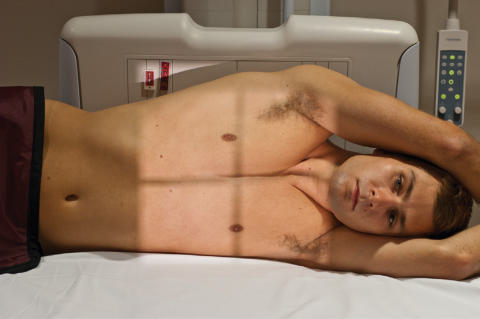
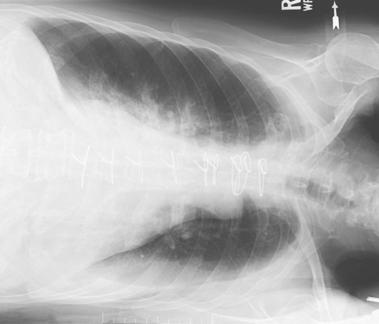
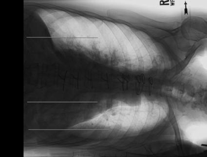

# Rx Torace Incidență Decubit Lateral (AP (Antero-Posterior))

  📷 Radiografie Convențională (Rx)
  <strong>Actualizat:</strong> 2026-09-15
  <strong>Autor:</strong> Departamentul de Radiologie / Referință Bontrager

---

-   __1. Rezumat Clinic & Indicații__

    ---

    === "Indicații Clinice"

        - Revărsatele pleurale (pleureziile) mici sunt evidențiate prin niveluri hidroaerice în spațiul pleural.
        - Cantități mici de aer în cavitatea pleurală pot evidenția un posibil pneumotorax (vezi OBSERVAȚII).

    === "Ghid Național IRIS"

        !!! info "Referință Primară: Ghidul Național IRIS (Ordinul MS 1342/2012)"
            - **Capitol Ghid IRIS:** *Torace & Pulmon*
            - **Grad de Recomandare:** **Grad A**
            - **Nivel de Iradiere Estimată:** `Clasa 1 (Minimă < 0.1 mSv)`

            [:octicons-search-16: Deschide Ghidul IRIS](../../iris.md){ .md-button .md-button--primary } [:material-open-in-new: Aplicația Oficială PWA](https://radiologie-pediatrica.ro/iris/){ .md-button target="_blank" rel="noopener" }

-   __2. Poziționare & Centrare Fascicul__

    ---

    - **Poziție Pacient:** Pacient: Placă pentru resuscitare cardiacă pe cărucior sau suport radiotransparent sub pacientul culcat pe partea dreaptă pentru decubit lateral drept și pe partea stângă pentru decubit lateral stâng (vezi OBSERVAȚII); bărbia pacientului ridicată și ambele brațe ridicate deasupra capului pentru a elibera câmpurile pulmonare; spatele pacientului lipit ferm de receptorul de imagine; căruciorul fixat pentru a împiedica deplasarea pacientului înainte și eventuala cădere; pernă sub capul pacientului (Fig. 2.67); genunchii ușor flectați și planul coronal paralel cu receptorul de imagine, fără rotația corpului. Regiune anatomică: Se ajustează înălțimea receptorului de imagine pentru a centra toracele pe acesta (vezi OBSERVAȚII). Se ajustează pacientul și căruciorul pentru a centra planul mediosagital și T7 pe raza centrală (marginea superioară a receptorului de imagine este la aproximativ 1 țol [2.5 cm] deasupra vertebrei proeminente (apofiza spinoasă C7)).
    - **Punct de Centrare Fascicul:** Orizontală, orientată spre centrul receptorului de imagine, la nivelul T7, la 3 până la 4 inci (8 până la 10 cm) inferior de nivelul incizurii jugulare (manubriul sternal). Trebuie utilizat un fascicul orizontal pentru a evidenția un nivel hidroaeric sau pneumotoraxul.
    - **Distanță Focar-Film (DFF / SID):** 180 cm
    - **Comandă Respiratorie:** Apnee în inspir profund complet (după a doua inspirație). Poziționare alternativă: Unele protocoale de departament specifică poziționarea capului cu 10° mai jos decât șoldurile, pentru a reduce ridicarea apexurilor produsă de umăr, permițând întregului torace să rămână orizontal (necesită un suport sub șolduri). Radiografia poate fi efectuată în decubit lateral drept sau stâng. Pentru a obține imagini cu valoare diagnostică maximă, ambii plămâni trebuie incluși pe imagine. Pentru un posibil lichid în cavitatea pleurală (revărsat pleural (pleurezie)), partea suspectată trebuie să fie dedesubt. Nu se exclude din imagine acea parte a toracelui. Markerul anatomic de lateralitate (D/S) trebuie să corespundă părții stângi sau drepte a corpului pacientului. Markerul trebuie plasat pe receptorul de imagine înainte de expunere. Nu este acceptabilă indicarea părții corpului după expunere, nici digital, nici cu un marker de scris. Pentru posibile cantități mici de aer în cavitatea pleurală (pneumotorax), partea afectată trebuie să fie deasupra și trebuie avut grijă să nu fie exclusă din imagine această parte a toracelui.

-   __3. Parametri Tehnici Expunere__

    ---

    | Parametru Tehnic | Valoare Configurare Generator / Tub |
    |:-----------------|:-------------------------------------|
    | **Tensiune Tub (kV)** | DE CONFIGURAT PE APARAT |
    | **Sarcină / Produs Curent-Timp (mAs)** | DE CONFIGURAT PE APARAT |
    | **Distanță Focar-Film (DFF / SID)** | 180 cm |
    | **Grilă Antidifuzoare (Bucky)** | Conform grosimii anatomice (> 10 cm cu grilă) |
    | **Dimensiune Focar** | Focar Mare (1.0 - 1.2 mm) |
    | **Camere de Ionizare AEC** | DE CONFIGURAT PE APARAT |
    | **Colimare Fascicul** | Se colimează pe cele patru laturi la aria câmpurilor pulmonare (marginea superioară a câmpului luminos la nivelul vertebrei proeminente (apofiza spinoasă C7)) (vezi OBSERVAȚII). |
    | **Filtrare Tub** | Totală ≥ 2.5 mm Al echivalent |

-   __4. Criterii de Calitate & Reușită Imagine__

    ---

    - Trebuie incluși plămânii în întregime, inclusiv apexurile (vârfurile pulmonare), ambele sinusuri costodiafragmatice și ambele margini laterale ale coastelor (grilajului costal) (Fig. 2.68 și 2.69). Poziție
    - Absența rotației anatomice: clavicule echidistante față de linia apofizelor spinoase; trebuie să se observe distanțe egale de la coloana vertebrală până la marginile laterale ale coastelor (grilajului costal) pe ambele părți (bilateral); articulațiile sternoclaviculare trebuie să fie la aceeași distanță de coloana vertebrală.
    - Brațele nu trebuie să se suprapună peste porțiunile superioare ale plămânilor.
    - Câmpul colimat (raza centrală) trebuie centrat pe regiunea T7 la pacienții de talie medie. Expunere
    - Absența mișcării; contururile cupolelor diafragmatice, coastelor și cordului, precum și desenul pulmonar trebuie să fie nete.
    - Scala optimă de contrast și expunerea trebuie să permită vizualizarea slabă a vertebrelor și a coastelor (grilajului costal) prin umbra cordului.

-   __5. Protecție Radiologică (ALARA)__

    ---

    - Ecranare gonadică și a organelor radiosensibile conform procedurilor locale de radioprotecție ALARA.
    - Colimare strictă la aria de interes pentru limitarea radiației difuze.
    - Verificarea posibilității unei sarcini la pacientele de vârstă fertilă înainte de expunere.

!!! note "Observații Clinice & Tehnice"
    Se plasează markerul de decubit adecvat și markerul R sau L pentru a indica partea situată deasupra sau dedesubt, conform protocolului instituției. TORACE, INCIDENȚĂ SPECIALĂ AP în ortostatism sau în poziție semiverticală; decubit lateral (AP). Fig. 2.67 Decubit lateral stâng (incidență antero-posterioară (AP)). Fig. 2.68 Decubit lateral stâng (lichid vizibil în plămânul stâng). Plămân. Cord. Aer. Niveluri hidroaerice. Fig. 2.69 Decubit lateral stâng.

### 🖼️ Imagini

<figure class="protocol-image-card" markdown>

<figcaption><strong>Fig. 2.67 Decubit lateral stâng (incidență antero-posterioară (AP)).</strong> — Poziționarea pacientului conform Ghidului Bontrager (Fig. 2.67 Poziție în decubit lateral stâng (incidență AP).)</figcaption>

</figure>

<figure class="protocol-image-card" markdown>

<figcaption><strong>Fig. 2.68 Decubit lateral stâng (lichid vizibil în plămânul stâng).</strong> — Aspect radiografic de referință conform Ghidului Bontrager (Fig. 2.68 Decubit lateral stâng (lichid vizibil în plămânul stâng).)</figcaption>

</figure>

<figure class="protocol-image-card" markdown>

<figcaption><strong>Fig. 2.69 Decubit lateral stâng.</strong> — Aspect radiografic de referință conform Ghidului Bontrager (Fig. 2.69 Decubit lateral stâng.)</figcaption>

</figure>

=== "Ghid Rapid de Execuție"

    1. **Identificarea și verificarea pacientului:** verificare identitate, zonă de examinat, consimțământ conform procedurii și evaluarea posibilității unei sarcini, când este relevantă.
    2. **Pregătire:** îndepărtarea oricăror obiecte radiopace (bijuterii, agrafe, fermoare, proteze, pansamente dense).
    3. **Poziționare precisă:** alinierea receptorului de imagine și a tubului la distanța prescrisă (180 cm).
    4. **Colimare strictă:** adaptarea fasciculului strict la regiunea de diagnostic pentru scăderea iradierii și reducerea radiației difuze.
    5. **Radioprotecție:** verificarea [politicii RX](../radioprotectie.md), cu măsuri distincte pentru pacient, personal și însoțitor.

## Surse de documentare

- [Bontrager's Textbook of Radiographic Positioning (Ed. 9/10), Pagina 107](https://www.elsevier.com/books/textbook-of-radiographic-positioning-and-related-anatomy/lampignano/978-0-323-65367-1)
