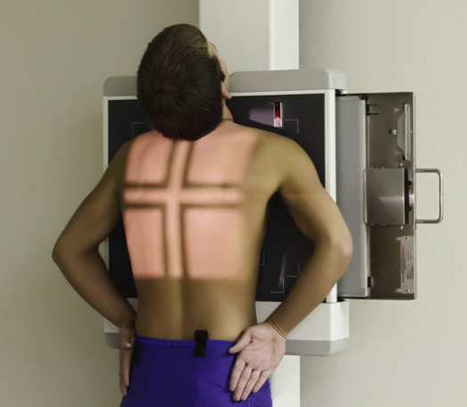
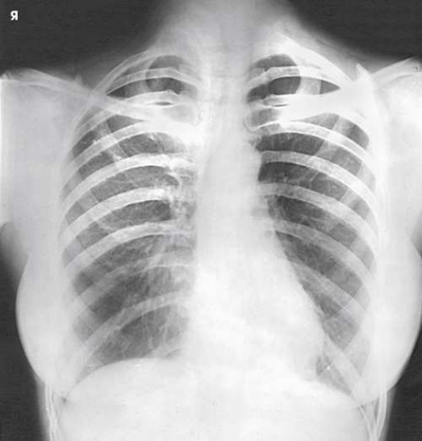
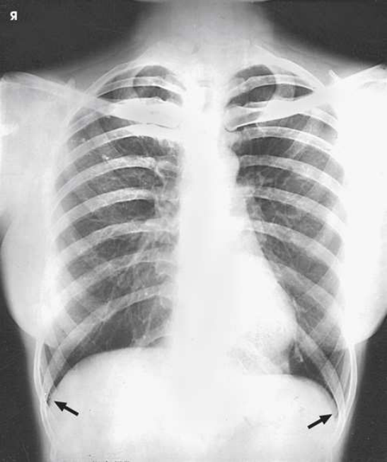
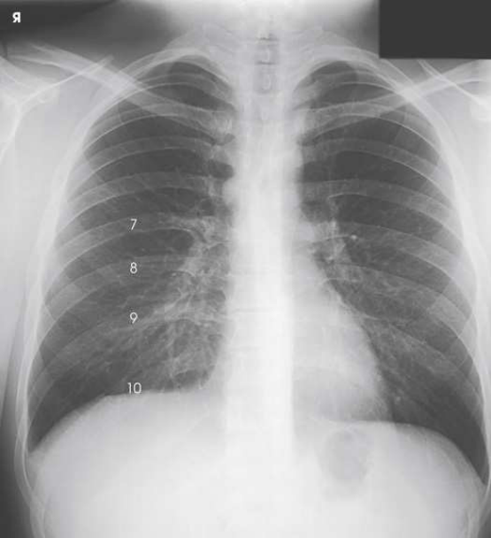
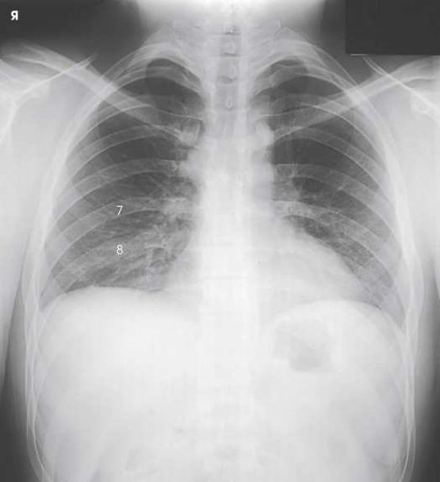
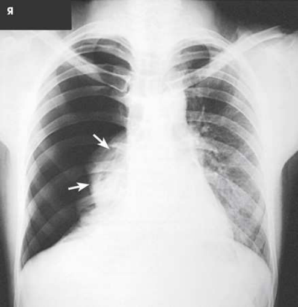
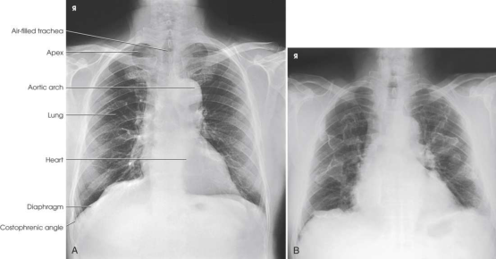

# Rx Torace — Incidență Postero-Anterioară (PA) (Merrill)

  📷 Radiografie Convențională (Rx)
  <strong>Actualizat:</strong> 2026-09-16
  <strong>Autor:</strong> Referință Merrill

---

-   __1. Rezumat Clinic & Indicații__

    ---

    === "Indicații Clinice"

        - Conform reperelor anatomice standard din tratat

    === "Ghid Național IRIS"

        !!! info "Referință Primară: Ghidul Național IRIS (Ordinul MS 1342/2012)"
            - **Capitol Ghid IRIS:** *Ghidul Național IRIS*
            - **Grad de Recomandare:** **De verificat pe indicație; fără grad atribuit automat**
            - **Nivel de Iradiere Estimată:** `De verificat pentru examinarea și populația selectate`

            [:octicons-search-16: Deschide Ghidul IRIS](../../iris.md){ .md-button .md-button--primary } [:material-open-in-new: Aplicația Oficială PWA](https://radiologie-pediatrica.ro/iris/){ .md-button target="_blank" rel="noopener" }
-   __2. Poziționare & Centrare Fascicul__

    ---

    - **Poziție Pacient:** If possible, always examine pacienți în ortostatism, either în ortostatism sau Poziție Șezândă, astfel încât cupole diafragmatice este la its lowest poziție, și air sau nivele hidroaerice sunt seen. Engorgement de pulmonary vessels este also avoided. pacienți pe stretcher poate fie radiographed așezat cu picioarele dangling over side de stretcher, if conditions allow.; se poziționează pacientul, cu brațe hanging la sides, before stativ vertical Bucky. se ajustează height de receptorul de imagine so that its upper margine este 1.5 la 2 inches (3.8 la 5 cm) above relaxat umeri. se centrează plan mediosagital de pacientul’s corp la linia mediană receptorul de imagine. Se instruiește pacientul să stand straight, cu weight de corp equally distributed pe picioarele. se extinde pacient’s chin upward sau over top de grila device, then se ajustează cap astfel încât plan mediosagital este vertical. Se instruiește pacientul să se flectează coate și la rest backs de mâinile low pe șoldurile, sub nivelul sinusuri costodiafragmatice. Depress umerii și adjust la lie în same plan transversal. These movements will poziție clavicles below apexuri (vârfuri pulmonare) de plămânii. se rotește umeri forward so that ambele touch stativ vertical Bucky. This movement will se rotește scapulae outward și laterally la reduce superimposition de scapulae cu plămânii (Fig. 3.34). If female pacient’s breasts sunt large enough la fie superimposed over lower part de câmpuri pulmonare, especially sinusuri costodiafragmatice, Se instruiește pacientul să pull breasts upward și laterally. This este especially important when ruling out presence de lichid. Se instruiește pacientul să hold breasts în place prin leaning pe / sprijinit de receptorul de imagine holder (Figs. 3.35 și 3.36). se efectuează ecranarea gonadelor cu șorț plumbat.
    - **Punct de Centrare Fascicul:** perpendicular pe centrul receptorului de imagine. raza centrală trebuie să enter la nivelul T7 (inferior angle de Omoplat (Scapulă)).
    - **Distanță Focar-Film (DFF / SID):** Minimum SID of 72 inches (183 cm) is recommended to decrease magnification of the heart and increase spatial resolution of the thoracic structures.
    - **Comandă Respiratorie:** Inspir profund complet. expunere este made after second Inspir profund complet la ensure maximum expansion de plămânii. plămânii expand transversely, anteroposteriorly, și vertically, cu vertical being greatest dimension. pentru certain conditions, such ca Pneumotorax (colaps pulmonar) și presence de Corp străin / corpuri străine radio-opace, radiografii sunt sometimes made la end de Inspir profund complet și expiration (Figs. 3.37 through 3.39). Pneumotorax (colaps pulmonar) este vizualizat more clearly pe expiration, because collapse de lung este accentuated.

-   __3. Parametri Tehnici Expunere__

    ---

    | Parametru Tehnic | Valoare Configurare Generator / Tub |
    |:-----------------|:-------------------------------------|
    | **Tensiune Tub (kV)** | DE CONFIGURAT PE APARAT |
    | **Sarcină / Produs Curent-Timp (mAs)** | DE CONFIGURAT PE APARAT |
    | **Distanță Focar-Film (DFF / SID)** | Minimum SID of 72 inches (183 cm) is recommended to decrease magnification of the heart and increase spatial resolution of the thoracic structures. |
    | **Grilă Antidifuzoare (Bucky)** | DE CONFIGURAT PE APARAT |
    | **Dimensiune Focar** | DE CONFIGURAT PE APARAT |
    | **Camere de Ionizare AEC** | DE CONFIGURAT PE APARAT |
    | **Colimare Fascicul** | se ajustează câmp de iradiere la 17 inches (43 cm) longitudinal și 1 inch (2.5 cm) beyond lateral shadows but fără more than 14 inches (35 cm). opposite dimensions sunt used pentru transversal receptorul de imagine. vertical dimension poate fie less pentru smaller pacienți. Place marker de lateralitate (D/S) în collimated expunere field. |
    | **Filtrare Tub** | DE CONFIGURAT PE APARAT |

-   __4. Criterii de Calitate & Reușită Imagine__

    ---

    - Criterii radiologice de calitate imaginii:
    - Evidence de corect collimation și presence de marker de lateralitate (D/S) plasat clear de anatomy de interest
    - Entire plămâni de la apexuri (vârfuri pulmonare) la sinusuri costodiafragmatice
    - Absența rotației anatomice (simetrie bilaterală perfectă)
    - Sternal ends de clavicles echidistant față de coloană vertebrală
    - Trachea vizibil în linia mediană
    - Equal distance de la coloană vertebrală la lateral margine de Coaste (Grilaj Costal) pe fiecare side
    - corect anterior Umăr rotație evidențiat prin scapulae projected outside câmpuri pulmonare
    - corect inspiration evidențiat prin 10 posterior Coaste (Grilaj Costal) vizibil above cupole diafragmatice; la least one less rib vizibil pe expiration
    - net outlines de heart și cupole diafragmatice
    - Faint shadows de Coaste (Grilaj Costal) și superior coloană toracală vizibil through cordul shadow
    - Pulmonary vascular markings de la hilar regions la periphery de plămânii

-   __5. Protecție Radiologică (ALARA)__

    ---

    - Nespecificat în fragmentul extras; de verificat în sursă

!!! note "Observații Clinice & Tehnice"
    inferior lobes de ambele plămâni trebuie să fie carefully checked pentru adecvat penetration în women cu large, pendulous breasts. Cardiac studies cu barium PA Torace radiografii poate fie obtained cu pacientul swallowing bolus de barium sulfate la outline posterior siluetă cardiovasculară și aortă. barium used în cardiac examinations trebuie să fie thicker than barium used pentru stomach, astfel încât contrast medium descends more slowly și adheres la esophageal pereți. pacientul trebuie să hold barium în mouth until just before expunere este made. Then pacientul trebuie să take deep respirației și swallow bolus de barium; expunere este made la this time (see Fig. 3.12).

### 🖼️ Imagini

<figure class="protocol-image-card" markdown>

<figcaption><strong>Merrill — pagina PDF 168, imaginea 1</strong> — Imagine din fragmentul sursă; asocierea necesită revizie.</figcaption>

</figure>

<figure class="protocol-image-card" markdown>

<figcaption><strong>Merrill — pagina PDF 169, imaginea 2</strong> — Imagine din fragmentul sursă; asocierea necesită revizie.</figcaption>

</figure>

<figure class="protocol-image-card" markdown>

<figcaption><strong>Merrill — pagina PDF 170, imaginea 3</strong> — Imagine din fragmentul sursă; asocierea necesită revizie.</figcaption>

</figure>

<figure class="protocol-image-card" markdown>

<figcaption><strong>Merrill — pagina PDF 171, imaginea 4</strong> — Imagine din fragmentul sursă; asocierea necesită revizie.</figcaption>

</figure>

<figure class="protocol-image-card" markdown>

<figcaption><strong>Merrill — pagina PDF 172, imaginea 5</strong> — Imagine din fragmentul sursă; asocierea necesită revizie.</figcaption>

</figure>

<figure class="protocol-image-card" markdown>

<figcaption><strong>Merrill — pagina PDF 173, imaginea 6</strong> — Imagine din fragmentul sursă; asocierea necesită revizie.</figcaption>

</figure>

<figure class="protocol-image-card" markdown>

<figcaption><strong>Merrill — pagina PDF 174, imaginea 7</strong> — Imagine din fragmentul sursă; asocierea necesită revizie.</figcaption>

</figure>

=== "Ghid Rapid de Execuție"

    1. **Identificarea și verificarea pacientului:** verificare identitate, zonă de examinat, consimțământ conform procedurii și evaluarea posibilității unei sarcini, când este relevantă.
    2. **Pregătire:** îndepărtarea oricăror obiecte radiopace (bijuterii, agrafe, fermoare, proteze, pansamente dense).
    3. **Poziționare precisă:** alinierea receptorului de imagine și a tubului la distanța prescrisă (Minimum SID of 72 inches (183 cm) is recommended to decrease magnification of the heart and increase spatial resolution of the thoracic structures.).
    4. **Colimare strictă:** adaptarea fasciculului strict la regiunea de diagnostic pentru scăderea iradierii și reducerea radiației difuze.
    5. **Radioprotecție:** verificarea [politicii RX](../radioprotectie.md), cu măsuri distincte pentru pacient, personal și însoțitor.

## Surse de documentare

- [Merrill’s Atlas, 3. Thoracic Viscera: Chest and Upper Airway, pagini PDF 167–174](../../assets/protocols/sources/a56d45c16829_Merrills_Atlas_of_Radiographic_Positioning__Procedures_3Vol_Set.pdf#page=167)

## Fragmente sursă traduse (referință tehnică)

### anatomy

PA incidență de thoracic viscera shows air-filled trachea, plămânii, diaphragmatic domes, cordul și aortic arch, și, if enlarged
laterally, thyroid sau thymus gland (Fig. 3.40). vascular markings sunt much more prominent pe incidență made la end de
expiration. bronchial tree este vizualizat de la oblic angle. esophagus este well vizualizat when it este filled cu barium sulfate suspension.

### collimation

• se ajustează câmp de iradiere la 17 inches (43 cm) longitudinal și 1 inch (2.5 cm) beyond lateral shadows but fără more than 14 inches (35
cm). opposite dimensions sunt used pentru transversal receptorul de imagine. vertical dimension poate fie less pentru smaller pacienți. Place marker de lateralitate (D/S) în
collimated expunere field.

### cr

• perpendicular pe centrul receptorului de imagine. raza centrală trebuie să enter la nivelul T7 (inferior angle de scapula).

### criteria

Criterii radiologice de calitate imaginii:
• Evidence de corect collimation și presence de marker de lateralitate (D/S) plasat clear de anatomy de interest
• Entire plămâni de la apexuri (vârfuri pulmonare) la sinusuri costodiafragmatice
• Absența rotației anatomice (simetrie bilaterală perfectă)
• Sternal ends de clavicles echidistant față de coloană vertebrală
• Trachea vizibil în linia mediană
• Equal distance de la coloană vertebrală la lateral margine de coaste pe fiecare side
• corect anterior umăr rotație evidențiat prin scapulae projected outside câmpuri pulmonare
• corect inspiration evidențiat prin 10 posterior coaste vizibil above cupole diafragmatice; la least one less rib vizibil pe expiration
• net outlines de heart și cupole diafragmatice
• Faint shadows de coaste și superior coloană toracală vizibil through cordul shadow
• Pulmonary vascular markings de la hilar regions la periphery de plămânii

### notes

inferior lobes de ambele plămâni trebuie să fie carefully checked pentru adecvat penetration în women cu large, pendulous breasts.
Cardiac studies cu barium
PA chest radiografii poate fie obtained cu pacientul swallowing bolus de barium sulfate la outline posterior siluetă cardiovasculară și aortă. barium
used în cardiac examinations trebuie să fie thicker than barium used pentru stomach, astfel încât contrast medium descends more slowly și
adheres la esophageal pereți. pacientul trebuie să hold barium în mouth until just before expunere este made. Then pacientul trebuie să
take deep respirației și swallow bolus de barium; expunere este made la this time (see Fig. 3.12).

### part_pos

• se poziționează pacientul, cu brațe hanging la sides, before stativ vertical Bucky.
• se ajustează height de receptorul de imagine so that its upper margine este 1.5 la 2 inches (3.8 la 5 cm) above relaxat umeri.
• se centrează plan mediosagital de pacientul’s corp la linia mediană receptorul de imagine.
• Se instruiește pacientul să stand straight, cu weight de corp equally distributed pe picioarele.
• se extinde pacient’s chin upward sau over top de grila device, then se ajustează cap astfel încât plan mediosagital este vertical.
• Se instruiește pacientul să se flectează coate și la rest backs de mâinile low pe șoldurile, sub nivelul sinusuri costodiafragmatice. Depress
umerii și adjust la lie în same plan transversal. These movements will poziție clavicles below apexuri (vârfuri pulmonare) de plămânii.
• se rotește umeri forward so that ambele touch stativ vertical Bucky. This movement will se rotește scapulae outward și laterally
la reduce superimposition de scapulae cu plămânii (Fig. 3.34).
• If female pacient’s breasts sunt large enough la fie superimposed over lower part de câmpuri pulmonare, especially costophrenic
angles, Se instruiește pacientul să pull breasts upward și laterally. This este especially important when ruling out presence de lichid. Have
pacientul hold breasts în place prin leaning pe / sprijinit de receptorul de imagine holder (Figs. 3.35 și 3.36).
• se efectuează ecranarea gonadelor cu șorț plumbat.

### patient_pos

• If possible, always examine pacienți în ortostatism, either în ortostatism sau așezat pe scaun, astfel încât cupole diafragmatice este la its lowest poziție,
și air sau nivele hidroaerice sunt seen. Engorgement de pulmonary vessels este also avoided. pacienți pe stretcher poate fie radiographed
așezat cu picioarele dangling over side de stretcher, if conditions allow.

### respiration

Inspir profund complet. expunere este made after second Inspir profund complet la ensure maximum expansion de plămânii. plămâni expand transversely, anteroposteriorly, și vertically, cu vertical being greatest dimension.
• pentru certain conditions, such ca Pneumotorax (colaps pulmonar) și presence de Corp străin / corpuri străine radio-opace, radiografii sunt sometimes made la end de full
inspiration și expiration (Figs. 3.37 through 3.39). Pneumotorax (colaps pulmonar) este vizualizat more clearly pe expiration, because collapse de lung este
accentuated.

### sid

Minimum SID de 72 inches (183 cm) este recommended la decrease magnification de cordul și increase spatial resolution de thoracic
structures.

### tech

poziționat prin manufacturer sau department protocol pentru corect anatomy display orientation; raza centrală plate: 14 × 17 inches (35
× 43 cm) longitudinal, sau transversal pentru hypersthenic pacienți.

